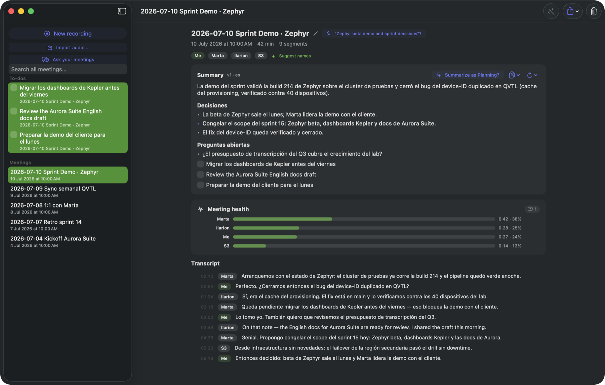
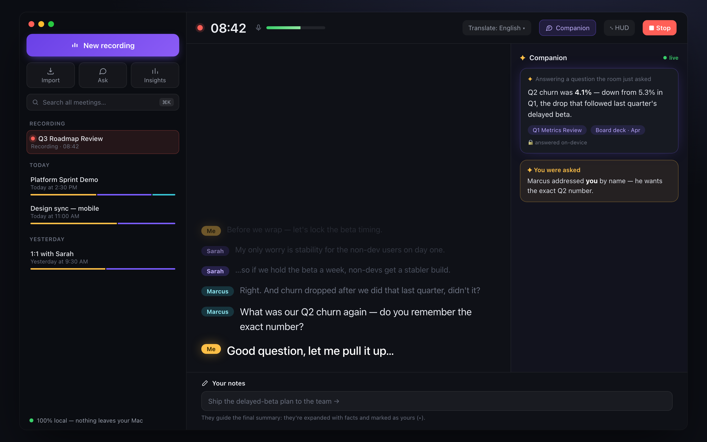
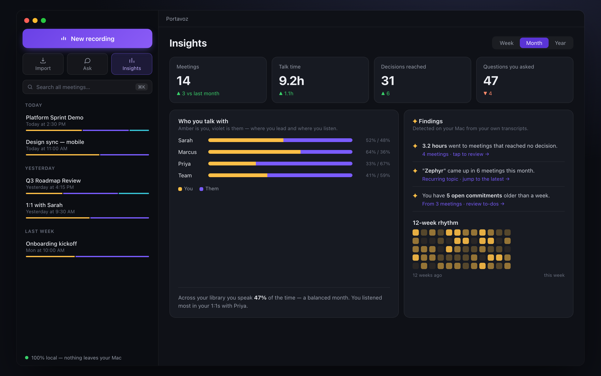

# Portavoz 🎙

**The meeting assistant that knows who said what — without your audio ever leaving your Mac.**

Portavoz records your meetings, transcribes them live, and tells apart every voice — including yours. Built natively in Swift for Apple platforms, running entirely on-device: Neural Engine transcription, local diarization, local summaries.

**[portavoz.app](https://portavoz.app)** · `brew install --cask portavoz` (after `brew tap johnny4young/tap`)

[](https://github.com/johnny4young/portavoz/actions/workflows/ci.yml)
[](LICENSE)




<table>
<tr>
<td width="50%"></td>
<td width="50%"></td>
</tr>
<tr>
<td align="center"><sub><b>Live recording</b> — lyrics captions + the on-device Companion</sub></td>
<td align="center"><sub><b>Insights</b> — your meeting life, computed on your Mac</sub></td>
</tr>
</table>

<sub>Representative data, English UI. Everything shown is computed and rendered on-device.</sub>

> *Portavoz* (Spanish): the one who carries the voice — a spokesperson.

## Why Portavoz

- **Who-said-what, structurally.** Microphone and system audio are captured as separate channels: everything on your mic is *you*, by hardware truth. Remote voices are separated on-device with speaker diarization, then mapped to real names automatically.
- **Local-first, for real.** Transcription, diarization, and summaries run on-device by default. Cloud LLMs — and local ones like Ollama — are an explicit, clearly-labeled opt-in with your own keys.
- **Bilingual by design.** Every speaker keeps the language they actually used, while summaries can independently follow the meeting or always use English or Spanish — with technical terms kept intact.
- **Listen back, not just read.** A synchronized player scrolls the transcript like song lyrics, colors your turns apart from theirs on the waveform, and exports any span as an audio clip.
- **A companion while you talk.** Opt-in live cards answer a factual question the room just asked, or nudge you when someone addressed you by name — on-device by default.
- **Built for developers.** Action items that become GitHub/Linear issues, decision records, a local MCP server so your AI tools can ask "what did I agree to yesterday?", and Shortcuts automation on meeting end.
- **Open format.** Your meetings are Markdown + SQLite you own. No accounts, no lock-in.

## Status

**Shipping and self-updating.** Install with Homebrew or grab the notarized DMG from [Releases](https://github.com/johnny4young/portavoz/releases); updates arrive automatically via Sparkle:

```sh
brew tap johnny4young/tap
brew install --cask portavoz
```

Capture, live + refine transcription, on-device diarization, bilingual summaries (three local engines), audio playback, co-authoring notes, pre-meeting briefs, and the live companion are all built and measured (see below). Every feature that ships lands in the [changelog](CHANGELOG.md).

## What you get

Everything below runs on your Mac. Grouped by what you're doing:

**Capture & transcribe**
- **Dual-channel recording** — your mic and the call are captured as separate channels, so *you* are known by hardware truth, not by guesswork. Echo cancellation, device-change resilience, a low-mic nudge, and a heads-up when the incoming channel goes silent. A channel that captured nothing stays empty — never filled with invented text.
- **Durable before the first byte** — the meeting and its channel reservations exist before capture starts. Each channel records behind a recovery filename, verifies its CAF metadata, checksum, and signal health, then publishes atomically for playback. On launch, staging-only or final-only files are revalidated and restored; ambiguous copies are preserved rather than guessed at. If transcription or later processing fails, the recording remains discoverable for playback or export.
- **Every voice stays itself** — auto-detect preserves each speaker's real language, including mixed Spanish/English meetings. Pin one transcript language only as a recovery tool for quiet or noisy audio.
- **Live captions, lyrics-style** — sub-second partials on the Neural Engine; the newest line reads big, your voice glows amber, older lines fade away. Optional **live translation** of captions as they arrive — and the one-time language download never interrupts your meeting.
- **Whisper refine** — a cancellable maximum-quality re-pass you approve as a draft (never silently overwrites), 23–42× realtime. Accepted drafts install language, speakers, and transcript atomically and are rejected if the meeting changed while you reviewed them. Force a language per meeting to recover one that came out wrong.
- **Import any audio** — drag in a recording or a `.portavoz` bundle. Recordings are transcribed, diarized, and summarized like a live capture; bundles restore the remapped transcript, summary, notes, Companion, and validated optional audio as one all-or-nothing meeting. Large files stay off the UI thread, and failed imports clean up their staged audio instead of leaving invisible files behind.

**Understand the meeting**
- **Every voice, told apart** — on-device diarization; each speaker gets a stable color, mapped to real names automatically (calendar + LLM) or with one click.
- **Three local summary engines** — Apple Intelligence, Ollama, or a built-in model. A separate Summary language setting follows the meeting or consistently writes English/Spanish, without changing the transcript. **Tabbed** so a long summary is skimmable.
- **Custom structures** — beyond the five built-in shapes (standup, 1:1, planning…), author your own — a Hangout, a Retro — with the sections you want. They appear in every meeting's Structure menu.
- **✦ Chapters** — Portavoz finds the turning points (a long pause, a stretch that ran long) and lets you jump to them, each labeled with the line that opens it.
- **Meeting health** — talk-time, interruptions and questions per speaker, computed locally.
- **Co-authoring notes** — jot raw notes while recording; the summary weaves them in and marks the co-authored lines (▸).

**Listen back**
- **Synced player** — the transcript scrolls like song lyrics, per-channel colored waveform, **"only my voice"** to replay just your turns, skip-silence, and any span exported as an audio clip or compressed to AAC in one click.

**Reflect & review**
- **Insights** — scope your meeting life to this week/month/year, see **who you talk with and how much** (amber = you, violet = them), your talk balance, a 12-week rhythm heatmap, and open commitments — all local.
- **🪞 Post-meeting mirror** (opt-in) — a private card at the end of a real meeting: your numbers next to your usual average, measured, never judged.
- **⌘K — ask your week** — a Spotlight-style palette over any view: instant results as you type, a full on-device answer with citation chips that jump to the exact moment.

**Fits your workflow**
- **Companion while you talk** (opt-in) — live cards answer a factual question the room just asked, or flag when someone addressed you by name.
- **Dictate anywhere** — a global hotkey (⌥⌘D) transcribes straight into any app, tap-to-toggle or hold-to-talk.
- **Menu-bar resident** — recording state, one-click record/dictate/ask, and your next calendar meeting, with the window closed.
- **Pre-meeting briefs** from your calendar, with verifiable citations, and recordings born with the real event name.
- **Developer glue** — action items → GitHub/Linear issues, a local **MCP server** so your AI tools can ask "what did I agree to yesterday?", and Shortcuts automation on meeting end.

**Own your data**
- **Open format** — Markdown + a SQLite file you own. Full-library Markdown backup, per-meeting `.portavoz` bundles (optionally with audio, assembled off the UI thread from one consistent snapshot), and a **trash** with restore (auto-purge after 30 days). No accounts, no lock-in.

## Benchmarks

Measured on a MacBook Pro **M4 Max, 36 GB, macOS 26** (July 2026). Everything below runs **on-device** — no network. Numbers are reproducible with the dev CLI; run them on your own machine and audio.

| Stage | Engine | Measured | Reproduce |
|---|---|---|---|
| **Live transcription** | Parakeet TDT 0.6B v3 (int8, ANE) | first partial **1.1 s**; finalization lag p50 **0.07 s** / p95 **0.68 s** | `portavoz-cli bench-live --file meeting.wav` |
| **Live under batch load** (M2 criterion) | Parakeet live + Whisper batch in parallel | end-to-end p95 **0.53 s** (target < 2 s) | `portavoz-cli bench-m2 --batch-file meeting.wav` |
| **Refine (quality pass)** | Whisper large-v3-turbo (WhisperKit) | **23–42× realtime** | `portavoz-cli transcribe --file meeting.wav` |
| **Diarization** | pyannote community-1 + WeSpeaker (FluidAudio) | **DER 7.6%** on an AMI sample | `portavoz-cli der --file meeting.wav --reference truth.rttm` |
| **Summary** | Foundation Models (on-device, 3B) | structured summary **3.8 s** after meeting end | `portavoz-cli summarize --file meeting.wav` |
| **Dual-channel drift** | AVAudioEngine + Core Audio tap | **4 ms** over 30 min (target < 50 ms) | 30-min `portavoz-cli record --system` |

An alternate live engine, Apple's **SpeechAnalyzer** (macOS 26), is benchmarked head-to-head against Parakeet in [docs/specs/02-transcription.md](docs/specs/02-transcription.md#speechanalyzer-spike-m12d25--status-and-findings-jul-2026): both stay under 1 s p95; Parakeet keeps the finalization-latency crown, SpeechAnalyzer wins on zero-download and rich volatile captions.

> Reproduce a live run yourself (`--engine speech` must run inside the app bundle — the Speech daemon won't answer an unbundled process):
> ```sh
> portavoz-cli bench-live --file your-meeting.wav --engine parakeet --seconds 60
> Portavoz.app/Contents/MacOS/portavoz-app --bench-live your-meeting.wav --seconds 60   # SpeechAnalyzer
> ```

### Models

Downloaded on first use and verified against pinned SHA-256 checksums (`portavoz-cli models download` / `verify`). None of them phone home after download.

| Model | Role | On-disk | Min RAM |
|---|---|---|---|
| Parakeet TDT 0.6B v3 (int8) | live transcription | ~483 MB | 4 GB |
| Whisper large-v3-turbo | refine (quality) | ~1.6 GB | 8 GB |
| Whisper large-v3 (626 MB variant) | refine on low disk | ~626 MB | 6 GB |
| pyannote + WeSpeaker | diarization | ~14 MB | 2 GB |
| Qwen3.5 4B (MLX, 4-bit) | optional embedded summaries | ~3 GB | 8 GB |

## Architecture

Swift 6 (strict concurrency), SwiftUI, modular SPM workspace. Most Kits depend
on `PortavozCore`; the few verified cross-Kit dependencies are documented in
[docs/ARCHITECTURE.md](docs/ARCHITECTURE.md). As-built behavior lives in
[docs/specs/](docs/specs/README.md). The approved, feature-parity-preserving
architecture migration is tracked in
[docs/refactor-20260714.md](docs/refactor-20260714.md).

| Module | Responsibility |
|---|---|
| `PortavozCore` | Shared domain types (meetings, segments, speakers, audio, durable processing jobs), Keychain secret store |
| `ApplicationKit` | Characterized workflows for lifecycle/trash, summary regeneration, external-audio and `.portavoz` aggregate import/export, reviewable/revision-fenced refinement, durable recording Start/Stop/launch-recovery handoffs, and storage-independent Library read contracts over narrow capability ports |
| `ModelStoreKit` | Curated model registry; SHA-256-verified downloads pinned to exact commits |
| `AudioCaptureKit` | Mic capture (AEC) + per-app Core Audio process taps (macOS 14.4+), crash-safe CAF writer |
| `TranscriptionKit` | Engine protocol, task-based routing, Parakeet (live) + Whisper (refine), scheduler |
| `DiarizationKit` | Speaker separation (pyannote/CoreML), who-said-what attribution, voice enrollment |
| `IntelligenceKit` | Summaries (Foundation Models / Ollama / embedded MLX / BYOK), recipes, action items, live companion |
| `AudioPlaybackKit` | Synchronized player, channel-colored waveform, clip export, AAC transcode |
| `ContextFeedKit` | Placeholder compatibility target; co-authored notes currently span Core, StorageKit, IntelligenceKit, and the app |
| `StorageKit` | GRDB/SQLite, FTS5 search, scoped Library observations, versioned snapshots, durable leased job queue, local vector index |
| `IntegrationsKit` | GitHub/Linear export, Gist sharing, MCP server |
| `SyncKit` | Placeholder target for future CloudKit sync and sharing |

The macOS app owns a per-window `LibraryModel` with one observable value-state
snapshot and enum actions/effects. SwiftUI Library views render and present
native controls; an app composition adapter merges independent GRDB
observations for meeting rows/voice mix, open items, trash, and active FTS into
storage-independent ApplicationKit updates. Library no longer consumes the
global invalidation counter; Meeting Detail, Insights, and Spotlight retain
that transitional seam until their own characterized slices.

## Build from source

Requires **Xcode 16+ / Swift 6 on macOS 14.4+**.

```sh
swift build
swift test

# Build and run the app bundle (Info.plist with the mic + system-audio entitlements):
scripts/make-app.sh && open dist/Portavoz.app

# Fetch and verify the models:
swift run portavoz-cli models download
```

Distributed as a notarized DMG with Sparkle auto-updates, plus the Homebrew cask above (tap: [johnny4young/homebrew-tap](https://github.com/johnny4young/homebrew-tap)).

## Privacy

Audio, transcripts, summaries, and voice embeddings stay on-device by default. API keys live in the Keychain, never in the database or preferences. Model downloads are checksum-verified. The MCP server binds to localhost only. See [SECURITY.md](SECURITY.md) for the full commitments and how to report a vulnerability.

## Contributing

Issues are the most valuable contribution right now — use cases, platform quirks, model recommendations. See [CONTRIBUTING.md](CONTRIBUTING.md). Privacy is non-negotiable and we are MIT-licensed (no GPL code ports).

## License

[MIT](LICENSE)

---

### Spanish-speaking users

Portavoz started from a real need: Spanish-speaking developers living in English-language meetings. Bilingual summaries, a technical glossary that respects real-world Spanglish (`deploy`, `PR`, `rollback`), and live translated captions are core roadmap items, not side quests.
