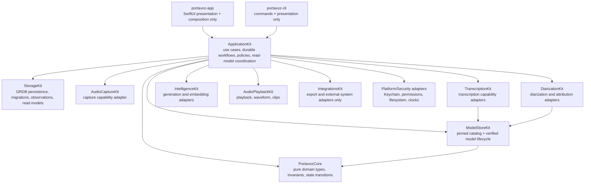
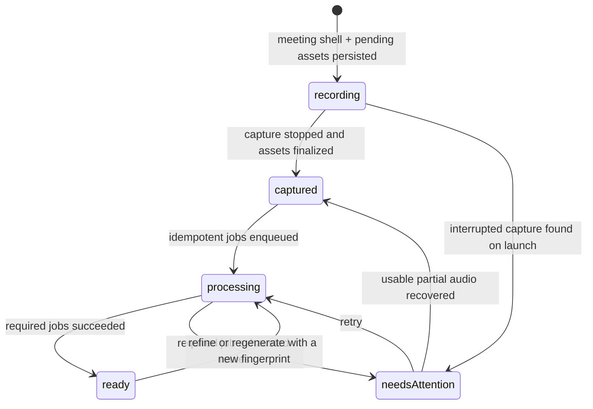

# ARCHITECTURE — Technical design and engineering rules

## What Portavoz is

Privacy-first, local-first meeting assistant for Apple platforms (macOS first; iOS/iPadOS later; visionOS eventually), written natively in Swift 6 + SwiftUI. Core promise: **know who said what — including the user's contributions — without audio leaving the device.** It is the Swift-native successor to Meetily's ideas (reference repository in `../meetily`; studied, but its code is never ported).

Differentiators in priority order: structural who-said-what through dual-channel capture, diarization with the user's voice identity, bilingual ES/EN summaries and live translated captions, development workflow integrations (GitHub/Linear, local MCP server, and Shortcut/URL/Spotlight automation surfaces; native App Intents remain planned), and an open data format (Markdown + user-owned SQLite).

## Document contract and refactor status

This file is the architecture source of truth for the **current commit**. It
separates as-built behavior from target architecture explicitly; planned types,
tables, modules, and workflows must never be described as implemented. The
executable migration plan, rationale, bands, target schemas, and acceptance
criteria live in [refactor-20260714.md](refactor-20260714.md).

The rearchitecture direction is approved and execution is active on
`codex/refactor-20260717`. Band 0 slice 0A has landed its first runtime
invariants: persisted identities and record enums fail with typed integrity
errors instead of changing meaning, and library/Insights projections scope
through live meetings with delete/restore conservation coverage. The typed
transcript/summary language policy remains the next Band 0 slice. Every
refactor commit must update this file to reflect the dependency graph and
migration status that actually exist in that commit, while the matching
as-built spec records runtime behavior.

## SPM workspace (a single package)

`PortavozCore` contains shared domain types. The package currently exposes ten
Kit libraries. Most depend on Core only; verified exceptions are
`TranscriptionKit → ModelStoreKit`, `DiarizationKit → ModelStoreKit`, and
`IntegrationsKit → IntelligenceKit + StorageKit` (D31). The app and CLI compose
the capabilities directly today.

| Module | Responsibility |
|---|---|
| `PortavozCore` | Shared domain types and typed IDs. It currently also contains the concrete Keychain-backed `SecretStore`; moving that implementation to a platform adapter is a target, not current behavior |
| `ModelStoreKit` | Curated registry (`ModelCatalog`, routing **by task** through `ModelTask`) + `ModelStore`: downloads verified by sha256/pinned commit. Shared by every Kit that loads models |
| `AudioCaptureKit` | Mic (AVAudioEngine) + per-app process taps (Core Audio, macOS 14.4+); `RecordingSession` (with `onChunk` tap); crash-safe CAF `CaptureFileWriter`; retention policies |
| `TranscriptionKit` | `TranscriptionEngine` protocol; `ParakeetEngine` (live sliding window + batch long-form); `TranscriptionScheduler` (D7 slots) |
| `DiarizationKit` | `PyannoteDiarizer` (pyannote community-1 + WeSpeaker through FluidAudio) over system/room channels; `SpeakerAttributor` (structural who-said-what); `Voiceprint` (biometric: on-device only, encrypted, never synced, erasable) |
| `IntelligenceKit` | Summary providers for Foundation Models, OpenAI-compatible BYOK/Ollama, and embedded MLX; structured summaries, Recipes, fingerprint caching, Companion/RAG intelligence, schedulers, embeddings, and bilingual output policy |
| `ContextFeedKit` | Placeholder-scale compatibility target; timestamped note behavior is implemented through Core/app/storage rather than a substantial standalone Kit |
| `StorageKit` | `MeetingStore` over GRDB 7 + FTS5, schema v5: meetings, transcript, immutable summary snapshots, search, trash, bundles, and audio-location policy. Persisted IDs/enums decode strictly, and live library projections join the meeting root. Segment vectors are plain BLOBs; sqlite-vec is not used |
| `AudioPlaybackKit` | Synchronized playback, channel-aware waveform data, clips, silence skipping, and AAC transcoding |
| `SyncKit` | Placeholder-scale `Visibility` model. CKSyncEngine and CloudKit sync are planned, not implemented |
| `IntegrationsKit` | Export and external-system adapters plus several cross-cutting read/product policies. It is the only cross-Kit layer under D31; narrowing it is part of Band 2 |
| `portavoz-app` | SwiftUI macOS application. `AppServices` currently composes dependencies and carries application orchestration; feature extraction is planned |
| `portavoz-cli` | Executable development harness (`record --seconds N --pid X --system --out dir`) |

## Target modular-monolith architecture (not implemented yet)

Portavoz remains a single local SwiftPM product. The target adds one
`ApplicationKit` for use cases and durable workflows; it does not introduce a
backend, microservices, full CQRS, full event sourcing, or a state-management
framework.



Target responsibility rules:

- `PortavozCore` becomes pure and portable: entities, invariants, typed
  policies, state transitions, and capability protocols.
- `ApplicationKit` owns `StartRecording`, `StopRecording`, recovery, refine,
  import, regeneration, export, delete/restore, and query coordination.
- `ModelStoreKit` remains the single reviewed catalog and SHA-256-verified
  lifecycle for downloadable model artifacts.
- `portavoz-app` owns dependency composition, navigation, feature-scoped
  `@Observable` models, localization, and rendering only.
- `StorageKit` owns strict record conversion, transactions, migrations,
  integrity checks, query-specific read models, and scoped GRDB observations.
- `IntegrationsKit` retains outbound adapters; pure chapter, voice, summary,
  playback, reminder, and Insights policies move to Core/ApplicationKit.
- Placeholder Kits gain a real bounded responsibility or are removed after
  external package compatibility is checked.

Feature parity is non-negotiable: the current release remains functional after
every incremental Strangler slice. The old path is removed only after the new
path has characterization coverage and equivalent runtime evidence.

## Durable meeting lifecycle target (not implemented yet)

The current app persists the main meeting record after capture stops and then
coordinates several derived writes from `RecordingController`. The target
persists a discoverable meeting shell before capture and treats every derived
step as retryable work:



The target uses a Unit of Work for the captured database snapshot, a
Saga/process manager for filesystem+SQLite reconciliation, a durable job queue
for refine/diarization/summary, and a transactional outbox for Spotlight,
Shortcuts, sync, and other external side effects. Audio remains playable and
exportable when derived work fails.

## Audio pipeline design (M1)

```
MicrophoneSource (AVAudioEngine, native format)    ──┐
ProcessTapSource (per-PID / global tap, 14.4+)     ──┤──► AsyncThrowingStream<AudioChunk>
[RoomSource: iPhone through Continuity — future]  ──┘            │
                                                                  ▼
                                        RecordingSession (actor, one consumer per channel)
                                             │ lazy writer on first chunk (actual sample rate)
                                             ▼
                              microphone.caf / system.caf (CaptureFileWriter → AVAudioFile 16-bit CAF)
```

- Channels are **never mixed before diarization** (D5): everything on the mic belongs to the user by hardware.
- The chunk carries a `timestamp` in seconds from session start (`HostClock` over host time).
- Drift = |seconds written to mic − system|; M1 criterion: < 50 ms in 30 min.
- No FFmpeg: `AVAudioFile` writes CAF directly from Float32; CAF remains readable after a crash while it is being written.

## Transcription pipeline (M2)

```
RecordingSession.start(sources:onChunk:)  ── per-chunk tap ──► AsyncStream<AudioChunk> per channel
                                                                       │
                     TranscriptionScheduler (D7: slots)                ▼
   live: immediate ───────────────────────────────► ParakeetEngine.transcribe (SlidingWindowAsrManager,
   batch: serial FIFO, Task.detached(.utility) ───► ParakeetEngine.transcribeFile (AsrManager long-form)
                                                                       │
                                          ParakeetSegmentMapper (deltas from absolute timings)
                                                                       ▼
                                                     AsyncThrowingStream<TranscriptSegment>
```

- Models: `ModelCatalog` (artifacts pinned by sha256 + commit) → `ModelStore` (verified download, `~/Library/Application Support/Portavoz/Models`) → `AsrModels.load` — nothing is ever loaded without verification (D15).
- A single `AsrModels` shared across jobs (MLModel is thread-safe); each job creates its own manager with its own decoder state.
- Custom live window left 11 / chunk 1.0 / right 0.4 and custom overlap filter (D16). Measured: 0.53 s p95 transcript lag with batch running in parallel at ~100x.
- Harness: `portavoz-cli bench-m2` reproduces the complete acceptance criterion.

## Diarization and attribution pipeline (M3)

```
system.caf / AsyncStream<AudioChunk> ──► PyannoteDiarizer (10 s windows, continuous atTime,
                                          SpeakerManager preserves S1/S2… across windows)
                                                    │  [SpeakerTurn]
TranscriptSegments (batch: 1 per sentence; live: ~1 s) ──► SpeakerAttributor
                                                    │
                    mic → "Me" (hardware, D5) · system → overlapping turn; multi-turn segments split
                    at turn boundaries (words proportional to time) · no turn → nil
                                                    ▼
                                    attributed transcript + [Speaker] ("Me" first)
```

- Clustering threshold **0.45** (D17) — FluidAudio's 0.7 default merges real speakers; calibrated against the pyannote AMI sample with its reference RTTM.
- Batch segments split on **sentence punctuation** in addition to pauses: TDT timings contain no gaps (end of token = start of the next), so the pause almost never triggers.
- Harness: `portavoz-cli diarize --file x.wav [--attribute] [--threshold t]`.

## Architecture for multiple engines and configurations (phase 2, D25)

The goal: support heterogeneous hardware (from 8 GB without Apple Intelligence to M4 Max) and changing market conditions (Apple giving SpeechAnalyzer away) without any feature depending on ONE specific model.

- **Explicit `ModelTask`** in ModelStoreKit: `liveTranscription`, `finalTranscription`, `summarization`, `embedding`, and `diarization`. `ModelCatalog.recommended(for:)` already routes by task — it can grow into `candidates(for:) -> [ModelDescriptor]` + `recommended(for:hardware:)` with a `HardwareProfile` (chip, RAM, macOS version, Apple Intelligence yes/no) read once at startup.
- **Protocols by role, not by model**: `SummaryProvider` already exists (Foundation Models, OpenAI-compatible/Ollama, and MLX implement it); the same applies to quality transcription (`FileTranscriber`: Whisper today, SpeechAnalyzer and Parakeet-batch candidates). Views and the CLI depend on the protocol; selection lives in Settings + per-meeting/language overrides.
- **The fallback chain is visible**: every result carries the engine that produced it (`provenance` column on summary/segment when the schema reaches that point — additive, D4 permits it); the UI shows it in gray ("Resumido on-device" / "Resumido por Ollama·qwen3"). Nothing silently fails over to another provider: degrade = inform.
- **Layered configuration**: hardware default → global Settings by role → per-meeting override → per-language override (Humla pattern). Global settings currently use UserDefaults; durable typed per-meeting policy is a refactor target.
- **Audio is already first-class in the product flow (D27)**: dual CAF capture feeds transcription, diarization, playback, waveform, clips, compression, and import through `MeetingAudioLayout`. **Current storage still exposes only `Meeting.audioDirectory`; there is no implemented `AudioAsset` type/table or durable waveform cache.** The target `AudioAsset` record, health metadata, checksums, and content-addressable caches are specified in [refactor-20260714.md](refactor-20260714.md).

Transcript language and generated-output language are separate policies. Refine
preserves the language actually spoken per segment; summaries and other
generated artifacts use their configured output language. A single persisted
global default plus per-meeting override is a Band 0 target and is not yet
consistent across recording, import, and regeneration paths.

## Engineering rules (non-negotiable)

1. **Privacy:** no feature sends audio/transcripts off-device without explicit, visible opt-in. Opt-in telemetry. API keys in Keychain — never SQLite or UserDefaults (an anti-pattern inherited from Meetily, which stores them in plain SQLite).
2. **License hygiene:** Portavoz is MIT. Copying code from GPL projects is prohibited — notably MacParakeet (GPL-3): it validates our stack but is look-don't-touch. Humla (MIT) and FluidAudio/WhisperKit (MIT/Apache) are permitted, with attribution.
3. **Strict Swift 6 concurrency:** actors + `AsyncStream` end-to-end; `@unchecked Sendable` only with a comment justifying confinement; no manual locks.
4. **Live work never waits for batch work:** live transcription and batch work (files, re-passes) run in separate scheduler slots (MacParakeet pattern).
5. **Models = code:** every download is checked against a pinned sha256 before loading.
6. Conventional Commits (`feat:`, `fix:`, `docs:`…).
7. **Feature parity during refactors:** every commit remains shippable; released behavior is characterized before it moves and the old path remains until parity is proven.
8. **Documentation is part of the change:** all explanatory content under `docs/` is English. Every refactor commit updates this file and every other source-of-truth document whose facts changed. User-visible changes update CHANGELOG; internal plumbing does not create misleading release notes.
9. **Persisted identity is strict:** storage decoding never invents UUIDs or silently changes aggregate identity.
10. **Capture outranks derivation:** usable captured audio remains discoverable even when captions, diarization, refine, summaries, indexing, or integrations fail.

## Refactor migration status

The detailed scope and acceptance criteria are in
[refactor-20260714.md](refactor-20260714.md). Update this table in every
refactor commit; a target becomes as-built only when code, tests, and the
matching spec land together.

| Band | Current state | Architectural outcome |
|---|---|---|
| 0 — Integrity and truth | In progress — slice 0A complete: strict record decoding and live-meeting aggregate scope; language policy remains | Strict identity decoding, live-meeting aggregate scope, explicit transcript/summary language policies |
| 1 — Indestructible recording | Not started | Meeting shell, `AudioAsset`, durable jobs, recovery, Unit of Work and outbox foundations |
| 2 — Application layer | Not started | `ApplicationKit`, composition-only `AppServices`, feature models, scoped GRDB observations |
| 3 — Provenance and privacy | Not started | `generationRun`, egress gateway, privacy receipt, typed errors and diagnostics |
| 4 — Detail and scale | Not started | Meeting Detail decomposition, content-addressable caches, incremental indexing, measured large-library performance |
| 5 — Evidence and people | Not started | Canonical people, evidence links, source navigation, local feedback |
| 6 — Platform expansion | Deferred | CKSyncEngine/iOS built on durable state and tombstones |

## Documentation synchronization

The documentation roles are intentionally separate:

- `ARCHITECTURE.md`: current dependency rules, as-built high-level design, and
  clearly labeled target architecture.
- `refactor-20260714.md`: migration explanation, bands, technical target, and
  execution protocol.
- `specs/`: as-built behavior only; planned behavior must be labeled.
- `DECISIONS.md`: binding decisions and trade-offs.
- `ROADMAP.md`: current status and next concrete step.
- `GAPS.md`: unresolved limitations and pending field validation.
- `README.md`: public product and contributor truth.
- `CHANGELOG.md`: user-visible benefits only, never internal documentation or
  refactor bookkeeping.

## Development environment

```sh
swift build    # builds all modules
swift test     # XCTest suite
```

- If tests fail with "no such module 'XCTest'": the machine has CommandLineTools selected. Run with `DEVELOPER_DIR=/Applications/Xcode.app/Contents/Developer swift test` or fix permanently: `sudo xcode-select -s /Applications/Xcode.app/Contents/Developer`.
- Minimum targets: macOS 14.4 (process taps) / iOS 17 (WhisperKit). OS 26 features (SpeechAnalyzer, Foundation Models, AirPods studio recording) degrade gracefully.
- CI: `.github/workflows/ci.yml` (macos-latest, build + test).
- **Tests with real models** (Foundation Models, Parakeet, Whisper): gated by `PORTAVOZ_MODEL_TESTS=1` (some also by `PORTAVOZ_TEST_WAV`/`PORTAVOZ_TEST_CONVERSATION_WAV`). CI **does not** run them — they are validated locally. **Design rule verified in practice**: every prompt/schema for the 3B model is tested against the REAL model with these tests; they caught bugs that pure tests do not see (the 3B model truncates opaque Markdown, invents sections if given the entire summary, ignores abstract rules without few-shot examples, and cleans a name out of the question if asked to detect it — use deterministic heuristics, not the model's opinion).
- **In-app benchmark**: SpeechAnalyzer **hangs in CLI processes without a bundle** (the Speech daemon does not respond without TCC/bundle context). Its benchmark runs inside the app: `Portavoz.app/Contents/MacOS/portavoz-app --bench-live <file> [--seconds N] [--language xx]` (hidden launch argument that prints to stdout and exits).
- **UI tests** (`make test-ui`, D30): XcodeGen (`project.yml`, source of truth) generates `Portavoz.xcodeproj` (gitignored) with a `PortavozUITests` target (`bundle.ui-testing`). The app honors `-use-temp-store` (disposable DB) and `-seed-demo` (deterministic meeting) for reproducible tests without touching the real library or driving the screen. Covers library, detail with player/clip, and settings; the preflight closes Portavoz before the runner to prevent automation-mode failures from stale instances. Shipping continues through `scripts/make-app.sh` (this is verification only).
- Reference toolchain: Swift 6.3.3, macOS 26, Apple Silicon (M4 Max, 36 GB). Models in `~/Library/Application Support/Portavoz/Models/` (override with `--models-dir`).
- Python from python.org does not include SSL certificates (`urllib` fails) — use `curl` in scripts.

## Business context for technical decisions

Everything is open source (MIT). FREE never limits minutes/meetings/history — the user's local compute is free. PRO = one-time payment (convenience and power: sync, development integrations, RAG, MCP). Distribution: notarized DMG + Sparkle + Homebrew cask + direct sales; App Store on iOS. Full details in [PRODUCT.md](PRODUCT.md) and decisions D9/D10 in [DECISIONS.md](DECISIONS.md).

## Local app workflow (Jul 2026)

`/Applications/Portavoz.app` is the user's RELEASE copy (notarized, installed through DMG/brew, automatically updated by Sparkle) — **no development workflow touches it**. `make install` builds and installs `/Applications/Portavoz Dev.app` (same bundle ID — shared TCC and Keychain; different display name; Info.plist edited post-build and RE-SIGNED, because an invalid signature prevents TCC grants from persisting). Both share `~/Library/Application Support/Portavoz` (DB, models): if a development build introduces a new schema migration, test first with `-use-temp-store` or with a COPY of the DB — never against the real DB. Real recordings for tests: copy them; never operate on them live.
