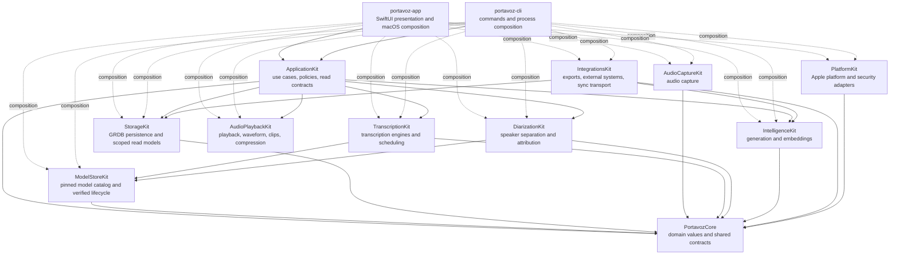
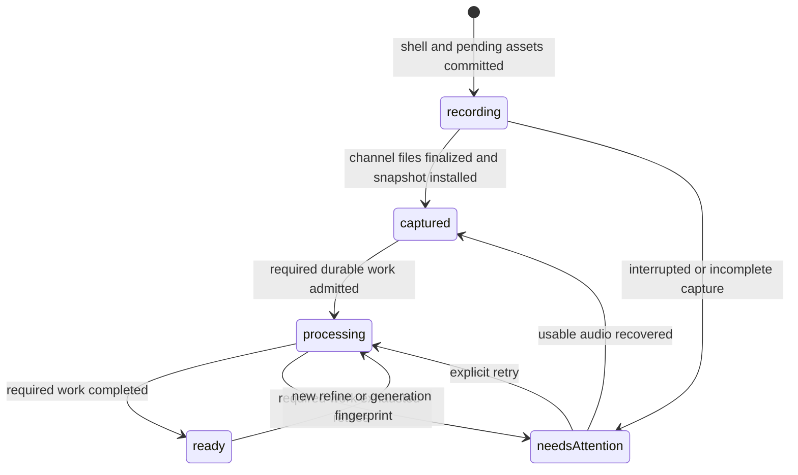
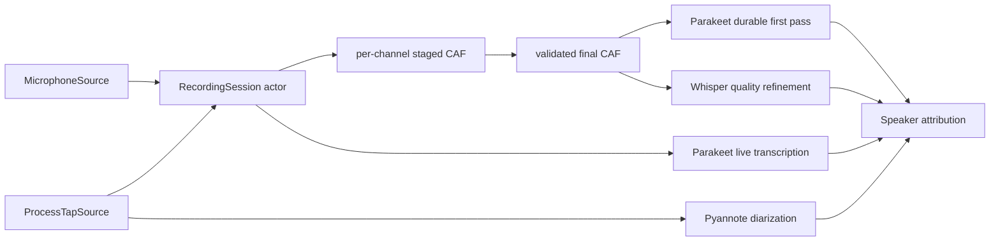

# Architecture

## Purpose

Portavoz is a local-first meeting assistant for macOS. It records independent
audio channels, creates live and refined transcripts, attributes speakers,
generates reviewable intelligence, and stores the user's library on the Mac.
Remote operations are explicit, policy-gated, and recorded without copying
meeting content into diagnostics or telemetry.

This document describes only the architecture implemented in the repository.
It is intentionally independent from roadmap terminology, work-item names,
migration history, and delivery sequencing. Detailed runtime behavior belongs
in `docs/specs/`; binding trade-offs belong in `docs/DECISIONS.md`; remaining
limitations and field validation belong in `docs/GAPS.md`, with deferred Apple
platform work in `docs/IOS.md`.

## Architectural style

Portavoz is a modular monolith distributed as one macOS application and one
command-line executable from a single Swift package. Module boundaries provide
dependency direction and test seams without introducing a backend, service
mesh, event-sourcing framework, or global state-management framework.

The system combines these patterns:

- application use cases for multi-step product workflows;
- typed domain values and stable failure categories;
- GRDB transactions and query-specific read models;
- durable owner-leased jobs for restart-safe derived work;
- process managers for filesystem and database reconciliation;
- feature-scoped observable presentation models;
- injected capability and platform adapters;
- explicit, content-free policy records before meeting-content network egress.

Feature parity is a permanent constraint: audio and user-owned data remain
discoverable when transcription, diarization, generation, indexing, sync, or an
external integration fails.

## Current module graph

`portavoz-app` and `portavoz-cli` are the current composition roots. They link
the concrete capability modules needed to construct production adapters and
also enter characterized workflows through `ApplicationKit`.



Capability modules never depend back on `ApplicationKit`. Sibling capability
dependencies are limited to three declared edges: `TranscriptionKit` and
`DiarizationKit` use `ModelStoreKit` for the verified model lifecycle, and
`IntegrationsKit` uses StorageKit for persisted sync state plus
IntelligenceKit values for issue-export formatting. `AudioPlaybackKit` is
self-contained over system frameworks and carries no module dependency.

## Module responsibilities

| Module | Implemented responsibility |
|---|---|
| `PortavozCore` | Typed meeting, transcript, speaker, person, audio, processing, provenance, evidence, language, privacy, sync, and secret-identifier values plus capability ports. Its only imports are Foundation and CryptoKit (digest values); it links no UI, persistence, media, or platform-service framework. |
| `ApplicationKit` | Delete, restore, purge, summary regeneration, local summary-provider discovery and clean-install selection, external-audio import, file transcription/diarization/summarization, meeting-bundle import/export, coherent meeting-document preparation and explicit document/action publishing, whole-library Markdown backup, Ask search/evidence/answer coordination, command-library reads, verified calendar-backed speaker-name suggestions, inert Meeting Detail title/structure/chapter suggestions, Meeting Detail playback preparation, waveform/filter coordination, failure-safe channel compression and clip export, deterministic pre-meeting reminder resolution, local voice capture/enrollment/status/deletion, explicit participant-voice memory and privacy-safe gallery management, microphone discovery, resumable recording-root management, pinned-model management, first-run eligibility, exact local-data receipts, pre-meeting preparation, refine/apply, recording start/stop/recovery, durable post-capture execution, typed workflow failures, storage-independent Library/Insights/Meeting Detail/menu-bar contracts, and deterministic product/read policies. |
| `PlatformKit` | Concrete Apple platform and security adapters. It currently owns device-only Keychain access and microphone authorization while depending only on `PortavozCore`. |
| `ModelStoreKit` | Task-oriented model catalog, pinned artifact metadata, streaming SHA-256 verification, atomic download repair, verified-installation evidence, and process-scoped model lifecycle. |
| `AudioCaptureKit` | Microphone capture, macOS process taps, dual-channel recording sessions, staged CAF writing, audio validation, checksums, levels, and recovery inspection. |
| `TranscriptionKit` | Live Parakeet and quality Whisper adapters, transcript scheduling, language-aware operation fingerprints, model preparation tokens, and segment mapping. |
| `DiarizationKit` | Pyannote/Core ML speaker turns, clustering, attribution, voice matching, and encrypted local voice-gallery support. |
| `IntelligenceKit` | Foundation Models, Ollama/OpenAI-compatible, and embedded MLX summary providers; structured summaries; Companion; retrieval and answer primitives; embeddings; provider fingerprints; and egress-aware clients. |
| `StorageKit` | GRDB schema, migrations, strict record conversion, transactions, FTS5, scoped observations, query-specific projections, durable jobs, generation provenance, privacy receipts, typed evidence, local feedback, people, sync journal, aggregate replay, support-safe snapshots, and Spotlight projections. |
| `AudioPlaybackKit` | Synchronized channel playback, stateless Accelerate waveform generation, silence skipping, voice-only playback, clip export, and AAC compression. |
| `IntegrationsKit` | Canonical Markdown/PDF and issue exports, meeting bundles, EventKit mapping, MCP protocol handling, policy-checked HTTP transport, deterministic sync envelopes, protected CloudKit record/state adapters, and sync lifecycle policy. |
| `portavoz-app` | macOS scenes, navigation, localization, accessibility, observable feature owners, dependency construction, native panels, model-lifecycle composition, and background supervisors. |
| `portavoz-cli` | Command parsing, terminal and MCP-tool presentation, benchmark harnesses, and one process composition surface. |

## Application boundary

`ApplicationKit` defines asynchronous Sendable workflows over narrow ports.
Concrete storage, model, capture, filesystem, playback-codec, document,
provider, and platform implementations are injected by the executable
composition roots.

The implemented application workflows include:

- meeting delete, restore, manual purge, and expiry purge;
- summary regeneration with explicit provider availability and provenance;
- local summary-provider discovery, typed recommendation, and first-selection
  persistence without overwriting an existing choice;
- external-audio import with required transcription and degradable derivation;
- relational `.portavoz` bundle import and read-consistent bundle export;
- read-consistent whole-library Markdown backup with typed partial results;
- reviewable refinement and revision-fenced acceptance;
- pre-capture recording reservation and failure reconciliation;
- audio-first stop, durable processing admission, and terminal recovery state;
- launch recovery for interrupted capture and expired processing leases;
- serial post-capture transcription, diarization, and summary execution with
  owner leases, heartbeats, exact input fingerprints, dependency admission,
  bounded retries, supersession cancellation, and scheduled wakes;
- canonical-person lookup and explicit speaker-to-person linking;
- instant Ask search, hybrid evidence retrieval, and optional local answer
  generation with evidence-preserving degradation;
- first-run eligibility without model or permission prerequisites;
- independent exact local-data receipt metrics with per-source degradation;
- pre-meeting preparation from shared Ask evidence, batched current summaries,
  open commitments, and source-indexed optional synthesis;
- bounded nonvisual meeting list/detail/search/open-item queries used by terminal
  and local protocol interfaces;
- standalone audio transcription, diarization with optional attribution, and
  summary generation over admitted files, with model and provider work behind
  injected processors;
- persisted meeting refinement that loads one current detail, accepts optional
  external audio, creates a revision-fenced draft, and applies it atomically;
- canonical meeting-document preparation for native save surfaces, explicit
  Gist publication, and pending action-item publication from one coherent
  meeting projection;
- local voice enrollment from an admitted file, a supplied in-memory sample, or
  a bounded captured sample; typed progress, sample validation,
  status/deletion, and ordered pinned-model inspection/installation all use
  capability-neutral ports;
- microphone discovery as capability-neutral identifiers and names, resumable
  recording-root inspection and update with ordered progress, and remembered-
  voice listing/deletion through a projection that excludes embeddings;
- speaker-name suggestion from one coherent meeting projection, optional
  calendar candidates, an injected untrusted proposer, and application-owned
  whole-token verification against currently unnamed remote speakers with
  typed transcript or calendar-candidate evidence;
- optional Meeting Detail title, structure, and chapter-label suggestion with
  application-owned eligibility, bounded output admission, cancellation, and
  per-output degradation over one storage-independent review projection;
- Meeting Detail audio preparation that resolves current channels, constructs
  one synchronized playback session, derives a bounded waveform and playback
  filters, coordinates failure-safe channel compression, and re-resolves files
  before clip export;
- pre-meeting reminder resolution from one sampled clock value, one configured
  lead window, session deduplication, and an injected upcoming-event source;
- degradable participant-voice suggestions, duplicate-offer admission, and
  explicit remembered-voice persistence without automatic speaker mutation;
- asynchronous user-managed secret reads, writes, presence checks, and deletion
  over an injected device-local storage port;
- scoped Library, Insights, Meeting Detail, and resident menu-bar read contracts;
- meeting-review, brief, reminder, mirror, and Insights policies.

Application failures cross into presentation as bounded categories or stable
workflow codes. Raw filesystem paths, localized dependency errors, model
payloads, and storage implementation details do not form the UI contract.

## Presentation and state ownership

SwiftUI renders immutable snapshots and sends explicit actions through feature
owners. Adopted read surfaces do not observe a global invalidation counter.

| Surface | State owner | Lifetime |
|---|---|---|
| Library | `LibraryModel` | one main window |
| Insights | `InsightsModel` | one main window |
| Meeting Detail | `MeetingDetailModel` | one selected meeting route |
| Ask conversation | `AskModel` | one main window |
| Command palette | `CommandPaletteModel` | application process |
| First-run welcome | `FirstRunModel` | application process |
| Local-data receipt | `LocalDataLedgerModel` | application process |
| Resident menu bar | `MenuBarModel` | menu-bar scene |
| Private sync | `MeetingSyncModel` | application process |
| Whole-library backup | `LibraryMarkdownBackupModel` | application process |
| Spotlight reconciliation | `SpotlightIndexer` | application process |
| Post-capture processing | `PostCaptureProcessingSupervisor` | application process |
| Whisper preparation | shared readiness owner | application process |

Library combines independently observed meeting rows, open commitments, trash,
and active FTS results. Insights combines chronology, participants,
commitments, talk balance, and bounded finding evidence. Meeting Detail merges
transcript/cast, newest summary, Companion, privacy receipt, and durable
processing streams. A failed stream degrades only its section and preserves
healthy state from the remaining sections.

Meeting Detail audio uses the same route owner. `MeetingDetailModel` owns
one-shot preparation, cancellation retry, compression state, playback
invalidation, and clip-export effects. ApplicationKit owns the operation order
and exposes an observable playback-session facade plus capability-neutral
waveform values.
Playback preparation has an audio-directory-scoped task lifetime, independent
from the multi-section review revision, so unrelated initial section updates
cannot cancel and consume the only load attempt.
The app composition resolves recording paths and supplies the concrete codec
adapter. `AudioPlaybackKit` owns AVFoundation playback, waveform analysis, AAC
encoding, and clip rendering. SwiftUI owns transport controls, drawing, and the
native save panel; it neither discovers channel files nor constructs audio
capabilities. Multi-channel compression refuses to replace an existing output,
retains every original until all outputs verify, removes generated outputs on
failure or cancellation, and only then removes the raw channels.

The menu-bar scene receives bounded recent-meeting and open-commitment updates
through an app adapter. EventKit access remains in the adapter and follows the
no-prompt resident-surface rule. The SwiftUI panel owns commands and rendering,
not Store or calendar coordination.

The pre-meeting reminder controller owns only its periodic task, session-local
deduplication, floating panel, and recording route. It requests a typed notice
from an application workflow. The app adapter samples preferences and time once
and performs the EventKit projection away from the main actor. Disabled
reminders do not query the calendar; due-event selection is independent of
source order and uses the same sampled time for admission and displayed
minutes.

The full Ask route and the command palette share one `AskMeetings` application
workflow. Its public request and response values carry meeting identity,
timestamps, snippets, complete evidence, and optional generated text without
exposing StorageKit records or IntelligenceKit passages to presentation.
`AskModel` owns each window's draft, conversation, progress, cancellation, and
stale-result fence. `CommandPaletteModel` owns process-scoped instant results,
answer state, cancellation, and generation fencing so closing one panel cannot
publish work into a later invocation. SwiftUI and AppKit retain rendering,
clipboard access, panel lifecycle, route selection, and exact evidence seeking.
The CLI command and local MCP tool enter the same workflow before formatting
their terminal or protocol responses.

The CLI has one process-wide platform composition and one database composition
surface. Meeting list, detail, search, open-item, Ask, and MCP reads enter
`QueryMeetingLibrary` or `AskMeetings`; the application values expose no GRDB
records. Detail plus the latest live General summary comes from one SQLite read
snapshot. File transcription, diarization, summarization, persisted refinement,
document export/publication, action-item publication, local voice management,
and pinned-model lifecycle also enter ApplicationKit workflows. Command files
retain argument parsing and terminal/protocol formatting. Concrete filesystem,
model, storage, voice, provider, integration, hashing, and platform behavior is
confined to `CLIComposition` and `CLIProductAdapters`. Capture diagnostics and
benchmark harnesses retain isolated direct capability construction.

The post-capture supervisor coalesces producer notifications, starts one
application workflow drain, and schedules the next persisted wake without
polling. `ProcessPostCaptureJobs` owns job order, lease maintenance, operation
identity, transcript cleanup and attribution policy, dependency admission,
summary provenance, retries, cancellations, lifecycle outcomes, and
post-meeting action timing. The app adapter owns concrete recording paths,
filesystem checks, model loading, user preferences, Shortcut invocation, idle
engine release, deterministic UI fixtures, and content-free signposts.

Meeting Detail document actions also enter the application boundary. One
workflow loads the selected meeting and latest General summary coherently,
renders the canonical Markdown once, and returns either Markdown or PDF bytes
with the released title-based suggested filename for the native save surface.
Explicit secret-Gist publication uses the same coherent source and renderer.
The app adapter owns utility-priority rendering, lazy credential resolution, gateway-backed
publisher construction, and native platform presentation. The route-owned
`MeetingDetailModel` owns document actions and typed effects; SwiftUI owns the
user gesture, off-device confirmation, save panel state, and localized result.

Meeting Detail voice memory enters a separate application workflow. It reads
one coherent meeting projection, limits candidates to unnamed remote speakers,
loads the encrypted gallery through an injected port, asks an injected
extractor only for relevant labels, applies one-to-one voice matching, and
returns suggestions without mutating the cast. Remembering a voice requires a
separate explicit request for a currently named remote speaker. The app adapter
owns recording-path resolution, model loading, transient embedding extraction,
encrypted gallery access, and disposable-test isolation. `MeetingDetailModel`
owns one-shot loading, suggestion state, duplicate-offer checks, and explicit
remember effects; SwiftUI never calls those adapters directly.

Meeting Detail transcript/calendar naming enters another application workflow.
It reads one coherent meeting projection, excludes the local and already named
speakers before using optional capabilities, asks an injected calendar source
for candidates around the meeting, and treats every generated proposal as
untrusted. A proposal is returned only when its label is still eligible and its
normalized name appears as complete tokens in a real transcript line or
calendar candidate. The workflow derives typed evidence from that source,
deduplicates labels, and never exposes generator-authored evidence prose. The
app adapter owns EventKit authorization and the concrete on-device proposer.
The route-owned `MeetingDetailModel` owns loading and suggestion state, removes
a chip only after its explicit rename persists, and keeps a failed confirmation
visible. SwiftUI renders inert chips, labels transcript versus calendar
evidence, and sends explicit actions. Calendar-backed confirmations retain
calendar provenance when the user later creates a canonical-person alias. No
suggestion names or links a person automatically.

Meeting Detail's optional title, summary-structure, and chapter labels enter a
single application workflow. It admits only template-like meeting titles,
General summaries, and still-untitled chapters; bounds generated labels; maps
recipes back to the known catalog; and preserves literal chapter excerpts when
generation is unavailable or fails. Cancellation remains cancellation so a
newer read revision can retry rather than publish stale suggestions. The app
adapter owns Foundation Models capability and the concrete title, meeting-type,
and chapter generators. The route-owned model owns one-shot state, revision
fencing, retry admission, and inert suggestions. SwiftUI renders suggestions
and sends explicit acceptance actions; no title or structure is applied
automatically. A failed title save keeps its chip visible and reports the
existing localized rename error.

The user's own voice enrollment also enters an application workflow. The
workflow bounds requested capture time, requires at least four seconds of
finite sample data, orders capture, extraction, and encrypted persistence, and emits typed progress without
importing audio or diarization implementations. The app adapter owns the exact
microphone mode, guarantees capture shutdown on success, failure, and
cancellation, loads the verified diarization capability, extracts the transient
embedding, and invalidates the cached diarizer only after a successful save or
delete. A destructive failure remains visible and does not clear presentation
state. Settings requests a twelve-second echo-cancelled capture. Onboarding
either reuses its already captured first-listen sample or requests a fresh
twelve-second raw capture. Neither SwiftUI surface constructs a microphone,
loads a model, extracts an embedding, or reads the encrypted voice store.
Disposable UI composition never reads or writes the host voice identity.

Settings obtains microphone choices, recording-root state, and remembered-
voice summaries through application workflows. The macOS adapter retains Core
Audio enumeration, marker-file and filesystem migration behavior, and the
encrypted gallery. Recording-root progress is drained in order before the
workflow returns, and the active marker changes only after migration succeeds.
A destination that resolves to the active root, including a symlink alias, is
a no-op and cannot enter resumable cleanup against its own source.
The gallery projection contains identity, display name, and creation time but
never an embedding. SwiftUI owns the folder panel and localized state; failed
destructive gallery actions remain visible and preserve the current list.

Whole-library backup survives Settings-window closure because progress and
terminal state belong to a process-scoped owner. Settings retains only the
native folder picker and localized presentation.

The first-run owner resolves one process-wide presentation decision so restored
windows cannot compete to show setup. It tracks active main-window hosts and
hands the single sheet to another active host if its current window closes.
Existing-library detection uses only a live-meeting count, and model readiness
never blocks launch or recording. The
Settings data receipt loads meeting count, allocated audio bytes, and encrypted
voice count concurrently; an unavailable source affects only its own tile and
is never rendered as a verified zero. Network behavior is presented separately
as an explicit-transfer and opt-in policy backed by local receipts.

Upcoming-meeting preparation belongs to the Library owner and enters
`PrepareMeetingBrief`. EventKit remains at the macOS adapter and is queried only
after access already exists. The workflow ranks shared Ask evidence, loads
current live summaries in one bounded database projection, overlaps commitment
loading, and admits generated context only when its source index resolves to a
navigable related meeting. Agenda buttons explicitly opt out of selectable
meeting-row behavior, so opening a brief cannot race the sidebar's meeting
route. Persistent privacy seals use local-first and explicit opt-in language;
feature-specific on-device claims remain limited to operations that cannot use
a remote provider.

## Verified model lifecycle

`ModelStoreKit` is the only source of local-model installation truth. Every
catalog descriptor fixes its revision and enumerates every artifact with an
expected byte count and SHA-256 digest. `ModelStore` streams each digest,
downloads only missing or corrupt artifacts into a same-directory sibling,
verifies the staged bytes, publishes them with one atomic rename or replacement,
and performs a complete verification pass before returning a loadable directory.

`VerifiedModelLifecycle` wraps the process's shared `ModelStore`. It emits an
installation value only after the complete descriptor passes verification,
keys successful evidence by descriptor identity and revision, coalesces
concurrent checks, and caches only successful results. Missing or corrupt
results remain re-checkable. Mutating operations for one descriptor execute in
invocation order, while explicit installation, deletion, invalidation, or
forced verification supersedes older checks; an awaiting consumer loops to the
current result instead of receiving stale evidence. Cancellation remains
effective before publication but cannot report false failure after a verified
installation crosses its filesystem commit point. This avoids hashing
multi-gigabyte weights for every consumer without treating a directory, one
expected filename, or aggregate file size as proof.

The macOS composition root owns one store and lifecycle for Settings, summary
provider resolution, import, durable post-capture work, support diagnostics,
live transcription, diarization, refinement, and voice-memory extraction.
Disposable automation receives an isolated empty model root and never inspects
host installations. Settings verifies in the background and renders a checking
state until evidence exists; it never exposes a partial installation as
downloaded. Recording remains audio-first and does not await any of these
checks.

## Persistence and aggregate integrity

Storage uses GRDB over SQLite with additive migrations and strict conversion.
Persisted identifiers are never replaced with random fallback values. Deleted
meetings are excluded from live aggregate reads, and child records cannot make
a tombstoned root visible again.

The current schema version is 14. It includes:

- meetings with lifecycle state and transcript revision;
- audio assets with capture/publication/health metadata;
- meeting-local speakers and explicitly confirmed canonical people/aliases;
- transcript segments and FTS5 search;
- immutable summary versions and action items;
- Companion cards and role-separated source evidence;
- generated overview, decision, and action-item evidence;
- reversible current-claim feedback stored separately from generated output;
- immutable generation-run provenance;
- content-free meeting egress attempts and receipt coverage;
- owner-leased durable processing jobs;
- a content-free per-meeting sync generation journal;
- meeting preferences and the generic outbox schema retained for compatible
  persistence even where runtime delivery uses another mechanism.

Aggregate writes that must remain consistent execute in one transaction.
Summary, Companion, transcript, evidence, provenance, and durable-job commits
use source-revision or owner-lease fences where applicable. Stale work is
discarded rather than overwriting newer truth.

Query-specific projections use explicit scope and ordering. Whole-library
backup performs one newest-first database snapshot. Spotlight uses a bounded
projection and client-state reconciliation. Library, Insights, Meeting Detail,
and the menu bar use independent GRDB observations sized to their surface.

## Durable recording lifecycle

The app persists a meeting shell and pending capture assets before audio
sources start. Capture therefore does not depend on model availability.



Each channel writes `<channel>.partial.caf`, validates non-empty audio, computes
its checksum and level/health evidence, and performs a same-directory
non-overwriting move to `<channel>.caf`. Stop then installs finalized assets,
provisional live content, and initial durable work atomically.

At launch, expired leases are recovered before the application workflow
resumes. It claims supported work serially, renews each lease, recomputes the
input fingerprint before capability work, publishes through owner- and
revision-fenced StorageKit transactions, and derives the next dependency or
terminal lifecycle outcome. Failed required work receives bounded persisted
retry dates; superseded work and exhausted optional summaries are cancelled
without hiding the captured meeting. The private macOS filesystem adapter
revalidates staged/final files and reconciles them with persisted lifecycle
state. Usable audio remains playable and exportable when derived work fails.

## Audio, transcription, and attribution

Microphone and system/process audio remain separate through capture,
transcription, diarization, playback, and refinement. The microphone channel is
structurally the local user; system audio requires speaker attribution.



Live transcription and batch work use separate scheduler capacity. One model
role cannot block another. Refine requires Whisper; attribution is degradable.
Import requests its required transcriber and optional diarizer independently.
Durable first-pass recovery and dictation request Parakeet without acquiring
unrelated models. `ProcessPostCaptureJobs` keeps automatic recognition
unhinted, removes nonlexical microphone fragments and periodic mic bleed,
preserves each segment's detected language, and sets meeting-level language
only when the attributed transcript is homogeneous. Diarization failure
degrades to an unattributed system channel; missing finalized audio remains a
durable failure.

Transcript recognition language and generated-output language are independent.
Automatic transcript policy leaves mixed-language meetings unhinted so each
segment can retain the language spoken. Fixed transcript language is an
explicit recovery choice. Summary language either follows homogeneous speech
or uses an explicit English/Spanish setting, with app locale as the fallback
for mixed or unknown speech.

Standalone terminal analysis follows the same boundary: ApplicationKit admits
the input file and owns operation order, elapsed-time policy, speaker identity,
optional attribution, summary persistence, and progress values. CLI adapters
construct the pinned local engines. Download callbacks are serialized and
drained before workflow completion so terminal progress cannot arrive after a
success result.

## Generated intelligence and evidence

Generated success is one atomic fact: an immutable output and its successful
generation record commit together. Provenance stores provider/model identity,
operation fingerprint, configuration, language, timing, outcome, and aggregate
metrics without meeting text.

Summary and Companion sources are typed rather than inferred from rendered
text:

- overview evidence points to ordered transcript segments;
- decision evidence uses canonical section and bullet coordinates;
- action-item evidence follows durable task identity;
- Companion evidence separates the triggering question from answer support;
- answer sources exist only for exact local-retrieval citations;
- feedback remains a separate reversible human assessment and never rewrites
  generated Markdown.

Every evidence write validates current transcript revision and live
same-meeting sources. Missing, stale, deleted, ambiguous, or partially resolved
evidence fails closed and disables navigation. Portable bundles remap every
identity explicitly.

## Search, playback, and derived indexes

Local lexical search uses FTS5 and query-specific bounded reads. One
ApplicationKit Ask workflow serves full Ask, the command palette, CLI, MCP, and
meeting-brief retrieval. Its local adapter combines bounded per-term lexical
candidates, exact semantic ranking, optional bilingual query expansion, and
reciprocal-rank fusion. Local generation is optional: ordinary model failure
preserves exact citations, while caller cancellation propagates. Embeddings are
device-local derivation and do not mark a meeting for sync. Meeting Detail
seeks exact transcript evidence only after its audio player is ready; early
source selections remain queued until waveform preparation completes.

Waveform generation is stateless and uses Accelerate over range-aligned channel
spans. Playback supports synchronized channels, silence skipping, local-voice
filtering, clips, and AAC compression. Meeting Detail receives only the
application-owned playback facade and capability-neutral waveform values.
Compression verifies every generated channel before removing raw inputs,
refuses to overwrite an existing canonical AAC file, and reports live
post-publication disk savings. Clip export resolves the current channel set for
each request so a completed compression cannot leave stale URLs behind.

Spotlight indexing is a process-scoped, protected, coalescing reconciler. It
compares compact client state, publishes bounded batches to a named index,
retries transient failures, and repairs missed work at launch without exposing
meeting content to logs.

## Open-format export and backup

Canonical Markdown and PDF rendering live in `IntegrationsKit`. Meeting bundles
carry a versioned relational aggregate with canonical identity remapping and
optional audio. Machine-local paths, canonical-person links, voiceprints,
secrets, embeddings, and transport state are not portable.

Single-meeting rendering and explicit publication enter ApplicationKit. The
macOS detail workflow loads one coherent detail projection, renders through an
injected document port, and returns Markdown or PDF bytes plus the released
title-based suggested filename for the native save surface. Secret-Gist
publication and terminal export use the same coherent projection and canonical
renderer; terminal export may return Markdown, write Markdown/PDF through an injected filesystem
port, or invoke an explicit publisher. Pending action-item publication
similarly reads one current detail and summary, resolves owners from that
snapshot, and publishes only unfinished items in stable order. Remote paths
complete local admission and no-op checks before the publisher prepares its
credential; only a prepared destination emits presentation progress and
proceeds to transport. Missing meetings and empty pending-item sets therefore
do not touch Keychain or announce egress.

Whole-library Markdown backup is coordinated by
`ApplicationKit.ExportLibraryMarkdownBackup`. StorageKit provides one
read-consistent snapshot containing every healthy live meeting, cast, ordered
transcript, and latest General summary. Corrupt required aggregates become
typed per-meeting failures while healthy meetings continue; corrupt optional
summaries degrade to absent.

Filename allocation accounts for existing Markdown files, Unicode
normalization, case and width equivalence, hidden/empty titles, reserved device
names, and concurrent collisions. The macOS filesystem adapter writes a UUID
temporary file in the destination directory and then moves it to the final name
without replacement. Existing files are never overwritten.

## Privacy and network boundaries

Meeting content stays on-device unless the user initiates or explicitly enables
an operation that requires transport. Every adopted meeting-content HTTP path
crosses a shared `DataEgressGateway` and declares content-free metadata before
transport:

- operation and purpose;
- destination host and scope;
- local-device or remote classification;
- consent source;
- meeting and provider identity.

The immutable attempt is persisted before URLSession runs. Persistence failure
fails closed, redirects are rejected, and transport failure remains visible in
the meeting privacy receipt. The receipt also reports the meeting's
private-sync standing, so an unqualified all-local claim can never coexist
with an acknowledged iCloud copy (see Private text sync). The gateway requires its recorder by type — a
gateway that cannot record an attempt cannot be constructed. One scoped
exception exists for standalone terminal analysis, which has no library
meeting to own a durable receipt: after its explicit interactive warning, the
CLI records the same content-free attempt on the terminal before transport
instead of in the database. Support diagnostics never include meeting text,
generated output, prompts, secrets, full URLs, paths, stable database IDs, raw
failure payloads, or reusable fingerprints.

`PortavozCore` defines stable secret identifiers and the `SecretStoring` port.
`PlatformKit.KeychainSecretStore` is the concrete device-only adapter and is
constructed only by the app and CLI composition roots. `ApplicationKit` exposes
asynchronous user-managed credential operations, so Settings credential and
publishing-command paths do not block their actor on Security.framework calls.
CLI publishing adapters resolve a credential lazily only after ApplicationKit
has admitted the local document or pending work, preserving local errors and
no-op behavior before any device-secret read.
The macOS meeting-document adapter follows the same ordering: local
Markdown/PDF preparation never reads a credential, and secret-Gist publication
resolves the GitHub token only after the coherent meeting document exists.
Encrypted voice stores receive the Core port directly; other capability clients
receive resolved credential values, and no capability module constructs
Keychain. SQLite and UserDefaults do not store secrets. Voiceprints are
encrypted, local, erasable biometric data and never enter bundles or sync.

Microphone authorization is queried and requested by a `PlatformKit` adapter.
Onboarding renders only the resulting stable state and delegates calendar
authorization to the app's EventKit integration adapter.

## Private text sync

StorageKit owns portable aggregate semantics and a content-free per-meeting
generation fence. Portable mutations advance the local generation; device-local
audio, paths, embeddings, jobs, receipts, model links, canonical people,
secrets, and voiceprints do not.

The per-meeting privacy receipt reads this journal: an acknowledged generation
is durable proof of a private-cloud copy and is disclosed permanently, even
after sync is disabled. An unacknowledged entry cannot distinguish disabled
sync from an in-flight first upload, so it changes nothing in the receipt. The
receipt says that CloudKit fields or assets are encrypted; it does not claim
end-to-end encryption because Apple guarantees that stronger property for
third-party CloudKit data only when the user enables Advanced Data Protection,
and Portavoz cannot inspect that account setting.

IntegrationsKit encodes deterministic text-first envelopes and maps them to one
private-zone record per meeting. Small payloads use encrypted record values;
large payloads use private CKAsset staging files. Content-free `0600` probes in
the destination directory test complete-protection and backup-exclusion
metadata independently. When supported, that metadata is applied while the
staging sibling is empty and verified before publication. Only `EINVAL` or
`ENOTSUP` marks one metadata capability unavailable; every other application or
verification failure fails closed. Regardless of optional metadata support,
one POSIX descriptor creates and writes a private `0600` sibling, handles
partial writes and `EINTR`, synchronizes with `fsync`, and closes without a
Foundation reopen. Size and owner-only permissions are always verified before
one same-volume atomic rename, so partial content never occupies the final path.
Deletion is an encrypted tombstone, not a physical record deletion.

Transport state is separate from the meeting database and includes hashed
account identity, explicit consent/seed policy, opaque engine state, system
fields, exact attempts, retries, replay cursors, and protected deferred
payloads. A platform-neutral lifecycle owns enable, existing-library seed,
retry, pause, remove-this-device, and account transitions.

The macOS CloudKit adapter is inert until explicit consent and signed capability
admission. It checks the exact private container, environment, CloudKit, and
push entitlements before constructing the container. Account status precedes
private-database identity. Local and UI-test builds use a no-cloud composition.
Audio never syncs.

## Concurrency and failure handling

- The package compiles under strict Swift 6 concurrency.
- Long-lived mutable workflow state is actor-isolated or `@MainActor`-isolated.
- Live transcription never waits behind batch transcription.
- Potentially blocking database-independent work runs at utility priority.
- Synchronous download callbacks are relayed in order to async presentation and
  drained before their owning workflow returns.
- Durable jobs are idempotent, fingerprinted, owner-leased, heartbeat-driven,
  and retryable without polling.
- Compiler-dense deterministic collections, including operation fingerprints
  and high-cardinality characterization fixtures, are assembled in explicitly
  typed steps. This preserves order and coverage while keeping the supported
  Sequoia Swift 6.2 compiler path bounded.
- Cancellation is explicit and cannot convert partial success into false
  completion.
- Optional derivation cannot roll back required captured/imported data.
- One failed scoped observation preserves healthy sections.
- Model availability is sampled by app-owned adapters and never silently
  changes the selected provider.
- Every critical workflow exposes a typed recovery route.

## Packaging and platform operation

The package minimum is macOS 14.4 because system-audio process taps require it.
Newer OS capabilities degrade through explicit availability checks. The app is
built from SwiftPM and wrapped by `scripts/make-app.sh`; `project.yml` exists for
XCUITest generation. Generated projects, result bundles, local screenshots,
agent state, scratch plans, and local work-item files remain outside version control;
`scripts/check-repository-hygiene.sh` rejects both tracked local state and
private work-item identifier leakage in implementation files. SwiftUI APIs with SDK-
overloaded defaults and presentation math that crosses `CGFloat`/`Double`
boundaries use explicit signatures and types so both the Sequoia and latest
compiler lanes resolve the same behavior. The focused transcript measures rows
in SwiftUI's built-in vertical scroll-view coordinate space instead of sharing
a generic named coordinate key with a concurrent visual-effect closure.
Current dependency APIs are used without deprecated compatibility shims. The
AVAudioConverter input callback receives its immutable source through one
lock-protected, one-shot Sendable bridge; unchecked conformance is confined to
that bridge and no import-wide concurrency suppression is used. First-party
Swift sources compile against the current SDK with warnings treated as errors
both locally and in the primary GitHub Actions build lane; the Sequoia lane
continues to prove compatibility with the oldest supported runtime/toolchain.

Pull-request UI evidence is selected deterministically from changed paths.
Known presentation and application files map to feature-level XCUITest
selectors; localization and shared-harness changes expand to bilingual
evidence; unknown production Swift paths fall back to the complete English
suite. An empty selector explicitly means every test; optional selector and
locale arguments are assembled without empty-array expansion on the system
Bash runtime. One `build-for-testing` result is reused across selected locales.
The complete 39-case English and Spanish suites remain the
release/architecture closure gate rather than the default cost for
documentation or isolated surface changes.

The shipping app is Developer ID signed, notarized, and stapled. The DMG has an
independent signature/notarization/stapling boundary. Release verification
extracts and checks the inner application rather than trusting the mounted DMG.
Production remains non-sandboxed because capture, CLI/MCP visibility, custom
folders, Sparkle, and local automation do not yet have a proven parity-preserving
sandbox composition.

`/Applications/Portavoz.app` is the user's release installation and is never
modified by development commands. `make install` builds, signs, verifies, and
installs `/Applications/Portavoz Dev.app`. UI tests use disposable SQLite,
audio, saved-state, and voice-gallery locations and never touch the real
library or Keychain.

## Enforced engineering rules

1. Meeting content does not leave the device without explicit, visible policy.
2. Portavoz remains MIT-compatible; GPL code is reference-only.
3. Strict Swift concurrency is mandatory; unchecked Sendable requires a
   confinement explanation.
4. Live work has independent scheduling capacity from batch work.
5. Downloaded models are pinned and SHA-256 verified before loading.
6. Persisted identity conversion is strict and never invents replacements.
7. Captured audio outranks every derived artifact and remains recoverable.
8. Application workflows own cross-capability policy; views do not coordinate
   persistence or long-running capability work once a surface is adopted.
9. Capability modules never depend back on the application layer.
10. Generated success and its immutable artifact share one atomic boundary.
11. Evidence is typed, same-meeting, revision-fenced, and fail-closed.
12. Human identity and feedback require explicit gestures and remain distinct
    from generated output.
13. Meeting-content network transport crosses one content-free policy gateway.
14. Support evidence is bounded and redacted by construction.
15. Selected providers and capabilities never change silently.
16. Distribution boundaries carry independently verified trust evidence.
17. Performance changes require comparable disposable measurements before and
    after implementation.
18. Every commit preserves released behavior and leaves build/tests green.
19. Every interactive control has a stable accessibility identifier and UI
    coverage appropriate to its surface. Diff scoping may reduce redundant UI
    execution but must fall back conservatively when ownership is unknown.
20. Every architecture-changing commit updates this document and every other
    source of truth whose current facts changed.
21. Internal tracker keys and ephemeral planning/tool state do not enter source
    identifiers, comments, or tracked files; durable accepted project truth
    remains in the reviewed `docs/` sources of truth.
22. SDK concurrency gaps are isolated in the narrowest lock-protected bridge
    with an explicit safety proof; broad import-level suppression is forbidden.

## Runtime composition facts

The following facts are part of the implemented architecture and are not hidden
behind aspirational diagrams:

- `PortavozCore` contains no Security, AVFoundation, EventKit, SwiftUI, AppKit,
  GRDB, CloudKit, or CoreML import.
- `PlatformKit` depends only on `PortavozCore`; its Keychain adapter is created
  only by the app and CLI composition roots.
- `portavoz-app` combines SwiftUI presentation and concrete macOS composition
  in one executable target, so the target links every capability module.
- `portavoz-cli` links every capability module for product commands and
  benchmark harnesses. Adopted product commands enter ApplicationKit through
  one composition surface and keep concrete integrations in executable
  adapters; command implementations contain parsing and presentation only.
  Capture diagnostics and benchmark harnesses keep direct capability access so
  their measurement construction remains explicit and disposable.
- The SwiftPM production graph is asserted exactly, including both executable
  composition roots, every inward Kit edge, and the absence of capability-to-
  application back edges. SwiftUI `View` types do not construct concrete
  storage, model, capture, playback, calendar, egress, or security adapters;
  call `MeetingStore`; or import database and platform-adapter frameworks.
  Concrete construction remains in executable composition, nonvisual live
  capability owners, diagnostics, and disposable benchmark harnesses.
- IntegrationsKit's CloudKit capability probe imports Security only to inspect
  signed entitlements; it does not own or store secrets.
- Durable post-capture product policy enters
  `ApplicationKit.ProcessPostCaptureJobs`. The app composes its StorageKit port
  and concrete audio/model/preference/automation capabilities, supervises the
  process lifetime, and maps content-free events to OSLog/signposts; it does
  not claim jobs or decide retries, fingerprints, dependencies, publication,
  or terminal outcomes.
- Meeting Detail Markdown/PDF preparation and secret-Gist publication enter
  ApplicationKit. The SwiftUI view does not construct the canonical renderer,
  publisher, or network gateway and does not read the publishing credential.
- Meeting Detail participant-voice suggestions and explicit memory enter
  ApplicationKit. The SwiftUI view does not read the encrypted gallery,
  resolve recording files, load a diarization model, or match embeddings.
- Meeting Detail transcript/calendar name suggestions enter ApplicationKit.
  The SwiftUI view does not request calendar access, construct a name proposer,
  trust generator-authored evidence, or verify generated identity claims.
- Meeting Detail title, structure, and chapter-label suggestions enter
  ApplicationKit. The SwiftUI view does not inspect model availability,
  construct concrete generators, coordinate one-shot state, or publish stale
  output after a newer review projection arrives.
- Meeting Detail playback preparation, waveform/filter policy, all-channel
  compression, and clip export enter ApplicationKit. The app adapter owns
  recording-root/channel resolution and the concrete AAC compressor; SwiftUI
  imports neither AudioPlaybackKit nor StorageKit and does not retain channel
  URLs or coordinate destructive publication.
- Settings and Onboarding local-voice enrollment enter ApplicationKit. Their
  SwiftUI views do not construct microphone, model, embedding, or encrypted
  identity capabilities; those remain in app composition adapters.
- Settings and Onboarding local summary-provider discovery enters
  ApplicationKit as one coherent typed profile and deterministic
  recommendation. A running Ollama service is eligible only when it exposes a
  nonempty model whose normalized name is not classified as OCR, embedding,
  reranking, or Whisper work. A separate use case persists a clean-install
  recommendation only while no selection exists; the main-actor adapter
  rechecks UserDefaults at the guarded write and reports whether that write won.
  Existing choices remain authoritative. The app adapter retains Foundation
  Models capability checks, content-free localhost requests,
  process/filesystem facts, provider DTO mapping, and UserDefaults persistence.
  SwiftUI localizes typed reasons and renders explicit actions without probing
  providers or recomputing policy. Discovery downloads nothing and never
  substitutes the configured engine. Disposable automation substitutes a
  bounded profile and never probes the host's Ollama models, memory, or disk.
- Settings microphone enumeration, recording-root changes, and remembered-
  voice management enter ApplicationKit. Their SwiftUI views do not construct
  Core Audio, storage-location, or encrypted-gallery capabilities and do not
  discard destructive failures.
- The pre-meeting reminder controller does not read EventKit, preferences, or
  clocks and does not apply reminder policy. Those concerns enter one
  ApplicationKit workflow through a private app adapter; AppKit retains only
  panel and route presentation.
- Model readiness comes only from `ModelStoreKit.VerifiedModelLifecycle`
  evidence over the full pinned descriptor. App consumers share one process
  lifecycle; Settings does not inspect filenames or byte counts, and summary
  providers do not receive a model directory without verified evidence.

Architecture dependency tests ratchet these exceptions so they cannot spread
silently.

## Quality evidence

The current local acceptance baseline is:

- `swift build` succeeds;
- `swift build -Xswiftc -warnings-as-errors` succeeds for first-party Swift;
- 973 package tests pass, with 13 real-model/environment cases gated;
- strict SwiftLint reports zero violations across 344 Swift source files;
- 39 XCUITest cases pass in English and 39 in Spanish;
- pull requests run only their selected feature-level UI evidence, while shared
  localization/harness changes and release closure expand to bilingual gates;
- deterministic UI runs use the real application with disposable storage and
  app-window or identified-panel screenshot attachments;
- measured scale fixtures cover 5,000-segment detail, 100,000-segment search,
  100,000-meeting Spotlight projection, semantic retrieval, and long-duration
  waveform generation.

Run the standard gates with:

```sh
swift build
swift build -Xswiftc -warnings-as-errors
swift test
swiftlint lint --strict --no-cache
scripts/check-repository-hygiene.sh
make test-ui-changed UI_BASE=origin/main
make test-ui-bilingual # explicit release/architecture closure
make install
```

## Documentation maintenance

- `docs/ARCHITECTURE.md` describes only current structure and invariants.
- `docs/specs/` describes current runtime behavior by domain.
- `docs/DECISIONS.md` records binding trade-offs and their reasons.
- `docs/GAPS.md` records unresolved limitations and field-validation needs.
- `docs/IOS.md` records deferred iOS platform constraints and direction.
- `README.md` is public product and contributor truth.
- `CHANGELOG.md` contains user-visible benefits, not internal restructuring.

The repository delivery ledger and completed migration execution ledger are
local maintainer state.
`docs/ROADMAP.md` and `docs/refactor-20260714.md` remain on developer machines
but are gitignored and must not be cited as public project truth.

All explanatory documentation under `docs/` is written in English. Literal
localized UI copy and bilingual transcript fixtures may remain quoted as test
evidence.
