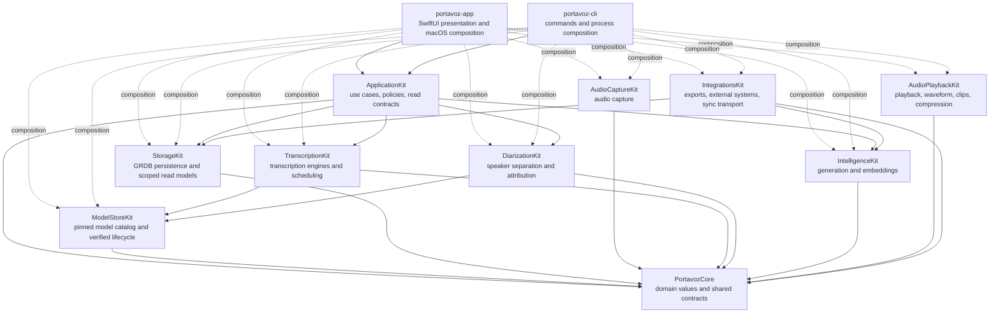
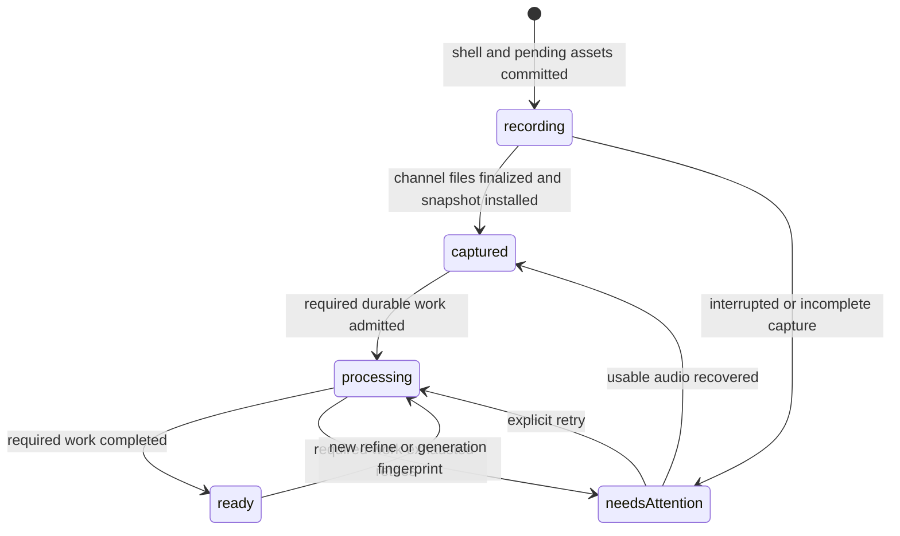
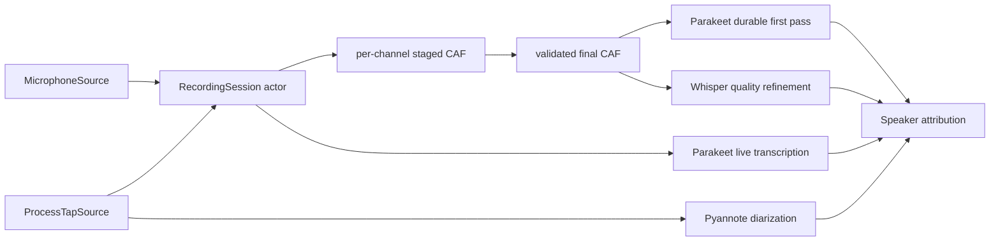

# Architecture

## Purpose

Portavoz is a local-first meeting assistant for macOS. It records independent
audio channels, creates live and refined transcripts, attributes speakers,
generates reviewable intelligence, and stores the user's library on the Mac.
Remote operations are explicit, policy-gated, and recorded without copying
meeting content into diagnostics or telemetry.

This document describes only the architecture implemented in the repository.
It is intentionally independent from roadmap terminology, work-item names,
migration history, and delivery sequencing. Detailed runtime behavior belongs
in `docs/specs/`; binding trade-offs belong in `docs/DECISIONS.md`; remaining
work belongs in `docs/ROADMAP.md` and `docs/GAPS.md`.

## Architectural style

Portavoz is a modular monolith distributed as one macOS application and one
command-line executable from a single Swift package. Module boundaries provide
dependency direction and test seams without introducing a backend, service
mesh, event-sourcing framework, or global state-management framework.

The system combines these patterns:

- application use cases for multi-step product workflows;
- typed domain values and stable failure categories;
- GRDB transactions and query-specific read models;
- durable owner-leased jobs for restart-safe derived work;
- process managers for filesystem and database reconciliation;
- feature-scoped observable presentation models;
- injected capability and platform adapters;
- explicit, content-free policy records before meeting-content network egress.

Feature parity is a permanent constraint: audio and user-owned data remain
discoverable when transcription, diarization, generation, indexing, sync, or an
external integration fails.

## Current module graph

`portavoz-app` and `portavoz-cli` are the current composition roots. They link
the concrete capability modules needed to construct production adapters and
also enter characterized workflows through `ApplicationKit`.



Capability modules never depend back on `ApplicationKit`. `IntegrationsKit` is
the only capability module that currently depends on sibling capability
modules: it uses StorageKit for persisted sync state and IntelligenceKit values
for issue-export formatting.

## Module responsibilities

| Module | Implemented responsibility |
|---|---|
| `PortavozCore` | Typed meeting, transcript, speaker, person, audio, processing, provenance, evidence, language, privacy, and sync values. It also contains the current Keychain-backed `SecretStore` implementation. |
| `ApplicationKit` | Delete, restore, purge, summary regeneration, external-audio import, meeting-bundle import/export, whole-library Markdown backup, Ask search/evidence/answer coordination, refine/apply, recording start/stop/recovery, typed workflow failures, storage-independent Library/Insights/Meeting Detail/menu-bar contracts, and deterministic product/read policies. |
| `ModelStoreKit` | Task-oriented model catalog, pinned artifact metadata, SHA-256 verification, download state, and model lifecycle. |
| `AudioCaptureKit` | Microphone capture, macOS process taps, dual-channel recording sessions, staged CAF writing, audio validation, checksums, levels, and recovery inspection. |
| `TranscriptionKit` | Live Parakeet and quality Whisper adapters, transcript scheduling, language-aware operation fingerprints, model preparation tokens, and segment mapping. |
| `DiarizationKit` | Pyannote/Core ML speaker turns, clustering, attribution, voice matching, and encrypted local voice-gallery support. |
| `IntelligenceKit` | Foundation Models, Ollama/OpenAI-compatible, and embedded MLX summary providers; structured summaries; Companion; retrieval and answer primitives; embeddings; provider fingerprints; and egress-aware clients. |
| `StorageKit` | GRDB schema, migrations, strict record conversion, transactions, FTS5, scoped observations, query-specific projections, durable jobs, generation provenance, privacy receipts, typed evidence, local feedback, people, sync journal, aggregate replay, support-safe snapshots, and Spotlight projections. |
| `AudioPlaybackKit` | Synchronized channel playback, stateless Accelerate waveform generation, silence skipping, voice-only playback, clip export, and AAC compression. |
| `IntegrationsKit` | Canonical Markdown/PDF and issue exports, meeting bundles, EventKit mapping, MCP protocol handling, policy-checked HTTP transport, deterministic sync envelopes, protected CloudKit record/state adapters, and sync lifecycle policy. |
| `portavoz-app` | macOS scenes, navigation, localization, accessibility, observable feature owners, dependency construction, native panels, model-readiness composition, background supervisors, and platform adapters. |
| `portavoz-cli` | Commands, terminal presentation, benchmark harnesses, and concrete dependency construction. |

## Application boundary

`ApplicationKit` defines asynchronous Sendable workflows over narrow ports.
Concrete storage, model, capture, filesystem, document, provider, and platform
implementations are injected by the executable composition roots.

The implemented application workflows include:

- meeting delete, restore, manual purge, and expiry purge;
- summary regeneration with explicit provider availability and provenance;
- external-audio import with required transcription and degradable derivation;
- relational `.portavoz` bundle import and read-consistent bundle export;
- read-consistent whole-library Markdown backup with typed partial results;
- reviewable refinement and revision-fenced acceptance;
- pre-capture recording reservation and failure reconciliation;
- audio-first stop, durable processing admission, and terminal recovery state;
- launch recovery for interrupted capture and expired processing leases;
- canonical-person lookup and explicit speaker-to-person linking;
- instant Ask search, hybrid evidence retrieval, and optional local answer
  generation with evidence-preserving degradation;
- scoped Library, Insights, Meeting Detail, and resident menu-bar read contracts;
- meeting-review, brief, reminder, mirror, and Insights policies.

Application failures cross into presentation as bounded categories or stable
workflow codes. Raw filesystem paths, localized dependency errors, model
payloads, and storage implementation details do not form the UI contract.

## Presentation and state ownership

SwiftUI renders immutable snapshots and sends explicit actions through feature
owners. Adopted read surfaces do not observe a global invalidation counter.

| Surface | State owner | Lifetime |
|---|---|---|
| Library | `LibraryModel` | one main window |
| Insights | `InsightsModel` | one main window |
| Meeting Detail | `MeetingDetailModel` | one selected meeting route |
| Ask conversation | `AskModel` | one main window |
| Command palette | `CommandPaletteModel` | application process |
| Resident menu bar | `MenuBarModel` | menu-bar scene |
| Private sync | `MeetingSyncModel` | application process |
| Whole-library backup | `LibraryMarkdownBackupModel` | application process |
| Spotlight reconciliation | `SpotlightIndexer` | application process |
| Post-capture processing | worker supervisor | application process |
| Whisper preparation | shared readiness owner | application process |

Library combines independently observed meeting rows, open commitments, trash,
and active FTS results. Insights combines chronology, participants,
commitments, talk balance, and bounded finding evidence. Meeting Detail merges
transcript/cast, newest summary, Companion, privacy receipt, and durable
processing streams. A failed stream degrades only its section and preserves
healthy state from the remaining sections.

The menu-bar scene receives bounded recent-meeting and open-commitment updates
through an app adapter. EventKit access remains in the adapter and follows the
no-prompt resident-surface rule. The SwiftUI panel owns commands and rendering,
not Store or calendar coordination.

The full Ask route and the command palette share one `AskMeetings` application
workflow. Its public request and response values carry meeting identity,
timestamps, snippets, complete evidence, and optional generated text without
exposing StorageKit records or IntelligenceKit passages to presentation.
`AskModel` owns each window's draft, conversation, progress, cancellation, and
stale-result fence. `CommandPaletteModel` owns process-scoped instant results,
answer state, cancellation, and generation fencing so closing one panel cannot
publish work into a later invocation. SwiftUI and AppKit retain rendering,
clipboard access, panel lifecycle, route selection, and exact evidence seeking.
The CLI command and local MCP tool enter the same workflow before formatting
their terminal or protocol responses.

Whole-library backup survives Settings-window closure because progress and
terminal state belong to a process-scoped owner. Settings retains only the
native folder picker and localized presentation.

## Persistence and aggregate integrity

Storage uses GRDB over SQLite with additive migrations and strict conversion.
Persisted identifiers are never replaced with random fallback values. Deleted
meetings are excluded from live aggregate reads, and child records cannot make
a tombstoned root visible again.

The current schema version is 14. It includes:

- meetings with lifecycle state and transcript revision;
- audio assets with capture/publication/health metadata;
- meeting-local speakers and explicitly confirmed canonical people/aliases;
- transcript segments and FTS5 search;
- immutable summary versions and action items;
- Companion cards and role-separated source evidence;
- generated overview, decision, and action-item evidence;
- reversible current-claim feedback stored separately from generated output;
- immutable generation-run provenance;
- content-free meeting egress attempts and receipt coverage;
- owner-leased durable processing jobs;
- a content-free per-meeting sync generation journal;
- meeting preferences and the generic outbox schema retained for compatible
  persistence even where runtime delivery uses another mechanism.

Aggregate writes that must remain consistent execute in one transaction.
Summary, Companion, transcript, evidence, provenance, and durable-job commits
use source-revision or owner-lease fences where applicable. Stale work is
discarded rather than overwriting newer truth.

Query-specific projections use explicit scope and ordering. Whole-library
backup performs one newest-first database snapshot. Spotlight uses a bounded
projection and client-state reconciliation. Library, Insights, Meeting Detail,
and the menu bar use independent GRDB observations sized to their surface.

## Durable recording lifecycle

The app persists a meeting shell and pending capture assets before audio
sources start. Capture therefore does not depend on model availability.



Each channel writes `<channel>.partial.caf`, validates non-empty audio, computes
its checksum and level/health evidence, and performs a same-directory
non-overwriting move to `<channel>.caf`. Stop then installs finalized assets,
provisional live content, and initial durable work atomically.

At launch, expired leases are recovered before the worker resumes. The private
macOS filesystem adapter revalidates staged/final files and reconciles them
with persisted lifecycle state. Usable audio remains playable and exportable
when derived work fails.

## Audio, transcription, and attribution

Microphone and system/process audio remain separate through capture,
transcription, diarization, playback, and refinement. The microphone channel is
structurally the local user; system audio requires speaker attribution.



Live transcription and batch work use separate scheduler capacity. One model
role cannot block another. Refine requires Whisper; attribution is degradable.
Import requests its required transcriber and optional diarizer independently.
Durable first-pass recovery and dictation request Parakeet without acquiring
unrelated models.

Transcript recognition language and generated-output language are independent.
Automatic transcript policy leaves mixed-language meetings unhinted so each
segment can retain the language spoken. Fixed transcript language is an
explicit recovery choice. Summary language either follows homogeneous speech
or uses an explicit English/Spanish setting, with app locale as the fallback
for mixed or unknown speech.

## Generated intelligence and evidence

Generated success is one atomic fact: an immutable output and its successful
generation record commit together. Provenance stores provider/model identity,
operation fingerprint, configuration, language, timing, outcome, and aggregate
metrics without meeting text.

Summary and Companion sources are typed rather than inferred from rendered
text:

- overview evidence points to ordered transcript segments;
- decision evidence uses canonical section and bullet coordinates;
- action-item evidence follows durable task identity;
- Companion evidence separates the triggering question from answer support;
- answer sources exist only for exact local-retrieval citations;
- feedback remains a separate reversible human assessment and never rewrites
  generated Markdown.

Every evidence write validates current transcript revision and live
same-meeting sources. Missing, stale, deleted, ambiguous, or partially resolved
evidence fails closed and disables navigation. Portable bundles remap every
identity explicitly.

## Search, playback, and derived indexes

Local lexical search uses FTS5 and query-specific bounded reads. One
ApplicationKit Ask workflow serves full Ask, the command palette, CLI, MCP, and
meeting-brief retrieval. Its local adapter combines bounded per-term lexical
candidates, exact semantic ranking, optional bilingual query expansion, and
reciprocal-rank fusion. Local generation is optional: ordinary model failure
preserves exact citations, while caller cancellation propagates. Embeddings are
device-local derivation and do not mark a meeting for sync. Meeting Detail
seeks exact transcript evidence only after its audio player is ready; early
source selections remain queued until waveform preparation completes.

Waveform generation is stateless and uses Accelerate over range-aligned channel
spans. Playback supports synchronized channels, silence skipping, local-voice
filtering, clips, and AAC compression.

Spotlight indexing is a process-scoped, protected, coalescing reconciler. It
compares compact client state, publishes bounded batches to a named index,
retries transient failures, and repairs missed work at launch without exposing
meeting content to logs.

## Open-format export and backup

Canonical Markdown and PDF rendering live in `IntegrationsKit`. Meeting bundles
carry a versioned relational aggregate with canonical identity remapping and
optional audio. Machine-local paths, canonical-person links, voiceprints,
secrets, embeddings, and transport state are not portable.

Whole-library Markdown backup is coordinated by
`ApplicationKit.ExportLibraryMarkdownBackup`. StorageKit provides one
read-consistent snapshot containing every healthy live meeting, cast, ordered
transcript, and latest General summary. Corrupt required aggregates become
typed per-meeting failures while healthy meetings continue; corrupt optional
summaries degrade to absent.

Filename allocation accounts for existing Markdown files, Unicode
normalization, case and width equivalence, hidden/empty titles, reserved device
names, and concurrent collisions. The macOS filesystem adapter writes a UUID
temporary file in the destination directory and then moves it to the final name
without replacement. Existing files are never overwritten.

## Privacy and network boundaries

Meeting content stays on-device unless the user initiates or explicitly enables
an operation that requires transport. Every adopted meeting-content HTTP path
crosses a shared `DataEgressGateway` and declares content-free metadata before
transport:

- operation and purpose;
- destination host and scope;
- local-device or remote classification;
- consent source;
- meeting and provider identity.

The immutable attempt is persisted before URLSession runs. Persistence failure
fails closed, redirects are rejected, and transport failure remains visible in
the meeting privacy receipt. Support diagnostics never include meeting text,
generated output, prompts, secrets, full URLs, paths, stable database IDs, raw
failure payloads, or reusable fingerprints.

API keys and tokens use Keychain with this-device-only accessibility. SQLite
and UserDefaults do not store secrets. Voiceprints are encrypted, local,
erasable biometric data and never enter bundles or sync.

## Private text sync

StorageKit owns portable aggregate semantics and a content-free per-meeting
generation fence. Portable mutations advance the local generation; device-local
audio, paths, embeddings, jobs, receipts, model links, canonical people,
secrets, and voiceprints do not.

IntegrationsKit encodes deterministic text-first envelopes and maps them to one
private-zone record per meeting. Small payloads use encrypted record values;
large payloads use complete-protection, backup-excluded CKAsset staging files.
Deletion is an encrypted tombstone, not a physical record deletion.

Transport state is separate from the meeting database and includes hashed
account identity, explicit consent/seed policy, opaque engine state, system
fields, exact attempts, retries, replay cursors, and protected deferred
payloads. A platform-neutral lifecycle owns enable, existing-library seed,
retry, pause, remove-this-device, and account transitions.

The macOS CloudKit adapter is inert until explicit consent and signed capability
admission. It checks the exact private container, environment, CloudKit, and
push entitlements before constructing the container. Account status precedes
private-database identity. Local and UI-test builds use a no-cloud composition.
Audio never syncs.

## Concurrency and failure handling

- The package compiles under strict Swift 6 concurrency.
- Long-lived mutable workflow state is actor-isolated or `@MainActor`-isolated.
- Live transcription never waits behind batch transcription.
- Potentially blocking database-independent work runs at utility priority.
- Durable jobs are idempotent, fingerprinted, owner-leased, heartbeat-driven,
  and retryable without polling.
- Cancellation is explicit and cannot convert partial success into false
  completion.
- Optional derivation cannot roll back required captured/imported data.
- One failed scoped observation preserves healthy sections.
- Model availability is sampled by app-owned adapters and never silently
  changes the selected provider.
- Every critical workflow exposes a typed recovery route.

## Packaging and platform operation

The package minimum is macOS 14.4 because system-audio process taps require it.
Newer OS capabilities degrade through explicit availability checks. The app is
built from SwiftPM and wrapped by `scripts/make-app.sh`; `project.yml` exists for
XCUITest generation.

The shipping app is Developer ID signed, notarized, and stapled. The DMG has an
independent signature/notarization/stapling boundary. Release verification
extracts and checks the inner application rather than trusting the mounted DMG.
Production remains non-sandboxed because capture, CLI/MCP visibility, custom
folders, Sparkle, and local automation do not yet have a proven parity-preserving
sandbox composition.

`/Applications/Portavoz.app` is the user's release installation and is never
modified by development commands. `make install` builds, signs, verifies, and
installs `/Applications/Portavoz Dev.app`. UI tests use disposable SQLite,
audio, saved-state, and voice-gallery locations and never touch the real
library or Keychain.

## Enforced engineering rules

1. Meeting content does not leave the device without explicit, visible policy.
2. Portavoz remains MIT-compatible; GPL code is reference-only.
3. Strict Swift concurrency is mandatory; unchecked Sendable requires a
   confinement explanation.
4. Live work has independent scheduling capacity from batch work.
5. Downloaded models are pinned and SHA-256 verified before loading.
6. Persisted identity conversion is strict and never invents replacements.
7. Captured audio outranks every derived artifact and remains recoverable.
8. Application workflows own cross-capability policy; views do not coordinate
   persistence or long-running capability work once a surface is adopted.
9. Capability modules never depend back on the application layer.
10. Generated success and its immutable artifact share one atomic boundary.
11. Evidence is typed, same-meeting, revision-fenced, and fail-closed.
12. Human identity and feedback require explicit gestures and remain distinct
    from generated output.
13. Meeting-content network transport crosses one content-free policy gateway.
14. Support evidence is bounded and redacted by construction.
15. Selected providers and capabilities never change silently.
16. Distribution boundaries carry independently verified trust evidence.
17. Performance changes require comparable disposable measurements before and
    after implementation.
18. Every commit preserves released behavior and leaves build/tests green.
19. Every interactive control has a stable accessibility identifier and UI
    coverage appropriate to its surface.
20. Every architecture-changing commit updates this document and every other
    source of truth whose current facts changed.

## Current boundary exceptions

The following facts are part of the implemented architecture and are not hidden
behind aspirational diagrams:

- `PortavozCore.SecretStore` imports Security and contains the concrete
  Keychain implementation.
- `portavoz-app` combines SwiftUI presentation and concrete macOS composition
  in one executable target, so the target links every capability module.
- `portavoz-cli` constructs concrete capabilities and also links every module.
- First-run eligibility, the local Settings ledger, and pre-meeting brief
  assembly still perform direct Store/capability reads in app presentation
  files; their surrounding Library state is already scoped.
- The durable post-capture executor remains app-composed and talks to concrete
  capability and StorageKit APIs by design; further extraction remains
  evidence-gated.

Architecture dependency tests ratchet these exceptions so they cannot spread
silently.

## Quality evidence

The current local acceptance baseline is:

- `swift build` succeeds;
- 834 package tests pass, with 13 real-model/environment cases gated;
- strict SwiftLint reports zero violations across 302 Swift source files;
- 35 XCUITest cases pass in English and 35 in Spanish;
- deterministic UI runs use the real application with disposable storage and
  app-window or identified-panel screenshot attachments;
- measured scale fixtures cover 5,000-segment detail, 100,000-segment search,
  100,000-meeting Spotlight projection, semantic retrieval, and long-duration
  waveform generation.

Run the standard gates with:

```sh
swift build
swift test
swiftlint lint --strict --no-cache
make test-ui-en
make test-ui-es
make install
```

## Documentation maintenance

- `docs/ARCHITECTURE.md` describes only current structure and invariants.
- `docs/specs/` describes current runtime behavior by domain.
- `docs/DECISIONS.md` records binding trade-offs and their reasons.
- `docs/ROADMAP.md` records current progress and the next executable work.
- `docs/GAPS.md` records unresolved limitations and field-validation needs.
- `docs/refactor-20260714.md` retains the migration execution plan.
- `README.md` is public product and contributor truth.
- `CHANGELOG.md` contains user-visible benefits, not internal restructuring.

All explanatory documentation under `docs/` is written in English. Literal
localized UI copy and bilingual transcript fixtures may remain quoted as test
evidence.
