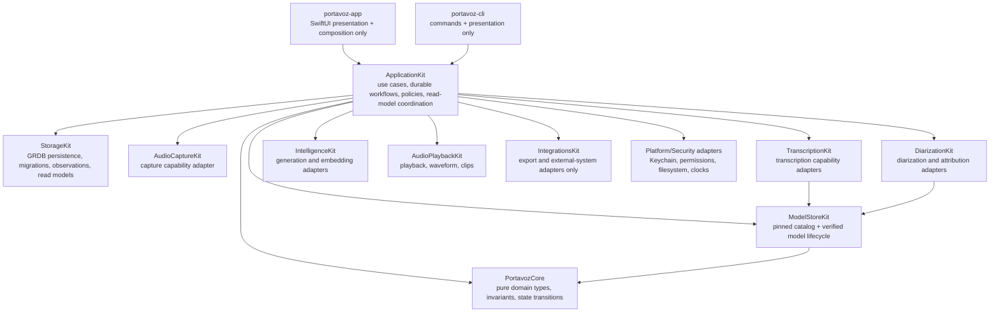
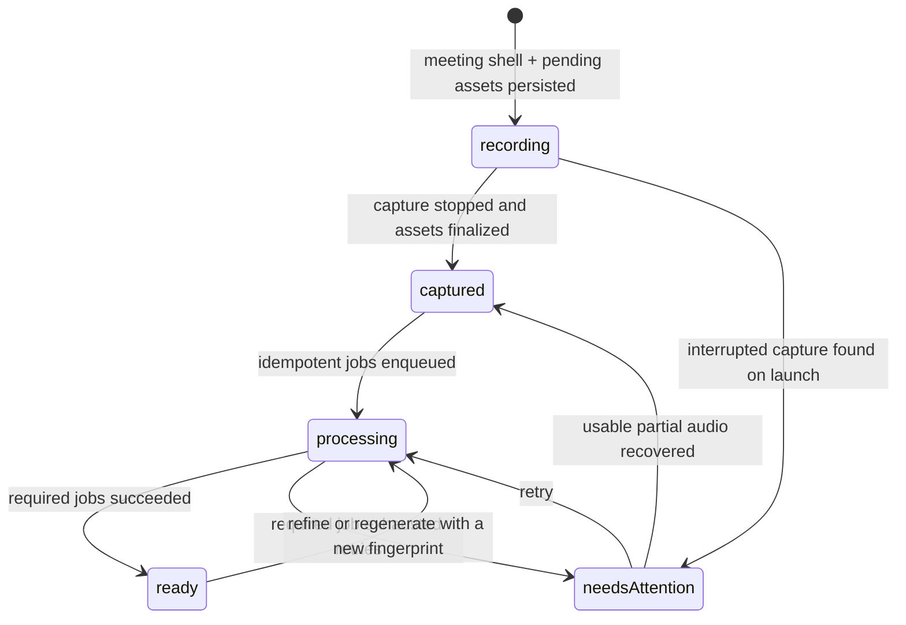

# ARCHITECTURE — Technical design and engineering rules

## What Portavoz is

Privacy-first, local-first meeting assistant for Apple platforms (macOS first; iOS/iPadOS later; visionOS eventually), written natively in Swift 6 + SwiftUI. Core promise: **know who said what — including the user's contributions — without audio leaving the device.** It is the Swift-native successor to Meetily's ideas (reference repository in `../meetily`; studied, but its code is never ported).

Differentiators in priority order: structural who-said-what through dual-channel capture, diarization with the user's voice identity, bilingual ES/EN summaries and live translated captions, development workflow integrations (GitHub/Linear, local MCP server, and Shortcut/URL/Spotlight automation surfaces; native App Intents remain planned), and an open data format (Markdown + user-owned SQLite).

## Document contract and refactor status

This file is the architecture source of truth for the **current commit**. It
separates as-built behavior from target architecture explicitly; planned types,
tables, modules, and workflows must never be described as implemented. The
executable migration plan, rationale, bands, target schemas, and acceptance
criteria live in [refactor-20260714.md](refactor-20260714.md).

The rearchitecture direction is approved and execution is active on
`codex/refactor-20260717`. Band 0 is complete in two independently shippable
slices, and Band 1 is in progress. Slice 0A made persisted identity/enum decoding strict and scoped
library/Insights projections through live meetings. Slice 0B separated
transcript recognition policy from generated-output language and made
recording, rolling summary, import, refine, and regeneration use the same typed
policy boundary. Band 1 slice 1A installed the additive schema-v6 durability
contract. Slice 1B adopted its first runtime boundary: new recordings now own a
durable shell and pending assets before capture starts. Slice 1C now stages,
validates, hashes, and atomically publishes channel files, then installs the
captured meeting projection through one StorageKit Unit of Work. Slice 1D-a
adds the typed, idempotent, owner-leased StorageKit job queue while leaving the
released synchronous app workflow in place. Slice 1D-b1 adds process-launch
reconciliation for interrupted capture files, meeting lifecycle, and expired
leases without running ML. Slice 1D-b2a adds stale-safe atomic diarization and
summary artifact completion; concrete app job producers/workers remain 1D-b2b.
Every refactor commit must update this file to reflect the
dependency graph and migration status that actually exist in that commit,
while the matching as-built spec records runtime behavior.

## SPM workspace (a single package)

`PortavozCore` contains shared domain types. The package currently exposes ten
Kit libraries. Most depend on Core only; verified exceptions are
`TranscriptionKit → ModelStoreKit`, `DiarizationKit → ModelStoreKit`, and
`IntegrationsKit → IntelligenceKit + StorageKit` (D31). The app and CLI compose
the capabilities directly today.

| Module | Responsibility |
|---|---|
| `PortavozCore` | Shared domain types, typed IDs, canonical `LanguageCode`, and independent transcript/summary language policies. It currently also contains the concrete Keychain-backed `SecretStore`; moving that implementation to a platform adapter is a target, not current behavior |
| `ModelStoreKit` | Curated registry (`ModelCatalog`, routing **by task** through `ModelTask`) + `ModelStore`: downloads verified by sha256/pinned commit. Shared by every Kit that loads models |
| `AudioCaptureKit` | Mic (AVAudioEngine) + per-app process taps (Core Audio, macOS 14.4+); `RecordingSession` (with `onChunk` tap); crash-safe staged CAF writer; validated SHA-256/health metadata and same-directory atomic publication; persisted-PCM recovery inspection/publication; retention policies |
| `TranscriptionKit` | `TranscriptionEngine` protocol; `ParakeetEngine` (live sliding window + batch long-form); `TranscriptionScheduler` (D7 slots) |
| `DiarizationKit` | `PyannoteDiarizer` (pyannote community-1 + WeSpeaker through FluidAudio) over system/room channels; `SpeakerAttributor` (structural who-said-what); `Voiceprint` (biometric: on-device only, encrypted, never synced, erasable) |
| `IntelligenceKit` | Summary providers for Foundation Models, OpenAI-compatible BYOK/Ollama, and embedded MLX; structured summaries, Recipes, fingerprint caching, Companion/RAG intelligence, schedulers, embeddings, and bilingual output policy |
| `ContextFeedKit` | Placeholder-scale compatibility target; timestamped note behavior is implemented through Core/app/storage rather than a substantial standalone Kit |
| `StorageKit` | `MeetingStore` over GRDB 7 + FTS5, schema v6: the released meeting/transcript/summary/search/trash behavior plus lifecycle, audio-asset, durable-job, generation-run, outbox, and meeting-preference foundations. Recording reserves assets and installs the captured meeting/assets/live content in one Unit of Work; recovery installs revalidated assets through a repeat-safe Unit of Work that protects ready meetings. The typed job queue enforces idempotent enqueue, owner-bound leases, retries, terminal states, and lifecycle derivation; generated diarization/summary artifacts have stale-safe atomic completion boundaries, but the app does not enqueue the queue yet. Provenance, outbox, and per-meeting preferences remain unconsumed. Persisted IDs/enums decode strictly, live library projections join the meeting root, and segment vectors remain plain BLOBs |
| `AudioPlaybackKit` | Synchronized playback, channel-aware waveform data, clips, silence skipping, and AAC transcoding |
| `SyncKit` | Placeholder-scale `Visibility` model. CKSyncEngine and CloudKit sync are planned, not implemented |
| `IntegrationsKit` | Export and external-system adapters plus several cross-cutting read/product policies. It is the only cross-Kit layer under D31; narrowing it is part of Band 2 |
| `portavoz-app` | SwiftUI macOS application. `AppServices` currently composes dependencies and carries application orchestration; feature extraction is planned |
| `portavoz-cli` | Executable development harness (`record --seconds N --pid X --system --out dir`) |

## Target modular-monolith architecture (not implemented yet)

Portavoz remains a single local SwiftPM product. The target adds one
`ApplicationKit` for use cases and durable workflows; it does not introduce a
backend, microservices, full CQRS, full event sourcing, or a state-management
framework.



Target responsibility rules:

- `PortavozCore` becomes pure and portable: entities, invariants, typed
  policies, state transitions, and capability protocols.
- `ApplicationKit` owns `StartRecording`, `StopRecording`, recovery, refine,
  import, regeneration, export, delete/restore, and query coordination.
- `ModelStoreKit` remains the single reviewed catalog and SHA-256-verified
  lifecycle for downloadable model artifacts.
- `portavoz-app` owns dependency composition, navigation, feature-scoped
  `@Observable` models, localization, and rendering only.
- `StorageKit` owns strict record conversion, transactions, migrations,
  integrity checks, query-specific read models, and scoped GRDB observations.
- `IntegrationsKit` retains outbound adapters; pure chapter, voice, summary,
  playback, reminder, and Insights policies move to Core/ApplicationKit.
- Placeholder Kits gain a real bounded responsibility or are removed after
  external package compatibility is checked.

Feature parity is non-negotiable: the current release remains functional after
every incremental Strangler slice. The old path is removed only after the new
path has characterization coverage and equivalent runtime evidence.

## Durability foundation and first runtime adoption (as built)

Band 1 slice 1A adds one atomic, additive `v6` migration (D36):

- `MeetingLifecycleState` and persisted `meeting.lifecycleState`,
  `transcriptRevision`, and `lastProcessingError`; existing rows become
  `ready` at revision zero;
- `audioAsset`, `processingJob`, `generationRun`, `outboxEvent`, and
  `meetingPreference` tables with integrity constraints and dispatch indexes;
- nullable `generationRunID` foreign keys on segments, summaries, and
  Companion cards.

Slice 1B adds the first workflow adoption behind that contract:

- `AudioAssetID`, `AudioAsset`, strict record conversion, and live-rooted asset
  reads;
- one `MeetingStore.beginRecording` transaction that inserts a `recording`
  shell plus all pending capture assets before sources start;
- guarded rollback only for an empty provisional shell that never produced a
  file or user/generated content (D37);
- controller transitions through `captured`, `processing`, `ready`, or
  `needsAttention`; valid audio is retained when transcription or later work
  fails.

Slice 1C closes the normal Stop publication boundary (D38):

- capture reserves `<channel>.partial.caf`; keeping CAF as the terminal
  extension lets `AVAudioFile` create the intended crash-readable container;
- stop closes writers, validates a non-empty mono CAF, streams SHA-256, records
  actual duration/size/sample format plus finite peak/RMS dBFS computed only
  from successfully written, signed-PCM-clamped samples and
  `healthy`/`silent`/`clipped` health, then performs one same-directory rename
  to `<channel>.caf` without overwriting an existing final file;
- `MeetingStore.installCapturedSnapshot` advances the untouched shell and
  installs finalized/missing assets, the provisional live cast/transcript,
  notes, and Companion cards in one transaction; batch diarization later uses
  the existing atomic `replaceCast` path;
- publication failure preserves either staging or final audio and marks the
  shell `needsAttention`; it never enters D37's no-file hard rollback.

Slice 1D-a adopts the durable queue contract without switching app execution
yet (D39):

- `ProcessingJobID`, open typed kinds, strict states, requests, failures, and
  strict record decoding map the schema-v6 row without database knowledge in
  `PortavozCore`;
- `enqueueProcessingJobs` writes each `(meetingID, kind, inputFingerprint)`
  once and derives `processing` in the same transaction; re-enqueue returns the
  original execution policy and never resurrects terminal work;
- capable workers atomically claim the highest-priority due job, increment one
  attempt, and own every heartbeat/completion/failure write through an
  unexpired lease. Progress is monotonic and retries become due through
  `notBefore`;
- terminal reconciliation keeps a meeting `processing` while work remains,
  moves it to `needsAttention` after an exhausted failure, and moves it to
  `ready` when all work succeeds or is cancelled. Expired-lease recovery is
  repeat-safe, and deleted meetings are neither exposed nor claimed.

Slice 1D-b1 closes process-launch capture reconciliation without adopting ML
workers (D40):

- `RecordingRecoveryCoordinator` starts from app composition rather than a
  view, skips benchmark launches, and defers while the live recording pipeline
  is preparing, recording, or processing;
- it scans each pending asset in both the configured recordings root and the
  default fallback. Staging-only evidence is fully remeasured and published;
  final-only evidence is fully revalidated; missing evidence is explicit; and
  staging-plus-final or duplicate-root evidence becomes
  `capture.recovery.ambiguous` without overwrite, deletion, or guessing;
- persisted PCM is reread off the main actor to reconstruct duration, media
  format, SHA-256, peak/RMS dBFS, and health after in-memory capture meters are
  gone;
- one repeat-safe StorageKit recovery Unit of Work installs all channel
  evidence, protects immutable ownership and already-ready meetings, and
  reconciles interrupted shells to `needsAttention` or publication-only
  recovery to `ready` when no derived work remains;
- expired leases are recovered on the same launch pass. This slice deliberately
  invokes no transcription, diarization, or summary engine.

Slice 1D-b2a establishes the generated-artifact commit boundary before app
workers adopt it (D41):

- `DiarizationArtifact` and `SummaryArtifact` carry the exact durable job
  fingerprint and source transcript revision separately from summary cache
  identity;
- owner-leased diarization completion replaces the live cast, updates language,
  increments `transcriptRevision`, completes the job, and can enqueue dependent
  work in one transaction;
- owner-leased summary completion inserts one immutable summary/action-item
  snapshot, completes the job, and can enqueue dependent work in the same
  transaction;
- changed revisions, mismatched kind/meeting/fingerprint, cross-meeting IDs,
  invalid current speaker ownership, or a lost lease roll back every artifact
  write. Generated-content jobs cannot bypass these boundaries through generic
  completion;
- lifecycle reconciliation combines job state with pending capture assets, so
  successful derived work cannot hide `capture.publication.failed`, while
  completed job history does not block later capture recovery.

The released synchronous `RecordingController` Stop path remains unchanged.
Slice 1D-b2b owns concrete producers/workers and app queue adoption; the
schema-v6 `generationRun` provenance envelope remains Band 3 work.

The v6 migration still never reads the filesystem or synthesizes assets for
legacy recordings. `Meeting.audioDirectory` remains the authoritative product
read path for all meetings. New `audioAsset` rows move from a staging path to
the current final CAF path only after publication; finalized rows carry media,
checksum, level, and health evidence. Missing channels remain metadata-free,
and an unpublished staging file remains pending until the launch reconciler
classifies it. Concrete app job producers/workers remain slice 1D-b2b.
Global UserDefaults remain the active language
defaults. Slice 1B crosses D36's behavioral-adoption boundary: an older binary
may open the additive schema but cannot reconcile new lifecycle/assets, so any
binary rollback now requires a copied-database assessment and preservation of
v6 rows and recording directories.

## Durable meeting lifecycle (partially adopted; target retained)

The app now persists a discoverable shell and pending capture assets before
`RecordingSession.start`. On normal stop it atomically publishes valid files
and installs `captured` plus provisional live content in one transaction, then
records `processing` and finally `ready`; audio without captions or a later
required write failure becomes `needsAttention`. A startup failure with no
file rolls back only the empty provisional shell, while any staging or final
channel file keeps the aggregate. `RecordingController` still coordinates this
normal Stop saga directly. At process launch, `RecordingRecoveryCoordinator`
revalidates interrupted assets and reconciles incomplete lifecycle state while
StorageKit recovers expired leases. The app does not yet enqueue or execute
concrete durable workers. The retained target is:



The target uses a Unit of Work for the captured database snapshot, a
Saga/process manager for filesystem+SQLite reconciliation, a durable job queue
for refine/diarization/summary, and a transactional outbox for Spotlight,
Shortcuts, sync, and other external side effects. Audio remains playable and
exportable when derived work fails.

## Audio pipeline design (M1)

```
MicrophoneSource (AVAudioEngine, native format)    ──┐
ProcessTapSource (per-PID / global tap, 14.4+)     ──┤──► AsyncThrowingStream<AudioChunk>
[RoomSource: iPhone through Continuity — future]  ──┘            │
                                                                  ▼
                                        RecordingSession (actor, one consumer per channel)
                                             │ lazy writer on first chunk (actual sample rate)
                                             ▼
                              <channel>.partial.caf (AVAudioFile 16-bit CAF)
                                             │ inspect + hash + same-directory rename
                                             ▼
                                       <channel>.caf (reader-visible)
```

- Channels are **never mixed before diarization** (D5): everything on the mic belongs to the user by hardware.
- The chunk carries a `timestamp` in seconds from session start (`HostClock` over host time).
- Drift = |seconds written to mic − system|; M1 criterion: < 50 ms in 30 min.
- No FFmpeg: `AVAudioFile` writes CAF directly from Float32; CAF remains readable after a crash while it is being written.

## Transcription pipeline (M2)

```
RecordingSession.start(sources:onChunk:)  ── per-chunk tap ──► AsyncStream<AudioChunk> per channel
                                                                       │
                     TranscriptionScheduler (D7: slots)                ▼
   live: immediate ───────────────────────────────► ParakeetEngine.transcribe (SlidingWindowAsrManager,
   batch: serial FIFO, Task.detached(.utility) ───► ParakeetEngine.transcribeFile (AsrManager long-form)
                                                                       │
                                          ParakeetSegmentMapper (deltas from absolute timings)
                                                                       ▼
                                                     AsyncThrowingStream<TranscriptSegment>
```

- Models: `ModelCatalog` (artifacts pinned by sha256 + commit) → `ModelStore` (verified download, `~/Library/Application Support/Portavoz/Models`) → `AsrModels.load` — nothing is ever loaded without verification (D15).
- A single `AsrModels` shared across jobs (MLModel is thread-safe); each job creates its own manager with its own decoder state.
- Custom live window left 11 / chunk 1.0 / right 0.4 and custom overlap filter (D16). Measured: 0.53 s p95 transcript lag with batch running in parallel at ~100x.
- Harness: `portavoz-cli bench-m2` reproduces the complete acceptance criterion.

## Diarization and attribution pipeline (M3)

```
system.caf / AsyncStream<AudioChunk> ──► PyannoteDiarizer (10 s windows, continuous atTime,
                                          SpeakerManager preserves S1/S2… across windows)
                                                    │  [SpeakerTurn]
TranscriptSegments (batch: 1 per sentence; live: ~1 s) ──► SpeakerAttributor
                                                    │
                    mic → "Me" (hardware, D5) · system → overlapping turn; multi-turn segments split
                    at turn boundaries (words proportional to time) · no turn → nil
                                                    ▼
                                    attributed transcript + [Speaker] ("Me" first)
```

- Clustering threshold **0.45** (D17) — FluidAudio's 0.7 default merges real speakers; calibrated against the pyannote AMI sample with its reference RTTM.
- Batch segments split on **sentence punctuation** in addition to pauses: TDT timings contain no gaps (end of token = start of the next), so the pause almost never triggers.
- Harness: `portavoz-cli diarize --file x.wav [--attribute] [--threshold t]`.

## Architecture for multiple engines and configurations (phase 2, D25)

The goal: support heterogeneous hardware (from 8 GB without Apple Intelligence to M4 Max) and changing market conditions (Apple giving SpeechAnalyzer away) without any feature depending on ONE specific model.

- **Explicit `ModelTask`** in ModelStoreKit: `liveTranscription`, `finalTranscription`, `summarization`, `embedding`, and `diarization`. `ModelCatalog.recommended(for:)` already routes by task — it can grow into `candidates(for:) -> [ModelDescriptor]` + `recommended(for:hardware:)` with a `HardwareProfile` (chip, RAM, macOS version, Apple Intelligence yes/no) read once at startup.
- **Protocols by role, not by model**: `SummaryProvider` already exists (Foundation Models, OpenAI-compatible/Ollama, and MLX implement it); the same applies to quality transcription (`FileTranscriber`: Whisper today, SpeechAnalyzer and Parakeet-batch candidates). Views and the CLI depend on the protocol; selection lives in Settings + per-meeting/language overrides.
- **The fallback chain is visible**: every result carries the engine that produced it (`provenance` column on summary/segment when the schema reaches that point — additive, D4 permits it); the UI shows it in gray ("Resumido on-device" / "Resumido por Ollama·qwen3"). Nothing silently fails over to another provider: degrade = inform.
- **Layered configuration**: hardware default → global Settings by role → per-meeting override → per-language override (Humla pattern). Global settings currently use UserDefaults; durable typed per-meeting policy is a refactor target.
- **Audio is already first-class in the product flow (D27)**: dual CAF capture feeds transcription, diarization, playback, waveform, clips, compression, and import through `MeetingAudioLayout`. Schema v6 has the constrained `audioAsset` table plus an `AudioAsset` domain/record/read path. New capture reserves pending rows before sources start and finalizes media/checksum/level/health evidence after atomic publication, but product readers still resolve `Meeting.audioDirectory`; durable waveform and content-addressable caches remain targets described in [refactor-20260714.md](refactor-20260714.md).

Transcript recognition and generated-output language are separate as-built
policies (D35). `TranscriptLanguagePolicy.automatic` leaves mixed meetings
unhinted so each segment remains in the language actually spoken; `.fixed` is
an explicit recovery choice for weak or noisy audio. `SummaryLanguagePolicy`
either follows homogeneous speech or fixes output to English/Spanish, with the
selected app locale as the mixed/unknown fallback. The app adapter reads two
independent UserDefaults keys and applies the same rules to recording, rolling
summary, import, and regeneration. Explicit regeneration language is captured
by the immutable summary snapshot. Refine recalculates `Meeting.language` from
the resulting segments and clears it for mixed/unknown meetings. Schema v6
contains the constrained `meetingPreference` row shape, but current app flows
do not create or read those rows yet; global UserDefaults remain authoritative
until a later Band 1 adoption slice.

## Engineering rules (non-negotiable)

1. **Privacy:** no feature sends audio/transcripts off-device without explicit, visible opt-in. Opt-in telemetry. API keys in Keychain — never SQLite or UserDefaults (an anti-pattern inherited from Meetily, which stores them in plain SQLite).
2. **License hygiene:** Portavoz is MIT. Copying code from GPL projects is prohibited — notably MacParakeet (GPL-3): it validates our stack but is look-don't-touch. Humla (MIT) and FluidAudio/WhisperKit (MIT/Apache) are permitted, with attribution.
3. **Strict Swift 6 concurrency:** actors + `AsyncStream` end-to-end; `@unchecked Sendable` only with a comment justifying confinement; no manual locks.
4. **Live work never waits for batch work:** live transcription and batch work (files, re-passes) run in separate scheduler slots (MacParakeet pattern).
5. **Models = code:** every download is checked against a pinned sha256 before loading.
6. Conventional Commits (`feat:`, `fix:`, `docs:`…).
7. **Feature parity during refactors:** every commit remains shippable; released behavior is characterized before it moves and the old path remains until parity is proven.
8. **Documentation is part of the change:** all explanatory content under `docs/` is English. Every refactor commit updates this file and every other source-of-truth document whose facts changed. User-visible changes update CHANGELOG; internal plumbing does not create misleading release notes.
9. **Persisted identity is strict:** storage decoding never invents UUIDs or silently changes aggregate identity.
10. **Capture outranks derivation:** usable captured audio remains discoverable even when captions, diarization, refine, summaries, indexing, or integrations fail.

## Refactor migration status

The detailed scope and acceptance criteria are in
[refactor-20260714.md](refactor-20260714.md). Update this table in every
refactor commit; a target becomes as-built only when code, tests, and the
matching spec land together.

| Band | Current state | Architectural outcome |
|---|---|---|
| 0 — Integrity and truth | Complete — slices 0A/0B: strict decoding, live-meeting aggregate scope, independent language policies; retained by the 440-test package baseline | Strict identity decoding, live-meeting aggregate scope, explicit transcript/summary language policies |
| 1 — Indestructible recording | In progress — slices 1A/1B/1C/1D-a/1D-b1/1D-b2a: additive schema-v6 contract, real-v5 scratch migration, atomic pre-capture reservations, D37 no-file rollback, staged CAF validation/checksum/health, no-overwrite atomic publication, captured/recovery Units of Work, typed idempotent owner-leased jobs, evidence-first launch reconciliation, and stale-safe atomic diarization/summary artifact completion (D39/D40/D41) | Next: 1D-b2b concrete app producers/workers and queue adoption; playback remains on `Meeting.audioDirectory` until asset-reader parity is proven |
| 2 — Application layer | Not started | `ApplicationKit`, composition-only `AppServices`, feature models, scoped GRDB observations |
| 3 — Provenance and privacy | Not started; the nullable schema-v6 `generationRun` envelope exists but no producer writes it | Generation provenance adoption, egress gateway, privacy receipt, typed errors and diagnostics |
| 4 — Detail and scale | Not started | Meeting Detail decomposition, content-addressable caches, incremental indexing, measured large-library performance |
| 5 — Evidence and people | Not started | Canonical people, evidence links, source navigation, local feedback |
| 6 — Platform expansion | Deferred | CKSyncEngine/iOS built on durable state and tombstones |

## Documentation synchronization

The documentation roles are intentionally separate:

- `ARCHITECTURE.md`: current dependency rules, as-built high-level design, and
  clearly labeled target architecture.
- `refactor-20260714.md`: migration explanation, bands, technical target, and
  execution protocol.
- `specs/`: as-built behavior only; planned behavior must be labeled.
- `DECISIONS.md`: binding decisions and trade-offs.
- `ROADMAP.md`: current status and next concrete step.
- `GAPS.md`: unresolved limitations and pending field validation.
- `README.md`: public product and contributor truth.
- `CHANGELOG.md`: user-visible benefits only, never internal documentation or
  refactor bookkeeping.

## Development environment

```sh
swift build    # builds all modules
swift test     # XCTest suite
```

- If tests fail with "no such module 'XCTest'": the machine has CommandLineTools selected. Run with `DEVELOPER_DIR=/Applications/Xcode.app/Contents/Developer swift test` or fix permanently: `sudo xcode-select -s /Applications/Xcode.app/Contents/Developer`.
- Minimum targets: macOS 14.4 (process taps) / iOS 17 (WhisperKit). OS 26 features (SpeechAnalyzer, Foundation Models, AirPods studio recording) degrade gracefully.
- CI: `.github/workflows/ci.yml` (macos-latest, build + test).
- **Tests with real models** (Foundation Models, Parakeet, Whisper): gated by `PORTAVOZ_MODEL_TESTS=1` (some also by `PORTAVOZ_TEST_WAV`/`PORTAVOZ_TEST_CONVERSATION_WAV`). CI **does not** run them — they are validated locally. **Design rule verified in practice**: every prompt/schema for the 3B model is tested against the REAL model with these tests; they caught bugs that pure tests do not see (the 3B model truncates opaque Markdown, invents sections if given the entire summary, ignores abstract rules without few-shot examples, and cleans a name out of the question if asked to detect it — use deterministic heuristics, not the model's opinion).
- **In-app benchmark**: SpeechAnalyzer **hangs in CLI processes without a bundle** (the Speech daemon does not respond without TCC/bundle context). Its benchmark runs inside the app: `Portavoz.app/Contents/MacOS/portavoz-app --bench-live <file> [--seconds N] [--language xx]` (hidden launch argument that prints to stdout and exits).
- **UI tests** (`make test-ui`, D30): XcodeGen (`project.yml`, source of truth) generates `Portavoz.xcodeproj` (gitignored) with a `PortavozUITests` target (`bundle.ui-testing`). The app honors `-use-temp-store` (disposable DB) and `-seed-demo` (deterministic meeting) for reproducible tests without touching the real library or driving the screen. Covers library, detail with player/clip, and settings; the preflight closes Portavoz before the runner to prevent automation-mode failures from stale instances. Shipping continues through `scripts/make-app.sh` (this is verification only).
- Reference toolchain: Swift 6.3.3, macOS 26, Apple Silicon (M4 Max, 36 GB). Models in `~/Library/Application Support/Portavoz/Models/` (override with `--models-dir`).
- Python from python.org does not include SSL certificates (`urllib` fails) — use `curl` in scripts.

## Business context for technical decisions

Everything is open source (MIT). FREE never limits minutes/meetings/history — the user's local compute is free. PRO = one-time payment (convenience and power: sync, development integrations, RAG, MCP). Distribution: notarized DMG + Sparkle + Homebrew cask + direct sales; App Store on iOS. Full details in [PRODUCT.md](PRODUCT.md) and decisions D9/D10 in [DECISIONS.md](DECISIONS.md).

## Local app workflow (Jul 2026)

`/Applications/Portavoz.app` is the user's RELEASE copy (notarized, installed through DMG/brew, automatically updated by Sparkle) — **no development workflow touches it**. `make install` builds and installs `/Applications/Portavoz Dev.app` (same bundle ID — shared TCC and Keychain; different display name; Info.plist edited post-build and RE-SIGNED, because an invalid signature prevents TCC grants from persisting). Both share `~/Library/Application Support/Portavoz` (DB, models): if a development build introduces a new schema migration, test first with `-use-temp-store` or with a COPY of the DB — never against the real DB. Real recordings for tests: copy them; never operate on them live.
