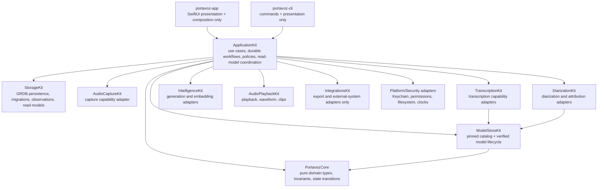
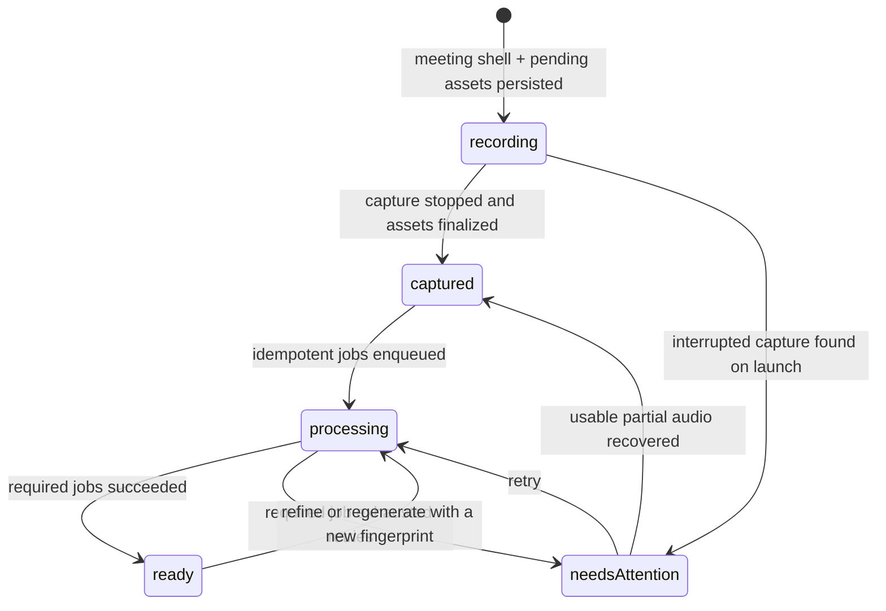

# ARCHITECTURE — Technical design and engineering rules

## What Portavoz is

Privacy-first, local-first meeting assistant for Apple platforms (macOS first; iOS/iPadOS later; visionOS eventually), written natively in Swift 6 + SwiftUI. Core promise: **know who said what — including the user's contributions — without audio leaving the device.** It is the Swift-native successor to Meetily's ideas (reference repository in `../meetily`; studied, but its code is never ported).

Differentiators in priority order: structural who-said-what through dual-channel capture, diarization with the user's voice identity, bilingual ES/EN summaries and live translated captions, development workflow integrations (GitHub/Linear, local MCP server, and Shortcut/URL/Spotlight automation surfaces; native App Intents remain planned), and an open data format (Markdown + user-owned SQLite).

## Document contract and refactor status

This file is the architecture source of truth for the **current commit**. It
separates as-built behavior from target architecture explicitly; planned types,
tables, modules, and workflows must never be described as implemented. The
executable migration plan, rationale, bands, target schemas, and acceptance
criteria live in [refactor-20260714.md](refactor-20260714.md).

The rearchitecture direction is approved and execution is active on
`codex/refactor-20260717`. Bands 0 and 1 are complete in independently
shippable slices. Slice 0A made persisted identity/enum decoding strict and scoped
library/Insights projections through live meetings. Slice 0B separated
transcript recognition policy from generated-output language and made
recording, rolling summary, import, refine, and regeneration use the same typed
policy boundary. Band 1 slice 1A installed the additive schema-v6 durability
contract. Slice 1B adopted its first runtime boundary: new recordings now own a
durable shell and pending assets before capture starts. Slice 1C now stages,
validates, hashes, and atomically publishes channel files, then installs the
captured meeting projection through one StorageKit Unit of Work. Slice 1D-a
adds the typed, idempotent, owner-leased StorageKit job queue while leaving the
released synchronous app workflow in place. Slice 1D-b1 adds process-launch
reconciliation for interrupted capture files, meeting lifecycle, and expired
leases without running ML. Slice 1D-b2a adds stale-safe atomic diarization and
summary artifact completion. The first 1D-b2b control-plane unit adds
owner-fenced cancellation for degradable work and durable scheduled-wake
discovery. The second 1D-b2b unit adds the concrete process-scoped diarization
and summary executor, exact operation fingerprints, heartbeat/retry ownership,
and a single non-polling wake. The final 1D-b2b unit atomically installs the
captured snapshot plus initial exact job, makes normal Stop navigate immediately
and kick the executor, and preserves terminal-aware Shortcut delivery (D43).
Band 2 slice 2A added the Core-only `ApplicationKit` product, a Sendable async
use-case boundary, and source/manifest architecture tests without moving
runtime orchestration. Slice 2B admits the first ratcheted capability edge,
`ApplicationKit → StorageKit`, and moves all three app delete/restore call sites
behind characterized `DeleteMeeting` and `RestoreMeeting` use cases. Slice 2C
completes trash mutations with `PurgeMeeting`/`PurgeExpiredTrash`; filesystem
work stays behind an app-owned `MeetingAudioFiles` adapter. Slice 2D admits
`ApplicationKit → IntelligenceKit` with `RegenerateSummary`: Meeting Detail now
supplies one request and maps an explicit outcome while notes, glossary,
provider override, Apple reuse/pivot, persistence, and released error policy
cross narrow capability ports (D44). Slice 2E closes T16 without changing the
boundary: cache reads now carry the selected recipe, and Meeting Detail loads
the newest immutable snapshot across recipes while retaining every
recipe-specific version (D45).
Slice 2F admits `TranscriptionKit` and `DiarizationKit` only with
`ImportMeeting`. External audio now crosses typed file, preference, processor,
store, and summary ports; the copied file remains staged until one atomic
meeting/cast/transcript commit, while the released best-effort diarization and
summary policies remain intact (D46).
Slice 2G moves the reviewable quality pass behind `RefineMeeting` and
`ApplyRefinedMeeting`. Draft generation crosses typed audio, preference,
processor, and progress ports; accepted language, cast, transcript, and
revision now commit together behind a source-revision fence. Cancellation is
explicit, model release is guaranteed after every model-owning exit, summaries
remain immutable history, and optional Companion refresh cannot turn an
accepted transcript into a failed apply (D47). Slice 2H moves the durable Stop
policy into `ApplicationKit.StopRecording`: the use case reconciles finalized
capture evidence, provisional attribution and per-turn language, audio-first
fallbacks, atomic snapshot/job admission, worker kick, and recording-engine
release. `RecordingController` retains the platform session flush/feed teardown
and maps typed outcomes to the released navigation and localized failures; the
worker remains the sole owner of terminal-aware Shortcut delivery (D48).
Slice 2I moves recording-start policy into `ApplicationKit.StartRecording`.
The use case samples start preferences once, prepares the injected capture
runtime, derives title/sequence, atomically reserves the meeting shell and
pending assets before any source starts, and reconciles a failed source start
against both staging and published file evidence. A private app runtime owns
the concrete mic/process-tap sources, `RecordingSession`, direct per-channel
Parakeet streams, and one recording-scoped voiceprint future. The controller
retains live caption hygiene, streaming diarization, rolling summary, exact
localized result mapping, and synchronous next-buffer mic mute (D49).
The Jul 16 Sequoia stabilization extends that boundary without reopening Band
2: Start preparation now covers only microphone/channel readiness and samples
whether Parakeet is already resident. Audio capture never waits for verified
model download or compilation. A successful start without live transcription
warms the shared engines in the background and carries explicit recovery
evidence; a live-lane failure marks the same evidence without stopping capture.
Stop atomically admits an exact durable first-pass transcription job for empty
or degraded live captions, and the worker publishes the complete cast/
transcript/revision plus dependent diarization under one lease transaction
(D70).
The same stabilization interrupt now treats Whisper quality-model readiness as
app-scoped capability state. Settings, Refine, and external-audio Import share
one serialized verified preparation task; closing Settings cannot cancel it,
and successful completion retains an opaque TranscriptionKit token rather than
the heavyweight runtime. Turbo/Compact selection, progress, retry, and safe
deletion are explicit while ModelStore remains the sole integrity owner (D71).
Summary and Companion availability now follow one app-owned Foundation Models
capability adapter. A clean install initializes an absent summary preference
only when policy identifies a feasible local path; an explicit Apple, Ollama,
or MLX selection never silently changes provider. Typed setup states open the
exact Intelligence Settings pane, while Companion controls appear only when its
Foundation Models classifier can run. Canonical hardware advice remains pure in
IntelligenceKit and is localized only at the app presentation boundary.
Sequoia retains Ollama, MLX, Whisper, recording, and every
non-Foundation-Models feature without
presenting impossible controls. Launch recovery and durable worker resume run
before optional provider discovery, so recommendation probing cannot delay
finalized-audio or transcript recovery (D72).
Speech-model readiness is now split by role. One app-scoped task owns Parakeet
preparation and another owns pyannote preparation, so concurrent callers join
the exact capability instead of acquiring a monolithic engine bundle. Refine
prepares only required Whisper before transcription and requests only
best-effort pyannote when attribution begins; it never loads live Parakeet.
External-audio Import requests pyannote alone, while durable first-pass
recovery and Dictation request Parakeet alone. Explicit onboarding/benchmark
preparation may still request both. A failure in an optional capability can no
longer block an otherwise valid transcript path (D73).
Distribution now treats the app bundle and disk image as two independent trust
boundaries. A Developer ID app is archived, submitted to Apple, stapled, and
validated before it is copied into the DMG; the completed DMG is then signed,
submitted, stapled, and validated separately. The final release gate mounts the
image, copies `Portavoz.app` into a scratch directory exactly as Homebrew Cask
does, and independently requires codesign, stapler, and Gatekeeper acceptance.
This prevents direct-DMG trust from masking an inner app that becomes dependent
on an online ticket lookup after package-manager extraction. CI also executes
the full package suite on a macOS 15 Sequoia runner (D74).
Slice 2J moves launch reconciliation into
`ApplicationKit.RecoverInterruptedMeetings`. The use case recovers expired
leases first, loads non-ready candidates, rechecks the live-writer gate before
each aggregate, coordinates recovered evidence with guarded shell/snapshot/
asset/lifecycle transactions, preserves canonical failures, and returns typed
invalidation/logging evidence. A private app adapter retains configured plus
fallback root discovery and off-main CAF validation/publication; the app shell
still awaits recovery before adopting durable worker work and invokes no ML
during reconciliation (D50).
Slice 2K begins explicit composition-root reduction with
`ApplicationKit.ImportMeetingBundle`. A private IntegrationsKit adapter decodes
and identity-remaps format v1 on a utility task, then crosses the application
boundary with only validated canonical attachments. The use case clears
machine-local paths, stages optional audio, installs the complete relational
aggregate through one StorageKit Unit of Work, and compensates the staged
directory after persistence failure without masking the original error.
AppServices retains one success invalidation and callers retain navigation
timing (D51).
Slice 2L completes the symmetric meeting-bundle boundary with
`ApplicationKit.ExportMeetingBundle`. One StorageKit read now projects the
live meeting, cast, transcript, newest summary across recipes, notes, and
Companion cards from one database moment. The use case clears the machine-local
audio directory, admits optional canonical channel attachments, and hands a
format-neutral document to private app adapters. Those adapters resolve the
configured/fallback recordings root, omit missing or unreadable channels as
before, and perform full-file reads plus IntegrationsKit format-v1 encoding on
utility tasks. Meeting Detail retains the native save panel, filename, UTI,
and exact localized error presentation (D52).
Slice 2M introduces the first feature-scoped presentation owner through the
Strangler pattern. Each `ContentView` creates one per-window `@MainActor`
`@Observable` `LibraryModel` with a private-write value snapshot and enum
actions/effects. It owns Library loading, FTS debounce and stale-result fences,
meetings/voice mixes/open items/trash, rename and mutation outcomes, import
progress/errors, calendar agenda, briefs, and navigation effects.
`LibraryView` and `TrashSection` now render and present native UI instead of
coordinating Store, lifecycle, import, or platform calls. A narrow app client
composes the existing services; StorageKit-shaped projections and the broad
`libraryVersion` reload request remain the explicitly characterized starting
point for the next scoped-observation slice (D53).
Slice 2N replaces that temporary Library read seam. ApplicationKit defines
storage-independent meeting-row, voice-mix, open-item, trash, search, section,
and update contracts. StorageKit owns four independent GRDB observations with
explicit regions: meeting rows/voice mix observe `meeting`, `speaker`, and
`segment`; open items observe `meeting`, `summary`, and `actionItem`; trash
observes `meeting`; active FTS observes `meeting` and `segment`. The app adapter
maps and merges those streams, while `LibraryModel` preserves healthy section
data and reports degraded state if one projection becomes unavailable. Library
no longer consumes `libraryVersion`; Detail, Insights, and Spotlight retain it
as an explicit migration seam. One-shot and observed paths share the same
query helpers, `DatabaseQueue` remains in place, and schema v6 is unchanged
(D54).
Slice 2O begins the pure-policy reduction of `IntegrationsKit` without adding a
dependency edge. `ChapterExtractor`, `PlaybackRanges`, `SummarySections`, and
`VoiceHue` now live in `ApplicationKit`; Meeting Detail, Insights, recording,
and design-system consumers import that inward boundary. Their existing 18
tests continue to characterize chapter segmentation, duration-bounded playback
complements, language-agnostic summary-section parsing, and deterministic
speaker hues. A sixteenth architecture rule requires all four source files to
remain in ApplicationKit, absent from IntegrationsKit, and consumed by the app
through ApplicationKit. At that slice, Insights, brief, reminder, and mirror
policies remained separate migration candidates beside the external adapters.
No user-visible behavior, schema, capability dependency, or localized copy
changed (D55).
Slice 2P moves the adjacent Insights read-policy cluster inward without adding
a dependency edge. `InsightsScope`, `LibraryStats`, and `InsightsFindings` now
live in `ApplicationKit`; their calendar-bounded scope windows, aggregate and
heatmap calculations, no-decision findings, and recurring-topic ranking remain
unchanged. `InsightsView` no longer imports `IntegrationsKit` for local product
decisions, while Store-backed facts, voice balance, and its broad
`libraryVersion` refresh remain explicit later migration seams. A seventeenth
architecture rule locks source ownership and the narrow consumer import. The
remaining brief, reminder, and mirror policies form the next characterized
inward slice; outbound adapters stay in `IntegrationsKit` (D56).
Slice 2Q completes that local-policy reduction. `BriefRelevance`,
`ReminderPolicy`, and `MirrorStats` now live in `ApplicationKit`, preserving
explainable RAG-result ranking, pre-meeting lead-window/deduplication rules, and
bilingual factual mirror qualification/synthesis. The calendar-neutral
`UpcomingEvent` value now lives in `PortavozCore`; `CalendarAttendeeSource`
continues to own EventKit access and creates the Core value from platform
events. An eighteenth architecture rule locks those three responsibilities and
their direct app consumers. A temp-store-only fresh-recording fixture exercises
the real opted-in mirror sheet and retains app-window visual evidence. No
released behavior, schema, capability edge, or localized copy changed (D57).
Slice 2R replaces Insights' broad read seam. ApplicationKit now owns the
storage-independent `InsightsReadModel` plus facts, voice-balance, finding,
section, and update contracts. Each `ContentView` owns one per-window
`@MainActor @Observable InsightsModel`; it samples a single reference date per
scope, merges four query streams, rejects stale observations, preserves healthy
sections after partial failure, and publishes one dashboard projection.
StorageKit separately observes live meetings; participant/commitment facts;
voice balance; and finding evidence bounded to the 60 newest live meetings in
the active scope. Their explicit regions match their actual base tables and
one-shot reads share the same query helpers. `InsightsView` no longer imports
StorageKit, reaches `services.store`, or consumes `libraryVersion`; Meeting
Detail and Spotlight retain that independent compatibility seam. A nineteenth
architecture rule locks the boundary. No visible behavior, schema,
`DatabaseQueue`, capability edge, or localized copy changed (D58).
Slice 2S replaces Meeting Detail's broad read seam. ApplicationKit now owns
storage-independent meeting-review core, newest-summary, aggregate, section,
and update contracts. Each detail route owns one `@MainActor @Observable
MeetingDetailModel` that merges three meeting-scoped streams, distinguishes
missing from failed state, rejects stale observation instances, and preserves
healthy sections after partial failure. StorageKit observes transcript/cast
through `meeting`/`speaker`/`segment`, newest immutable summary/action items
through `meeting`/`summary`/`actionItem`, and persisted Companion through
`meeting`/`companionCard`; one-shot and observed paths share their core,
summary-selection, and Companion helpers. `MeetingDetailView` no longer runs
three sequential reads when `libraryVersion` changes. Accepted Refine feeds its
just-committed draft directly into regeneration instead of racing observation
delivery. A twentieth architecture rule locks the read boundary. Direct detail
mutations and Spotlight still increment the compatibility counter for slice 2T
and measured Band 4 respectively. No visible behavior, schema, `DatabaseQueue`,
capability edge, or localized copy changed (D59).
Slice 2T removes the remaining Meeting Detail persistence bypasses.
`MeetingDetailModel` now owns explicit actions/effects for meeting and speaker
rename, suggestion acceptance, action-item completion, Companion removal,
meeting deletion, and searchable-content changes. Its app client adapts Store,
the lifecycle use case, and Spotlight's compatibility trigger; scoped
observations return post-write truth. The model preserves the released mix of
best-effort paths, visible manual-rename/Companion errors, remember-voice
consent, and delete navigation. The app adapter maps stale-refine persistence
errors before presentation, while audio-path resolution remains a separate
StorageKit seam for Band 4. The twentieth architecture rule now also forbids
the view from reaching Store, lifecycle, or `libraryVersion`. Two model tests
and the seeded action-item UI round trip prove the mutation boundary. No
visible behavior, schema, `DatabaseQueue`, capability edge, or localized copy
changed (D60).
Slice 2U closes Band 2 by removing package products that never represented
implemented behavior. A compatibility audit found no app, CLI, test, project,
script, or visible external source consumer for `ContextFeedKit` or `SyncKit`;
their products, targets, test edges, and placeholder files are gone. Core's
`ContextItem`, co-authored-note behavior, and future sync roadmap remain. A
twenty-first architecture rule rejects either package name until a deliberate
vertical use case replaces that rule. No released feature, persisted schema,
localized copy, or visible behavior changed (D61).
Slice 3A begins Band 3 with one vertical generation-provenance contract.
PortavozCore owns typed run identity/kind/outcome values; manual and post-refine
`RegenerateSummary` attempts capture provider, model/revision, the existing
material fingerprint, recipe/reuse operation, requested language, timing,
outcome, and content-free aggregate metrics. Exact cache hits create no run.
Failed/cancelled attempts are best-effort terminal records; a failed Apple
translation pivot remains a separate attempt before the existing full-summary
fallback. StorageKit atomically installs each successful run with its immutable
summary/action items and rejects orphaned success, malformed envelopes, and
cross-aggregate/language links. No meeting content is duplicated and no visible
provider, cache, failure, persistence, or summary behavior changed (D62).
Slice 3B extends that contract to the durable post-capture summary executor.
`SummaryArtifact` now requires its successful run, and StorageKit installs the
run, immutable summary/actions, job success, and lifecycle
reconciliation in the existing owner-lease/transcript-revision-fenced
transaction. The worker snapshots content-free provider/model, job-attempt,
recipe, language, revision, and exact operation-fingerprint metadata only after
all preflight checks and immediately before invoking the provider. Failure,
cancellation, lease loss, or input supersession after that point produces a
separate best-effort terminal run; no provider or a pre-attempt supersession
creates none. Existing retry, optional degradation, fallback, immediate-detail,
and Shortcut timing remain unchanged (D63).
Slice 3C extends the same content-free envelope to the best-effort
external-audio import summary. `ImportMeeting` resolves a metadata-bearing
provider only after the required meeting/cast/transcript aggregate commits,
then snapshots one attempt immediately before the provider call. Success
atomically links run, immutable summary, and actions; generation cancellation/
failure or summary-publish rollback records the same attempt separately as
best-effort terminal provenance. Provider unavailability creates no run. The
already committed meeting and copied audio, compensation before aggregate
commit, typed progress, language policy, navigation, and idle release are
unchanged (D64).
Slice 3D gives accepted Refine transcripts one composite run over every actual
non-silent Whisper channel. Exact content evidence, provider/model/revision,
source revision, language policy, and vocabulary material are hashed locally;
success remains in the review draft until Apply atomically inserts the run,
links every replacement segment, and advances the transcript revision. Silent,
discarded, empty, stale, invalid, and rolled-back drafts leave no orphaned
success, while begun failure/cancellation remains best-effort terminal history
(D65).
Slice 3E gives every durable Companion card one exact, content-free run. The
trace distinguishes Foundation Models classification, actual answer provider,
context count, and explicit BYOK transfer success or fallback without storing
candidate, context, owner, question, or answer text. Cancellation never becomes
an unintended local fallback. Live artifacts and completed terminal attempts
join the atomic Stop snapshot; post-Refine artifacts replace cards with run
links only under the current transcript revision, while incomplete refresh
preserves prior cards. Normal no-card paths create no orphaned run (D66).
Slice 3F establishes the first enforceable external-data boundary without a
broad integration rewrite. PortavozCore owns content-free egress metadata and
the `DataEgressGateway` port; IntegrationsKit owns the validating URLSession
adapter; IntelligenceKit's Companion-specific BYOK client requires an injected
gateway; and the macOS app composes that adapter for live and post-Refine use.
The policy distinguishes only provable loopback as `local-device`, treats every
other destination as `remote`, requires an HTTP(S) destination with exact
provider disclosure, and associates persisted Companion consent with the
source meeting. Only the
classified knowledge question crosses the boundary; context remains local,
ordinary failure retains the existing on-device fallback, and cancellation
does not fall through. Provenance records the content-free destination scope.
Other summary and integration paths remain direct until later vertical slices
rather than being misrepresented as migrated (D67).
Slice 3G-a moves every OpenAI-compatible summary-generation path behind that
same boundary. IntelligenceKit now owns a transport-free chat codec and a
summary client that requires an injected gateway. App-selected Ollama summary
generation declares `meeting-summary-material`, its source meeting, selected-
engine consent, provider/model, and provable loopback scope; explicit CLI BYOK
declares the same material with explicit-provider consent and conservative
remote scope. App and CLI compose IntegrationsKit's adapter. Ollama health and
model discovery remain direct because they carry no meeting content. At the
D68 boundary, Gist, GitHub Issue, and Linear Issue publishing remained on their
characterized direct paths until 3G-b (D68).
Slice 3G-b completes the meeting-content network migration. Gist publication
declares one complete meeting export document; GitHub and Linear issue creation
declare one meeting action item plus its title/owner context. All three require
the source meeting, operation-specific explicit consent, exact remote provider,
no model disclosure, and a non-empty POST through the same gateway. The adapter
admits only GitHub's canonical Gist URL, canonical
`/repos/{owner}/{repository}/issues` URLs, and Linear's canonical GraphQL URL.
Meeting Detail preserves its explicit secret-Gist confirmation; CLI Gist and
issue commands preserve their opt-in warnings, bodies, responses, and failures.
No capability outside `URLSessionDataEgressGateway` now owns a meeting-content
URLSession path. Content-free model downloads and Ollama discovery remain
outside this boundary, while the user-configured Shortcut process remains an
explicit local automation surface rather than a network adapter (D69).
Slice 3H turns that policy boundary into auditable user evidence. Schema v7
adds immutable, content-free `dataEgressEvent` attempts plus one persisted
tracking boundary. The gateway validates metadata, persists the attempt, and
only then invokes URLSession; persistence failure fails closed, transport
failure retains the event, and redirects are rejected so a canonical endpoint
cannot forward meeting material to an unclassified host. A fourth independent
Meeting Detail observation combines those attempts with purpose-built
generation provenance. New meetings can state that tracked processing remained
local; older meetings only state that no remote transfer was recorded since the
migration timestamp. The right rail shows remote purpose, host, and time without
copying a URL, request, transcript, prompt, notes, summary, or action item
(D75).
Slice 3I makes recovery evidence useful without creating a second sensitive
store. One ApplicationKit use case exports a versioned JSON report from a
single read-consistent StorageKit snapshot. Meeting identities and existing
fingerprints are rehashed; the report admits only app/build/OS identity, model
readiness, lifecycle/revision state, stable error codes, durable-job state,
content-free generation provenance, and the existing privacy evidence. Titles,
transcript/summary/card text, prompts, config/metrics JSON, raw errors, secrets,
full URLs, and paths never enter the report. Meeting Detail independently
observes durable jobs, presents active/failed/recovery states, and exposes one
bounded retry that preserves job identity, idempotency key, and input
fingerprint before the normal worker revalidates it. Content-free
`OSSignposter` intervals record only job kind, attempt, and terminal outcome
(D76).
Slice 3J makes recording lifecycle failures stable before they reach
presentation. Core owns five product-level failure categories and the
`CodedFailure` contract. ApplicationKit maps Start and Stop dependency errors
to bounded workflow enums with stable codes instead of transporting raw or
dependency-localized descriptions. The macOS app alone owns localized copy and
the exact retry, Library, or support-diagnostics route. Critical and
destructive outcomes keep their durable fallback distinctions, and the failed
recording screen exposes a selectable support reference without adding raw
errors to diagnostics (D77).
Slice 3K closes Band 3's App Sandbox decision gate without changing production
entitlements. A separately signed probe and same-binary non-sandboxed control
measure container/legacy storage, child-process inheritance, microphone,
process-catalog and process-tap setup, Keychain, Carbon hotkeys, loopback
networking, Shortcuts, Accessibility, and Calendar state. The active sandbox
blocks the current shared Application Support layout; its child processes
inherit that restriction. Microphone, Keychain, network client, hotkey, and
process-catalog operations succeed. The full private process-tap graph creates
its IOProc and starts/stops in both variants, proving structural setup
compatibility while complete product capture remains a field gate. Production App
Sandbox is deferred until a reversible app/CLI/MCP data migration,
security-scoped custom folders, Sparkle sandbox setup, and signed feature-parity
smoke exist. The current accurate security boundary remains Developer ID,
Hardened Runtime, notarization, narrow TCC entitlements, and policy-gated
egress (D78).
Band 4A establishes the scale decision gate before changing the detail graph.
A Release CLI matrix exercises the production schema and read paths at
1k/10k/50k/100k library segments and 30-minute/2-hour/8-hour meetings; a
temp-store-only app fixture renders a 2-hour/5,000-segment detail, applies a
later scoped summary update, emits a content-free first-content signpost, and
retains XCUITest visual evidence. The measured storage core and chapter
projection remain below budget, while `MeetingHealth` grows to 347.58 ms at
5,000 segments and 5.39 s at 20,000. Exact FTS remains below 50 ms at 100,000
segments, while broad OR retrieval misses at 50,000 and 100,000. The app reaches
first content in 522.30 ms and records one 515.86 ms initial hang. Xcode 26.6
captures Time Profiler symbols but emits zero SwiftUI-update rows with its
explicit no-data warning, so invalidation scope remains unclaimed. D79 keeps
`DatabaseQueue`, chapter derivation, and vector storage unchanged, prioritizes
the measured health algorithm, and requires before/after evidence for every
later scale change.
Band 4B changes only that measured algorithm. Interruption detection builds a
linear prefix-maximum-end index and stops a reverse search only when the whole
earlier prefix has ended. It therefore preserves the released meaning of an
interruption, including an older long turn hidden behind a newer ended turn,
while making ordinary sequential transcripts near-linear. Release p95 falls
from 24.25/347.58/5,385.76 ms to 2.55/9.94/41.39 ms at
1,250/5,000/20,000 segments. The unchanged native 5k fixture reaches first
content in 91.87 ms, down from 522.30 ms, and records no potential hang instead
of one 515.86 ms hang. Because the 300 ms budget now passes, D80 rejects detail
decomposition or caching as the next change; broad OR candidate selectivity is
the remaining measured Band 4 miss.
Band 4C closes that lexical miss at the existing IntegrationsKit retrieval
edge. StorageKit keeps exact FTS and exposes the complete segment beside its
bounded highlighted snippet; its top-k query orders by FTS5's hidden `rank`,
whose default is the same BM25 score without the eager auxiliary-function
evaluation. `AskPipeline` normalizes and deduplicates content terms, retrieves
a bounded top-k list for each of at most eight terms, and applies
reciprocal-rank fusion so evidence matching several terms climbs. Longer pasted
questions retain the released broad-OR fallback instead of multiplying scans.
The answer context now uses the complete selected segment, not the UI snippet.
The production scale harness calls that exact lexical policy without loading
embedding assets. At 100,000 segments, exact p95 falls from 38.38 ms to
30.99 ms and lexical Ask p95 from 111.19 ms to 66.89 ms; the latter is 39.8%
faster and passes the 100 ms target. D81 therefore retains FTS5, the existing
schema, `DatabaseQueue`, and embedding layout. Semantic cosine ranking remains
unmeasured at this scale and is Band 4D's next decision gate.
Band 4D now closes that evidence gap without changing product behavior. A
dedicated Release CLI stores deterministic normalized vectors at the production
512 dimensions and measures the exact `MeetingStore.searchSemantic` path in a
fresh process for each 1k/10k/50k/100k corpus. It validates the expected top
result and records wall time, Mach-timebase-corrected process CPU, physical
footprint, raw vector bytes, and database size. At 100,000 segments, semantic
wall/CPU p95 is 325.41/328.43 ms, over 3x the 100 ms target. Incremental
footprint p95 is only 8.50 MiB and absolute peak p95 50.05 MiB, while the
512-dimensional payload occupies 195.31 MiB raw and 416.54 MiB in the complete
SQLite directory. D82 therefore selects CPU/latency as the problem. Band 4E
must first remove `fetchAll`, per-row Float-array decoding, and full-corpus
sorting through streaming, allocation-free Accelerate scoring, and bounded
top-k retention; sqlite-vec and `segmentEmbedding` remain conditional on the
same after matrix still missing budget.
Band 4E closes that gate without a dependency or schema change. StorageKit now
streams only each live segment's BLOB and rowid, scores SQLite-owned bytes
directly with Accelerate, retains a deterministic bounded exact top-k, and
materializes complete `SearchHit` text only for the winners. A tombstone
subquery replaces the previous meeting join for every vector while preserving
deleted-meeting exclusion. At 100,000 segments, comparable wall/CPU p95 is
90.22/91.26 ms, 72.3%/72.2% below baseline and inside the 100 ms budget;
incremental footprint p95 is 8.42 MiB and absolute peak p95 falls from 50.05
to 15.66 MiB. D83 therefore retains exact Float32 BLOBs (carried unchanged
into the current schema v14), `DatabaseQueue`, and the MIT/no-GPL dependency set; sqlite-vec and
`segmentEmbedding` are rejected as unjustified complexity at the measured
scale.
Band 4F closes the independent derived-audio gate. `Waveform.generate` keeps
the released stateless bucket contract but uses range-aligned Accelerate
maxima. On copied real 55.9-minute dual-channel audio, first wall/CPU falls to
109.25/94.81 ms and repeat p95 to 70.11/71.33 ms with the exact fingerprint
preserved. D84 therefore rejects a cache, sidecar, schema change, and
invalidation lifecycle at the measured scale.
Band 4G closes the remaining Spotlight seam. StorageKit owns one consistent
`SpotlightDocument` projection for every live meeting, newest cross-recipe
summary, and first 40 live segments. A process-scoped actor coalesces mutation
requests and reconciles a named `.complete`-protected Core Spotlight index in
500-item batches with compact client state, bounded retries, and launch repair.
The window-owned `libraryVersion` counter and default prototype index are gone.
At 100,000 meetings the exact projection falls from 22,085.35 ms to 425.64 ms
wall p95; a synthetic 1,000-item protected delivery completes and cleans up.
D85 therefore rejects an outbox consumer for Spotlight at the measured scale;
the v6 outbox foundation remains unused until a separate vertical proves it.
Band 5A establishes the first human-memory vertical without conflating
meeting observations, names, or biometrics. `Person` and `PersonAlias` are
Core values; additive schema v8 stores canonical people, duplicate-safe
normalized aliases, and a nullable `speaker.personID`. Meeting Detail offers
the link only after the user has accepted a non-user speaker name. An exact
alias match opens a chooser and never mutates data by itself; no match still
requires an explicit Remember action before one atomic create-and-link
transaction. Transcript, calendar, and encrypted voice suggestions retain
their separate evidence meaning and cannot auto-link a person. Bundle
export/import strips canonical IDs, and Refine's fresh diarization speakers
require fresh confirmation instead of guessing continuity from an unstable
label or biometric hint. Meeting Detail reads the encrypted voice gallery on
a utility executor rather than MainActor, and disposable UI fixtures treat it
as empty instead of touching the host gallery or Keychain (D30/D86).
Band 5B establishes the first generated-claim provenance vertical without a
generic artifact/EAV layer. `SummaryDraft` may carry one typed overview claim;
schema v9 stores the claim and its ordered nullable segment links in the same
transaction as the immutable summary. Storage validates that every new link is
unique, live, and belongs to the same meeting, then stamps the current
`transcriptRevision`. Foundation Models and the shared Ollama/BYOK/MLX contract
receive compact request-local E-tags; unknown, altered, duplicate, or excess
tags are discarded, tag-shaped content literals are escaped, and no valid tag
means no claim. Meeting Detail resolves
the claim against its independently observed transcript: a different revision
is stale, any missing or deleted segment is unavailable, and only a complete
current set may focus the exact transcript row and audio playhead. A source
selected while waveform preparation is still running retains its exact seek
until the player is ready rather than dropping half of that navigation. Translation
pivots preserve evidence with fresh claim IDs, while `.portavoz` import remaps
claim and segment IDs and lets Storage stamp the imported revision (D87).
Band 5C adds the first human-assessment child without mutating that generated
artifact. Core models one current correction or unsupported mark per overview
claim. Schema v10 stores the mutable assessment separately, fences writes to
the newest live cross-recipe summary, and erases correction text when clear
creates its future-sync tombstone. Normal generation, translation, prompts,
telemetry, privacy receipts, and support diagnostics cannot write or consume
feedback. Meeting Detail owns direct Add/Edit, Unsupported, and Clear actions
through its route-scoped model; `.portavoz` format v1 carries the current state
additively and preserves it while remapping the claim on import (D88).
Band 5D extends generated provenance with an explicit decision artifact rather
than weakening the overview claim or introducing generic EAV storage. Built-in
recipes declare their decision-bearing section ordinals; custom and
non-decision recipes fail closed instead of inferring meaning from localized
headings. Provider output supplies one optional evidence-tag array per rendered
bullet, and admission requires exact section/bullet shape plus request-local
tags. A shared Markdown outline anchors those coordinates across Core,
Intelligence, Storage, and UI. Schema v11 stores one typed decision parent per
rendered position with ordered nullable segment links; the summary transaction
validates unique positions, live same-meeting sources, and the current
transcript revision. Translation preserves coordinates while replacing
identity, bundle import remaps decision and segment IDs, and Meeting Detail
places each source directly beneath its exact bullet. Stale, missing, deleted,
or partially resolved evidence remains visible but cannot navigate (D89).
Band 5E gives commitments their own evidence identity rather than reusing
decision coordinates. `SummaryActionItemEvidence` keys one immutable
source-revision-fenced aggregate to a durable `ActionItem.id`; checkbox
completion changes only the task. Provider action-item shapes carry optional
exact E-tags, and older responses remain valid. Schema v12 stores a one-to-one
evidence parent plus ordered nullable segment links in the same summary
transaction, validates unique local task targets and the shared live
same-meeting source contract, and retains unavailable provenance after physical
deletion. Translation and format-v1 bundles mint and remap fresh task,
evidence, and segment identities. Meeting Detail places sources beneath the
matching checkbox and navigates current transcript/audio without autoplay;
stale or unavailable evidence cannot jump (D90).
Band 5F completes the evidence program with a contract specific to Companion
cards. `CompanionCardEvidence` keys one immutable aggregate to the card and
separates ordered question sources from ordered answer sources. Live capture
retains the closed row that triggered the card; post-Refine coalescing retains
every segment in the triggering turn. Context answers admit answer sources only
from exact `[N]` citations returned by the local RAG answerer. Knowledge answers
and directed pings retain question evidence but never fabricate answer support.
Schema v13 stores one card evidence parent plus role-typed nullable segment
links, validates card identity, live same-meeting sources, and the current
transcript revision transactionally, and preserves unavailable counts after
physical deletion. Companion observation and export reconstruct the nested
transport value from those separate tables; format-v1 import remaps card,
evidence, and segment identities and clears the foreign revision. Meeting
Detail renders Question source and Answer sources independently and focuses
transcript/audio without autoplay. This evidence remains outside summary
tables, claim feedback, privacy receipts, and support diagnostics (D91).
Band 6A opens platform expansion at the transport-independent durability seam.
Schema v14 adds one content-free `meetingSyncState` row per changed meeting
aggregate, with monotonic local and acknowledged generations. Storage-owned
triggers detect portable root, child, feedback, and typed-evidence mutations in
the same transaction while ignoring device-local paths, embeddings,
generation links, and canonical-person links. Null-safe value predicates avoid
false generations from whole-row saves. Explicit initial seeding does not run
during migration; a purge-surviving deletion row remains after the meeting is
physically removed. No CloudKit import, account behavior, network transport,
conflict resolver, audio transfer, SyncKit product, or iOS target exists in
this slice (D92).
Band 6B1 now fixes the transport-neutral content and replay seam without
enabling sync. StorageKit projects one complete text-first aggregate only when
the requested journal generation is still current, strips local paths and
canonical-person links by construction, and joins it to source-device and
generation identity. IntegrationsKit owns deterministic sorted-key JSON
encoding. Remote aggregate validation and replacement remain one StorageKit
transaction: live remote work waits behind an unsent local generation, remote
deletion wins that race but stays recoverable, matching device-local
derivations survive replacement, immutable identity collisions fail closed,
and accepted remote writes settle their trigger generations to prevent an
echo. CloudKit, CKSyncEngine state, account/consent, retry cursors, entitlements,
network behavior, status UI, audio transfer, and iOS composition remain absent
(D93).
Band 6B2A fixes the first Apple transport shape while keeping it dormant.
IntegrationsKit maps one deterministic `MeetingReplica` record per meeting in
the private custom `PortavozMeetings` zone. Payloads within a conservative
512 KiB policy use `CKRecord.encryptedValues`; larger payloads use a protected,
backup-excluded local staging file through `CKAsset`, whose content CloudKit
encrypts by default. The payload digest is encrypted, existing matching records
are reused so system fields/change tags survive, and deletion remains a saved
encrypted envelope instead of a CKRecord delete. StorageKit still imports no
CloudKit, and no container, account request, CKSyncEngine, entitlement, network
path, status UI, audio transfer, or iOS composition exists in this slice (D94).
Band 6B2B completes the dormant delivery state machine without composing a
network runtime. A separate IntegrationsKit actor persists content-free,
account-scoped consent/seed policy, opaque CKSyncEngine serialization, CKRecord
system fields, exact outgoing attempts, deterministic retry clocks, replay
cursors, and protected deferred-replay metadata. Exact outgoing and deferred
envelope bytes live in complete-protection, backup-excluded `0600` files and
fail closed on filename, size, digest, or identity mismatch. Account loss pauses
work; an actual account switch clears old account-scoped metadata while
preserving device-owned outgoing attempts and requiring new consent. A thin,
explicitly injected CKSyncEngine delegate forwards callbacks through the
coordinator to StorageKit's existing replay boundary. A dormant factory can
construct a manually driven engine from an injected CKDatabase with automatic
sync disabled. A late save cannot erase newer local or deferred work, partial
record results remain independent, and a restart rebuilds engine pending
changes from both the journal and protected attempts. The explicit seed request
enters StorageKit and completes only after both durable queues drain. A
physical CKRecord deletion only invalidates system fields because only an
encrypted tombstone is a domain deletion. The app still creates no CKContainer,
requests no account, adds no entitlement, performs no sync network work, and
shows no sync UI; initial upload also remains explicit (D95).
Band 6C1 now fixes lifecycle policy without composing that dormant transport.
`CloudMeetingSyncLifecycle` owns explicit enable, existing-library seed,
manual sync/retry, pause, remove-this-device, and account-change semantics over
injected platform/driver protocols. A launch with no prior account-scoped
consent returns local-only without calling the platform. Account loss pauses
and preserves consent plus exact attempts; a real account switch clears the old
scope and requires a new opt-in. StorageKit exposes an observable content-free
journal count, which the lifecycle combines with protected transport state to
derive local-only, pending, synchronized, paused, retrying, or failed. Pause
preserves queue/local/remote content, remove-this-device clears only local
transport metadata/files, and retry re-admits the same exact payload while
retaining attempt history. This slice still imports no CloudKit in the
lifecycle, creates no container, adds no entitlement, performs no app network
work, and exposes no UI (D96).
Band 6C2 composes that policy on macOS without weakening the local-only
boundary. An inert IntegrationsKit actor is the sole owner of the named private
`CKContainer`; it validates the running signature/profile before creation,
checks account status before identity, and gives D95 a manually driven private-
database engine. One process-scoped app model serializes lifecycle actions and
coalesces content-free journal, account, retry, and silent-push wakeups. Explicit
user actions retain FIFO semantics during actor reentrancy; an action made
inapplicable by an earlier queued action completes as a no-op without stranding
later work. A bilingual
Settings pane exposes truthful status and keeps Enable, existing-library seed,
retry, pause, and remove-this-device distinct. Audio and every device-local or
sensitive derivation remain excluded. Local/XCUITest bundles use unrestricted
entitlements and an explicit fake; Developer ID distribution embeds an
unexpired profile and fails before notarization unless its exact production
CloudKit/APNs capabilities match the signed app (D97).
Band 6C3 continues the macOS shell convergence before any iOS target is added.
The resident menu-bar scene now owns one `@MainActor @Observable`
`MenuBarModel` instead of keeping Store results in SwiftUI `@State` and issuing
one-shot persistence/calendar calls from the view. ApplicationKit defines the
storage-independent recent-meeting, pending-count, section, and update
contracts. StorageKit publishes a bounded three-row live-meeting observation
over the `meeting` table only and reuses the independently scoped latest-action
observation. The app adapter maps and merges those streams and keeps EventKit
behind composition; one failed section preserves the other section's last
healthy value. The panel's commands, calendar no-prompt rule, pending badges,
ordering, relative dates, and visual structure are unchanged, while a reopened
panel receives current meetings and pending counts (D98).
Band 6C4 moves the open-format whole-library backup out of Settings
coordination. `ApplicationKit.ExportLibraryMarkdownBackup` owns one typed
workflow over injected source, Markdown-document, and filesystem ports.
StorageKit loads every live meeting, cast, ordered transcript, and latest
General-recipe summary inside one newest-first SQLite snapshot; one corrupt
required aggregate becomes a per-meeting source failure while healthy meetings
continue and an optional corrupt summary degrades to absent. Portable filename
allocation includes existing disk names, canonical Unicode/case/width
collisions, hidden/empty/device-name fallbacks, and bounded collision retry.
The macOS adapter renders with `MeetingExporter` at utility priority and
publishes each complete document through an atomic same-directory temporary
file followed by a non-replacing move. A process-scoped observable model owns
progress and terminal typed state across Settings windows. SwiftUI retains only
the native folder picker and localized presentation, with no Store, StorageKit,
or IntegrationsKit coordination (D99).
Every refactor commit must update this file to reflect the
dependency graph and migration status that actually exist in that commit,
while the matching as-built spec records runtime behavior.

## SPM workspace (a single package)

`PortavozCore` contains shared domain types. The package currently exposes
nine Kit libraries. Most depend on Core only; verified exceptions are
`ApplicationKit → TranscriptionKit + DiarizationKit + IntelligenceKit + StorageKit`, `TranscriptionKit → ModelStoreKit`,
`DiarizationKit → ModelStoreKit`, and
`IntegrationsKit → IntelligenceKit + StorageKit` (D31/D44). The app and CLI
still compose most capabilities directly at runtime; trash mutations, Meeting
Detail summary regeneration, external-audio and `.portavoz` aggregate import/export,
meeting refinement, and durable recording Start/Stop/launch-recovery handoffs
now cross ApplicationKit. Library, Insights, each selected Meeting Detail, and
the resident menu-bar scene have app-owned models whose read sides consume
storage-independent ApplicationKit updates mapped from scoped StorageKit
observations. Meeting Detail persistence mutations also enter through its
model/client boundary.

| Module | Responsibility |
|---|---|
| `PortavozCore` | Shared domain types, typed IDs, meeting-local observed speakers, explicitly confirmed canonical people and duplicate-safe aliases, privacy-safe `GenerationRun` identity/kind/outcome values, content-free `DataEgressGateway` policy metadata and immutable-attempt recorder contract, purpose-built per-meeting `PrivacyReceipt` projections, the calendar-neutral `UpcomingEvent` value, length-prefixed SHA-256 operation identity, canonical `LanguageCode`, and independent transcript/summary language policies. It currently also contains the concrete Keychain-backed `SecretStore`; moving that implementation to a platform adapter is a target, not current behavior |
| `ApplicationKit` | Band 2 application boundary. It defines `ApplicationUseCase<Request, Response>` as a Sendable async workflow contract and currently depends on Core, TranscriptionKit, DiarizationKit, IntelligenceKit, and StorageKit. `FindCanonicalPeople` keeps exact alias lookup separate from `LinkObservedSpeaker`, whose explicit selection either links a chosen person or creates a distinct one; delete/restore use `MeetingLifecycleStore`; manual/expired purge coordinates `MeetingPurgeStore` with `MeetingAudioFiles`; `RegenerateSummary` owns recipe-scoped provider/reuse policy, typed provider-unavailability states, and attempt-level summary provenance; `ImportMeeting` owns typed progress, language policy, required transcription, best-effort diarization/summary, staged-audio rollback, engine release, aggregate persistence, and attempt-level import-summary provenance; `ImportMeetingBundle` owns machine-path clearing, canonical attachment admission, staged-directory compensation, and one complete relational aggregate commit; `ExportMeetingBundle` owns a consistent aggregate projection, path stripping, optional canonical audio, and format-neutral document assembly; `ExportLibraryMarkdownBackup` owns the read-consistent whole-library source, portable non-overwriting names, typed partial results, progress, and injected document/filesystem publication; `RefineMeeting` creates one privacy-safe composite transcript attempt across actual Whisper channels and carries success in its reviewable draft; `ApplyRefinedMeeting` accepts that draft through a revision-fenced transcript/provenance Unit of Work and a degradable current-revision Companion artifact replacement; `StartRecording` owns once-sampled start preferences, title/sequence policy, model-independent atomic pre-source reservation/start, explicit live-transcription readiness, evidence-first start-failure reconciliation, and failure-time release behind runtime/filesystem/store ports; `StopRecording` owns finalized capture reconciliation, audio-first fallbacks, generated Companion artifacts/terminal attempts, exact diarization or first-pass transcription admission, worker kick, and idle release; `RecoverInterruptedMeetings` owns expired-lease-first launch reconciliation, live-writer exclusion, evidence-to-lifecycle policy, and typed invalidation/failure reporting. It also defines storage-independent Library, Insights, Meeting Detail, and resident menu-bar read/update contracts consumed by feature models and owns deterministic meeting-review, Insights, brief-relevance, reminder, and post-meeting-mirror policies. `MeetingStore` plus private app platform/model/file/provider/document adapters are the production implementations. Further capability dependencies are admitted only with the characterized vertical use case that consumes them (D44–D73/D86/D98/D99) |
| `ModelStoreKit` | Curated registry (`ModelCatalog`, routing **by task** through `ModelTask`) + `ModelStore`: downloads verified by sha256/pinned commit. Shared by every Kit that loads models |
| `AudioCaptureKit` | Mic (AVAudioEngine) + per-app process taps (Core Audio, macOS 14.4+); `RecordingSession` (with `onChunk` tap); crash-safe staged CAF writer; validated SHA-256/health metadata and same-directory atomic publication; persisted-PCM recovery inspection/publication; retention policies |
| `TranscriptionKit` | `TranscriptionEngine` protocol; `ParakeetEngine` (live sliding window + batch long-form); `TranscriptionScheduler` (D7 slots); exact Refine operation identity over source revision, provider/model, language/vocabulary material, and content-digested active channels |
| `DiarizationKit` | `PyannoteDiarizer` (pyannote community-1 + WeSpeaker through FluidAudio) over system/room channels; `SpeakerAttributor` (structural who-said-what); exact post-capture operation fingerprints; `Voiceprint` (biometric: on-device only, encrypted, never synced, erasable) |
| `IntelligenceKit` | Summary providers for Foundation Models, OpenAI-compatible BYOK/Ollama, and embedded MLX; structured summaries, Recipes, material-cache and language/revision-aware operation fingerprints, Companion/RAG intelligence with exact card-generation fingerprints and provider/egress traces, OpenAI-compatible summary and Companion clients that cannot transport without `DataEgressGateway`, schedulers, embeddings, and bilingual output policy |
| `StorageKit` | `MeetingStore` over GRDB 7 + FTS5, schema v14: the released meeting/transcript/summary/search/trash behavior plus schema-v6 durability, schema-v7 privacy receipts, schema-v8 canonical people, schema-v9 typed overview claims with ordered nullable segment evidence, schema-v10 current claim feedback, schema-v11 position-typed decision evidence, schema-v12 identity-typed action-item evidence, schema-v13 card-identity-keyed question/answer Companion evidence, and schema-v14 content-free generation-fenced meeting change state. Summary evidence is validated and revision-stamped atomically with its immutable summary; Companion evidence is validated and stamped with its card transaction. Decision positions must match the canonical rendered Markdown outline, action evidence must target one unique task, and Companion links must target one card plus live same-meeting segments. Feedback writes are separately fenced to the newest cross-recipe overview claim and clear physically erases correction text before tombstoning. Portable aggregate mutations coalesce transactionally by meeting; explicit initial seeding, bounded pending reads, generation-aware acknowledgement, and purge-surviving deletion state exist without a transport. Device-local paths, embeddings, generation links, canonical people, jobs, receipts, model state, audio, secrets, and voiceprints do not dirty that journal. Summary and Companion observations include their own evidence/link tables while transcript availability resolves against the independent core projection. Exact aliases remain candidate-only and ambiguity-preserving. Recording, recovery, import/export, whole-library backup snapshots, Refine, Spotlight, job, provenance, egress, strict-decoding, live-root, and plain-BLOB vector contracts remain as detailed in the matching specs; `.portavoz` strips canonical people but carries and remaps portable overview, decision, action-item, and Companion evidence plus current overview feedback. The generic v6 outbox and per-meeting preferences remain unconsumed |
| `AudioPlaybackKit` | Synchronized playback, channel-aware waveform data, clips, silence skipping, and AAC transcoding |
| `IntegrationsKit` | Export, bundle, EventKit calendar, RAG, gateway-only issue/Gist publishers, MCP, external-system adapters, deterministic meeting-sync envelopes, and the private-zone CloudKit transport boundary. It owns encrypted inline/protected-asset records plus content-free account/consent/seed, system-field, exact-attempt, retry, deferred-replay, cursor, and opaque engine state; exact payloads use protected files. Its thin explicitly injected CKSyncEngine delegate forwards domain replay to StorageKit, and its runtime builds a manually driven private-database engine with automatic sync disabled. A platform-neutral lifecycle owns zero-platform local-only launch, explicit enable/seed/retry/pause/remove-device semantics, account transitions, and truthful status. One inert fail-closed macOS actor owns the named CKContainer only after lifecycle consent and signed-capability admission. `URLSessionDataEgressGateway` remains the sole policy-validating non-CloudKit meeting-content network transport: it persists a content-free attempt before transport, fails closed when persistence fails, and rejects redirects. IntegrationsKit is the only cross-Kit layer under D31; local product/read policy has moved inward while adapter and transport mechanics remain here |
| `portavoz-app` | SwiftUI macOS application. `AppServices` owns one process-scoped `MeetingSyncModel` that serializes the D96 lifecycle, observes content-free journal/account/retry/push wakeups, registers APNs only while consent remains active, and presents status through declarative Settings actions; the temp-store composition is a deterministic no-cloud fake. `AppServices` also composes dependencies, owns independently deduplicated Parakeet, pyannote, and Whisper readiness so each workflow acquires only its required model role, the process-scoped post-capture worker supervisor, and a process-scoped coalescing `SpotlightIndexer`. Searchable mutations request eventual reconciliation; launch repairs missed work without a SwiftUI window or global counter. The private Core Spotlight backend uses a named protected index, bounded batches, client state, and retries. `AppServices` also composes one store-receipted `URLSessionDataEgressGateway` into live/post-Refine Companion BYOK, app-selected Ollama regeneration/import/durable generation, and explicitly confirmed Meeting Detail Gist publishing. The durable summary worker snapshots provider/model and content-free operation metadata per attempt and publishes provenance only through the job's fenced completion boundary. Each `ContentView` owns per-window Library and Insights state; each selected detail route owns `MeetingDetailModel`; the resident menu-bar scene owns `MenuBarModel`. The sidebar List binds only to meeting routes, ignores transient native deselection of the broader route, and retains tagged native selection for meeting/search rows; explicit navigation and deletion own non-meeting and empty routes. Meeting Detail merges a fourth independent privacy-receipt stream, renders its complete, partial-history, or remote-attempt state in the right rail, exposes canonical-person candidate/link actions through the same model boundary, and performs potentially blocking encrypted voice-gallery reads on a utility executor. Their views render native presentation, consume merged scoped updates, and send persistence mutations through model actions instead of coordinating Store/lifecycle/invalidation calls. The menu-bar adapter maps bounded meeting/open-commitment observations and the no-prompt EventKit lookup into storage-independent updates; its SwiftUI view retains navigation, recording, dictation, and launch-at-login commands without Store or calendar read coordination. A process-scoped `LibraryMarkdownBackupModel` drives typed progress and terminal partial results; its private document/filesystem adapters render off-main and publish complete files without replacing disk content, while Settings retains only the native folder panel. Trash mutations, Meeting Detail summary regeneration, external-audio and meeting-bundle import/export, meeting refinement, durable Start/Stop/launch recovery, meeting-review, Insights, brief/reminder, and post-meeting-mirror policy enter through ApplicationKit. Private adapters own concrete capture sources/session/live Parakeet feeds, shared voiceprint acquisition, EventKit event mapping, recordings-root discovery, CAF recovery mechanics, bundle decoding/remapping, canonical file staging/reading, format-v1 encoding, fixtures, OSLog, and presentation mapping while the remaining feature extraction continues incrementally |
| `portavoz-cli` | Executable development harness (`record --seconds N --pid X --system --out dir`) |

Band 2 slices 2A–2U establish and exercise a dependency, feature-state, and
product-policy ratchet rather than a
broad empty layer. Package and XcodeGen manifests expose `ApplicationKit`; app,
CLI, and tests link it. StorageKit, IntelligenceKit, TranscriptionKit, and
DiarizationKit are admitted only with real vertical use cases. Forty-seven
architecture tests parse the real target declarations, package surface, and
source imports. They prevent capability Kits from
depending back on ApplicationKit, reject presentation or platform imports in
the application layer, freeze Core's existing `SecretStore.swift → Security`
exception, and forbid app delete/restore/purge writes from bypassing the use
cases. Foundation-backed FileManager, UserDefaults, and URLSession are also
forbidden symbols in ApplicationKit. Workflow-specific rules also reject the
old Meeting Detail provider/cache bypass, any second app import definition,
direct app refine persistence bypasses, and Start/Stop persistence or capture
bypasses in `RecordingController`; launch recovery must also enter through its
use case before worker resume, and bundle import cannot return to sequential
Store writes; bundle export cannot return to Meeting Detail assembly or
meeting-length reads. Whole-library backup must remain one ApplicationKit
workflow over one StorageKit snapshot and injected document/filesystem ports;
Settings cannot regain Store or IntegrationsKit coordination, and publication
cannot combine trapping Foundation write options or replace an existing file.
The Library rule requires per-window model ownership,
ApplicationKit-owned read contracts, scoped StorageKit observations, and
adapter merging; it rejects direct Store/lifecycle coordination, local meeting
state, StorageKit-shaped model state, and a return to broad Library
invalidation. The Insights rule similarly requires a per-window model,
ApplicationKit-owned projection contracts, four app-mapped scoped Store
streams, and presentation free of StorageKit, direct Store access, or
global invalidation; the Meeting Detail rule additionally requires explicit model
actions, mutation adapters, and no direct Store/lifecycle/invalidation calls
from the view. Application workflow tests prove
exact port delegation, provider override/material inputs, reuse and pivot
fallback, released failure policy, strict expiry, aggregate/voice-mix
conservation, import order/language/degradation/rollback/atomicity, and real
Store/filesystem persistence. Refine coverage adds exact phase/order and
mixed-language behavior, silence/noise/bleed hygiene, cancellation and release,
degradable diarization/Companion outcomes, stale-draft rejection, immutable
summary preservation, and rollback under injected child failure. Stop
coverage adds finalized/missing channel reconciliation, mixed-language
preservation, transcript/no-audio recovery, exact job policy and ordering,
admission rollback, fallback failure, engine release, and a real SQLite Unit of
Work. Start coverage adds preference sampling, title/sequence and event-title
policy, model-independent reservation/source ordering, callback forwarding, exact channel
assets, typed preparation failures, staging/published evidence preservation,
guarded discard, reconciliation failure reporting, release, and real Store
atomic reservation before source invocation. Recovery coverage adds
expired-lease-first order, per-candidate live-writer deferral, captured/
processing/job-aware lifecycle decisions, guarded empty-shell discard,
publication-only content preservation, typed canonical failures, released
invalidation timing, and real-Store ready protection.
Bundle coverage adds hostile attachment metadata, duplicate-channel rejection,
text-only and audio-bearing order, machine-path clearing, early-failure
isolation, original-error-preserving compensation, full-content conservation,
foreign-child rejection, and rollback when the final relational child fails.
Whole-library backup coverage adds portable/canonical filename allocation,
existing and concurrent collision handling, typed partial source/render/write
failures, stable fatal boundaries, a read-consistent real-Store projection,
atomic non-replacing scratch publication, process-model state, and a real-app
readable Markdown export.
The T16 parity slice also proves newest-across-recipe selection without
deleting older immutable snapshots. Slice 2G adds a 19th XCUITest proving a
running refine can be canceled without changing the visible transcript. Eight
direct `LibraryModel` tests characterize complete/empty/degraded/failed loads,
version and query fences, mutations/effects, import, agenda, and brief state;
slice 2N adds a ninth section-failure case plus three real-Store observation
tests. Eighteen direct review-policy tests preserve those four moved policies;
21 direct Insights policy tests preserve scope, aggregate, heatmap, no-decision,
and topic behavior; 14 brief/reminder/mirror policy tests preserve the final
local-policy cluster. Architecture gates prevent all three clusters' source
ownership, the Core event value, or consumer imports from drifting outward
again. Ten additional tests characterize the Insights read projection,
per-window model phases and scope restarts, live-rooted/scoped Store
observations, and the no-global-invalidation source boundary. The current gate
is supplemented by seven Meeting Detail model, real-Store observation, and
source-boundary tests, plus two direct mutation-policy tests and one package-
surface regression test. Band 3A adds four direct and real-Store provenance
cases; Band 3B adds three durable-attempt, fingerprint, and transactional
rollback cases. Band 3C adds three import attempt/no-attempt/rollback cases.
Band 3D adds three Refine provenance/fingerprint/transaction cases and hardens
the prior injected-child rollback fixture so it reaches the intended trigger.
Band 3E adds eight Companion fingerprint/provider/fallback/cancellation/link/
revision/rollback cases and strengthens the existing live Stop and post-Refine
behavioral coverage. Band 3F adds six destination/policy/request cases,
strengthens remote-scope provenance coverage, and adds a 22nd architecture
test guarding against direct Companion BYOK network bypass. Band 3G-a adds
three summary material/scope/consent cases and a 23rd architecture test guarding
against direct OpenAI-compatible summary transport. Band 3G-b adds six
publisher success/failure cases, four canonical/forged policy cases, and a 24th
architecture test guarding every explicit publisher and app/CLI composition
against direct transport. The Jul 16 audio-first hardening adds deterministic
initial-transcription fingerprints, unavailable/failed-live-lane Stop recovery,
atomic transcription-artifact/dependent publication, a required-artifact fence,
and a source guard that prevents model loading from returning to the pre-capture
adapter. Proactive Whisper preparation adds the 25th architecture rule and a
clean-install Settings assertion. Capability-aware intelligence adds five pure
policy cases and the 21st XCUITest across both locales. Role-specific speech
readiness adds the 26th architecture rule: Refine preparation cannot acquire
the broad live-model bundle, Parakeet and pyannote loaders cannot construct one
another, Import requests diarization only, and durable first-pass recovery
requests transcription only. Distribution adds a 27th architecture rule that
locks app-before-DMG notarization order and the extracted-app verification
boundary. Band 3H adds schema migration/coverage, strict event validation,
receipt-before-transport/failure/redirect, independent observation, and
presentation cases plus a 28th architecture rule that locks production
composition and validation-before-receipt-before-transport order. Band 3I adds
adversarial redaction, atomic support-snapshot, durable retry, fifth-section
observation, model-action, localization, and EN/ES UI cases plus a 29th
architecture rule that locks the diagnostics boundary. Band 3J adds typed
Start/Stop outcome, critical/destructive persistence, localized recovery, and
EN/ES failure-screen cases plus a 30th architecture rule that rejects raw
dependency-localized error transport. Slice 3K adds a 31st architecture rule
that keeps the production non-sandboxed decision and experimental sandbox
harness explicit. Band 4 adds the measured scale rule plus exact health,
lexical, semantic, waveform, and Spotlight acceptance evidence. Band 5A adds
canonical-person normalization, v7-to-v8 migration, duplicate-alias,
candidate-only lookup, atomic create/link/rollback, use-case delegation,
bundle privacy, Refine non-inheritance, Meeting Detail model,
source-boundary, off-MainActor voice-gallery access, temp-store biometric
isolation, localization, and explicit EN/ES UI coverage. Band 5B adds typed
claim resolution, v8-to-v9 migration, atomic evidence validation/rollback,
exact provider tags, stale/deleted fail-closed semantics, bundle remapping,
localized transcript/audio navigation, and EN/ES visual coverage. Band 5C adds
typed correction validation, v9-to-v10 migration, active-claim write fencing,
text-erasing tombstones, generation/diagnostics isolation, bundle preservation,
route-model mutations, localization, and reversible EN/ES visual coverage. Band
5D adds explicit recipe decision semantics, exact provider-shape/tag admission,
shared rendered coordinates, v10-to-v11 migration, transactional
coordinate/revision/live-segment validation, physical-deletion handling,
translation and bundle identity remapping, source-level dependency coverage,
and per-bullet EN/ES navigation evidence. Band 5E adds identity-keyed action
evidence, v11-to-v12 migration, provider compatibility, target/revision/live
segment validation, completion stability, physical-deletion handling,
translation/bundle remapping, diagnostics/Companion isolation, and per-task
EN/ES navigation evidence. Band 5F adds role-separated card evidence, exact
question-turn identity, exact local-RAG citation extraction, v12-to-v13
migration, card/revision/live-segment validation, evidence-only observation,
physical-deletion handling, transactional capture/refine/import persistence,
bundle remapping, summary/diagnostics isolation, and bilingual source
navigation. Band 6A adds v13-to-v14 migration, transaction/rollback, false-
positive exclusion, typed-evidence replacement, generation-race, explicit-
seed, purge-tombstone, fail-closed API, and no-adapter architecture coverage.
Band 6B1 adds exact-generation envelope, privacy projection, deterministic
codec, two-store replay, local-derivation preservation, remote-delete/local-
edit, deferred live/live, rollback, immutable-collision, and no-CloudKit
architecture coverage. Band 6B2A adds encrypted-inline and protected-asset
record round trips, tamper rejection, exact record-identity reuse, saved
deletion tombstones, and a source-level CloudKit ownership/runtime ratchet.
Band 6B2B adds account-scoped explicit consent/seed, exact attempt/retry,
restart, partial-success, stale-ack, protected deferred-replay, physical-delete,
privacy-tombstone, failure-classification, and thin-delegate ownership coverage.
Band 6C2 adds signed-capability tests, process-orchestration tests, one
architecture/release ratchet, and a bilingual Settings flow above the retained
6C1 lifecycle/journal suite. They prove local-only launch privacy, explicit
opt-in/seed separation, account loss and switches, truthful phases, retry
preservation, FIFO user actions during in-flight work (including draining past
an action made inapplicable by an earlier Pause), pause/remove-device
semantics, exact Developer ID CloudKit/APNs admission, and observable pending
generations. Band 6C3 adds three database-free menu-bar model cases, one real
Store observation case, and one architecture ratchet. They prove bounded live
ordering, delete/restore conservation, storage-independent composition,
empty/degraded/failed state, and last-healthy-section preservation. Band 6C4
adds six workflow, one real-Store, two filesystem-adapter, two process-model,
and one architecture case plus a real-app Settings export in each locale. They
prove one snapshot, released General-summary parity, corrupt-aggregate
isolation, typed partial completion, portable collision-safe names, atomic
non-replacing publication, and presentation-only Settings ownership. The
current gate is 825 package tests (13 gated), zero strict-lint violations across
298 Swift source files, and 33 XCUITest cases passing in both English and Spanish.
Throwaway
`-use-temp-store` launches use a deterministic visible frame so persistent
desktop overlays cannot cover the tested sidebar; production window placement
remains unchanged.

## Target modular-monolith architecture (partially implemented)

Portavoz remains a single local SwiftPM product. `ApplicationKit` and its first
StorageKit/IntelligenceKit-backed, platform-coordinating workflows now exist,
but the remaining workflows and target edges below are not implemented yet.
The target does not introduce a backend, microservices, full CQRS, full event
sourcing, or a state-management framework.



Target responsibility rules:

- `PortavozCore` becomes pure and portable: entities, invariants, typed
  policies, state transitions, and capability protocols.
- `ApplicationKit` owns `StartRecording`, `StopRecording`, recovery, refine,
  import, regeneration, export, delete/restore, query coordination, and pure
  product/read policy.
- `ModelStoreKit` remains the single reviewed catalog and SHA-256-verified
  lifecycle for downloadable model artifacts.
- `portavoz-app` owns dependency composition, navigation, feature-scoped
  `@Observable` models, localization, and rendering. This is as-built for
  Library, Insights, Meeting Detail, and the resident menu bar.
- `StorageKit` owns strict record conversion, transactions, migrations,
  integrity checks, query-specific read models, and scoped GRDB observations.
- `IntegrationsKit` retains outbound adapters and implements Core's shared
  egress-policy port; Companion BYOK, OpenAI-compatible summary generation,
  and explicit Gist/GitHub/Linear publishing are the as-built verticals.
  Meeting-review and Insights read policy plus
  reminder, mirror, and brief policy already live in ApplicationKit.
- Package targets represent implemented bounded behavior. Speculative targets
  return only with a characterized vertical use case and an explicit decision
  replacing D61.

Feature parity is non-negotiable: the current release remains functional after
every incremental Strangler slice. The old path is removed only after the new
path has characterization coverage and equivalent runtime evidence.

## Durability foundation and first runtime adoption (as built)

Band 1 slice 1A adds one atomic, additive `v6` migration (D36):

- `MeetingLifecycleState` and persisted `meeting.lifecycleState`,
  `transcriptRevision`, and `lastProcessingError`; existing rows become
  `ready` at revision zero;
- `audioAsset`, `processingJob`, `generationRun`, `outboxEvent`, and
  `meetingPreference` tables with integrity constraints and dispatch indexes;
- nullable `generationRunID` foreign keys on segments, summaries, and
  Companion cards.

Slice 1B adds the first workflow adoption behind that contract:

- `AudioAssetID`, `AudioAsset`, strict record conversion, and live-rooted asset
  reads;
- one `MeetingStore.beginRecording` transaction that inserts a `recording`
  shell plus all pending capture assets before sources start;
- guarded rollback only for an empty provisional shell that never produced a
  file or user/generated content (D37);
- controller transitions through `captured`, `processing`, `ready`, or
  `needsAttention`; valid audio is retained when transcription or later work
  fails.

Slice 1C closes the normal Stop publication boundary (D38):

- capture reserves `<channel>.partial.caf`; keeping CAF as the terminal
  extension lets `AVAudioFile` create the intended crash-readable container;
- stop closes writers, validates a non-empty mono CAF, streams SHA-256, records
  actual duration/size/sample format plus finite peak/RMS dBFS computed only
  from successfully written, signed-PCM-clamped samples and
  `healthy`/`silent`/`clipped` health, then performs one same-directory rename
  to `<channel>.caf` without overwriting an existing final file;
- `MeetingStore.installCapturedSnapshot` advances the untouched shell and
  installs finalized/missing assets, the provisional live cast/transcript,
  notes, and Companion cards in one transaction. D43 later extends this same
  Unit of Work to admit the initial job atomically; durable diarization uses
  D41's artifact completion boundary;
- publication failure preserves either staging or final audio and marks the
  shell `needsAttention`; it never enters D37's no-file hard rollback.
- a Jul 16 field hotfix keeps that boundary exact across persistence: GRDB
  stores dates at millisecond precision, so immutable reservation timestamps
  compare by their canonical database value instead of raw submillisecond
  `Date` equality. A valid Stop no longer falls into launch recovery solely
  because its in-memory shell was more precise than its SQLite row.

Slice 1D-a adopts the durable queue contract without switching app execution
yet (D39):

- `ProcessingJobID`, open typed kinds, strict states, requests, failures, and
  strict record decoding map the schema-v6 row without database knowledge in
  `PortavozCore`;
- `enqueueProcessingJobs` writes each `(meetingID, kind, inputFingerprint)`
  once and derives `processing` in the same transaction; re-enqueue returns the
  original execution policy and never resurrects terminal work;
- capable workers atomically claim the highest-priority due job, increment one
  attempt, and own every heartbeat/completion/failure write through an
  unexpired lease. Progress is monotonic and retries become due through
  `notBefore`;
- terminal reconciliation keeps a meeting `processing` while work remains,
  moves it to `needsAttention` after an exhausted failure, and moves it to
  `ready` when all work succeeds or is cancelled. Expired-lease recovery is
  repeat-safe, and deleted meetings are neither exposed nor claimed.

Slice 1D-b1 closes process-launch capture reconciliation without adopting ML
workers (D40), and Band 2 slice 2J moves its application policy behind
`RecoverInterruptedMeetings` while preserving the same platform evidence
adapter (D50):

- `RecordingRecoveryCoordinator` still starts from app composition rather than
  a view and skips benchmark launches. It enters the application use case,
  maps typed issues to OSLog and broad invalidation, and keeps only the
  temp-store UI fixture;
- the use case recovers expired leases first, scans only non-ready candidates,
  and rechecks the injected live pipeline gate before each aggregate so a new
  recording cannot race later candidates;
- it scans each pending asset in both the configured recordings root and the
  default fallback. Staging-only evidence is fully remeasured and published;
  final-only evidence is fully revalidated; missing evidence is explicit; and
  staging-plus-final or duplicate-root evidence becomes
  `capture.recovery.ambiguous` without overwrite, deletion, or guessing;
- persisted PCM is reread off the main actor to reconstruct duration, media
  format, SHA-256, peak/RMS dBFS, and health after in-memory capture meters are
  gone;
- one repeat-safe StorageKit recovery Unit of Work installs all channel
  evidence, protects immutable ownership and already-ready meetings, and
  reconciles interrupted shells to `needsAttention` or publication-only
  recovery to `ready` when no derived work remains;
- expired leases are recovered on the same launch pass. This slice deliberately
  invokes no transcription, diarization, or summary engine.

Slice 1D-b2a establishes the generated-artifact commit boundary before app
workers adopt it (D41):

- `DiarizationArtifact` and `SummaryArtifact` carry the exact durable job
  fingerprint and source transcript revision separately from summary cache
  identity. Since D63, `SummaryArtifact` also requires the successful typed
  generation run that produced its draft;
- owner-leased diarization completion replaces the live cast, updates language,
  increments `transcriptRevision`, completes the job, and can enqueue dependent
  work in one transaction;
- owner-leased summary completion inserts one immutable summary/action-item
  snapshot, completes the job, and can enqueue dependent work in the same
  transaction;
- changed revisions, mismatched kind/meeting/fingerprint, cross-meeting IDs,
  invalid current speaker ownership, or a lost lease roll back every artifact
  write. Generated-content jobs cannot bypass these boundaries through generic
  completion;
- lifecycle reconciliation combines job state with pending capture assets, so
  successful derived work cannot hide `capture.publication.failed`, while
  completed job history does not block later capture recovery.

The first 1D-b2b control-plane unit completes the queue behavior required by a
non-polling app worker:

- `cancelProcessingJob` is owner- and lease-fenced, records one terminal reason,
  never fabricates a generated artifact, and lets optional or superseded work
  settle without turning the meeting into `needsAttention`;
- `nextScheduledProcessingDate` returns the earliest future `notBefore` for the
  worker's explicit capabilities, excluding tombstoned meetings and exhausted
  work, so a process can sleep until durable work is due instead of polling.

The second 1D-b2b unit adopts those boundaries in a concrete app executor
(D42), independently of normal Stop:

- `PostCaptureProcessingSupervisor` owns at most one serial drain and one
  future retry wake for the process. Repeated launch/producer kicks coalesce,
  and launch starts it only after capture and expired-lease recovery;
- the worker claims only diarization and summary jobs, renews a 120-second
  lease every 30 seconds, drains all due work, then sleeps until the earliest
  durable `notBefore` rather than polling;
- diarization identity includes meeting/revision, every finalized transcript
  field, the pinned diarization model and revision, clustering threshold,
  finalized system-audio evidence, and the enrolled voiceprint. Summary
  operation identity layers provider, target output language, and transcript
  revision over D25's language-independent material-cache key;
- an unchanged diarization input atomically publishes attribution and enqueues
  the exact dependent summary operation. Summary publishes through its own
  artifact Unit of Work. Changed inputs cancel as superseded; required
  diarization exhausts to `needsAttention`, while optional summary exhausts to
  non-failing cancellation;
- the deterministic `-seed-processing` fixture is legal only with
  `-use-temp-store`, uses no audio/model/Keychain state, and characterizes
  launch resume through diarization, dependent summary, UI invalidation, and
  `ready`.

The final 1D-b2b unit completes Band 1 adoption (D43):

- one utility-priority voiceprint read begins after reservation and supplies
  both live diarization and the exact initial job identity;
- `installCapturedSnapshot(..., enqueue:)` commits finalized/missing assets,
  provisional cast/transcript, notes, Companion cards, and the first
  diarization job in one transaction. An injected job-write failure rolls
  every captured write back; the controller then attempts one explicit
  `needsAttention` snapshot fallback so audio/content remain discoverable;
- after that transaction Stop moves immediately to `done` and kicks the
  process supervisor. Detail remains usable while attribution and optional
  summary arrive through scoped library invalidation;
- the post-meeting Shortcut runs after terminal derived work: after
  diarization when no summary provider exists, or after summary success or
  exhausted optional cancellation. Disposable stores never invoke host
  Shortcuts. Exactly-once external delivery remains future automation work;
  completed Band 3 did not treat the local Shortcut process as HTTP egress.

Band 3A adopts the schema-v6 `generationRun` envelope for manual and
post-refine summary regeneration. Band 3B extends it to each actual durable
post-capture summary attempt. A successful durable run shares
`completeSummaryJob`'s lease/revision-fenced transaction with its immutable
summary/actions, job success, and lifecycle reconciliation.
Post-attempt failure/cancellation records are best effort and standalone;
provider unavailability or pre-attempt supersession creates no run. Band 3C
adds external-audio import summaries after their required aggregate commit:
summary success is atomic with its run, while provider/publish failure or
cancellation cannot discard the meeting/audio/transcript and persists one
best-effort terminal attempt. Band 3D adds one composite transcript attempt per
reviewable Refine across non-silent channels. Success stays ephemeral until
Apply atomically inserts the run, links every accepted segment, replaces the
cast/transcript/language, and increments revision under the existing stale-
draft fence. Discarded, empty, stale, invalid, and rolled-back drafts leave no
orphaned success; failed/cancelled begun attempts remain standalone best effort.
Band 3E links one exact content-free run to each durable Companion card, records
actual BYOK transfer/fallback provider facts, and commits live artifacts in Stop
or post-Refine artifacts under the current transcript revision. Normal no-card
paths create no durable run. Band 3F routes that explicit Companion BYOK
operation through the first `DataEgressGateway` vertical, validates content-free
policy metadata before URLSession, and persists only conservative destination
scope with the existing provenance facts (D62–D67).
Band 3G-a routes OpenAI-compatible summary generation through the same gateway.
The operation declares complete summary material, meeting identity, provider/
model, and either app Settings or explicit-provider consent before transport.
The pure request codec cannot perform I/O, and app/CLI composition owns the
concrete adapter. Ollama discovery remains direct and content-free; explicit
publishing was the remaining 3G-b migration at the D68 boundary (D68).
Band 3G-b routes Gist documents and GitHub/Linear action-item issues through
operation-specific gateway contracts. App and CLI composition supply the real
meeting identity and explicit invocation consent; provider-specific adapters
retain request/response/error semantics but cannot own transport. Canonical
endpoint validation prevents a forged path on an otherwise valid provider
host. Meeting-content URLSession ownership is now centralized (D69).
Band 3H persists one immutable attempt after metadata validation and before
transport. Receipt failure prevents transport; HTTP failure retains the attempt;
redirects are not followed. Storage combines those events with generation runs
and a persisted schema-v7 coverage boundary, while Meeting Detail consumes the
result through a fourth independent observation and content-free rail card
(D75).

The v6 migration still never reads the filesystem or synthesizes assets for
legacy recordings. `Meeting.audioDirectory` remains the authoritative product
read path for all meetings. New `audioAsset` rows move from a staging path to
the current final CAF path only after publication; finalized rows carry media,
checksum, level, and health evidence. Missing channels remain metadata-free,
and an unpublished staging file remains pending until the launch reconciler
classifies it.
Global UserDefaults remain the active language
defaults. Slice 1B crosses D36's behavioral-adoption boundary: an older binary
may open the additive schema but cannot reconcile new lifecycle/assets, so any
binary rollback now requires a copied-database assessment and preservation of
v6 rows and recording directories.

## Durable meeting lifecycle (adopted for normal recording)

The app persists a discoverable shell and pending capture assets before
`RecordingSession.start`. On normal Stop it atomically publishes valid files,
then installs `captured` plus provisional live content and the initial exact
job in one database transaction. The process worker derives `processing` and
finally `ready`; audio without captions, failed job admission, or exhausted
required work becomes `needsAttention`. A startup failure with no file rolls
back only the empty provisional shell, while any staging or final channel file
keeps the aggregate. At process launch, `RecordingRecoveryCoordinator`
invokes `ApplicationKit.RecoverInterruptedMeetings`. The application workflow
recovers expired leases and reconciles incomplete lifecycle state; its private
macOS filesystem adapter revalidates interrupted assets. Only after that
awaited pass does the process worker resume durable diarization/summary work.
The state model is:



The target uses a Unit of Work for the captured database snapshot, a
Saga/process manager for filesystem+SQLite reconciliation, and a durable job
queue for refine/diarization/summary. A transactional outbox remains available
for sync or external hooks whose measured delivery contract requires it;
Spotlight deliberately uses D85's bounded protected snapshot reconciliation
instead. Audio remains playable and exportable when derived work fails.

## Audio pipeline design (M1)

```
MicrophoneSource (AVAudioEngine, native format)    ──┐
ProcessTapSource (per-PID / global tap, 14.4+)     ──┤──► AsyncThrowingStream<AudioChunk>
[RoomSource: iPhone through Continuity — future]  ──┘            │
                                                                  ▼
                                        RecordingSession (actor, one consumer per channel)
                                             │ lazy writer on first chunk (actual sample rate)
                                             ▼
                              <channel>.partial.caf (AVAudioFile 16-bit CAF)
                                             │ inspect + hash + same-directory rename
                                             ▼
                                       <channel>.caf (reader-visible)
```

- Channels are **never mixed before diarization** (D5): everything on the mic belongs to the user by hardware.
- The chunk carries a `timestamp` in seconds from session start (`HostClock` over host time).
- Drift = |seconds written to mic − system|; M1 criterion: < 50 ms in 30 min.
- No FFmpeg: `AVAudioFile` writes CAF directly from Float32; CAF remains readable after a crash while it is being written.

## Transcription pipeline (M2)

```
RecordingSession.start(sources:onChunk:)  ── per-chunk tap ──► AsyncStream<AudioChunk> per channel
                                                                       │
                     TranscriptionScheduler (D7: slots)                ▼
   live: immediate ───────────────────────────────► ParakeetEngine.transcribe (SlidingWindowAsrManager,
   batch: serial FIFO, Task.detached(.utility) ───► ParakeetEngine.transcribeFile (AsrManager long-form)
                                                                       │
                                          ParakeetSegmentMapper (deltas from absolute timings)
                                                                       ▼
                                                     AsyncThrowingStream<TranscriptSegment>
```

- Models: `ModelCatalog` (artifacts pinned by sha256 + commit) → `ModelStore` (verified download, `~/Library/Application Support/Portavoz/Models`) → `AsrModels.load` — nothing is ever loaded without verification (D15).
- A single `AsrModels` shared across jobs (MLModel is thread-safe); each job creates its own manager with its own decoder state.
- Custom live window left 11 / chunk 1.0 / right 0.4 and custom overlap filter (D16). Measured: 0.53 s p95 transcript lag with batch running in parallel at ~100x.
- Harness: `portavoz-cli bench-m2` reproduces the complete acceptance criterion.

## Diarization and attribution pipeline (M3)

```
system.caf / AsyncStream<AudioChunk> ──► PyannoteDiarizer (10 s windows, continuous atTime,
                                          SpeakerManager preserves S1/S2… across windows)
                                                    │  [SpeakerTurn]
TranscriptSegments (batch: 1 per sentence; live: ~1 s) ──► SpeakerAttributor
                                                    │
                    mic → "Me" (hardware, D5) · system → overlapping turn; multi-turn segments split
                    at turn boundaries (words proportional to time) · no turn → nil
                                                    ▼
                                    attributed transcript + [Speaker] ("Me" first)
```

- Clustering threshold **0.45** (D17) — FluidAudio's 0.7 default merges real speakers; calibrated against the pyannote AMI sample with its reference RTTM.
- Batch segments split on **sentence punctuation** in addition to pauses: TDT timings contain no gaps (end of token = start of the next), so the pause almost never triggers.
- Harness: `portavoz-cli diarize --file x.wav [--attribute] [--threshold t]`.

## Architecture for multiple engines and configurations (phase 2, D25)

The goal: support heterogeneous hardware (from 8 GB without Apple Intelligence to M4 Max) and changing market conditions (Apple giving SpeechAnalyzer away) without any feature depending on ONE specific model.

- **Explicit `ModelTask`** in ModelStoreKit: `liveTranscription`, `finalTranscription`, `summarization`, `embedding`, and `diarization`. `ModelCatalog.recommended(for:)` already routes by task — it can grow into `candidates(for:) -> [ModelDescriptor]` + `recommended(for:hardware:)` with a `HardwareProfile` (chip, RAM, macOS version, Apple Intelligence yes/no) read once at startup.
- **Protocols by role, not by model**: `SummaryProvider` already exists (Foundation Models, OpenAI-compatible/Ollama, and MLX implement it); the same applies to quality transcription (`FileTranscriber`: Whisper today, SpeechAnalyzer and Parakeet-batch candidates). Views and the CLI depend on the protocol; selection lives in Settings + per-meeting/language overrides.
- **The fallback chain is visible**: summaries and accepted Refine segments have additive generation-run links, and Meeting Detail exposes the retained generation/privacy evidence without copying meeting content. Nothing may silently fail over to another provider: degrade = inform.
- **Layered configuration**: hardware default → global Settings by role → per-meeting override → per-language override (Humla pattern). Global settings currently use UserDefaults; durable typed per-meeting policy is a refactor target.
- **Audio is already first-class in the product flow (D27/D84)**: dual CAF capture feeds transcription, diarization, playback, waveform, clips, compression, and import through `MeetingAudioLayout`. Schema v6 has the constrained `audioAsset` table plus an `AudioAsset` domain/record/read path. New capture reserves pending rows before sources start and finalizes media/checksum/level/health evidence after atomic publication, while product readers still resolve `Meeting.audioDirectory`. Waveform derivation is deliberately stateless: range-aligned channel spans use Accelerate maxima, preserve the exact bucket contract, and meet the measured 55.9-minute first/repeat budgets without a sidecar, schema change, or invalidation lifecycle.

Transcript recognition and generated-output language are separate as-built
policies (D35). `TranscriptLanguagePolicy.automatic` leaves mixed meetings
unhinted so each segment remains in the language actually spoken; `.fixed` is
an explicit recovery choice for weak or noisy audio. `SummaryLanguagePolicy`
either follows homogeneous speech or fixes output to English/Spanish, with the
selected app locale as the mixed/unknown fallback. The app adapter reads two
independent UserDefaults keys and applies the same rules to recording, rolling
summary, import, refine, and regeneration. Explicit regeneration language is
captured by the immutable summary snapshot. Refine recalculates
`Meeting.language` from the resulting segments and clears it for mixed/unknown
meetings; accepted language, cast, transcript, and `transcriptRevision` now
commit in one StorageKit transaction that rejects a draft produced from an
older revision (D47). Schema v6
contains the constrained `meetingPreference` row shape, but current app flows
do not create or read those rows yet; global UserDefaults remain authoritative
until a later Band 1 adoption slice.

## Engineering rules (non-negotiable)

1. **Privacy:** no feature sends audio/transcripts off-device without explicit, visible opt-in. Opt-in telemetry. API keys in Keychain — never SQLite or UserDefaults (an anti-pattern inherited from Meetily, which stores them in plain SQLite).
2. **License hygiene:** Portavoz is MIT. Copying code from GPL projects is prohibited — notably MacParakeet (GPL-3): it validates our stack but is look-don't-touch. Humla (MIT) and FluidAudio/WhisperKit (MIT/Apache) are permitted, with attribution.
3. **Strict Swift 6 concurrency:** actors + `AsyncStream` end-to-end; `@unchecked Sendable` only with a comment justifying confinement; no manual locks.
4. **Live work never waits for batch work:** live transcription and batch work (files, re-passes) run in separate scheduler slots (MacParakeet pattern).
5. **Models = code:** every download is checked against a pinned sha256 before loading.
6. Conventional Commits (`feat:`, `fix:`, `docs:`…).
7. **Feature parity during refactors:** every commit remains shippable; released behavior is characterized before it moves and the old path remains until parity is proven.
8. **Documentation is part of the change:** all explanatory content under `docs/` is English. Every refactor commit updates this file and every other source-of-truth document whose facts changed. User-visible changes update CHANGELOG; internal plumbing does not create misleading release notes.
9. **Persisted identity is strict:** storage decoding never invents UUIDs or silently changes aggregate identity.
10. **Capture outranks derivation:** usable captured audio remains discoverable even when captions, diarization, refine, summaries, indexing, or integrations fail.
11. **Application dependencies ratchet inward:** `ApplicationKit` started Core-only and now admits StorageKit for characterized lifecycle/trash/regeneration/import/export/refine/recording/recovery persistence, IntelligenceKit for regeneration/import summary and refine Companion contracts, and TranscriptionKit plus DiarizationKit for the characterized import/refine and recording boundaries. Platform settings, filesystem operations, concrete capture/model/provider construction, external-format decoding/encoding, localization, and availability remain injected adapters above the layer. Pure product/read policy also moves inward without adding capability edges; reusable platform-neutral values such as `UpcomingEvent` live in Core while EventKit mapping remains outbound. Every later capability dependency must arrive with the use case that needs it; capability Kits never depend back on the application layer. Package products follow the same rule: no speculative target without implemented behavior (D44–D61).
12. **Feature state and read scope have one owner:** an adopted feature uses one route/window/scene-scoped `@MainActor @Observable` model, a private-write value snapshot, explicit actions when it owns mutations, and narrow injected clients. SwiftUI renders and presents; it does not coordinate persistence or capability workflows. A native control's transient presentation state cannot overwrite a broader application route or lifecycle state during recomposition. ApplicationKit owns storage-independent read contracts, StorageKit owns explicit query regions, and adapters map between them. A failed scoped observation preserves healthy feature sections instead of forcing a global reload. Library, Insights, Meeting Detail, and resident menu-bar reads plus Meeting Detail persistence mutations now follow this rule; Spotlight and whole-library backup have process-scoped owners, while detail audio-path resolution remains the explicit independent seam (D53/D54/D58–D60/D85/D98/D99).
13. **Generated success is one atomic fact:** a successful model run and the immutable artifact it produced commit together; durable outputs share the same owner lease and source-revision fence as their processing job. Optional imported derivation begins only after its required aggregate commits and can never roll that aggregate back. A reviewable Refine keeps success ephemeral until the user accepts it; Apply then links the run and every replacement segment in the existing source-revision transaction. Retained live Companion cards commit with Stop; post-Refine cards commit only against the current accepted revision. Failed/cancelled attempts are separate terminal records, while cache hits, unavailable providers, silent channels, discarded drafts, classifier/no-card paths, and inputs rejected before a model attempt create no synthetic run. Provenance stores identities, fingerprints, provider/egress facts, configuration, timing, outcome, and aggregate metrics but never meeting content (D62–D69).
14. **Meeting-derived network egress crosses one policy port:** every adopted outbound operation declares content-free operation, destination/scope, classification, consent, meeting, and provider metadata separately from its payload before transport. Only provable loopback is `local-device`; unknown destinations are `remote`. Capability code cannot invoke URLSession around the gateway. Companion BYOK, OpenAI-compatible summaries, Gist documents, and GitHub/Linear action-item issues are enforced with separate contracts and existing confirmation semantics. Content-free downloads/discovery and the explicitly configured local Shortcut process are not misrepresented as meeting-content network adapters (D67–D69).
15. **Capture readiness is independent from model readiness:** recording preparation may warm the microphone and select channels but never awaits a download or model compile. Missing/failed live transcription becomes explicit recovery evidence, and Stop atomically admits exact durable first-pass work from finalized audio. Shared background preparation is the sole clean-install download owner; the controller does not start a redundant session diarizer while live captions are unavailable. Automatic recovery preserves each channel and spoken language; Whisper remains a separate reviewable quality pass (D70).
16. **Quality-model preparation outlives its view:** Settings, Refine, and Import join one app-scoped serialized Whisper preparation task. Only ModelStore may download/verify, only TranscriptionKit may mint the opaque prepared-model token, and only that token may allocate the runtime. Closing Settings never cancels preparation; completion retains evidence rather than the heavy runtime, and deleting a variant invalidates both evidence and runtime (D71).
17. **Selected capabilities never change silently:** OS/model availability is sampled by one app-owned adapter and injected into provider composition and presentation. A selected summary engine either runs exactly or returns a typed setup state; it never falls through to another provider. Clean-install defaults may choose only an actually available or explicitly downloadable local path. Controls whose required classifier cannot run stay hidden or disabled with an exact explanation and recovery route (D72).
18. **Model readiness follows the workflow role:** app-scoped Parakeet, pyannote, and Whisper preparation is independently deduplicated. A workflow requests only the capability it executes: Refine requires Whisper and treats later pyannote attribution as degradable; Import requests its diarizer without live Parakeet; durable first-pass recovery and Dictation request Parakeet without pyannote. Only explicit all-model setup or measurement paths may acquire both (D73).
19. **Every distribution boundary carries its own trust evidence:** a release app is Developer-ID signed, notarized, and stapled before packaging; the final DMG is then separately signed, notarized, and stapled. Release verification must copy the app out of the mounted image and independently pass strict codesign, stapler, and Gatekeeper assessment, because Homebrew does not launch within the outer DMG trust boundary. CI runs the package suite on the oldest supported release lane, macOS 15 Sequoia (D74).
20. **Privacy evidence is conservative and content-free:** a meeting-content transfer validates policy, persists an immutable purpose/host/scope/consent/provider attempt, and only then reaches a redirect-blocked URLSession. Persistence failure fails closed; transport failure remains visible. New meetings may claim complete tracked coverage, while pre-v7 meetings disclose the exact later tracking boundary instead of treating absent history as proof (D75).
21. **Support evidence is local, bounded, and redact-by-construction:** diagnostics read one atomic content-free projection and never serialize meeting text, generated output, prompts, raw failures, secrets, configuration/metrics payloads, full URLs, paths, stable database identities, or reusable fingerprints. Recovery observes durable jobs independently and may only reset exhausted work while preserving identity, idempotency, and input evidence for normal worker validation. Signposts carry job kind, attempt, and outcome only. The privacy receipt remains the sole user-facing egress claim (D76).
22. **Workflow failures are coded before presentation:** Core owns the bounded product categories, while each adopted ApplicationKit workflow owns stable failure codes and exact durable outcome distinctions. Dependency-localized text, raw paths, and broad errors cannot cross that boundary. The app owns localized copy and an explicit recovery route; critical or destructive Start/Stop failures may not be hidden, collapsed into generic success, or added to support diagnostics as raw messages (D77).
23. **Security capabilities are enabled only with product-level parity:** production remains accurately non-sandboxed until a signed migration preserves app/CLI/MCP data visibility, persistent custom folders, Sparkle, capture, and local automation. Experimental sandbox entitlements stay outside the shipping entitlement file, and inconclusive probe results are never promoted to compatibility claims (D78).
24. **Scale architecture follows measured bottlenecks:** performance changes begin with disposable Release evidence over the production schema and app projection. A cache, database pool, vector/index format, or view decomposition lands only when the relevant budget misses and the change includes a comparable before/after matrix. Tooling gaps remain explicit; an empty Instruments lane is never evidence of zero invalidation (D79).
25. **Derived-performance indexes preserve product semantics:** an optimization may bound a scan only with evidence over the entire skipped range, not a convenient neighboring row. Adversarial characterization and comparable Release/app evidence must land with the change; once a target passes, speculative structural complexity is rejected (D80).
26. **Retrieval policy is bounded at the integration edge:** StorageKit retains safe exact FTS and complete source content; IntegrationsKit owns local-RAG candidate selection. Normal question shapes fuse bounded per-term top-k lists and reward multi-term evidence, while unusually long questions keep the complete broad-OR fallback. A lexical budget pass cannot justify vector storage until semantic ranking itself is measured (D81).
27. **Semantic storage follows isolated resource evidence:** vector-search decisions use the exact production dimensions and adapter in fresh Release processes, report wall/CPU/physical-footprint/storage cost separately, and validate retrieval correctness. An O(n) miss first removes adapter-level allocation and sorting amplification; sqlite-vec or a new persisted layout requires the comparable after matrix to keep missing (D82).
28. **A passing exact adapter rejects vector-storage complexity:** semantic ranking streams SQLite-owned BLOB bytes, uses deterministic exact scoring, retains only bounded top-k rowids, and materializes complete passages after ranking. When the comparable 100k matrix passes wall and CPU budgets, approximate search, sqlite-vec, a new embedding table, `DatabasePool`, and cache invalidation are not selected (D83).
29. **Derived audio is vectorized before it is persisted:** waveform decisions use copied real audio, separate first/repeat wall and CPU distributions, footprint, exact result fingerprints, and replacement characterization. When stateless Accelerate generation passes the long-meeting budget, a durable cache, sidecar, schema/read-model change, and invalidation protocol are not selected (D84).
30. **Local OS indexes reconcile from measured protected snapshots:** StorageKit projects the complete searchable aggregate from one database snapshot; one process-scoped actor coalesces requests, compares compact client state, publishes bounded batches to a named file-protected index, retries transient failures, and repairs at launch. An outbox is not selected when the exact 100,000-meeting path passes its latency and memory gates; field staleness or user-visible delivery-status requirements must justify reopening that decision (D85).
31. **Human memory is explicit and ambiguity-preserving:** a meeting speaker is an observation, not a person. Transcript, calendar, and encrypted voice evidence may suggest a meeting-local name, but only a user gesture may create or link a canonical person. Exact aliases are candidates, duplicate names remain representable, `isMe` stays structurally separate, exports strip canonical IDs, and fresh Refine speakers require fresh confirmation (D86).
32. **Generated evidence is typed, revision-fenced, and fail-closed:** provider tags are request-local hints, not durable authority. Storage accepts only live same-meeting segments and stamps the current transcript revision in the summary transaction. A stale revision, missing link, tombstoned segment, unknown tag, or partial resolution disables every jump. Portable bundles remap evidence IDs; new artifact kinds require explicit domain models rather than a generic EAV table (D87).
33. **Human feedback never impersonates generated output:** a generated claim may own one explicit current correction or unsupported mark, but feedback cannot rewrite summary Markdown, inherit across regeneration/translation, or enter prompts, telemetry, privacy receipts, or support diagnostics. Writes target only the newest live claim; clearing erases private text before retaining a tombstone, and portability occurs only through an explicit `.portavoz` export (D88).
34. **Decision evidence is position-typed and recipe-explicit:** built-in recipes declare which rendered sections carry decisions, while custom and non-decision recipes fail closed without heading inference. Each admitted decision must match an exact canonical section/bullet coordinate and only request-local evidence tags; Storage fences the whole summary transaction by live same-meeting sources and transcript revision. Translation preserves coordinates with fresh identity, bundles remap identity, and stale, missing, deleted, or partial evidence cannot navigate (D89).
35. **Action-item evidence follows task identity, not presentation:** a commitment's generated provenance is a separate immutable aggregate keyed to one durable action-item ID. Checkbox completion cannot detach or rewrite it; admission requires exact request-local tags plus a unique local task target and the shared live same-meeting revision fence. Translation and bundles remap fresh task/evidence/segment identities, while stale, missing, deleted, or partial sources cannot navigate. Companion cards do not inherit this contract (D90).
36. **Companion evidence separates trigger from answer support:** one card-identity-keyed immutable aggregate owns ordered question and answer roles behind the shared transcript-revision fence. Question links come from the exact closed/coalesced turn; answer links exist only for exact local-RAG citations and are empty for knowledge answers or directed pings. Storage validates live same-meeting links transactionally, physical deletion remains visible, bundles remap every identity, and stale, missing, deleted, or partial roles cannot navigate. Summary evidence, claim feedback, privacy receipts, and support diagnostics do not inherit this contract (D91).
37. **Sync detects aggregate change before transport:** StorageKit owns one content-free, per-meeting generation fence updated transactionally by every portable root, child, feedback, and typed-evidence mutation. Migration never opts a library into sync; initial seeding is explicit. Acknowledging generation N cannot hide N+1, and a physical purge preserves deletion state without a meeting foreign key. Device-local paths, embeddings, model/provenance links, canonical people, jobs, receipts, audio, secrets, and voiceprints never dirty the journal. CloudKit state, account policy, conflict resolution, and iOS composition must arrive later through an implemented adapter vertical rather than a speculative package target (D92).
38. **Sync projection and replay precede Apple transport:** one exact pending generation may produce one versioned text-first aggregate; stale generations fail before encoding. Portable replay validates before writing, preserves device-local derivations, defers live remote work behind unsent local work, lets a remote deletion win that race without physical purge, rejects immutable identity rewrites, and settles accepted remote-trigger generations atomically. IntegrationsKit owns deterministic bytes; CloudKit callbacks never own these business rules (D93).
39. **CloudKit records are encrypted tombstone containers, not business state:** IntegrationsKit maps one deterministic private-zone record to each meeting. Small envelopes and their digest use encrypted values; oversized envelopes use a protected local CKAsset staging file whose content CloudKit encrypts by default. Existing matching records retain system fields for optimistic concurrency, while type, zone, format, storage, checksum, and envelope identity fail closed. Deletion saves an encrypted tombstone to the same record rather than deleting it. The codec alone cannot create a container, request an account, initialize CKSyncEngine, or perform network work (D94).
40. **CloudKit delivery state is account-scoped, exact-generation, and outside StorageKit:** IntegrationsKit persists only hashed account/explicit consent/seed policy, opaque engine serialization, record system fields, exact attempt metadata, retry clocks, replay cursors, and protected payload references in its transport snapshot; exact envelopes live in validated complete-protection files. Account loss pauses, an account switch clears old account-scoped metadata without erasing device-owned attempts, and a late callback can settle only its exact generation; if N succeeds after N+1 exists, the shared record ID is re-admitted to CKSyncEngine. Fetched work deferred by StorageKit is staged before the engine checkpoint can lose it. Only encrypted tombstones delete domain content; physical CKRecord deletion invalidates metadata only. CKSyncEngine callbacks remain thin and cannot own replay/conflict rules or start network work without later app composition and explicit user consent (D95).
41. **Sync lifecycle policy precedes platform composition:** one IntegrationsKit actor derives status and owns explicit enable, seed, retry, pause, remove-device, and account-change actions through injected platform/driver protocols. An unconsented launch performs zero platform work. Temporary account loss preserves consent and the exact queue; an account switch requires new consent. Pause never deletes content, remove-this-device clears only local transport state, and retry preserves exact payload/generation plus attempt history. SwiftUI and CKContainer adapters cannot redefine these contracts (D96).
42. **Cloud sync requires signed evidence and one process owner:** the macOS adapter may construct the exact private container only after the running bundle proves matching CloudKit/container/environment/push authorization and the lifecycle requests account access. Account status precedes private-database identity, CKSyncEngine stays manually scheduled, and silent push is only a wake hint. One process-scoped model serializes consent-gated wakeups and explicit actions outside SwiftUI. Production releases fail closed without a matching unexpired Developer ID provisioning profile; local/XCUITest builds omit restricted capabilities and use a zero-platform fake. Enable and existing-library upload remain separate confirmations, audio stays local, and field delivery evidence is never inferred from unit tests (D97).
43. **Resident macOS surfaces observe scoped application state:** a menu-bar scene cannot query Store or EventKit from SwiftUI or retain one-shot persistence snapshots. One presentation owner consumes storage-independent updates, StorageKit observes only the tables and row bound that surface needs, platform calendar access remains in the app adapter, and a failed section preserves healthy resident state. Reopening the panel must converge to current local truth without a global invalidation counter (D98).
44. **Open-format backup is coherent, truthful about partial completion, and non-replacing:** the whole-library export reads one live database snapshot, preserves released General-summary selection, isolates corrupt aggregates, and returns typed per-meeting source/document/publication failures without hiding healthy output. Portable names include existing disk state and canonical collisions. Each complete document is published from a same-directory atomic temporary file without replacing a destination; SwiftUI owns only native presentation, while one process-scoped application model owns progress and completion (D99).

## Refactor migration status

The detailed scope and acceptance criteria are in
[refactor-20260714.md](refactor-20260714.md). Update this table in every
refactor commit; a target becomes as-built only when code, tests, and the
matching spec land together.

| Band | Current state | Architectural outcome |
|---|---|---|
| 0 — Integrity and truth | Complete — slices 0A/0B: strict decoding, live-meeting aggregate scope, independent language policies; retained by the current 825-test package baseline | Strict identity decoding, live-meeting aggregate scope, explicit transcript/summary language policies |
| 1 — Indestructible recording | Complete — slices 1A/1B/1C/1D-a/1D-b1/1D-b2a/1D-b2b plus Jul 16 field hardening: additive schema-v6 contract, real-v5 scratch migration, atomic pre-capture reservations, D37 no-file rollback, staged CAF validation/checksum/health, no-overwrite atomic publication, millisecond-canonical reservation matching, model-independent audio start, exact Parakeet-only durable first-pass transcript recovery for missing/failed live lanes, atomic captured-state/initial-job and recovered-transcript/dependent handoffs, typed idempotent owner-leased jobs, evidence-first launch reconciliation, stale-safe atomic artifact completion, degradable cancellation, heartbeat/retry execution, scheduled wakes, immediate Stop handoff, and Shortcut parity (D39–D43/D70/D73) | Valid audio starts and remains durable before derivation or model readiness; normal Stop and relaunch share the same resumable processing path. Playback still reads `Meeting.audioDirectory` until later asset-reader parity work is proven |
| 2 — Application layer | Complete — 2A adds the shell/rules; 2B adopts delete/restore; 2C completes trash; 2D moves Meeting Detail regeneration; 2E closes T16; 2F moves audio import; 2G moves draft/apply refinement; 2H moves durable Stop; 2I moves Start; 2J moves expired-lease-first launch recovery; 2K moves `.portavoz` import; 2L moves read-consistent `.portavoz` export; 2M gives each window one explicit Library state/action/effect owner; 2N scopes Library reads; 2O moves four meeting-review policies inward; 2P moves three Insights read policies inward; 2Q completes local policy ownership and moves the neutral event value to Core; 2R gives each window one Insights read owner; 2S gives each selected meeting one review read owner; 2T routes its persistence mutations through model actions and adapters; 2U removes two unimplemented package promises after a compatibility audit. Jul 16 capability hardening adds exact summary-provider setup states, one app-owned Foundation Models adapter, and role-specific speech-model readiness without broadening ApplicationKit's platform edge (D44–D61/D72/D73) | Nine implemented Kit libraries; no speculative boundary remains. Detail audio-path resolution stays a measured seam; D85 closes the separate Spotlight owner |
| 3 — Provenance and privacy | Complete — 3A–3J implement generation provenance, gateway-only meeting-content egress, durable privacy receipts, redacted local support/recovery evidence, content-free signposts, and typed recording recovery; 3K records the measured App Sandbox defer gate (D62–D78) | Every generated/egress/recovery vertical in scope is auditable without copying meeting content. Production remains accurately non-sandboxed until a reversible feature-parity migration passes the explicit D78 gates |
| 4 — Detail and scale | Complete — 4A records the baseline; 4B brings 5k first content to 91.87 ms; 4C brings 100k lexical p95 to 66.89 ms; 4D measures semantic cost; 4E brings semantic wall/CPU p95 to 90.22/91.26 ms; 4F brings a 55.9-minute waveform repeat p95 to 70.11/71.33 ms wall/CPU; 4G brings the exact 100k-meeting Spotlight projection from 22,085.35 ms to 425.64 ms and adopts protected launch-reconciled delivery (D79–D85) | Detail, lexical, exact semantic, waveform, and Spotlight budgets pass without a pool, cache, extension, sidecar, schema change, global invalidation counter, or Spotlight outbox |
| 5 — Evidence and people | Complete — 5A through 5F: explicit canonical people, source-revision-fenced overview evidence/navigation, reversible local claim feedback, position-typed decision evidence, identity-typed action-item evidence, and role-separated Companion-card evidence/navigation (D86–D91) | Canonical identity preserves ambiguity and biometric separation. Typed overview, decision, action, and Companion provenance persists ordered same-meeting links in schema v9/v11/v12/v13, fails closed when stale/unavailable, and remaps through bundles. Schema v10 keeps the current overview assessment separate, active-claim fenced, text-erasing on clear, and explicitly portable. Companion question sources come from exact turns; answer sources come only from exact local-RAG citations |
| 6 — Platform expansion | In progress — 6A through 6C4 complete; private macOS text-first sync is composed behind explicit consent and exact release capabilities, resident menu-bar reads have one scoped owner, and whole-library Markdown backup is one coherent application workflow (D92–D99) | Schema v14 remains the mutation authority; deterministic text-first envelopes replay atomically and private-zone records store encrypted inline/protected-asset tombstones. Separate complete-protected transport state preserves exact delivery, while a platform-neutral lifecycle owns zero-touch local-only launch, explicit consent/seed/retry/pause/remove-device, account transitions, and truthful status. Process-scoped macOS owners compose sync and whole-library backup outside transient windows; local/test builds remain no-cloud. The menu bar observes bounded local truth without Store/EventKit reach-through, and backup publishes typed partial results through atomic non-replacing files. Next: 6C5 unifies Ask and command-palette query/answer ownership before 6D; real-account field evidence remains independent and audio does not sync |

## Documentation synchronization

The documentation roles are intentionally separate:

- `ARCHITECTURE.md`: current dependency rules, as-built high-level design, and
  clearly labeled target architecture.
- `refactor-20260714.md`: migration explanation, bands, technical target, and
  execution protocol.
- `specs/`: as-built behavior only; planned behavior must be labeled.
- `DECISIONS.md`: binding decisions and trade-offs.
- `ROADMAP.md`: current status and next concrete step.
- `GAPS.md`: unresolved limitations and pending field validation.
- `README.md`: public product and contributor truth.
- `CHANGELOG.md`: user-visible benefits only, never internal documentation or
  refactor bookkeeping.

## Development environment

```sh
swift build    # builds all modules
swift test     # XCTest suite
```

- If tests fail with "no such module 'XCTest'": the machine has CommandLineTools selected. Run with `DEVELOPER_DIR=/Applications/Xcode.app/Contents/Developer swift test` or fix permanently: `sudo xcode-select -s /Applications/Xcode.app/Contents/Developer`.
- Minimum targets: macOS 14.4 (process taps) / iOS 17 (WhisperKit). OS 26 features (SpeechAnalyzer, Foundation Models, AirPods studio recording) degrade gracefully.
- CI: `.github/workflows/ci.yml` (macos-latest, build + test).
- **Tests with real models** (Foundation Models, Parakeet, Whisper): gated by `PORTAVOZ_MODEL_TESTS=1` (some also by `PORTAVOZ_TEST_WAV`/`PORTAVOZ_TEST_CONVERSATION_WAV`). CI **does not** run them — they are validated locally. **Design rule verified in practice**: every prompt/schema for the 3B model is tested against the REAL model with these tests; they caught bugs that pure tests do not see (the 3B model truncates opaque Markdown, invents sections if given the entire summary, ignores abstract rules without few-shot examples, and cleans a name out of the question if asked to detect it — use deterministic heuristics, not the model's opinion).
- **In-app benchmark**: SpeechAnalyzer **hangs in CLI processes without a bundle** (the Speech daemon does not respond without TCC/bundle context). Its benchmark runs inside the app: `Portavoz.app/Contents/MacOS/portavoz-app --bench-live <file> [--seconds N] [--language xx]` (hidden launch argument that prints to stdout and exits).
- **UI tests** (`make test-ui`, D30): XcodeGen (`project.yml`, source of truth) generates `Portavoz.xcodeproj` (gitignored) with a `PortavozUITests` target (`bundle.ui-testing`). The app honors `-use-temp-store` (disposable DB and empty participant-voice gallery) and `-seed-demo` (deterministic meeting) for reproducible tests without touching the real library, encrypted host gallery, or Keychain and without driving the screen. The runner consumes its Settings hint before launch and opens the real production scene with `⌘,`; no test-only sheet or app-owned window lifecycle can restore into the following case. Relaunches wait for process termination, cross a bounded LaunchServices boundary, and isolate AppKit saved state behind a UUID-scoped `TMPDIR`. Covers library, detail with player/clip, and settings; the preflight closes Portavoz before the runner to prevent automation-mode failures from stale instances. Shipping continues through `scripts/make-app.sh` (this is verification only).
- Reference toolchain: Swift 6.3.3, macOS 26, Apple Silicon (M4 Max, 36 GB). Models in `~/Library/Application Support/Portavoz/Models/` (override with `--models-dir`).
- Python from python.org does not include SSL certificates (`urllib` fails) — use `curl` in scripts.

## Business context for technical decisions

Everything is open source (MIT). FREE never limits minutes/meetings/history — the user's local compute is free. PRO = one-time payment (convenience and power: sync, development integrations, RAG, MCP). Distribution: notarized DMG + Sparkle + Homebrew cask + direct sales; App Store on iOS. Full details in [PRODUCT.md](PRODUCT.md) and decisions D9/D10 in [DECISIONS.md](DECISIONS.md).

## Local app workflow (Jul 2026)

`/Applications/Portavoz.app` is the user's RELEASE copy (notarized, installed through DMG/brew, automatically updated by Sparkle) — **no development workflow touches it**. `make install` builds and installs `/Applications/Portavoz Dev.app` (same bundle ID — shared TCC and Keychain; different display name; Info.plist edited post-build and RE-SIGNED, because an invalid signature prevents TCC grants from persisting). The target timestamps that replacement signature, requires deep/strict verification both before and after the copy, and launches only the verified installed bundle. Both apps share `~/Library/Application Support/Portavoz` (DB, models): if a development build introduces a new schema migration, test first with `-use-temp-store` or with a COPY of the DB — never against the real DB. Real recordings for tests: copy them; never operate on them live.
