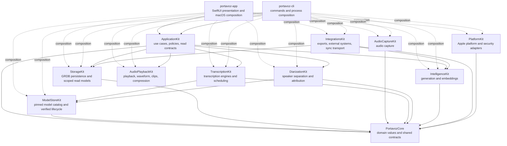
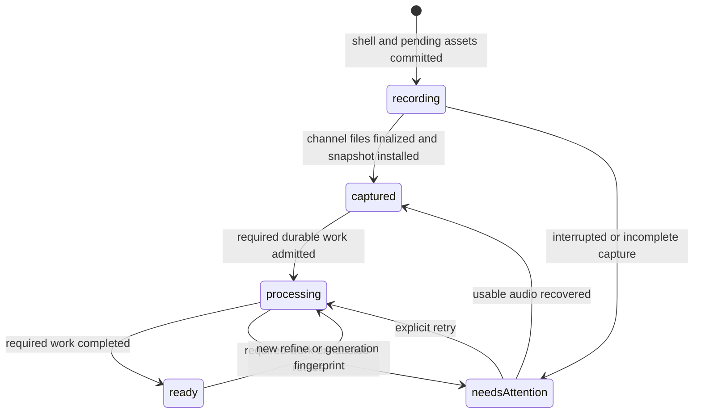
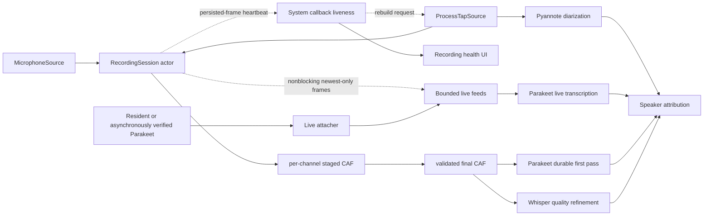

# Architecture

## Purpose

Portavoz is a local-first meeting assistant for macOS. It records independent
audio channels, creates live and refined transcripts, attributes speakers,
generates reviewable intelligence, and stores the user's library on the Mac.
Remote operations are explicit, policy-gated, and recorded without copying
meeting content into diagnostics or telemetry.

This document describes only the architecture implemented in the repository.
It is intentionally independent from roadmap terminology, work-item names,
migration history, and delivery sequencing. Detailed runtime behavior belongs
in `docs/specs/`; binding trade-offs belong in `docs/DECISIONS.md`; remaining
limitations and field validation belong in `docs/GAPS.md`, with deferred Apple
platform work in `docs/IOS.md`.

## Architectural style

Portavoz is a modular monolith distributed as one macOS application and one
command-line executable from a single Swift package. Module boundaries provide
dependency direction and test seams without introducing a backend, service
mesh, event-sourcing framework, or global state-management framework.

The system combines these patterns:

- application use cases for multi-step product workflows;
- typed domain values and stable failure categories;
- GRDB transactions and query-specific read models;
- durable owner-leased jobs for restart-safe derived work;
- process managers for filesystem and database reconciliation;
- feature-scoped observable presentation models;
- injected capability and platform adapters;
- explicit, content-free policy records before meeting-content network egress.

Feature parity is a permanent constraint: audio and user-owned data remain
discoverable when transcription, diarization, generation, indexing, sync, or an
external integration fails.

## Current module graph

`portavoz-app` and `portavoz-cli` are the current composition roots. They link
the concrete capability modules needed to construct production adapters and
also enter characterized workflows through `ApplicationKit`.


```mermaid
flowchart TB
    UI["portavoz-app\nSwiftUI presentation and macOS composition"]
    CLI["portavoz-cli\ncommands and process composition"]
    APP["ApplicationKit\nuse cases, policies, read contracts"]
    CORE["PortavozCore\ndomain values and shared contracts"]
    MODEL["ModelStoreKit\npinned model catalog and verified lifecycle"]
    STORAGE["StorageKit\nGRDB persistence and scoped read models"]
    CAPTURE["AudioCaptureKit\naudio capture"]
    TRANSCRIPTION["TranscriptionKit\ntranscription engines and scheduling"]
    DIARIZATION["DiarizationKit\nspeaker separation and attribution"]
    INTELLIGENCE["IntelligenceKit\ngeneration and embeddings"]
    PLAYBACK["AudioPlaybackKit\nplayback, waveform, clips, compression"]
    INTEGRATIONS["IntegrationsKit\nexports, external systems, sync transport"]
    PLATFORM["PlatformKit\nApple platform and security adapters"]

    UI --> APP
    CLI --> APP

    UI -. composition .-> MODEL
    UI -. composition .-> STORAGE
    UI -. composition .-> CAPTURE
    UI -. composition .-> TRANSCRIPTION
    UI -. composition .-> DIARIZATION
    UI -. composition .-> INTELLIGENCE
    UI -. composition .-> PLAYBACK
    UI -. composition .-> INTEGRATIONS
    UI -. composition .-> PLATFORM

    CLI -. composition .-> MODEL
    CLI -. composition .-> STORAGE
    CLI -. composition .-> CAPTURE
    CLI -. composition .-> TRANSCRIPTION
    CLI -. composition .-> DIARIZATION
    CLI -. composition .-> INTELLIGENCE
    CLI -. composition .-> PLAYBACK
    CLI -. composition .-> INTEGRATIONS
    CLI -. composition .-> PLATFORM

    APP --> CORE
    APP --> STORAGE
    APP --> PLAYBACK
    APP --> TRANSCRIPTION
    APP --> DIARIZATION
    APP --> INTELLIGENCE

    MODEL --> CORE
    STORAGE --> CORE
    CAPTURE --> CORE
    TRANSCRIPTION --> CORE
    TRANSCRIPTION --> MODEL
    DIARIZATION --> CORE
    DIARIZATION --> MODEL
    INTELLIGENCE --> CORE
    INTEGRATIONS --> CORE
    INTEGRATIONS --> STORAGE
    INTEGRATIONS --> INTELLIGENCE
    PLATFORM --> CORE
```

Capability modules never depend back on `ApplicationKit`. Sibling capability
dependencies are limited to three declared edges: `TranscriptionKit` and
`DiarizationKit` use `ModelStoreKit` for the verified model lifecycle, and
`IntegrationsKit` uses StorageKit for persisted sync state plus
IntelligenceKit values for issue-export formatting. `AudioPlaybackKit` is
self-contained over system frameworks and carries no module dependency.

## Module responsibilities

| Module | Implemented responsibility |
|---|---|
| `PortavozCore` | Typed meeting, transcript, speaker, person, audio, processing, provenance, evidence, language, privacy, sync, immutable transcript-correction, secret-identifier, and content-free resource-workload values plus capability ports, the universal lexical transcript-content policy, and deterministic generated-card admission. Its only imports are Foundation and CryptoKit (digest values); it links no UI, persistence, media, logging, or platform-service framework. |
| `ApplicationKit` | Delete, restore, purge, summary and explicit Apuntador regeneration, local summary-provider discovery and clean-install selection, external-audio import, file transcription/diarization/summarization, meeting-bundle import/export, coherent meeting-document preparation and explicit document/action publishing, whole-library Markdown backup plus publication-recovery contracts, Ask search/evidence/answer coordination, deterministic semantic-corpus indexing and speaker-safe retrieval-chunk candidate derivation, command-library reads, verified calendar-backed speaker-name suggestions, inert Meeting Detail title/structure/chapter suggestions, correction-ready Meeting Detail transcript reading snapshots, pure transcript-correction composition, focused text/speaker correction, and accepted-snapshot structural correction commands, Meeting Detail playback preparation, waveform/filter coordination, failure-safe channel compression and clip export, deterministic pre-meeting reminder resolution, local voice capture/enrollment/status/deletion, explicit participant-voice memory and privacy-safe gallery management, microphone discovery, resumable recording-root management, pinned-model management, first-run eligibility, exact local-data receipts, pre-meeting preparation, refine/apply, recording start/stop/recovery, durable post-capture execution, typed workflow failures, storage-independent Library/Insights/Meeting Detail/menu-bar contracts, and deterministic product/read policies. |
| `PlatformKit` | Concrete Apple platform and security adapters. It currently owns device-only Keychain access, microphone authorization, and regular persistent file bookmarks while depending only on `PortavozCore`. |
| `ModelStoreKit` | Task-oriented model catalog, pinned artifact metadata, streaming SHA-256 verification, atomic download repair, verified-installation evidence, and process-scoped model lifecycle. |
| `AudioCaptureKit` | Call-safe raw microphone capture, explicit nondefault voice processing for bounded nonmeeting tools, macOS process taps, dual-channel recording sessions, callback-liveness recovery, staged CAF writing, utility-priority finalization, audio validation, checksums, levels, and recovery inspection. |
| `TranscriptionKit` | Live Parakeet, quality Whisper, and macOS 26 SpeechAnalyzer adapters; transcript scheduling; language-aware operation fingerprints; model preparation tokens; segment mapping; structured SpeechAnalyzer input ownership; and one-shot CPU fallback when a verified Whisper model cannot load on its preferred accelerator. |
| `DiarizationKit` | Pyannote/Core ML speaker turns, clustering, attribution, voice matching, session-clock-anchored live windowing, and encrypted local voice-gallery support. |
| `IntelligenceKit` | Foundation Models, Ollama/OpenAI-compatible, and embedded MLX summary providers; structured summaries with deterministic action/evidence admission; Apuntador; retrieval and answer primitives; embeddings; provider fingerprints; and egress-aware clients. |
| `StorageKit` | GRDB schema, migrations, strict record conversion, transactions, FTS5, scoped observations, query-specific projections, durable jobs, generation provenance, privacy receipts, typed evidence, immutable transcript-correction history with atomic multi-lane appends and sparse correction-search lineage, explicit topic and decision continuity with immutable evidence and append-only relationship history, explicitly confirmed decision-topic authority, local feedback, people, sync journal, aggregate replay, support-safe snapshots, and correction-fenced Spotlight projections. |
| `AudioPlaybackKit` | Synchronized channel playback, reversible role-aware clear mixing validated on the timescale it is delivered on, stateless task-cancellable Accelerate waveform generation, silence skipping, voice-only playback, clip export, and AAC compression. |
| `IntegrationsKit` | Canonical Markdown/PDF, identity-preserving diarized SRT/WebVTT, and issue exports; meeting bundles; EventKit mapping; MCP protocol handling; policy-checked HTTP transport; deterministic sync envelopes; protected CloudKit record/state adapters; and sync lifecycle policy. |
| `portavoz-app` | macOS scenes, navigation, localization, accessibility, observable feature owners, dependency construction, native panels, model-lifecycle composition, and background supervisors. |
| `portavoz-cli` | Command parsing, terminal and MCP-tool presentation, benchmark harnesses, and one process composition surface. |

### First-listen speech lifetime

The onboarding First Listen resolves the optional macOS 26 SpeechAnalyzer asset
before it opens the microphone, so a cold framework wait cannot accumulate an
unconsumed audio stream. One session identity fences every asynchronous state
publication. Leaving the first step, skipping setup, or dismissing onboarding
cancels that identity, cancels the caption consumer, and awaits microphone and
caption cleanup; a cancelled run cannot later publish a completed or failed
state into a newer session.

Inside `TranscriptionKit`, the SpeechAnalyzer input feeder is a structured child
of the results consumer. Every normal, failed, or cancelled exit finishes the
input continuation, cancels and drains that child, and uses one idempotent gate
for `cancelAndFinishNow()`. No output consumer can leave a feeder reading a live
`AudioChunk` stream after the analyzer has lost its presentation owner.

### Database launch recovery

The macOS composition root is two-stage. `AppLaunchModel` first asks the
throwing `AppServices` constructor to open the authoritative `MeetingStore`;
`AppServices` does that before installing telemetry or constructing any other
runtime, model, sensitive-storage, scheduler, sync, recovery, or global-input
owner. The root then publishes either one complete service graph or a focused
database-unavailable state. Normal windows, Settings, commands, menu-bar
models, and background owners are created only from the complete graph, and
process activation is idempotent across retry.

The failure state reduces arbitrary errors to content-free typed evidence. It
can retry, export mode-`0600` diagnostics without paths or raw error text, or
create a verified SQLite recovery copy by reading the original authority
without modifying it. Recovery copies the authority and committed WAL into a
hidden mode-`0700` same-destination stage, opens only that private snapshot
read-only, runs SQLite online backup plus `PRAGMA quick_check`, creates a mode-`0600`
database, and a unique non-overwriting rename. No path auto-deletes, repairs,
migrates, replaces, or silently recreates the production library. The
simulation and database-path injection used by XCUITest require the disposable
`-use-temp-store` composition and cannot redirect a production launch.

## Application boundary

`ApplicationKit` defines asynchronous Sendable workflows over narrow ports.
Concrete storage, model, capture, filesystem, playback-codec, document,
provider, and platform implementations are injected by the executable
composition roots.

The implemented application workflows include:

- meeting delete, restore, manual purge, and expiry purge;
- summary regeneration with explicit provider availability and provenance;
- local summary-provider discovery, typed recommendation, and first-selection
  persistence without overwriting an existing choice;
- external-audio import with required transcription and degradable derivation;
- relational `.portavoz` bundle import and read-consistent bundle export;
- read-consistent staged whole-library Markdown backup with typed partial
  results and capture checkpoints;
- reviewable refinement and revision-fenced acceptance;
- pre-capture recording reservation and failure reconciliation;
- audio-first stop, durable processing admission, and terminal recovery state;
- launch recovery for interrupted capture and expired processing leases;
- serial post-capture transcription, diarization, and summary execution with
  owner leases, heartbeats, exact input fingerprints, dependency admission,
  bounded retries, supersession cancellation, and scheduled wakes;
- canonical-person lookup and explicit speaker-to-person linking;
- explicit topic creation/link confirmation plus reversible topic merge/split
  identity history;
- explicit decision confirmation, later evidence-source confirmation, and
  named supersede/reverse relationship history;
- instant Ask search, hybrid evidence retrieval, and optional local answer
  generation with evidence-preserving degradation;
- first-run eligibility without model or permission prerequisites;
- independent exact local-data receipt metrics with per-source degradation;
- pre-meeting preparation from shared Ask evidence, batched current summaries,
  open commitments, and source-indexed optional synthesis;
- bounded nonvisual meeting list/detail/search/open-item queries used by terminal
  and local protocol interfaces;
- standalone audio transcription, diarization with optional attribution, and
  summary generation over admitted files, with model and provider work behind
  injected processors;
- persisted meeting refinement that loads one current detail, accepts optional
  external audio, creates a revision-fenced draft, and applies it atomically;
- canonical meeting-document preparation for native save surfaces, explicit
  Gist publication, and pending action-item publication from one coherent
  meeting projection;
- local voice enrollment from an admitted file, a supplied in-memory sample, or
  a bounded captured sample; typed progress, sample validation,
  status/deletion, and ordered pinned-model inspection/installation all use
  capability-neutral ports;
- microphone discovery as capability-neutral identifiers and names, resumable
  recording-root inspection and update with ordered progress, and remembered-
  voice listing/deletion through a projection that excludes embeddings;
- speaker-name suggestion from one coherent meeting projection, optional
  calendar candidates, an injected untrusted proposer, and application-owned
  whole-token verification against currently unnamed remote speakers with
  typed transcript or calendar-candidate evidence;
- optional Meeting Detail title, structure, and chapter-label suggestion with
  application-owned eligibility, bounded output admission, cancellation, and
  per-output degradation over one storage-independent review projection;
- Meeting Detail audio preparation that resolves current channels, constructs
  one synchronized playback session, derives a bounded waveform and playback
  filters, coordinates failure-safe channel compression, and re-resolves files
  before clip export;
- pre-meeting reminder resolution from one sampled clock value, one configured
  lead window, session deduplication, and an injected upcoming-event source;
- degradable participant-voice suggestions, duplicate-offer admission, and
  explicit remembered-voice persistence without automatic speaker mutation;
- asynchronous user-managed secret reads, writes, presence checks, and deletion
  over an injected device-local storage port;
- scoped Library, Insights, Meeting Detail, and resident menu-bar read contracts;
- meeting-review, brief, reminder, mirror, and Insights policies.

The skill boundary is one of those application workflows, not a second
implementation of product behavior. `ExecuteSkill` admits a typed proposal,
durably confirms it, honours cancellation before the effect handoff, claims
the attempt, delegates through a registered effect port, and settles a typed
outcome. A pre-handoff cancellation is stored as `cancelled` and projected as
the domain's terminal no-effect `dismissed` state by one fail-closed decoder;
unknown future states project as `executing`, never as retryable failure.
Storage appends confirmation through one typed event write and represents every
later transition as one typed command whose case determines the persisted event
kind, state, and optional failure category. The event and current projection
therefore cannot drift through independently ordered string parameters.
Meeting Detail recap confirmation captures one durable material snapshot,
compares its composed artifact with the preview the user approved, and reuses
that snapshot for delivery. A changed preview is refused before a claim, and
the pasteboard adapter treats an unsuccessful write as a failed effect rather
than a successful receipt. The confirmation target allocates its proposal UUID
and `proposedAt` timestamp with that preview and keeps both across repeated
Confirm attempts. The 15-minute admission window therefore expires from what
the user actually reviewed; rebuilding the proposal at button-press time cannot
silently renew an old sheet. If SwiftUI
later reconstructs the sheet, the app resolves the unique idempotency key back
to its original durable proposal instead of attempting to transfer the claim to
a new UUID. Failed effects can therefore increment the original attempt while
succeeded or interrupted effects retain their existing no-repeat semantics.
The still-open sheet owns presentation of a recoverable reason, so it remains
visible beside the retry action rather than behind the modal.

External skills remain a separate application-owned registry, so the
`LocalSkills` registry's executable no-egress invariant cannot weaken as new
adapters land.
The first external effect derives an email subject and plain-text body through
the existing summary-only `RecapComposer`, captures the exact material shown in
the confirmation sheet, requests both meeting-read and remote-handoff
capabilities, and admits the effect only when that same submit action supplies
per-proposal egress permission. It never infers recipients. The production
adapter constructs a task-local `NSSharingService` on the main actor, assigns
an empty recipient list and the approved subject, and hands over the approved
body. Portavoz owns no email transport or Send operation; the email client may
still save or sync the handed-off text, so the capability and UI conservatively
treat the boundary as egress. A succeeded receipt means the system composer
accepted the handoff request, not that the user saved or sent a message.
An interrupted `executing` receipt keeps the one-shot email and clipboard
offers absent because either handoff may already have happened; only a typed
failed attempt is safe to re-offer. Both meeting-scoped one-shot keys are read
through one bounded exact-key batch, while package receipts retain one literal
prefix read; adding the external adapter does not add per-offer SQLite queries.
Disposable UI automation traverses the same proposal/effect path through an
inert opener and can never launch the host email client.

The second external effect publishes one reviewed secret GitHub Gist without
adding a document or transport path. Meeting Detail prepares the canonical
correction-aware Markdown, filename, description, and fixed `api.github.com`
destination as one immutable `SecretGistDraft`; confirmation re-renders and
compares that complete draft before any durable claim. The Keychain token is
prepared before `ExecuteSkill`, so a missing credential remains a known
pre-egress recovery. Production then enters the existing `GistPublisher`
through `URLSessionDataEgressGateway`. The proposal UUID is also the
`DataEgressEventID`, whose primary-key row is inserted before transport; a
reconstructed or retried ambiguous attempt therefore fails locally before a
second request. Because GitHub create-Gist has no caller idempotency token,
every provider, transport, decode, settlement, or interruption failure after
that point is reported as outcome unknown and suppresses the offer instead of
inviting retry. A returned URL is transient presentation state; Skill and
privacy receipts remain content-free. Disposable automation keeps the same
renderer, request codec, metadata validation, execution state, and receipt
paths but substitutes a no-network provider-shaped response. The exact
potentially long Markdown preview uses one read-only selectable TextKit
viewport rather than one monolithic SwiftUI `Text` layout; it does not truncate
the approved bytes to gain responsiveness.

The resident pre-meeting brief uses the same execution authority without
turning the existing manual Library brief into an implicit action. Its
`UpcomingEvent` carries one bounded opaque EventKit reference; title and time
are presentation facts, never identity. The resident source reads only when
full Calendar access already exists and never requests permission. A durable
offer is absent while Skills are paused or this Skill is disabled, after an
event-scoped dismissal, or whenever an existing execution is anything other
than failed. The menu-bar model composes one exact `MeetingBrief` before it
allocates the confirmation proposal UUID. Immediately before claim, the app
re-resolves the same EventKit identifier and requires every previewed event fact
to match. Missing or changed identifiers are stale; the app never guesses by
title or timestamp. A concurrent owner may be resumed only when its prior
effect failed; a different settled or potentially delivered owner makes this
preview stale. The effect receives and delivers the immutable approved
brief rather than querying Ask, storage, Calendar, or a model again.

Commitment Radar projects the reminder-draft Skill over at most 200 exact,
confirmed, live commitments. ApplicationKit performs one bounded batch
execution read beside policy and dismissal reads, so the surface does not
issue one durable-state query per row. A per-window `ReminderDraftModel` opens
the exact projected title and due date without requesting permission. Only the
explicit **Allow Reminders Access** action may ask for TCC access. Full access
must resolve one bounded opaque calendar identity plus display title, and both
are shown before confirmation. The process-owned EventKit actor uses one
`EKEventStore` to resolve that default Reminders list, construct the
`EKReminder`, and save it. Confirmation re-reads the commitment, policy,
durable execution owner, authorization, and exact list; removal, rename, or
permission drift fails closed with no fallback list. Success retires the offer
and leaves the content-free receipt both beside the commitment and in Skills
Settings. The disposable UI-test platform follows the same explicit permission
transition without reading host TCC or Reminders.

`SkillCatalogue` is the single application-owned projection for the
Skills management surface. It distinguishes skills that have both a proposal
surface and an effect adapter from contracts that are not yet implemented. A
device-local SQLite policy supplies one independent global pause plus a sparse
set of per-skill disablements; missing or corrupt policy state is an error, not
implicit permission. Meeting Detail reads that policy before presenting
offers, and `ExecuteSkill` reads it again immediately before admission and the
durable claim. The Settings snapshot combines the catalogue with exactly one
requested content-free execution scope: recent, confirmed and waiting to begin,
failed or executing runs that need attention, or terminal completed/cancelled
runs. Application requests at most 50 receipts (20 by default); storage itself
refuses reads above 100. Schema v39 supplies direction-matched newest-first
partial indexes for the three state scopes, and the query pins the matching
index so SQLite does not sort or scan unrelated execution history. The
attention predicate is deliberately negative: an unknown future durable state
stays visible for review rather than disappearing fail open. A scope response
must match the current selection before Settings renders any receipt, and a
scope-only read failure leaves already verified policy controls usable while
showing no stale rows.

Policy and receipt history remain independently verified inside that snapshot.
The application starts both bounded reads together, but only a policy failure
fails the entire control projection; a receipt failure returns the verified
catalogue/policy with an explicit unavailable receipt state and no rows. The
activity view projects loading, unavailable, empty, or receipt content through
one pure state boundary. Loading wins even when the retained snapshot already
matches the selected scope, so a same-scope mutation refresh cannot expose stale
rows. Policy mutations fence any older receipt load before writing and own their
fresh projection; receipt loading never disables independently verified policy
or proposal controls. Empty copy names the selected scope, while empty and
unavailable transitions request one localized medium-priority application-level
accessibility announcement through public AppKit. Loading is deliberately
silent, and the retry remains a separate reachable control.

The same pane reads a separate content-free **Proposed** projection from the
v40 Skill offer authority. Every executable definition declares both its
effect capabilities and the exact input-data classes it may read; an execution
proposal must request a nonempty subset of both declarations before admission.
Meeting Detail, the resident calendar brief, and Commitment Radar reconcile a
bounded set of stable offer intents before returning actionable offers.
Storage retains only a random review UUID, Skill identity/version, typed reason,
opaque subject identity, exact input classes, and observed/expiry times. Meeting
and commitment identities are foreign-key cleanup authority, while calendar
identities remain opaque and expire at the event start. Title, transcript,
preview, destination, recipient, and argument values never enter the review
projection or SwiftUI. Dismissal and one-shot confirmation retire the matching
authority row in the same transaction; the destination-free package-export
offer deliberately remains reusable while each destination owns a distinct
exact execution claim.

The read path prunes expired offers before a bounded newest-first index walk,
materializes at most 100 rows in StorageKit and 50 in ApplicationKit, and then
revalidates every row against the current catalogue version, reason, input
declaration, durable pause, and per-Skill policy. A proposal-only failure shows
no rows but does not disable independently verified execution controls.
Settings can dismiss one inert row using only its random review UUID. Storage
resolves the stable intent, inserts the existing terminal dismissal, and
deletes the authority row in one write; expired or already-retired review
identities return the same unavailable outcome. A failed write retains the row
and exposes retry instead of optimistically hiding it. Reconciliation checks
the dismissal set in its write transaction, so a producer that read before the
action cannot recreate hidden authority.

Meeting and commitment rows can also return to their original surface without
moving confirmation authority into Settings. The action sends only the random
review UUID; StorageKit resolves a current typed subject transiently, and
ApplicationKit revalidates catalogue version, reason, global pause, and
individual policy before returning an inert Meeting Detail or focused
Commitment Radar destination. The bounded list remains subject-free. Calendar
rows state that review lives in the Portavoz menu bar because public SwiftUI
has no action for opening a `MenuBarExtra`; no private status-item bridge is
used. A failed resolution retains the row and exposes retry. Programmatic main
window presentation uses one constant Codable `MainWindowIdentity.primary`
value so `openWindow(id:value:)` reuses the existing `WindowGroup` window; the
same `pendingRoute` channel handles an absent/cold main scene before Settings
dismisses itself.

Every executable `SkillDefinition` also declares exactly one subject kind, and
every exact `SkillProposal` binds one matching `SkillSubject` represented once
in its typed arguments. Admission rejects a mismatched, missing, duplicated, or
invalid subject before any durable claim. Schema v41 adds the current typed
failure category to `skillExecutionState` and records each newly confirmed
proposal's exact content-free meeting, commitment, or bounded opaque calendar
subject in the separate `skillExecutionSubject` table. Meeting and commitment
foreign keys remove only recovery authority when their owner disappears; the
execution receipt remains. Legacy executions receive no inferred subject:
idempotency and offer-key strings are never parsed to manufacture authority.

A verified failed receipt can therefore classify recovery without becoming a
retry engine. ApplicationKit replays the causal audit, re-reads current global
and individual policy, requires the same available catalogue version and
subject kind, and distinguishes local/recoverable failures from external or
destructive outcomes. Meeting and commitment failures may return to their
original context; calendar recovery remains resident in the menu bar. External
or destructive failures expose verification guidance only because their effect
may already exist outside Portavoz. Missing subjects, deleted owners, disabled
policy, stale catalogue versions, malformed history, and legacy rows remain
unavailable.

The recovery action sends only the proposal UUID and returns at most an inert
navigation destination. Settings receives no arguments, preview, destination,
recipient, offer key, idempotency key, confirmation, claim, settlement, or
effect port. The original subject surface must rebuild a fresh proposal and own
its exact preview and approval again. A failed resolution retains the receipt
and exposes only a route-resolution retry; it never retries the Skill effect.
The receipt sheet first dismisses completely; its parent then opens the
value-scoped primary scene and closes only the weakly captured presenting
Settings `NSWindow` through a narrow AppKit boundary. SwiftUI's `DismissAction`
and `dismissWindow` leave this Settings host open after the modal transition,
while process-wide key-window inference can target the primary scene after the
sheet has gone away. The bridge therefore retains neither the scene nor window
and invokes `close()` only on the exact captured host.

An ordinary receipt-sheet dismissal keeps only the exact proposal UUID long
enough to return interaction context. The Settings root emits a bounded focus
request after AppKit removes the sheet focus scope; the activity component that
owns the receipt rows owns both `FocusState` and `AccessibilityFocusState` and
matches that request against `proposalID`. A reconstructed activity subtree
handles the request as initial state and yields once before applying it. A
recovery route clears the pending receipt request instead, so focus cannot be
pulled back into the Settings window that is closing. No retained view, window,
receipt payload, or execution authority enters this focus handoff.

Confirmation still belongs to the original subject surface. Every execution
claim carries the reviewed `offerKey` separately from its exact
`idempotencyKey`: one-shot values are equal, while a reusable package offer is
the exact prefix of its destination-scoped slot. Storage validates that
relationship and checks the durable dismissal inside the claim transaction
before granting any new owner, while an exact owner that committed first stays
idempotently resolvable. A dismissal that commits first therefore blocks an
already-open stale confirmation without adding preview or subject identity to
Settings. No Settings confirmation, standing rule, or execution authority is
introduced.

Selecting one receipt opens a content-free AUTO-6 inspection projection. Storage
loads its current state and predecessor-linked event chain in one SQLite read
snapshot, rejects unknown typed failure categories, and preserves causal
insertion order even when wall-clock timestamps move backward. StorageKit also
requires every predecessor pointer and the projection's latest-event tail to
match. ApplicationKit replays the confirmation/begin/terminal transitions and
refuses an impossible or incomplete chain rather than rendering plausible
audit evidence. Inspection materializes at most 256 events and rejects a longer
chain after a bounded 257-row probe. The sheet shows only status, attempt,
typed category, and time; it never receives the
idempotency key, proposal arguments, destination, result, or meeting material,
and its inspection-error retry retries only the read.

After that inspection verifies the current state is `confirmed`, the sheet may
send only the proposal UUID through `RevokeWaitingSkillExecution`. Its narrow
storage port exposes only the existing cancellation transition: it cannot
claim, begin, settle, reconstruct, execute, or retry an effect. SQLite
serializes cancellation against `beginSkillExecution`. Cancellation first
writes the append-only `cancel` event and terminal `dismissed` projection;
begin first makes revocation unavailable because the effect may already have
crossed its handoff boundary. A thrown mutation keeps the verified Waiting
receipt and an inline retry. A verified revoked or unavailable outcome reloads
both inspection and the selected activity scope from durable authority. No
idempotency key, offer key, arguments, subject identity, destination, result,
or meeting material crosses into SwiftUI.
The external email and Secret Gist adapters store no reusable consent: each
complete preview, boundary warning, and submit action supplies authority for
that proposal only. No standing-rule control exists for irreversible or
external work, and an ambiguous remote attempt is never made retryable merely
because the provider outcome is unavailable.

The Skills pane derives each row's transfer disclosure from the executable
`SkillDefinition`, never from a title or a list of known identifiers. A
definition containing `sendRemote` is presented as potentially sharing outside
Portavoz; every other definition promises only that Portavoz performs no direct
network handoff, because a clipboard, native app, or user-selected file
destination may still sync independently. Enablement remains visually separate
from the definition's confirmation policy, so an enabled explicit-per-proposal
Skill still says that every run requires approval.

Application failures cross into presentation as bounded categories or stable
workflow codes. Raw filesystem paths, localized dependency errors, model
payloads, and storage implementation details do not form the UI contract.
The app maps reachable typed use-case failures to catalog strings at the
feature-model/presentation boundary; English developer descriptions remain a
CLI and diagnostic fallback rather than user-facing copy.

## Presentation and state ownership

SwiftUI renders immutable snapshots and sends explicit actions through feature
owners. Adopted read surfaces do not observe a global invalidation counter.

| Surface | State owner | Lifetime |
|---|---|---|
| Library | `LibraryModel` | one main window |
| Insights | `InsightsModel` | one main window |
| Commitment Radar | `CommitmentRadarModel` + `ReminderDraftModel` | one main window |
| Meeting Detail | `MeetingDetailScene` + `MeetingDetailModel` | one selected meeting route |
| Ask conversation | `AskModel` | one main window |
| Command palette | `CommandPaletteModel` | application process |
| First-run welcome | `FirstRunModel` | application process |
| Local-data receipt | `LocalDataLedgerModel` | application process |
| Resident menu bar | `MenuBarModel` | menu-bar scene |
| Global dictation | `DictationController` | application process |
| Private sync | `MeetingSyncModel` | application process |
| Whole-library backup | `LibraryMarkdownBackupModel` | application process |
| Skills Settings | policy/activity snapshot + independent proposal snapshot + receipt inspection | one Settings window |
| Spotlight reconciliation | `SpotlightIndexer` | application process |
| Post-capture processing | `PostCaptureProcessingSupervisor` | application process |
| Whisper preparation | shared readiness owner | application process |

Library combines independently observed meeting rows, open commitments, trash,
and active FTS results. Insights combines chronology, participants,
commitments, talk balance, and bounded finding evidence. Meeting Detail merges
transcript/cast, newest summary, Apuntador, privacy receipt, and durable
processing streams. A failed stream degrades only its section and preserves
healthy state from the remaining sections.

The route model delegates scoped-update accumulation to the pure
`MeetingDetailReviewAccumulator`. That owner fences observation instances,
retains the last healthy section across an observation restart, derives the
loaded/missing/degraded/failed state, and emits one storage-independent read
model plus explicit correction and audio-directory invalidation signals.
`MeetingDetailModel` alone applies those signals to suggestion and playback UI
lifetimes. Optional metadata request identity and one-shot eligibility live in
`MeetingDetailMetadataSuggestionState`; successful values remain in the route
model. Meeting actions retain one public factory surface but are routed through
editing, artifact, maintenance, preparation, and audio families, keeping each
exhaustive dispatcher bounded without weakening feature ownership.

`MeetingDetailScene` is the route/composition owner and the only Meeting Detail
presentation type that receives `AppServices`. It constructs one
`MeetingDetailModel` in `@State`; the route keys the scene by `MeetingID`, so a
different destination cannot retain the prior model. The scene projects process
observations into immutable values and exposes explicit meeting-scoped actions. The child
`MeetingDetailView` receives the model, values, actions, and one
pure `MeetingDetailPresentation`; it neither observes `AppServices` nor creates
the model. Presentation formatting receives its locale and time zone explicitly
and imports Foundation only. The composition root is not an allowed dependency
of child presentation types; scoped action values are their mutation boundary.

The child is itself a composition surface rather than the owner of every visual
section. `MeetingDetailHeaderSection` renders identity, facts, participants,
and optional suggestions. `MeetingDetailTrustSection` renders processing,
recovery, and the privacy receipt. `MeetingGeneratedDocumentSection` renders
the summary overview, decision/open-question sections, typed commitments, and
claim-adjacent proof controls. Each receives only explicit values and actions;
none can reach the route model, services, stores, or global preferences. The
generated section owns only tab selection, while the trust section owns only
retry progress. A pure Foundation projection preserves Markdown source
ordinals for evidence and suppresses a canonical `Action Items`/`Pendientes`
appendix only when equivalent typed commitments exist, so legacy content is
never discarded and the current document never renders the same task twice.
Each extracted section is an accessibility containment group: its stable
section boundary coexists with, rather than replacing, nested control
identifiers used for interaction and automation.

Meeting Detail audio uses the same route owner. `MeetingDetailModel` owns
one-shot preparation, cancellation retry, compression state, playback
invalidation, and clip-export effects. ApplicationKit owns the operation order
and exposes an observable playback-session facade plus capability-neutral
waveform values.
Playback preparation has an audio-directory-scoped task lifetime, independent
from the multi-section review revision, so unrelated initial section updates
cannot cancel and consume the only load attempt.
ApplicationKit admits one immutable waveform snapshot with 600 buckets by
default and a hard 2,000-bucket presentation ceiling. `AudioPlaybackKit`
propagates route cancellation into its off-main worker and checks it between
fixed-size file reads. An obsolete route therefore stops deriving and publishes
no partial result; the complete finalized channel files remain unchanged and
authoritative.
The app composition resolves recording paths and supplies the concrete codec
adapter. `AudioPlaybackKit` owns AVFoundation playback, waveform analysis, AAC
encoding, and clip rendering. SwiftUI owns transport controls, drawing, and the
native save panel; it neither discovers channel files nor constructs audio
capabilities.
Clear playback derives its complete microphone volume timeline as pure policy:
`CleanPlaybackPolicy.volumeSchedule` emits typed level and ramp events, and the
AVFoundation composition only replays them. Two local turns stay
separately ducked only when the earlier release ramp ends no later than the
later attack ramp starts, decided with the same arithmetic the schedule emits;
closer turns merge. The boundary revalidates ordering and returns no mix rather
than handing AVFoundation an overlapping ramp, which it answers with an
Objective-C exception that Swift cannot catch.
Multi-channel compression refuses to replace an existing output,
retains every original until all outputs verify, removes generated outputs on
failure or cancellation, and only then removes the raw channels.

The menu-bar scene receives bounded recent-meeting and open-commitment updates
through an app adapter. EventKit access remains in the adapter and follows the
no-prompt resident-surface rule. The SwiftUI panel owns commands and rendering,
not Store or calendar coordination. Its event-scoped brief proposal adds a
durable dismissal, exact-preview confirmation, local-draft handoff, and global
Skills receipt without adding a second product workflow. Calendar and effect
awaits are cancellation- and owner-fenced before the model publishes state.

Global dictation has one process-scoped, main-actor owner and one UUID-fenced
session task. Microphone duration starts only after the real stream opens;
finish-before-readiness cancels, one owned tail task drains an accepted finish,
and cancellation closes the transcription feed immediately while fencing every
later state mutation and delivery side effect. Audio sample reduction and feed
delivery stay off the main actor; only the observable meter update crosses back.
Failure-dismiss tasks are single-owner and cancelled on restart so an older
error cannot dismiss a newer session.
System-wide input adapters remain at the app boundary: Carbon owns the keyboard
hotkey and a session `CGEventTap` owns one explicitly configured middle or
additional mouse button. The pure `MousePTTGesture` table also remains in the app
target because it decides presentation/input ownership, not speech recognition.
The tap registration is idempotent, cancels a mouse-owned capture before
rebinding can discard its release event, and retries after the app returns from
the Accessibility permission flow. Invalid persisted button numbers normalize
to disabled; CGEvent indices 0/1 (left/right) are never eligible.
TranscriptionKit owns only the post-ASR text policy: optional bilingual filler
removal followed by one non-cascading, longest-trigger-first replacement pass.
The policy reads one canonicalized rule snapshot at delivery, never mutates a
meeting transcript, and treats the first match against the original dictation
as the user's authoritative spelling.
The last-mile `TextInserter` returns a typed result. It waits for physical
modifiers without swallowing cancellation, refuses a timed-out chord, performs
a fail-closed Accessibility inspection immediately before clipboard mutation,
posts a complete synthetic paste pair or restores synchronously, and later
restores only captured pasteboard representations when its change count still
owns the clipboard. Secure or uninspectable focus, unavailable clipboard or
event delivery, and held modifiers become visible failures rather than false
insertion success.

Live Apuntador keeps endpoint admission split across layers: the pure,
deterministic `TurnEndpointPolicy` in `IntelligenceKit` owns the remote-channel,
noise, question/name, and speculative-material rules, while
`RecordingController` owns exactly one main-actor silence deadline. Both a real
row close and a two-second silence expiry enter one shared detection dispatch;
the app never closes or rewrites the coalescer's mutable row. Every accepted
delta re-arms the deadline, and recording activation or an in-meeting opt-in
also synchronizes it so an already-visible remote question cannot be stranded
at either lifecycle boundary. Recording activation first drains every row that
closed while Start was still preparing, then arms the open tail. Disabling
Apuntador, stopping, or resetting the session cancels the pending deadline.

Bounded recording-scoped live Apuntador owns generation separately from that
deadline. One coordinator admits at most one active generation and one newest
not-yet-started candidate. Additional candidates replace only that pending
slot; they never create wrapper tasks or an unbounded queue. Disabling
Apuntador, stopping, resetting, or advancing to another recording clears the
pending candidate and cancels the active worker. A result may publish only
while its worker remains uncancelled, and a new lifecycle waits behind an
uncooperative older generator until it unwinds, preserving the one-active
invariant. Visible cards remain unlimited user history and are independent of
this ephemeral work bound. Generated cards cross a separate deterministic
last-mile boundary before presentation or persistence. Overlapping question
segment identities establish one source-turn lineage; a short time-bounded,
negation-safe lexical fallback handles adjacent captions that were split before
evidence identities converged. A more complete result replaces the prior card,
while an older or weaker result is discarded. The intelligence boundary also
repairs only pathological every-word title casing, preserving configured names
and common technical acronyms.

The pre-meeting reminder controller owns only its periodic task, session-local
deduplication, floating panel, and recording route. It requests a typed notice
from an application workflow. The app adapter samples preferences and time once
and performs the EventKit projection away from the main actor. Disabled
reminders do not query the calendar; due-event selection is independent of
source order and uses the same sampled time for admission and displayed
minutes.

The full Ask route and the command palette share one `AskMeetings` application
workflow. Its public request and response values carry meeting identity,
timestamps, snippets, complete evidence, and optional generated text without
exposing StorageKit records or IntelligenceKit passages to presentation.
The same boundary can emit lexical and final fused evidence while preserving
its final-result API. `AskModel` owns each window's draft, conversation,
finding/refinement/generation progress, early citations, cancellation, and
stale-result fence. `CommandPaletteModel` owns process-scoped instant results,
answer state, cancellation, and generation fencing so closing one panel cannot
publish work into a later invocation. SwiftUI and AppKit retain rendering,
clipboard access, panel lifecycle, route selection, and exact evidence seeking.
The CLI command and local MCP tool enter the same workflow before formatting
their terminal or protocol responses.

The CLI has one process-wide platform composition and one database composition
surface. Meeting list, detail, search, open-item, Ask, and MCP reads enter
`QueryMeetingLibrary` or `AskMeetings`; the application values expose no GRDB
records. Detail plus the latest live General summary comes from one SQLite read
snapshot. File transcription, diarization, summarization, persisted refinement,
document export/publication, action-item publication, local voice management,
and pinned-model lifecycle also enter ApplicationKit workflows. Command files
retain argument parsing and terminal/protocol formatting. Concrete filesystem,
model, storage, voice, provider, integration, hashing, and platform behavior is
confined to `CLIComposition` and `CLIProductAdapters`. Capture diagnostics and
benchmark harnesses retain isolated direct capability construction.

The post-capture supervisor coalesces producer notifications, starts one
application workflow drain, and schedules the next persisted wake without
polling. `ProcessPostCaptureJobs` owns job order, lease maintenance, operation
identity, transcript cleanup and attribution policy, dependency admission,
summary provenance, retries, cancellations, lifecycle outcomes, and
post-meeting action timing. The app adapter owns concrete recording paths,
filesystem checks, model loading, user preferences, Shortcut invocation, idle
engine release, deterministic UI fixtures, and content-free signposts.
ApplicationKit keeps the workflow's public store and capability ports,
configuration snapshots, progress events, issues, and result envelopes in one
contract owner separate from executable policy. This makes the composition
surface inspectable without widening the workflow's private dependencies or
letting adapters absorb product decisions.

Meeting Detail document actions also enter the application boundary. One
workflow loads the selected meeting and latest General summary coherently,
then renders only the requested representation: canonical Markdown, PDF
derived from that Markdown, or SRT/WebVTT directly from the diarized
transcript. The typed subtitle port cannot receive a Markdown/PDF request,
speaker identity—not display-name equality—controls cue merging, and the
native save surface receives an extension-specific content type plus the
released title-based suggested filename. Explicit secret-Gist publication
uses the same coherent source and Markdown renderer. The app adapter owns
utility-priority rendering, lazy credential resolution, gateway-backed
publisher construction, and native platform presentation. The route-owned
`MeetingDetailModel` owns document actions and typed effects; SwiftUI owns the
user gesture, off-device confirmation, save panel state, and localized result.

Meeting Detail voice memory enters a separate application workflow. It reads
one coherent meeting projection, limits candidates to unnamed remote speakers,
loads the encrypted gallery through an injected port, asks an injected
extractor only for relevant labels, applies one-to-one voice matching, and
returns suggestions without mutating the cast. Remembering a voice requires a
separate explicit request for a currently named remote speaker. The app adapter
owns recording-path resolution, model loading, transient embedding extraction,
encrypted gallery access, and disposable-test isolation. `MeetingDetailModel`
owns one-shot loading, suggestion state, duplicate-offer checks, and explicit
remember effects; SwiftUI never calls those adapters directly.

Meeting Detail transcript/calendar naming enters another application workflow.
It reads one coherent meeting projection, excludes the local and already named
speakers before using optional capabilities, asks an injected calendar source
for candidates around the meeting, and treats every generated proposal as
untrusted. A proposal is returned only when its label is still eligible and its
normalized name appears as complete tokens in a real transcript line or
calendar candidate. The workflow derives typed evidence from that source,
deduplicates labels, and never exposes generator-authored evidence prose. The
app adapter owns EventKit authorization and the concrete on-device proposer.
The route-owned `MeetingDetailModel` owns loading and suggestion state, removes
a chip only after its explicit rename persists, and keeps a failed confirmation
visible. SwiftUI renders inert chips, labels transcript versus calendar
evidence, and sends explicit actions. Calendar-backed confirmations retain
calendar provenance when the user later creates a canonical-person alias. No
suggestion names or links a person automatically.

Meeting Detail's optional title, summary-structure, and chapter labels enter a
single application workflow. It admits only template-like meeting titles,
General summaries, and still-untitled chapters; bounds generated labels; maps
recipes back to the known catalog; and preserves literal chapter excerpts when
generation is unavailable or fails. Cancellation remains cancellation so a
newer read revision can retry rather than publish stale suggestions. The app
adapter owns Foundation Models capability and the concrete title, meeting-type,
and chapter generators. The route-owned model owns one-shot state, revision
fencing, retry admission, and inert suggestions. SwiftUI renders suggestions
and sends explicit acceptance actions; no title or structure is applied
automatically. A failed title save keeps its chip visible and reports the
existing localized rename error.

The user's own voice enrollment also enters an application workflow. The
workflow bounds requested capture time, requires at least four seconds of
finite sample data, orders capture, extraction, and encrypted persistence, and emits typed progress without
importing audio or diarization implementations. The app adapter owns the exact
microphone mode, guarantees capture shutdown on success, failure, and
cancellation, loads the verified diarization capability, extracts the transient
embedding, and invalidates the cached diarizer only after a successful save or
delete. A destructive failure remains visible and does not clear presentation
state. Settings requests a twelve-second echo-cancelled capture. Onboarding
either reuses its already captured first-listen sample or requests a fresh
twelve-second raw capture. Neither SwiftUI surface constructs a microphone,
loads a model, extracts an embedding, or reads the encrypted voice store.
Disposable UI composition never reads or writes the host voice identity.

Settings obtains microphone choices, recording-root state, and remembered-
voice summaries through application workflows. The macOS adapter retains Core
Audio enumeration, marker-file and filesystem migration behavior, and the
encrypted gallery. Recording-root progress is drained in order before the
workflow returns, and the active marker changes only after migration succeeds.
A destination that resolves to the active root, including a symlink alias, is
a no-op and cannot enter resumable cleanup against its own source.
The gallery projection contains identity, display name, and creation time but
never an embedding. SwiftUI owns the folder panel and localized state; failed
destructive gallery actions remain visible and preserve the current list.

Whole-library backup survives Settings-window closure because progress and
terminal state belong to a process-scoped owner. Settings retains only the
native folder picker and localized presentation.

The first-run owner resolves one process-wide presentation decision so restored
windows cannot compete to show setup. It tracks active main-window hosts and
hands the single sheet to another active host if its current window closes.
Existing-library detection uses only a live-meeting count, and model readiness
never blocks launch or recording. The
Settings data receipt loads meeting count, allocated audio bytes, and encrypted
voice count concurrently; an unavailable source affects only its own tile and
is never rendered as a verified zero. Network behavior is presented separately
as an explicit-transfer and opt-in policy backed by local receipts.

Upcoming-meeting preparation belongs to the Library owner and enters
`PrepareMeetingBrief`. EventKit remains at the macOS adapter and is queried only
after access already exists. The workflow ranks shared Ask evidence, loads
current live summaries in one bounded database projection, overlaps commitment
loading, and admits generated context only when its source index resolves to a
navigable related meeting. Agenda buttons explicitly opt out of selectable
meeting-row behavior, so opening a brief cannot race the sidebar's meeting
route. Persistent privacy seals use local-first and explicit opt-in language;
feature-specific on-device claims remain limited to operations that cannot use
a remote provider.

## Verified model lifecycle

`ModelStoreKit` is the only source of local-model installation truth. Every
catalog descriptor fixes its revision and enumerates every artifact with an
expected byte count and SHA-256 digest. `ModelStore` streams each digest,
downloads only missing or corrupt artifacts into a same-directory sibling,
verifies the staged bytes, publishes them with one atomic rename or replacement,
and performs a complete verification pass before returning a loadable directory.

`VerifiedModelLifecycle` wraps the process's shared `ModelStore`. It emits an
installation value only after the complete descriptor passes verification,
keys successful evidence by descriptor identity and revision, coalesces
concurrent checks, and caches only successful results. Missing or corrupt
results remain re-checkable. Mutating operations for one descriptor execute in
invocation order, while explicit installation, deletion, invalidation, or
forced verification supersedes older checks; an awaiting consumer loops to the
current result instead of receiving stale evidence. Cancellation remains
effective before publication but cannot report false failure after a verified
installation crosses its filesystem commit point. This avoids hashing
multi-gigabyte weights for every consumer without treating a directory, one
expected filename, or aggregate file size as proof.

The macOS composition root owns one store and lifecycle for Settings, summary
provider resolution, import, durable post-capture work, support diagnostics,
live transcription, diarization, refinement, and voice-memory extraction.
Production model artifacts live in the stable user-domain
`~/Library/Application Support/Portavoz/Models` root, outside both
`Portavoz.app` and `Portavoz Dev.app`. Replacing either application bundle
therefore does not remove a verified model; only the explicit model-delete
workflow mutates that installation. Refine, Import, Settings, and CLI describe
the operation as local verification until `ModelStore` reports missing or
corrupt artifacts; only that latter activity is labeled as a download. Download
percentage is never synthesized for a checksum-only pass.
Disposable automation receives an isolated empty model root and never inspects
host installations. Settings verifies in the background and renders a checking
state until evidence exists; it never exposes a partial installation as
downloaded. Recording remains audio-first and does not await any of these
checks.

## Persistence and aggregate integrity

Storage uses GRDB over SQLite with additive migrations and strict conversion.
Persisted identifiers are never replaced with random fallback values. Deleted
meetings are excluded from live aggregate reads, and child records cannot make
a tombstoned root visible again.

The current schema version is 40. It includes:

- meetings with lifecycle state and transcript revision;
- audio assets with capture/publication/health metadata;
- meeting-local speakers and explicitly confirmed canonical people/aliases;
- transcript segments, FTS5 search, and compatibility-fingerprinted local
  semantic-vector derivations;
- immutable summary versions and action items;
- Apuntador cards and role-separated source evidence;
- generated overview, decision, and action-item evidence;
- reversible current-claim feedback stored separately from generated output;
- explicitly confirmed commitment continuity, typed ownership, immutable
  source/history evidence, and reversible generated-source review treatment;
- a bounded current commitment-reminder projection plus immutable local
  delivery history, fenced to the confirmed commitment's exact due date;
- content-free immutable first-presentation evidence for generated commitment
  review;
- UUID topic identities, ambiguous presentation aliases, immutable exact
  meeting evidence, and append-only merge/split identity history;
- explicitly confirmed decision continuity with immutable ordered multi-meeting
  sources and append-only confirm/supersede/reverse history;
- explicitly confirmed topic-scoped questions with immutable ordered opening
  evidence and append-only resolve/reopen/dismiss history;
- explicit decision-to-commitment blockers with immutable ordered confirmation
  evidence and append-only clear/reopen history;
- a disposable typed Meeting Memory Graph projection with a versioned profile,
  bounded invalidation cursor, and independently leased maintenance ownership;
- an append-only skill-execution event log with its bounded state projection;
- the decision-topic aboutness authority: immutable link sources, append-only
  confirm/retract events, and narrowly separated schema triggers for projection
  immutability, append-only history, evidence ownership, and valid retraction;
  confirmation preserves that validation order before constructing one typed
  link/source/event write committed inside the existing GRDB transaction;
- a disposable per-segment corrected-text search projection (one row per
  active text replacement, FTS-mirrored, rebuilt transactionally with every
  correction write) with an optional profile-fingerprinted semantic vector,
  plus sparse per-meeting correction lineage for revision-fenced local and
  system search;
- durable skill-offer dismissal keyed by stable intent identity, so a
  declined proposal never returns;
- a content-free central Skill-offer authority with random review identity,
  typed reason/subject, normalized exact input-data declarations, bounded
  newest-first review, calendar expiry, meeting/commitment cascade cleanup,
  opaque-UUID dismissal, tombstone-wins reconciliation, and a claim-time
  dismissal fence;
- one content-free device-local skill-control singleton, a sparse disablement
  set, and a direction-matched recent-execution index shared by proposal and
  execution admission;
- immutable generation-run provenance;
- one regenerable enhanced-notes document per meeting (raw notes stay
  untouched; provenance commits atomically with the artifact);
- content-free meeting egress attempts and receipt coverage;
- owner-leased durable processing jobs;
- a content-free derived-maintenance source generation and independently
  leased scheduling ledger;
- a content-free per-meeting sync generation journal;
- meeting preferences and the generic outbox schema retained for compatible
  persistence even where runtime delivery uses another mechanism.

Aggregate writes that must remain consistent execute in one transaction.
Summary, Apuntador, transcript, evidence, provenance, and durable-job commits
use source-revision or owner-lease fences where applicable. Stale work is
discarded rather than overwriting newer truth.

Query-specific projections use explicit scope and ordering. Whole-library
backup first copies one immutable SQLite stage through bounded GRDB backup
pages, then uses the copied live-root ordering index to load one newest-first
aggregate at a time from that stage without offset rescans.
Spotlight uses a bounded correction-fenced projection and client-state
reconciliation. Its meeting body shares the lexical search policy: current
text replacements substitute accepted rows, structural targets stay omitted,
and only summaries matching the effective correction revision are admitted. A
snapshot-local bounded overlay probe preserves the established fast transcript
path for accepted-only libraries—while retaining summary validation—and selects
the correction-aware CTE only when current history or sparse state requires it;
neither path performs per-meeting reads.
Library,
Insights, Meeting Detail, and the menu bar use independent GRDB observations
sized to their surface.
Library search expands a small deterministic English/Spanish meeting lexicon
locally, then groups each complete language variant under FTS5 `OR` rather
than weakening every token into a broad union. FTS5 `unicode61` provides
case- and Latin-diacritic-insensitive exact matching without changing stored
transcript text. Exact hits publish immediately. When Apple's Latin contextual
embedding assets are already installed and capture is inactive, Library
appends bounded cross-language semantic results from vectors already published
by maintenance. Typing never requests an asset download or writes the corpus,
semantic failure never invalidates exact results, and no additional vector
dependency is loaded. A selected hit emits the same one-shot
meeting/timestamp seek request used by Ask evidence before routing.

Ask and Library share one typed ApplicationKit readiness resolver. It combines
installed query-vector capability, a valid active embedding profile, one
profile-aware durable maintenance probe, and the process maintenance status
into `ready`, `partial`, `building`, `unsupported`, or `failed`. Exact search
remains available in every state. `partial`,
`building`, and `failed` may still query published vectors; `unsupported`
means no query vector can be produced. A complete durable corpus resolves
`ready` even after an older process failure.

Semantic asset readiness is a separate contract from corpus readiness. The
Intelligence Settings pane is the only product surface that may invoke
`PrepareSemanticSearchAssets`, and only after an explicit button press. Its
process-scoped presentation model first passes the semantic family through the
resource governor, then authorizes the existing runtime to request Apple's
OS-managed Latin assets. A successful request wakes the existing background
owner; it does not index inside Settings. Status inspection reads only the
model profile and installed-asset flag. Ask, Library, launch, and background
maintenance remain unable to download assets, and exact FTS remains available
through checking, preparation, failure, unsupported hardware, and corpus
backfill.

All product corpus backfill belongs to the signal-driven background owner. It
delegates complete drains to `ProcessSemanticCorpusMaintenance`, which owns a
content-free scheduling lease around `IndexSemanticCorpus` behind one
process-shared semantic-indexing coordinator. Explicit disposable benchmark
preparation may use the indexing operation outside product requests. There is
no pending-request array and never more than one embedding flight.

Schema v18 triggers advance one semantic source generation when authoritative
segment text, identity, tombstones, or meeting transcript revision changes.
Embedding publication does not advance it. The application idempotently admits
one operation for the active compatibility profile and generation, cancels
superseded pending operations, and claims at most one kind-wide lease. The
lease receives a bounded heartbeat; expected capture suspension returns the
operation to pending and refunds the claim attempt. Ordinary failures retry
after 5 and 30 seconds, then become terminal. The supervisor schedules one
future wake for the earliest retry or still-live predecessor lease expiration;
it never polls. Launch recovery reclaims expired ownership and continues from
the existing vector cursor.
Cancelling the final waiter cancels the worker before persistence; another
borrower keeps shared work alive. The writer obtains one valid compatibility
profile from the prepared embedder, resets incompatible derived vectors to the
existing `NULL` cursor, marks micro-segments with an empty vector, validates
the result count and every non-empty vector against that profile before
persistence, and emits content-free maintenance/search-index intervals.
Missing or invalidated embeddings remain durable `NULL` rows, so coalescing,
profile changes, policy suspension, bounded retry, or process death lose no
authoritative corpus evidence. Source generation identifies an admitted
mutation set but never counts progress; meeting lifecycle remains independent,
and the dormant meeting-processing `.index` kind is not activated.

Ask and Library are read-only with respect to that corpus. After bounded
deterministic bilingual expansion, every Ask request starts exact FTS and
optional semantic augmentation concurrently. Exact citations publish as soon
as FTS completes; the fused citation set is fenced before answer generation.
Semantic work resolves the shared state without downloading assets and searches
only embeddings already published by the maintenance owner. Ask never invokes
`IndexSemanticCorpus` or persists an embedding. Missing assets and ordinary
semantic preparation/query failures degrade to lexical evidence; cancellation
still cancels the complete request. Foundation Models query expansion is a
bounded late fallback only when deterministic lexical plus available semantic
retrieval found no citation, not a prerequisite for first evidence. The
resource and quality harnesses prepare their disposable corpus before the
measured query, so benchmark setup does not weaken this product invariant.

Semantic performance evidence is a separate, content-free boundary. A
schema-2 Release matrix seals clean source, binary, Apple toolchain, host,
profile, synthetic fixture/query pack, configuration, stages, and scales.
Three stable same-host matrices become one aggregate current-control receipt.
The cross-host comparator then requires one such canonical receipt for each of
the shared 8 GiB, 16 GiB, and reference memory profiles, with Sequoia and Tahoe
both represented. Source, Swift/Xcode versions, semantic profile, fixture, and
configuration must remain exact. The host-derived Swift target and Release
binary remain sealed per receipt and may differ only with a coherent supported
Apple-Silicon host.
Incomplete profile or OS coverage has no cross-host authority; a complete
matrix may report only the existing 100 ms current-control budget result, never
retrieval quality, answer quality, a cross-host regression delta, or engine
selection. Collection tooling may run against a separate clean source
worktree so later validation code can reproduce the exact source commit named
by an earlier receipt without dirtying that checkout.

PortavozCore owns one reusable `DurableMaintenanceGate`. The macOS composition
root maps its lock-protected capture mirror through the pure resource policy
and injects the gate into both ApplicationKit semantic indexing and
whole-library Markdown backup plus IntegrationsKit's existing-library sync
seed. Starting, active, and stopping capture defer a new maintenance pass.
Semantic indexing and sync already admitted finish their current bounded
database batch, publish an explicit policy-pause result, and do not fetch the
next batch. Ask then continues with lexical and already-indexed semantic
evidence instead of turning expected suspension into an error. Semantic
indexing resumes from remaining `NULL` rows; the sync seed resumes from its
protected opaque meeting cursor.

Whole-library backup uses one private on-disk SQLite stage instead of retaining
the complete library in Swift memory. The stage copy checkpoints after bounded
GRDB page groups; an arriving protected capture aborts and removes a partial
copy. Once the coherent stage exists, the process-owned use case checkpoints
before each staged aggregate read, after loading one aggregate, after rendering
one document, and after atomic publication. Suspension retains the stage cursor,
filename allocator, completed results, and at most one pending
aggregate/document. Capture completion resumes the same request without
rereading the live database or republishing completed files. The stage is
owner-only and excluded from backup. A newly prepared stage is removed after
completion or ordinary process-local failure; an adopted stage can instead
release its lease without deletion when recovery setup fails so a later launch
can retry it. Each current-format workspace holds a kernel-owned exclusive lease;
creation and cleanup share one root coordination lock, closing the race between
directory creation and owner acquisition. Before process-launch cleanup,
ApplicationKit catalogs every canonical recovery-operation UUID. StorageKit
then preserves those matching workspaces and removes only an unprotected
workspace whose valid owner lease can be acquired, which proves that a crash
released it. A live second Portavoz instance and an unknown legacy or malformed
workspace are preserved fail-closed. Disposable test composition never scans
the host staging root.

After staging admission, ApplicationKit asks a destination-access port to
prepare opaque bookmark identity and acquire one bounded lease. Each execution
interval resolves that identity, uses the resolved directory for inspection
and publication, refreshes stale identity in the active run, and closes the
lease on completion, suspension, or failure. The current non-App-Sandbox macOS
adapter uses a regular Foundation bookmark with
`withoutImplicitSecurityScope`; it follows a moved directory without inventing
a security-scoped entitlement or keeping access open while capture has paused
maintenance. A future sandbox composition can implement the same lease
contract with balanced security-scope acquisition and release.

ApplicationKit assigns the stage UUID to the recovery operation and persists
one versioned, content-minimized publication journal under the app's private
Application Support root. Small metadata retains the regular bookmark and
lifecycle status; one pending record carries the exact filename, meeting
identity, SHA-256, byte count, contiguous sequence, and optional content-free
source cursor. The cursor is present only while durable source advancement
remains safe and is bound to the same meeting identity. A separate immutable
failure sequence carries the exact source cursor, optional matching meeting
identity, a title normalized to at most 4 KiB of UTF-8, and the typed
source/document/publication stage needed to reconstruct a partial result.
Transcript, summary, and rendered Markdown bytes never enter this journal. The app reserves a
filename before the atomic destination move, then moves the pending record atomically into the
immutable completed-record directory. Steady-state journal I/O is O(1) per
meeting rather than repeatedly rewriting a growing manifest. A post-move
journal failure records the published result in process memory before
surfacing failure, then retries the exact pending completion before any next
document, so it cannot republish that document in the same process. Bookmark
refresh, failed-publication reservation clearing, and immutable completion each
update durable state before their in-memory transition advances.

Recovery directories are owner-only and excluded from backup. Launch cataloging
trusts only a canonical lowercase UUID child name, not its shape or content: a
canonical symlink or malformed operation therefore still protects the matching
immutable stage until strict loading rejects the journal. Metadata and
pending files are atomically replaced, completed records are immutable, and
each JSON record is bounded to 1 MiB. Symlinks, malformed/oversized records,
noncontiguous sequences, unknown versions, and filename/operation-ID mismatches
fail closed. Current-format stage
directories must use Portavoz's canonical lowercase UUID name; cleanup returns
the exact UUIDs it proved abandoned, and the app removes only the matching
recovery documents. Active, noncanonical, and unknown work are preserved.

StorageKit exposes the immutable stage's content-free keyset cursor
(`startedAt`, raw staged record identity) and can reopen one exact UUID stage
after the prior process has released its kernel lease. Reopening holds the root
coordination lock through ownership acquisition, rejects active work, opens the
SQLite copy read-only, and requires a supplied cursor to match one exact live
row before continuing after it. The stage root, owner file, and SQLite file
must all be regular non-symlink entries of the expected shape. Missing work is
reported as unavailable; malformed work and cursor mismatches fail closed and
remain untouched.

ApplicationKit maps that position into optional format-versioned recovery metadata
only after the corresponding destination publication has become an immutable
completed record. The recovery adapter rejects a checkpoint while a pending
reservation exists, rejects malformed or regressive positions, and accepts an
equal position as an idempotent retry. If checkpoint persistence fails after
publication completion, the process-owned actor retries only that metadata
mutation before any next source read; it never repeats the destination move.
Source, document, and publication failures become immutable recovery records
before their source cursor advances. A failed record write leaves the row
pending; a failed checkpoint retries only metadata and cannot duplicate the
failure. Later healthy publications therefore keep carrying their exact cursor.
If termination occurs before a publication reservation or failure record exists,
the durable cursor remains behind that row and a future adopted immutable stage
can safely reload and rerender it; rendered Markdown is never journaled.

ApplicationKit also owns a bounded pending-publication reconciliation operation.
It reacquires the stored destination lease, persists refreshed bookmark identity,
and asks the filesystem port for exact evidence about the reserved filename. The
macOS adapter opens the acquired directory without following a symlink, opens
the final component relative to that descriptor with `O_NOFOLLOW` and
`O_NONBLOCK`, requires a regular file with the reserved byte count, and streams
its SHA-256 at utility priority while checking cancellation between bounded
reads. A missing file clears only the reservation so the adopted source can
retry the same row. Matching bytes with a bound cursor promote the reservation
and then checkpoint that cursor. A
conflicting file or any matching reservation without a safe cursor remains
blocked and untouched; cursor-less records include old journals and new
publications created before durable failure outcomes. If publication or failure
evidence persisted but checkpointing did not, the next reconciliation repairs
only the furthest durable outcome cursor; it neither reacquires the destination
nor rehashes, rerenders, or republishes a file.

Completion and source-read failure enter an explicit terminal
state. Terminal retry marks completion when needed, removes the recovery
journal, and only then closes the staged source. It does not reacquire the
destination because no publication capability is needed after terminal work.

`ApplicationKit.RecoverLibraryMarkdownBackup` owns launch continuation. It
catalogs recovery operation IDs before cleanup, preserves every matching stage,
and refuses to choose when more than one operation exists. For one operation it
checks the shared maintenance gate before destination access, reconciles any
pending publication or lagging checkpoint, and adopts only the exact stage UUID
at the exact durable cursor. Active recovered state must have contiguous,
cursor-bound publication and failure evidence, unique destination filenames and
source positions, no pending reservation, a checkpoint equal to the furthest
durable outcome, and no more outcomes than the immutable stage's meeting count.
Completed state additionally requires the outcome count to equal that total.

After validation, the exporter rebuilds the collision allocator from the union
of current destination names and durable completed filenames, reconstructs the
typed exported-name and failure result, and continues strictly after the adopted
cursor. A completed journal reconstructs the final result without reacquiring
the destination, removes the journal, and then deletes the stage. Missing,
malformed, conflicting, cursor-less, multiply cataloged, or unavailable evidence
remains untouched and blocks a second backup rather than guessing. Capture can
suspend launch recovery before reconciliation or adoption; the existing
capture-stop signal retries it. A destination setup failure abandons only the
adopted lease and preserves both journal and immutable source for the next
attempt. If a recovered source terminates fatally after its journal and stage
are removed, the coordinator clears launch ownership; a later maintenance wake
cannot reinterpret the destination URL as permission to start a fresh backup.
None of these paths adds a timer, heartbeat, PID heuristic, or polling task.

Durable ownership follows the smallest recovery boundary that can prove exact
progress. Semantic corpus maintenance uses an independent content-free lease
only for admission, retry, and worker-death recovery; `NULL` vector rows remain
its sole progress cursor. The existing-library sync seed uses an idempotent
database cursor and needs no claimed-worker lease. Whole-library backup owns an
immutable SQLite stage through a kernel lease and journals every safe source
advance.
Post-capture transcription, diarization, and summary are different: each is an
exclusive claimed job whose generated publication must remain owner-fenced, so
the worker renews a durable lease. Intentional suspension explicitly returns an
owned job to pending, clears the lease, refunds that claim attempt, and ends the
current drain invocation so it cannot immediately reclaim pending work; an
expired running lease remains the distinct worker-death path consumed by launch
recovery. A semantic heartbeat protects scheduling ownership but never replaces
the replay-safe vector cursor.

Both paths also borrow one process-owned semantic runtime through an injected
ApplicationKit contract. The exact residency lease covers corpus maintenance,
query embedding, and semantic retrieval as one operation, so Library and Ask
cannot release or replace the model midway through a query. Corpus drains are
owned exclusively by signal-driven durable background maintenance; Ask and
Library only read compatible vectors already published by that owner.

## Durable recording lifecycle

The app persists a meeting shell and pending capture assets before audio
sources start. Capture therefore does not depend on model availability.


```mermaid
stateDiagram-v2
    [*] --> recording: shell and pending assets committed
    recording --> captured: channel files finalized and snapshot installed
    recording --> needsAttention: interrupted or incomplete capture
    needsAttention --> captured: usable audio recovered
    captured --> processing: required durable work admitted
    processing --> ready: required work completed
    processing --> needsAttention: required work exhausted retries
    needsAttention --> processing: explicit retry
    ready --> processing: new refine or generation fingerprint
```

Each channel writes `<channel>.partial.caf`, validates non-empty audio, computes
its checksum and level/health evidence, and performs a same-directory
non-overwriting move to `<channel>.caf`. Stop then installs finalized assets,
provisional live content, and initial durable work atomically. File inspection,
streamed SHA-256, and publication execute on a dedicated serial utility
`DispatchQueue` after every writer handle closes; Stop still awaits that
evidence, but blocking proportional file work cannot occupy Swift's cooperative
executor. One channel's publication failure preserves its staging file and
does not block a healthy peer from publishing.

If the atomic captured snapshot is rejected, ApplicationKit retries that exact
payload once to preserve every released feature after a transient Store
failure. A repeated rejection enters one bounded audio-priority ladder: core
transcript/cast/notes with only provenance-valid Apuntador cards; finalized
audio/notes plus exact durable transcription; then canonical `capture.*`
needs-attention projections. Every rung remains an ordinary StorageKit atomic
request. Generated content is never downgraded into provenance-free content,
and healthy finalized audio is never deleted because an optional projection is
invalid.

System-audio callback liveness is monitored independently from acoustic
silence. Monitoring begins only after the first system frame, then persisted
microphone frames provide a recording heartbeat. Eight seconds without another
system frame emits a content-free health event and requests a best-effort,
in-place `ProcessTapSource` graph rebuild; retries remain bounded to one request
per eight seconds until frames return. Capture, the microphone writer, and the
recording lifecycle never stop for this degradable recovery. A lock-protected
state machine keeps the per-chunk check off the `RecordingSession` actor hot
path, while source recovery remains actor-isolated. The application presents a
non-dismissible warning and an explicit recovered state; callback or stream
health events contain no audio or transcript content. After two uninterrupted
minutes without remote callbacks, Core policy makes Stop prominent in both the
full recording surface and compact HUD because the call may have ended; it
never stops automatically or interrupts microphone capture.

At launch, expired leases are recovered before the application workflow
resumes. It claims supported work serially, renews each lease, recomputes the
input fingerprint before capability work, publishes through owner- and
revision-fenced StorageKit transactions, and derives the next dependency or
terminal lifecycle outcome. Failed required work receives bounded persisted
retry dates; superseded work and exhausted optional summaries are cancelled
without hiding the captured meeting. Intentional workflow cancellation releases
the unexpired owner lease through an explicit StorageKit transition, resets
non-resumable progress, and refunds the claim attempt before returning the job
to pending. The current drain invocation then stops rather than reclaiming the
same or later pending work. Suspension therefore cannot be misclassified as
worker death or exhaust the retry budget; only an actually expired running
lease enters launch recovery.

StorageKit isolates durable processing scheduling from job mutation. Its
scheduling owner chooses one future wake by taking the minimum across pending
`notBefore` retry dates and running `leaseExpiresAt` deadlines, limited to the
worker's supported kinds and live meetings. The same owner performs repeat-safe
expired-lease recovery, while the claim transaction invokes that recovery
inline before selecting due work. The supervisor can therefore sleep without
polling and still reclaim a dead worker even when launch recovery ran before
the lease expired.

The private macOS filesystem adapter
revalidates staged/final files and reconciles them with persisted lifecycle
state. Usable audio remains playable and exportable when derived work fails.
A stale `recording` shell that already contains recovered transcript content is
repairable in the same launch pass: recovery marks it with canonical
`capture.publication.failed`, installs only revalidated asset evidence, and
lets StorageKit derive `ready` when the existing content and complete assets
satisfy the aggregate invariant. Recovery never replaces existing transcript
children or depends on a second restart.

## Audio, transcription, and attribution

Microphone and system/process audio remain separate through capture,
transcription, diarization, playback, and refinement. The microphone channel is
structurally the local user; system audio requires speaker attribution.

Meeting capture obeys an observational passivity invariant: production
recording and global dictation never enable AVAudioEngine voice processing,
other-audio ducking, or a system mute/volume mutation. The conferencing app
retains ownership of its microphone processing and playback graph. Raw
microphone spill is handled after capture by transcript bleed filtering rather
than by modifying the live call. `MicrophoneSource` keeps an explicit
voice-processing option only for bounded nonmeeting tools such as local voice
enrollment and the CLI diagnostic flag. Microphone graph preparation is also
fail-closed. The app resolves microphone authorization through `PlatformKit`
before constructing `MicrophoneSource` or touching `AVAudioEngine`; a
user-initiated Start may issue the one-time macOS prompt, while denied or
restricted access returns through the typed preparation failure. Warm-up and
device-restart paths then validate a finite positive hardware sample rate and
at least one input channel before calling `AVAudioEngine.prepare()`, while one
serial queue owns warm-up, start, stop, and device-restart graph mutation.
Input taps never request a cached hardware format: they leave the input bus
unchanged and derive the resampling source rate from each delivered buffer.
This prevents a route transition between format inspection and tap installation
from raising AVFAudio's Objective-C format-mismatch exception. Capture also
awaits its explicit warm-up task before entering that owner. An unavailable
route crosses the existing typed recording-start boundary instead of escaping
as an Objective-C exception.

Audio-route recovery is a graph handoff, not an in-place mutation. An
`AVAudioEngineConfigurationChange` callback only requests delayed work and
returns from AVFAudio's internal queue. A generation gate admits only the
newest request while capture is active, invalidates every pending request at
Stop, retires the old microphone engine, and installs exactly one noncoercing
tap on a fresh engine. The system-output source applies the same admission rule
while one rebuild queue exclusively owns process-tap Start, graph replacement,
recovery, and Stop. Burst input/output notifications therefore cannot install
two microphone taps or let a delayed Core Audio rebuild resurrect a stopped
session; both channels preserve their original stream and pad the bounded
handoff gap.


```mermaid
flowchart LR
    MIC[MicrophoneSource] --> SESSION[RecordingSession actor]
    SYSTEM[ProcessTapSource] --> SESSION
    SESSION --> STAGED[per-channel staged CAF]
    SESSION -. persisted-frame heartbeat .-> HEALTH[System callback liveness]
    HEALTH -. rebuild request .-> SYSTEM
    HEALTH --> NOTICE[Recording health UI]
    STAGED --> FINAL[validated final CAF]
    SESSION -. nonblocking newest-only frames .-> BUFFER[Bounded live feeds]
    RESIDENT[Resident or asynchronously verified Parakeet] --> ATTACH[Live attacher]
    ATTACH --> BUFFER
    BUFFER --> LIVE[Parakeet live transcription]
    FINAL --> DURABLE[Parakeet durable first pass]
    FINAL --> REFINE[Whisper quality refinement]
    SYSTEM --> DIARIZE[Pyannote diarization]
    DIARIZE --> ATTRIBUTE[Speaker attribution]
    LIVE --> ATTRIBUTE
    DURABLE --> ATTRIBUTE
    REFINE --> ATTRIBUTE
```

Live transcription and batch work use separate scheduler capacity. One model
role cannot block another. A recording creates bounded per-channel live feeds
before it starts writing. A resident Parakeet attaches immediately; otherwise
the recording-scoped attacher joins the process-owned verified load and begins
consuming only the newest buffered context when it completes. Capture never
awaits that load and the cold-start session retains its durable transcription
recovery bit because earlier audio was not live-transcribed. Preparing,
available, and failed states cross ApplicationKit without raw model errors.

Intelligence inference also preserves capability ownership. One process-owned
single-flight `IntelligenceScheduler` lane governs Apple Foundation Models on
the ANE, while a second independent lane governs embedded MLX work on the GPU.
Both lanes use the same interactive/live/background priority policy and emit
the same content-free queue/execution telemetry, but they never serialize each
other. Manual and imported MLX summaries default to interactive work; durable
post-capture MLX generation is explicitly background. IntelligenceKit owns
the concrete `MLXSummaryRuntime` actor and container mechanics; AppServices
owns its single process instance, active-use lifecycle, and idle-release
boundary. The runtime remains separate from scheduling policy.

Resource measurement preserves those owners rather than introducing another
queue. Core defines a closed content-free descriptor with five scheduling
classes, eleven resource families, five operations, and three terminal
outcomes. Recording Start and Stop, live and quality transcription,
diarization, intelligence, verified-model preparation/load/release, Spotlight
indexing, private-library sync, waveform generation, Meeting Detail first
projection, media export, and support export emit matched intervals at existing
application or async-task boundaries. The macOS composition root maps only
those enum values and terminal outcome to one generic Points of Interest
interval. It cannot receive meeting IDs, text, file paths, model names, raw
errors, or other content. The established exact Meeting Detail first-content
interval remains in parallel for its benchmark. AudioCaptureKit contains no
resource instrumentation, so capture callbacks never log, lock this telemetry,
or wait for it. Measurement currently changes no admission, queueing,
priority, eviction, residency, or concurrency policy.

Meeting Detail decomposition is also preceded by a frozen presentation
boundary. A generated contract inventories 371 interaction signals across
31 source files,
assigns all 27 detail XCUITest journeys to exactly one of twelve feature owners,
and digest-binds the reviewed performance harness and evidence. Hidden
payload-free scroll and seek signposts activate only when a disposable temp
store, the scale fixture, and the explicit detail-profile flag are present.
The Aug 2026 Xcode 26.6 baseline measures first content at 111.25 ms for 5,000
segments and 197.35 ms for 20,000; five playback seeks have p95 0.52 ms and
five transcript scrolls have p95 331.94 ms. Both profiles record zero app
hitches and zero potential hangs. Xcode emitted no SwiftUI update rows, so
body invalidation counts remain unavailable rather than being reported as
zero. This contract is a refactor-parity guard, not product telemetry or a
performance budget.

The reviewed interaction boundary includes the scene shell and extracted
header, actions, trust, generated-document, transcript, chapter, player,
secondary-rail, and Companion sections. It
preserves every journey, owner, control, sheet, keyboard shortcut, and
performance fixture while adding stable section identifiers. Scene/presentation
changes conservatively select all Meeting Detail journeys; each section and its
pure ApplicationKit projection select only the feature journeys they own.

The primary Meeting Detail column keeps generated material, synchronized
transcript, and playback as three independent layout regions. Summary,
commitment-review, and note content has a bounded 180-to-240-point vertical
scroll region; the transcript receives the remaining flexible height and clips
its focused viewport to the geometry SwiftUI actually allocated; and the
playback dock retains its intrinsic size below that viewport. Focused-row visual
effects transform only transcript presentation. Correction controls remain
external 28-point accessories, so blur or scale cannot move their hit targets
under the playback dock. This preserves source seeking and correction access
without allowing long generated content to collapse to zero or cover another
interaction owner.

Meeting Detail reads transcript presentation through one immutable
`MeetingTranscriptContent` snapshot. Stable visible rows retain ordered
source-segment identities plus speaker, channel, spoken language, timing,
confidence, and finality. `ComposeTranscript` can now deterministically replace
text, change a speaker, split, merge, suppress, or restore rows over an explicit
raw or refined base revision without mutating accepted evidence. It rejects
stale, missing, overlapping, branched, nonadjacent, and otherwise invalid
operations before producing anything. Stable final base rows, finite event
ordering, complete split partitions, ordered merges/supersession targets, and
globally unambiguous composed-row identities are enforced at the pure boundary.
Accepted and composed readings share the same snapshot type but carry an
explicit projection even when their rows are identical. `TranscriptReadingPolicy`
keeps direct projection choices constrained to the pure composer. Meeting
Detail is the first explicit product adopter: its application read-model
extension composes only corrections for the observed accepted revision and
falls back to accepted material if the retained history cannot be composed.
Rows and chapters in Meeting Detail derive from the same selected snapshot.
Source-ID routes focus evidence; timestamp routes from Library, Ask, and Spotlight focus
the nearest visible row and retain an exact seek until audio is ready. A start-
time binary search plus maximum-end segment tree keeps
active-row resolution logarithmic while preserving released overlap and gap
semantics. SwiftUI receives only the snapshot and explicit actions; the generic
focused viewport owns its pure live-versus-playback follow policy, never
correction authority.

Schema v19 persists that correction contract as immutable typed events instead
of opaque JSON. `PortavozCore` owns the portable event, payload, canonical
ordering, strict history validation, and transport-neutral format-1 envelope.
`StorageKit` owns normalized parent, ordered-target, scalar-payload, and split-
part tables; one transaction validates the current meeting/revision, accepted
targets, meeting-local speakers, split partition, merge adjacency, linear
supersession, and generated identities before appending all rows. Exact retries
are idempotent after millisecond timestamp canonicalization. Undo appends a
superseding event; tombstoning is the only allowed parent update and exists for
privacy or malformed-event removal. Complete history reads retain tombstones so
removing a terminal event cannot reactivate its predecessor. Target identities
deliberately have no segment foreign key because later Refine replacement or
source retirement must not erase what the correction originally addressed.
Every schema v1-v18 library migrates through the empty additive v19 tables, and
legacy meetings remain valid without synthetic corrections.

Schema v20 adds a separate confirmed-continuity aggregate without promoting
generated tasks. `commitment` stores only `confirmed`, `done`, or `dismissed`
current state; `commitmentSource` records whether the user confirmed an existing
evidence-linked action item, one live note, or a manual entry; ordered evidence
and append-only events preserve the source and every reassign, reschedule,
complete, reopen, or dismiss transition. The title and creation identity plus
all history rows are database-immutable. Current owner and due date are derived
from the event sequence and updated atomically with each appended event. An
existing action item can cross the boundary only when its immutable evidence is
nonempty, current-revision, live, and from the same meeting. A participant owner
is accepted only by exact live `PersonID`; the structural local speaker is
represented independently as `me`, and an absent owner as `unassigned`.
Aliases and display-name similarity never assign continuity state.

`PortavozCore` owns the strict lifecycle and a canonical format-3 continuity
envelope. Its decoder still accepts formats 1 and 2; format 1 can represent only
an exact person or an unassigned owner, while neither legacy format requires
event-level segment evidence. `StorageKit` exports and replays the current
representation idempotently,
requiring exact local source, meeting, evidence, and person identities before
writing anything. It is a transport-neutral backup/sync contract, not yet part
of the per-meeting `.portavoz` bundle, meeting CloudKit replica, CLI, MCP, or
SwiftUI. This keeps generated candidates and the candidate benchmark separate
from confirmed user truth; the visual surface crosses the aggregate boundary
only after explicit evidence review and does not select a candidate engine.

Schema v21 adds only reversible review feedback for generated action-item
sources. `commitmentReviewDecision` is keyed by the immutable `ActionItem` and
stores `dismissed` or future-dated `deferred` treatment plus timestamps and a
tombstone; it never copies generated text, owner, due date, or evidence. One
bounded read reconciles those rows and any confirmed commitment against the
newest live summary. The ApplicationKit confirmation-inbox candidate remains a
transient projection over typed action-item evidence. It can suggest an owner
only through an exact linked `Speaker.personID`, and it suggests no deadline
because no production extractor has passed the quality gate.

Local confirmation and exact portable replay tombstone review feedback in the
same transaction that publishes confirmed continuity. A unique partial source
index prevents one generated action item from backing multiple commitments.
Summary regeneration creates fresh action-item identities and therefore does
not inherit prior feedback.

Schema v22 types commitment ownership as `me`, `person`, or `unassigned` on
both the current projection and assignment events. Existing rows migrate to
`person` only when an exact `PersonID` already exists and otherwise to
`unassigned`; migration never guesses that a legacy nil owner meant the local
user. Database triggers reject mismatched kind/person payloads, and the portable
format-2 envelope preserves explicit self-assignment while retaining format-1
read compatibility.

Schema v28 adds exact optional evidence to later commitment lifecycle events:
the event owns one source transcript revision and an immutable ordered set of
accepted segment identities. Application validation and a SQLite trigger both
require the same live meeting revision, final segments, and no active
correction before event, evidence, and current projection commit atomically.
The evidence child has no segment foreign key, so transcript purge makes it
unavailable without rewriting user-authored history. Legacy lifecycle events
remain valid state but cannot become evidence-backed chronology by inference.

Meeting Detail renders that reconciliation as an independent evidence-first
section. Presentation receives immutable candidates and sends explicit intents
through `MeetingDetailModel` to `ManageMeetingCommitmentInbox`; SwiftUI never
opens StorageKit or constructs persistence. Confirmation stays disabled unless
the source resolves to current live transcript evidence. The editor may change
wording, explicitly choose the local user, choose an exact canonical person,
leave the owner unassigned, and add a user-entered date; it never infers
ownership or a deadline. Dismiss and defer remain
source-bound review feedback, and each candidate keeps its own evidence seek
before any action. Confirmation still adds no candidate-admission engine,
bundle field, CloudKit transport, CLI, or MCP contract.

A reusable commitment-review queue now exists below presentation for future
pre- and post-meeting review. `LoadCommitmentReviewQueue` samples the review
clock once and requests either the whole library or an exact, duplicate-free
set of at most 50 meetings. The query returns at most 100 generated action-item
roots and at most 20 evidence rows per root. StorageKit performs one
snapshot-consistent read with at most two set-based SELECT statements: one root
query and one ranked evidence-preview query, never one Meeting Detail hydration
per candidate.

Each meeting contributes action items only from its newest live summary across
all recipes. A root must belong to an ended, live meeting, remain open, retain
nonempty typed transcript evidence, and be pending at the Application-owned
review time. Confirmed, dismissed, and not-yet-due deferred sources are
excluded. Due deferred work sorts before new post-meeting work. An owner hint is
present only when the generated owner speaker has an exact live canonical
person; the queue never infers a deadline. Evidence freshness describes the
complete source, while returned segments are an explicitly bounded preview
with total/truncation metadata. The read model cannot confirm, schedule, sync,
or export work. The macOS app composes the whole-library projection as a
distinct **To review** mode inside Commitment Radar. Its load, page, mutation,
and failure state remain independent from the confirmed Radar page. Cards can
only dismiss, defer, or reopen the complete source meeting. Current evidence
requests the exact transcript time; stale or unavailable evidence opens the
meeting without claiming exact focus. Direct confirmation remains exclusively
in Meeting Detail, so a bounded preview cannot become commitment truth. There
is not yet a pre-meeting queue surface.

Commitment field quality has a separate Core authority before any production
thresholds or dashboards. `CommitmentFieldQualityEvaluator` scores one bounded
rolling 90-day commitment field cohort of at most 50,000 content-free
observations. Observations carry only a coarse English, Spanish, mixed, or
other/unknown bucket; timestamps; review state; opaque fixture- or
installation-local owner UUIDs; optional due dates; and the confirmation
basis. They never carry transcript text, names, meeting titles, paths, or
provider material.

The scorecard reports the human-review false-positive proxy, exact owner and
due-date claim precision, confirmation evidence coverage, and nearest-rank
confirmation-latency p50/p95 overall and by language. Only confirmed and
dismissed observations form a terminal-review denominator; pending, deferred,
and withdrawn work remains visible in cohort counts but cannot improve or
damage precision. Withdrawal means the generated source disappeared before a
terminal review, rather than pretending that regeneration was a user judgment.
A dismissal makes every attached owner/date claim incorrect, while confirmation
requires an exact opaque-owner or millisecond date match. Generated direct
evidence, a user note, and an explicit manual origin satisfy confirmation
coverage; a representable `missing` basis keeps invalid history measurable
instead of dropping it. The canonical content-free public fixture spans the
complete 90-day window and proves arithmetic only.

Schema v24 supplies the first production evidence adapter without retaining
meeting content. `commitmentFieldPresentation` records exactly one immutable,
idempotent first presentation per generated action item: an opaque presentation
identity, the source action-item identity, coarse language, an optional
domain-separated SHA-256 owner token, an intentionally absent due-date claim,
and presentation time. It has no meeting foreign key, text, person name, path,
or provider metadata, so source retirement cannot erase the observation or
turn it into another content store. Presentation is admitted only while the
action item belongs to an ended meeting's newest live summary, remains open,
and retains complete current direct evidence. A replay returns the original
record even after the source is retired.

One bounded StorageKit SELECT assembles the current 90-day observation state
from those immutable presentations, current review decisions, source activity,
and the first immutable confirmation event. It fetches at most 50,001 rows and
fails closed above the evaluator limit. Initial confirmed owner/date truth is
read from the first confirmation event rather than mutable current commitment
state; dismissed, deferred, pending, and withdrawn remain distinct. The query
is deliberately a current rolling read, not arbitrary historical
reconstruction.

ApplicationKit exposes two narrow, clock-owned use cases over that adapter.
`RecordCommitmentFieldPresentation` owns the observation identity and first
presentation time, while `LoadCommitmentFieldQuality` returns only the aggregate
scorecard: presentation code never receives owner tokens or observation/source
identities. A generated-review card records its first real SwiftUI appearance
idempotently and retries that best-effort write immediately before dismiss or
defer. Process-local in-flight coalescing prevents an appearance and immediate
review from issuing parallel writes, while storage idempotency remains the
durable boundary. Observation failure never blocks the user's review decision.

Commitment Radar has an independent **Quality** mode beside **Confirmed** and
**To review**. Its model fences scorecard requests separately from both
operational modes and rejects late responses after every mode change. The view
renders kept-suggestion rate, exact-owner
precision, confirmation-evidence coverage, median confirmation latency, cohort
counts, and non-empty language buckets. Empty, failed, and loaded states are
explicit. The UI labels every number local, private, rolling 90-day, and
advisory; it owns no threshold and cannot confirm, dismiss, remind, or automate
anything. No private fixture receipt, accepted quality floor,
diagnostic/bundle/sync/export surface, CLI, or MCP exposure is implemented yet.

Meeting Memory Graph work begins with a query contract rather than a storage
shape. The canonical public-synthetic corpus contains 36 isolated cases:
six user jobs crossed with English-to-English, Spanish-to-Spanish,
English-to-Spanish, Spanish-to-English, code-switched, and mandatory-abstention
relationships. Each case names its expected typed result identities and exact
supporting evidence identities; it also names tempting but forbidden results so
an adapter cannot receive credit for plausible unsupported output. Source facts
carry explicit generated/confirmed state, revision, and freshness. The fixture's
typed facts are evaluator oracle material only, not a product schema or an
authority to create topics, decisions, people, commitments, or edges.

`meeting_memory_graph_quality.py` generates and validates that corpus
deterministically, rejects drift and incomplete job/language coverage, and
requires every abstention reason to agree with the source evidence itself. The
corpus itself adds no product storage, provider, model, threshold, app
composition, UI, or graph database.

A separate relational topic-continuity foundation now establishes the first
product identity boundary in authoritative SQLite. A topic owns a UUID;
normalized bilingual labels are deliberately ambiguous presentation aliases,
never identity. An exact meeting/segment/revision proposal remains inert until
an explicit ApplicationKit command either creates a topic or links the meeting
to one selected active topic. The immutable evidence row retains its proposal
origin, user resolution, and any profile-local similarity candidate metadata.
A confirmed link first creates an observed child identity, then explicitly
redirects that child to the selected active topic so its alias and evidence can
be restored by a later split. Explicit merge and split commands append
identity-history events and update only the current redirect projection;
aliases resolve through that projection to the active UUID root. Evidence
availability is derived at read time from the current meeting revision and
accepted source segment, so correction or physical deletion makes evidence
stale or unavailable without rewriting history. Stable proposal IDs make an
exact retry replay immutable persisted identity before mutable source
validation; different content under the same ID fails closed, while the replay
still reports current derived availability. Topic confirmation itself still
selects no model-generated proposal producer, similarity threshold,
query-serving policy, UI, sync/export contract, CLI/MCP surface, global
taxonomy, or specialized graph engine.

Decision continuity is a second, separate relational boundary. Existing
immutable `SummaryDecisionEvidence` remains a generated observation and grants
no durable authority merely by being loaded or retrieved. An explicit
ApplicationKit confirmation promotes one current, complete, correction-free
observation into a stable decision UUID, immutable source snapshot, exact
ordered segment identities, and the first `confirm` event in one transaction.
Later observations from other meetings may be linked only through another
explicit command and never rewrite the confirmed statement. A newer confirmed
decision may explicitly supersede or reverse an older still-confirmed decision;
the target receives one terminal event that names the successor, while the
successor remains current.

The current projection permits only `confirmed`, `superseded`, or `reversed`;
`observed` exists only on the read-only candidate. Source meeting, summary,
generated-decision, and segment identities deliberately outlive physical
source purge, with current/stale/unavailable evidence derived on read. Exact
command retries replay persisted identity and current availability; identity
reuse with different content fails closed. This confirmation boundary has no
automatic candidate promotion or semantic relationship authority. Timeline,
Ask integration, sync/export, CLI/MCP, and specialized graph-engine behavior
remain absent.

Schema v27 adds a **disposable typed Meeting Memory Graph projection** over the
authoritative meeting, confirmed-person, topic, decision, and commitment
records. Schema v29 added meeting-question and topic-question topology sourced
only from explicitly confirmed question authority. Schema v30 compiles graph
profile v3 and adds meeting-blocker plus decision-commitment-blocker topology
from explicit blocker authority. The other edge families are meeting-person,
meeting-topic, meeting-decision, meeting-commitment, and commitment-person.
Topic edges resolve reversible observed identities to the current live
topic-family root. One dedicated StorageKit owner resolves the family root and
members once per topic scope, then replaces its meeting, question, and explicit
decision-aboutness edges in deterministic order inside the bounded batch
transaction. The projection never rewrites immutable topic, question, or
blocker evidence. No provider, model, embedding, score, generated label, or
answer text participates in projection.

Authoritative SQLite mutations advance one content-free source generation and
upsert a bounded invalidation cursor by typed scope. A versioned projection
fingerprint makes contract changes rebuild every scope without touching source
records. Each batch validates the exact durable job, lease owner, unexpired
lease, fingerprint, and claimed source generation in its publication
transaction, commits only a bounded scope set, and advances
the projection high-water only after every invalidation at or below that claim
is settled. Reads fail closed unless profile, source generation, and empty
cursor all agree. A newer mutation that arrives during a run remains queued for
a later operation.

ApplicationKit owns projection and durable retry/suspension policy. The macOS
composition root owns one signal-driven supervisor that runs only while capture
is inactive, shares the existing durable-maintenance scheduler without borrowing
a model runtime, coalesces burst signals, and resumes from committed cursor
state after lease expiry or relaunch. Launch, post-capture reconciliation,
explicit person/commitment changes, and successful Commitment Radar mutations
wake the owner; SQLite triggers persist work but never poll. The projection is
not evidence authority.

The evidence-preserving **memory timeline** read path consumes graph topology
without making the projection authoritative. Core accepts only an exact live
`PersonID` or `TopicID`, an optional exact through-meeting anchor, and a 1...100
item limit. ApplicationKit exposes one narrow use case; StorageKit resolves a
merged topic to its current root, chooses the immediately preceding related
meeting as the temporal baseline, and executes topology lookup, continuity
rehydration, freshness checks, and result assembly in one SQLite read snapshot.

Topic timelines can return confirmed decisions, explicit supersession or
reversal, newly confirmed commitments connected through the meeting topology,
later commitment changes whose append-only event owns exact accepted transcript
evidence, explicit question opening, resolution, reopening, or dismissal, and
explicit decision-to-commitment blocker confirmation, clearing, or reopening.
Commitment lifecycle output remains typed as reassignment, reschedule,
completion, reopen, or dismissal rather than encoded in generated display
prose. Question wording is stable user-reviewed authority; each state change
owns its own exact evidence. Person timelines deliberately return only
commitments whose **current canonical owner** is that person; meeting
participation never implies ownership of a decision or question. Every item
keeps authoritative wording plus ordered current final segments and an exact
meeting/segment/time navigation target.
Active corrections, revision drift, deleted/non-final/missing rows, an
incomplete graph generation, an unrelated anchor, or a missing prior meeting
fail closed through typed abstention or explicit omitted-evidence counts. When
multiple sources exist in the same meeting, current evidence wins over stale or
unavailable historical material. Candidate reads and output are bounded and
ordered newest first; limit overflow is explicit.

The first **source-backed graph fact query** is an exact commitment-to-active-
blockers read. Core owns a typed query, fact, page, and abstention
contract. ApplicationKit owns one injected loading use case. StorageKit uses
the ready decision-commitment-blocker graph edge only to select a bounded,
newest-first candidate window, then rehydrates blocker, decision, commitment,
and current accepted transcript authority in the same SQLite snapshot. The
fact exposes current authoritative endpoint wording, the exact commitment and
causal-relation evidence, and navigation to the blocker-confirmation segment.
It never returns a graph row as evidence.

Evidence freshness is evaluated before the caller's visible result limit, so a
newer corrected candidate cannot hide an older current fact. Candidate-window
overflow is explicit, and a commitment without exact transcript provenance
causes abstention rather than a weakly sourced answer. Ask does not compose this
use case yet: natural-language identity discovery, cross-lane ranking, answer
synthesis, UI, scale budgets, and private field evidence remain later gates.

The canonical public corpus is not runtime authority. A test-only conformance
adapter maps its six commitment-blocker cases into isolated in-memory Stores
through public Summary, commitment, decision, blocker, graph-maintenance, and
ApplicationKit query boundaries. It maps only returned typed identities and
exact source segments back to corpus identities. Generated association
distractors are never persisted, and no model, network, user library, direct
authority write, Ask composition, CLI, MCP, sync, or UI loads the fixture. The
other three canonical query jobs and relational scale evidence remain separate
gates.

The second source-backed graph fact query serves **where one exact topic family
was first discussed**. Core accepts a caller-resolved `TopicID`; label or
natural-language discovery is intentionally outside the contract. StorageKit
resolves the current family root and asks authoritative `TopicMeetingEvidence`
for the canonical earliest meeting and segment before consulting the graph. A
ready meeting-topic projection must contain that exact root/meeting edge, but
the disposable graph cannot select, reorder, or replace the authority row. The
same SQLite snapshot hydrates one current accepted source segment and returns a
typed topic-to-meeting fact with event time and exact navigation.

Chronology fails closed. If the authoritative earliest mention is stale,
unavailable, corrected, or missing, a later current mention cannot stand in for
it; a ready projection missing the exact edge reports an inconsistency instead
of inventing an answer. `LoadTopicFirstDiscussion` is an injected ApplicationKit
boundary and is not composed by Ask yet. A separate package-test adapter maps
all six canonical `firstDiscussion` cases through public meeting, transcript,
topic confirmation, graph maintenance, and application APIs. It persists the
forbidden distractor as a distinct confirmed topic, performs no direct database
write, and maps only typed returned identities back to the corpus. This query
adds no model call, graph authority, topic discovery, answer synthesis, UI,
sync/export, CLI, or MCP surface.

The third source-backed graph fact query serves **current commitments for one
exact canonical person**. Core accepts a caller-resolved `PersonID` and a
bounded result limit. StorageKit first proves the person is live, counts the
current confirmed commitments whose authoritative assignee is exactly that
person, and requires the ready commitment-person projection to represent the
same complete set. Missing or partial derived ownership is a projection
inconsistency, not a smaller answer.

Only then does the graph select a bounded newest-first candidate window. Each
candidate is rehydrated from `CommitmentContinuityEnvelope`; current status,
exact person ownership, title, and accepted transcript source decide whether a
typed person-to-commitment fact can be emitted. Completed, dismissed,
unassigned, self-owned, other-person, manual-without-segment, stale, corrected,
or unavailable material cannot become current work. If ownership changed, the
latest explicit reassign event must agree with the current assignee and carry
its own exact current transcript evidence. That reassignment is the primary
navigation target and precedes the original promise evidence; an evidence-less
or stale assignment cannot borrow the former owner's source. Evidence filtering
happens before the visible limit and overflow is explicit.
`LoadPersonCommitments` remains the exact injected boundary. A second narrow
ApplicationKit workflow, `LoadPersonCommitmentsByAlias`, composes read-only
exact-normalized-alias candidates with that exact fact reader. Invalid or
missing aliases and same-name people produce typed abstention before StorageKit
receives a query; only one candidate can cross as a `PersonID`. Candidate
reading is a smaller port than the explicit create/link identity authority, so
the read path cannot merge people.

A package-test adapter maps all six canonical `personCommitments` cases through
public meeting, speaker, person create/link, transcript, Summary, commitment
lifecycle, graph-maintenance, and application boundaries. It persists the
completed and other-person distractors, derives aliases from fixture identity
rather than query prose, performs no direct database write, and maps only typed
commitment/evidence identities back to the corpus. The two Alex identities
therefore abstain without either exact-person query running. Ask does not yet
compose this workflow; alias extraction, answer synthesis, UI, scale evidence,
sync/export, CLI, and MCP remain separate gates.

Explicit decision-topic aboutness also serves three exact source-backed reads.
`decisionConflicts` and `changeSince` select only confirmed supersession or
reversal events whose decision endpoints belong to the requested topic family;
the anchored form resolves its exact meeting boundary before consulting graph
topology. `decisionHistory` instead returns only the current confirmed decisions
linked to that family, so an older superseded decision keeps its relationship
history without answering what stands now. Every reader cross-checks the
disposable decision-topic projection, rehydrates current continuity and exact
transcript evidence in one SQLite snapshot, and abstains on missing authority,
inconsistent topology, or unusable evidence.

Decision-history page assembly counts every matching current decision for
overflow, but hydrates evidence only until the requested page is full. Later
matches therefore set `hasMore` without spending unbounded evidence reads or
reporting stale/unavailable omissions outside the visible page. The bounded
behavior is characterized directly alongside the canonical bilingual product
corpus.

Decision-relationship pages apply the same boundary after exact anchor and
fact filtering: the complete filtered event count determines overflow, while
only enough ordered events to fill the visible page rehydrate both endpoint
decisions and their evidence. Evidence outside that page cannot add work or
misstate its omission disclosure.

Ask now has a **separate exact graph-fact evidence lane** beside transcript
retrieval. `AskGraphFactQuery` can carry only one already-resolved blocker,
topic-first-discussion, or person-commitment query. A local adapter delegates
to the three source-backed ApplicationKit use cases and returns their typed
facts or abstention unchanged. `AskEvidenceBundle` keeps transcript citations
and the graph outcome in distinct fields; graph unavailability cannot erase
transcript evidence, and graph facts cannot be flattened into transcript rank.

This is a composition seam, not answer behavior. Existing Ask search,
progressive transcript evidence, answer generation, UI, CLI, MCP, and meeting
brief consumers do not request the bundle. The answer provider still receives
only transcript citations.

The graph lane also accepts an optional **caller-extracted exact filter**. A
narrow ApplicationKit resolver normalizes a person or topic alias through the
existing read-only candidate ports and admits exactly one canonical identity;
missing or duplicate aliases abstain without guessing. A person filter can
only match the exact `PersonID` already carried by a person-commitment query,
and a topic filter can only match the exact `TopicID` already carried by a
first-discussion query. Mixed identity dimensions, a mismatched identity, or an
identity attached to the wrong graph job is invalid before factual retrieval.

Date filtering uses one finite half-open occurrence range, and status filtering
uses the closed typed fact status. ApplicationKit intersects those constraints
with the exact query before StorageKit runs it; filtering never happens over an
already bounded fact page. Blocker confirmation time and the latest exact
person reassignment time (or commitment creation time when never reassigned)
enter candidate SQL before ordering and limiting. First-discussion retrieval
selects the earliest authoritative topic evidence inside the requested range.
Its meeting and segment chronology is loaded in one batch, and an unknown
occurrence fails closed instead of hiding a potentially earlier source.
Hydration rechecks the same exact filter inside the SQLite snapshot, while an
incompatible fixed fact status or a complete constrained miss returns typed
`no-matching-facts`. This adds no natural-language parser and current UI, CLI,
MCP, command-palette, and answer consumers still do not request the bundle.
Fact-aware synthesis, cross-lane selection, and graph telemetry remain later
gates.

Ask synthesis now has an explicit **two-lane evidence contract**. ApplicationKit
converts each source-backed graph fact into a typed relationship plus the exact
current transcript segments that authorize it. Admission rejects non-finite or
empty fact/source material, missing or repeated primary evidence, duplicate fact
or segment identities, inconsistent repeated sources, invalid revisions/timing,
and invalid page disclosure before model execution. Pagination generation,
overflow, and stale/unavailable omission counts remain attached to the page so
an incomplete read cannot silently authorize an exhaustive claim. Typed
abstention, operational unavailability, and malformed provenance stay distinct
instead of becoming empty prose context.

The existing released Ask workflow and `AskMeetingAnswering` port remain
unchanged and continue to generate from transcript citations with the original
numeric-citation prompt. One separate opt-in `AskEvidenceBundleAnswering` port
accepts the typed input. `answerBundle` invokes it only when both independently
ranked exact transcript citations and a valid non-empty graph page are present;
facts never replace an empty or failed transcript lane, and abstained,
unavailable, or invalid graph material never degrades into a seemingly complete
transcript-only answer.

IntelligenceKit receives transcript passages and graph facts as separate types.
Fact relationships never enter transcript RRF or acquire relevance from graph
popularity. A fact carries its exact source passages, page completeness is
disclosed in the prompt, and generated claims may cite only transcript/source-
segment markers, never a fact marker alone. The answer result returns the
unchanged evidence bundle when the opt-in provider is absent or ordinary
generation fails; cancellation still cancels the operation. No presentation,
CLI, MCP, command-palette, or meeting-brief surface invokes the graph-aware
boundary yet.

Before the opt-in provider runs, ApplicationKit applies a deterministic
**post-RRF fact-aware selector**. Transcript rank is reserved first as the
unchanged first six exact citations. Graph facts never enter RRF: they preserve
query order as one contiguous prefix of at most four facts, may never outnumber
the selected transcript citations, and remain atomic with every exact source
segment. The selector permits at most eight unique graph-source segments that
are not already selected transcript citations. A source already present in the
transcript lane consumes no additional budget and reuses its `[T…]` prompt
marker instead of being duplicated as `[S…]` material.

The selector stops before the first fact whose complete source set would exceed
the budget; it never skips that fact to admit a cheaper later relationship. If
no fact fits atomically, the graph lane reports typed selection-budget
exhaustion and generation does not run. The selected page and IntelligenceKit
context both carry candidate, selected, additional-source, and selection-
omission counts. Both layers validate those counts, the facts-to-transcript
ratio, and exact source overlap before model execution. Selection makes only
the provider input smaller: `AskEvidenceBundleAnswer` still returns the full
unselected transcript and graph evidence to its caller. Released adoption,
the remaining exact graph jobs, relational scale budgets, private field
evidence, and graph telemetry remain separate gates.

Commitment lifecycle events created before exact event evidence remain
loadable, but a timeline reports their encountered fact kind as unsupported
instead of borrowing the commitment's original source. Generated summary,
Companion, and Apuntador text cannot create a question or blocker identity or
lifecycle event. This path adds no generated narrative, Ask lane, SwiftUI,
model, threshold, graph database, sync/export, CLI, or MCP behavior.

Schema v28 stores optional non-confirm commitment-event authority as one source
meeting, its current transcript revision, and immutable ordered segment
identities. The write transaction and a database trigger independently require
unique final accepted segments from that meeting with no active correction.
Portable commitment format 3 carries the same evidence while continuing to
decode evidence-less formats 1 and 2. Segment ownership is deliberately absent:
source purge preserves why the event existed, while timeline hydration reports
the evidence unavailable.

Schema v29 stores **explicit topic-scoped question continuity**. One stable
question UUID owns reviewed wording, an exact current root topic, immutable
opening meeting/revision/ordered segment identities, and a current
open/resolved/dismissed projection. Resolve, reopen, and dismiss are append-only
events; each event owns a separate meeting revision and ordered exact segment
set. Core validates strict state transitions and chronological projection.
Storage repeats current live meeting revision, final accepted segment, active
correction exclusion, and current-root topic checks in the write transaction
and SQLite triggers. Exact retries are idempotent; identity reuse with different
content fails closed. Event insertion and parent projection update are atomic,
while immutable source identities deliberately survive physical transcript
purge so reads can report evidence unavailable instead of rewriting history.

Question writes invalidate only topology-bearing graph scopes. Opening or
tombstoning a question schedules its source meeting and topic; a lifecycle
event schedules only its evidence meeting because status does not alter the
topic-question relation. The v2 projection publishes meeting-question edges for
every live source meeting and one current-root topic-question edge. Timeline
queries use those disposable edges only to find candidate UUIDs, then rehydrate
question authority and exact current evidence from SQLite in the same read
snapshot. Question authority is currently topic-only: person timelines report
the question fact kinds as unsupported rather than guessing an owner.

Schema v30 stores **explicit decision-to-commitment blocker continuity**. One
stable blocker UUID relates one confirmed decision to one confirmed commitment,
owns immutable opening meeting/revision/ordered segment evidence, and begins
active. Clear and reopen append immutable events with separate exact evidence;
Core and SQLite enforce legal chronological transitions. Confirmation and
reopen require both endpoints to remain confirmed and live. Exact retries are
idempotent, identity conflicts fail closed, and source identities deliberately
survive transcript purge so missing evidence can be disclosed honestly.

Graph profile v3 publishes one decision-commitment-blocker edge plus a
meeting-blocker edge for every live opening or transition evidence meeting.
Clearing a blocker does not erase this historical topology and therefore does
not schedule a topology rebuild. Deletion or endpoint deletion does. Topic
timeline queries use graph rows only to select blocker UUIDs and then rehydrate
the authoritative opening or transition plus current exact evidence in the same
snapshot. They emit typed blocked, cleared, and reopened facts. A separate
bounded active-blocker read filters current state and requires an active blocker
with confirmed live endpoints; topology never substitutes for serving state.

The library-global Commitment Radar is a separate bounded read model over only
confirmed continuity. `LoadCommitmentRadar` owns the injected calendar and
clock that define start-of-day, the seven-day due-soon interval, and the
seven-day new-activity interval. StorageKit receives those concrete boundaries
and executes one snapshot-consistent read with an upper bound of four set-based
SELECT statements: roots, oldest source material, newest lifecycle history,
and any exact referenced people. Root pages stop at 200 rows; source and
history material stop at 20 rows per root and carry exact total counts so
truncation is visible. No Radar row hydrates Meeting Detail, invokes a model,
or infers an owner or date.

Owner filters distinguish the local user, exact people, and unassigned work.
Urgency filters include only open confirmed commitments and classify overdue
before the injected day boundary, due soon inside the half-open seven-day
window, or no date. Activity is derived from the latest immutable event:
completed requires `done` plus `complete`, reopened requires `confirmed` plus
`reopen`, and new requires a latest `confirm` inside the injected activity
window. Any current projection that disagrees with its latest event fails the
read instead of publishing misleading activity. Every item carries bounded
source and history rows plus source-meeting navigation metadata; deleted or
dismissed commitments never enter the result.

The macOS app adopts both bounded reads through a window-owned
`CommitmentRadarModel` and narrow `AppServices` adapters at the composition
root. A dedicated Library route keeps confirmed work and generated review in
explicitly labeled segmented modes. The confirmed mode maps owner, due-date,
and activity choices to the Radar query and groups the resulting immutable page
by canonical owner or exact source meeting. The review mode uses the existing
ApplicationKit inbox manager for reversible dismiss/defer mutations and reloads
only its own page. Selecting a confirmed source opens its durable meeting;
reviewing a current generated source additionally seeks to the exact evidence
time. SwiftUI does not import StorageKit, invoke intelligence, hydrate Meeting
Detail per row, or promote generated action items. Project and topic grouping
remain absent because neither has a canonical product entity.

Radar lifecycle changes cross a separate `ManageCommitmentRadar` application
boundary. The view can request only complete, reopen, or due-date reschedule;
the use case creates the event identity and timestamp and invokes the existing
append-only continuity transaction without fabricating a source meeting. The
model serializes mutations, keeps the visible page on failure, and reloads the
same bounded query after success. StorageKit atomically appends the event and
updates its current projection. Reminder snooze is intentionally not a Radar
mutation because it belongs to separate reminder-delivery history and must not
rewrite the commitment's due date.

Schema v23 establishes that separate history without composing notifications.
`commitmentReminderState` is one bounded current projection per confirmed
commitment; `commitmentReminderEvent` is its immutable schedule, present,
snooze, dismiss, and cancel ledger. A transaction appends one event and updates
the projection atomically. Initial schedule and active delivery transitions
require the commitment to remain open and retain the exact due date captured by
the reminder cycle. Snooze changes only the next delivery time; the commitment
deadline and continuity event stream remain untouched. The latest-event
composite foreign key, no-branch predecessor chain, immutable-history trigger,
and monotonic projection guard fail closed on malformed persistence.

A bounded reconciliation query now returns every unscheduled confirmed due
commitment and every active reminder that may require cancellation, together
with the complete row count. Terminal projections remain outside this
operational set. `ReconcileCommitmentReminders` refuses a truncated or duplicate
snapshot, upserts only content-free stable commitment identities through an
idempotent local scheduler port, and reasserts matching schedules after
relaunch. The port distinguishes a pending schedule from an exact request that
Notification Center already delivered. Reconciliation persists the latter as
an immutable `present` transition instead of blindly adding the identifier
again; when durable scheduling was missing after a prior partial failure, it
reconstructs a valid schedule/present pair from the request's content-free
scheduled and delivered timestamps. Completed, deleted, or due-less
commitments cancel active delivery;
dismissed and cancelled reminders never rearm themselves. A changed due date
uses one scheduler replacement and one atomic two-event cancel/schedule storage
transaction, so a retry cannot strand the projection in a terminal state.
Overdue first delivery receives a small injected future delay rather than an
invalid past schedule. Scheduler mutation precedes persistence, and an initial
persistence failure attempts compensating cancellation only for a newly
scheduled request, never for a notification already observed as delivered.

The macOS executable owns a delivery-aware `UserNotifications` adapter for that
port. It checks existing pending and delivered requests under one stable
identifier per commitment, removes stale copies before replacement, and
cancels both locations. Request metadata contains only the commitment identity,
scheduled timestamp, and source due-date fence; the visible title and body are
generic localized copy, never commitment, person, meeting, or transcript text.
Authorized, provisional, and ephemeral states may schedule. Not-determined and
denied states fail closed without prompting.

`AppServices` installs that adapter behind one process-owned
`CommitmentReminderModel`. Process launch inspects authorization without asking
for it; the only authorization request comes from the explicit **Enable
reminders** control in Commitment Radar. Once enabled, launch, successful
Meeting Detail confirmation, and successful Radar complete, reopen, or due-date
mutations signal reconciliation. The model uses no timer: it runs at most one
pass and coalesces a mutation burst into one pending rerun. SwiftUI observes
permission/reconciliation state but never schedules a request or reads
StorageKit. Disposable UI-test stores receive an in-memory notification center
that grants permission only through the same explicit action and never touches
the host.

The native category and `UNUserNotificationCenterDelegate` are installed before
application launch finishes. Foreground delivery and the default Notification
Center tap first decode content-free identity/date metadata, then
`RecordCommitmentReminderPresentation` accepts only an exact active
`scheduledFor` plus `sourceDueAt` fence. The first observation appends the
immutable `present` transition; repeats are idempotent, while replaced,
terminal, missing, or malformed requests are stale no-ops. Selecting the
generic alert routes through the shared process route to Commitment Radar and
activates the app. No notification payload becomes commitment truth, and no
delegate callback reaches StorageKit directly.

The notification category also owns one non-foreground **Remind me in 15
minutes** action and opts into the native custom-dismiss callback. The native
delegate classifies only the registered response identifier and forwards the
same opaque identity/date record to
`SnoozeCommitmentReminder`. ApplicationKit first records the exact delivery,
then appends `snooze` only while the current presentation retains the same
scheduled time and source due-date fence. The process reminder owner performs
the subsequent reconciliation, replacing the delivered request with its new
generic schedule. The commitment deadline and continuity history remain
untouched, stale or repeated responses are no-ops, and the action neither opens
Portavoz nor lets the delegate access StorageKit.

Clearing the alert yields `UNNotificationDismissActionIdentifier` through the
same classifier. `DismissCommitmentReminder` records exact presentation before
appending the terminal dismiss event while the delivery identity still matches.
The commitment and due date remain unchanged; repeated, replaced, and malformed
responses cannot revive or mutate work. Because dismissed projections are
terminal and excluded from reconciliation, relaunch cannot silently rearm the
alert. This background callback does not activate Portavoz or reach StorageKit
from the native delegate. Exact-presentation recording also re-reads the same
identity fences after an append race, so concurrent foreground delivery and
response callbacks converge on one persisted `present` fact instead of losing
the later snooze or dismiss command.

The lower-layer review-queue read is still absent from app composition. There
is also no external-sync mutation signal, sync/export field, bundle, CLI, or
MCP surface. Denied permission remains visible in Radar and may be checked
again after the user changes macOS settings; no undocumented Settings URL is
used.

The bounded read has a content-free Release scale gate. A fresh synthetic
store is prepared before timing, one warm read precedes five measured reads,
and the maximum four-statement shape is exercised with exact canonical-person
labels. The canonical 1,000- and 10,000-confirmed-commitment corpora return at
most 100 roots and must remain within a 100 ms nearest-rank p95 budget. On the
2 Aug 2026 arm64 reference host, p95 measured 4.25 ms and 25.27 ms
respectively. The runner emits aggregate schema-v1 JSON only; it never opens a
user library or records commitment, source, event, meeting, text, or path
identity. This gate measures the StorageKit read, not UI rendering, candidate
quality, or cross-meeting continuity inference.

Cross-meeting continuity now has one explicit append boundary below any future
ranking. `ManageMeetingCommitmentInbox` accepts a typed link confirmation for
an existing open commitment and one generated action item from the active
summary of a different, not-yet-linked meeting. StorageKit revalidates current
direct transcript evidence, exact expected meeting identity, active-summary
membership, and global generated-source uniqueness in one transaction. It then
appends only the immutable source and its ordered evidence and tombstones any
review treatment for that action item. The commitment title, typed owner, due
date, current projection, and lifecycle event history remain byte-for-byte
unchanged.

This boundary adds no schema migration and cannot be called by the transient
candidate projection. Below it, `CommitmentLinkSuggestionPolicy` is a pure,
non-serving PortavozCore ranker over already-authoritative identities. It
requires both exact typed-assignee equality and an intersection between at most
20 ordered semantic-hit segment IDs and the target's exact evidence IDs. It
examines at most 200 targets with 20 meeting/evidence rows each and returns at
most three stable, explainable suggestions ordered by first semantic rank,
evidence coverage, and commitment identity. Unknown or unassigned people,
same-meeting/closed/deleted targets, duplicate or malformed input, and every
overflow abstain.

The policy imports no ApplicationKit, IntelligenceKit, or StorageKit, cannot
invoke the append command, and has no runtime adapter or calibrated similarity
threshold. No confirmation UI, automatic merge, reminder, sync/export field,
CLI, or MCP surface exists for the link yet.
`CommitmentSource.firstSeenAt` continues to mean the time that evidence entered
confirmed continuity, not the meeting start or the original spoken promise. A
regressed wall clock is advanced beyond the target's latest source or lifecycle
timestamp so append order remains durable and reload-stable.
Future `first promised` and `last discussed` presentation must therefore join
source meeting chronology explicitly rather than relabeling confirmation time.

The focused correction command is the first product adoption of this durability
boundary. It validates the complete retained history, treats text and speaker
attribution as independent lanes that may coexist on one accepted source row,
and appends both changes atomically. Structural corrections remain exclusive.
Returning either lane to its exact original value appends a lane-specific
restore event; it never deletes or rewrites history. The editor exposes immutable
original evidence and correction history, and speaker-only edits preserve the
current text exactly.

The structural correction command extends the same boundary without mutating
accepted evidence. Every request carries the exact accepted projection and
revision observed by Meeting Detail. Split requires two lexical parts and a
strictly interior boundary that partitions the source interval. Merge accepts
only an explicit, ordered, contiguous selection from one meeting, speaker, and
audio channel whose accepted intervals remain time-monotonic; the current UI
deliberately offers pairwise previous/next
candidates rather than inferring a group. Suppress appends a typed event and
removes only the composed row. Hidden-line review retains the exact accepted
text and a durable restore action. Split and merge rows preserve every ordered
source ID, so later playback/export adoption can still resolve original audio.
Generated correction and split-part identities retry only within a bounded
budget and may not reuse accepted rows, correction events, or historical split
parts. A bidirectional source map uses the evidence timestamp to select the
right visible split part while retaining reverse access to all immutable source
IDs.
Restore remains in immutable lineage but is neither a visible edit nor an
active lane owner, allowing a later explicit correction over restored evidence.
Meeting Detail precomputes one immutable structural-editor projection per
accepted/composed snapshot pair, so row rendering performs constant-time
context lookups instead of repeatedly scanning transcript and correction
history while the user scrolls.

StorageKit keeps correction append, tombstone, validation, and canonicalization
on the write side while a separate read owner fetches child rows, decodes typed
payloads, validates contiguous ordinals and portable events, and reconstructs
complete histories. Persisted corruption still fails closed without exposing
raw correction identities.

Meeting Detail observes correction history and composes current-revision text
and speaker changes. Malformed or stale composition falls back to accepted
material. Correction inserts and tombstones advance the meeting journal exactly
once per logical event. Meeting aggregate format 2 carries the canonically
ordered typed history; replay rejects immutable rewrites and tombstone
regression, replaces v2 history atomically, and preserves local corrections when
a legacy format-1 peer has no correction field. Trigger echoes created while
replaying the aggregate are acknowledged in the same transaction.

Every accepted transcript projection now has one convergent
`TranscriptCorrectionRevision`: the literal `accepted` value when no effective
event is active, otherwise a SHA-256 identity over the meeting, accepted
transcript revision, and canonically ordered effective correction IDs. Local
append/tombstone and private-sync replay compare the revision before and after
their complete transaction. A real change cancels only pending or running
accepted-only summary/index jobs, advances the independent semantic-corpus
source generation once, and leaves transcription and diarization work intact.
The invalidation timestamp is monotonic across the correction event, meeting,
affected jobs, and existing semantic-maintenance source, so delayed sync replay
cannot move maintenance metadata backward.
Late work cannot publish across the boundary: summary and Apuntador generation
runs carry both transcript and correction revisions, and StorageKit admits the
artifact only when both still match the current meeting. Summary cache reuse
also requires a linked run with matching lineage; malformed metadata fails
closed, while legacy metadata is current only for an uncorrected revision-zero
meeting.

Correction-aware retrieval uses one shared text-affecting SQL predicate. An
accepted row owned by an active replace, split, merge, or suppress event is
removed from FTS candidates, semantic reads, embedding candidates, and vector
publication, while speaker-only changes and unaffected rows keep their accepted
text. Active replacement text serves immediately from the transactional
corrected FTS projection. Active split parts and merges serve from a separate
disposable structural projection: part UUIDs and correction UUIDs name the
visible result, while an ordered relation retains every immutable accepted
source segment. Suppression has no result. Library and Ask preserve both result
identity and accepted provenance, and navigation remains meeting-plus-timestamp
rather than assuming every result is an accepted segment.

Replacement and structural projections also own semantic lanes whose vectors
are produced by the existing background owner and stored beside disposable
text. Readiness returns to partial until every current source has the active
profile. Candidate selection and publication revalidate accepted revision,
exact text, correction identity, terminal-event ownership, sparse correction
state, live meeting/source rows, and missing vector state before accepting the
derived value. Projection refresh preserves a structural vector only while its
result identity, correction, revision, kind, text, language, and timing remain
exactly unchanged.

The immutable accepted vector remains cached on the accepted segment. Restore
therefore makes that row eligible again without rebuilding it. Exact semantic
search performs one snapshot-local correction-vector probe: accepted-only
libraries retain the established single-stream traversal, while libraries with
a current replacement or structural vector score one ordered union per query
batch. Result materialization revalidates current source state, returns
replacement text under accepted identity, and returns split/merge text under
its structural result identity with accepted provenance. Restore deletes
structural rows and makes accepted rows eligible again; a stale structural
publication is a content-free skip.
The non-serving research projection also stays accepted-only because its
segment/revision identity does not carry correction lineage; it drops an active
replacement rather than projecting a stale rank onto new text.

Explicit summary regeneration and review-metadata suggestions consume the
composed transcript. Generated row evidence is projected back to ordered,
immutable accepted segment IDs before persistence. Existing immutable summaries
and Apuntador cards are retained but resolve as stale in Meeting Detail; their
evidence controls are disabled, a stale summary offers an explicit Regenerate
action, and correction changes clear route-local generated chapter/title/recipe
suggestions before recomputation. No correction transaction starts model work
or rewrites an artifact automatically.

Stale Apuntador cards expose one explicit section-level refresh. ApplicationKit
owns the complete-snapshot policy while the app adapter reuses the post-Refine
turn pipeline over `MeetingTranscriptGenerationMaterial`. Generated split and
merge row identities remain in the private `companion-generation-v3`
operation fingerprint, which also binds their ordered accepted-source
projection; durable question and answer evidence expands back to those
immutable accepted segment IDs, and explicit-review storage refuses a
generated card without typed question evidence. A complete pass with no
terminal outcome atomically replaces the snapshot, including with an empty
set, while model unavailability, cancellation, any incomplete pass, lineage
drift, or a late persistence failure retains the old honestly stale cards.
Terminal attempts are best-effort provenance. The explicit action does not
depend on the live-recording toggle, but the classifier still requires macOS 26
and available Apple Intelligence; configured BYOK remains only the answer
provider. The adapter finds each question's prior context with lower-bound
search over the already ordered transcript and materializes at most 14 rows.
The disposable successful XCUITest adapter requires both the temporary store
and its dedicated launch argument, so production state cannot select it.
Automatic refresh remains deliberately absent.

Every Markdown, PDF, SRT, VTT, CLI, and Gist document now enters one
ApplicationKit correction-aware projection built from the same coherent Library
snapshot. It composes only current-revision history, preserves original audio
intervals and accepted source IDs, omits a summary whose correction lineage is
stale, and fails closed when the snapshot revision disagrees with its history.
Correction provenance is explicit opt-in metadata: Markdown/PDF append a local-
overlay disclosure and stable source map; VTT adds a standards-compatible NOTE
plus visible corrected-cue markers; SRT keeps strict cue grammar and uses only
the visible marker. Meeting Detail owns only a route-local option and forwards
it through typed application effects; CLI exposes the same policy as
`--correction-provenance`. The accepted transcript and audio remain unchanged.

Private sync now treats correction history as convergent user-authored truth
rather than applying the previous blanket local-wins rule. With an unsent local
generation, a format-2 remote aggregate may union disjoint correction lanes only
when its accepted transcript revision and complete segment material match.
Competing lanes preserve both exact payloads and install a protected outgoing
send fence that survives relaunch, explicit retry, and late CloudKit callbacks.
An explicit restore/tombstone can make the histories compatible; replay then
merges them, removes only the obsolete blocked attempt, and publishes the newest
local generation. Remote deletion remains privacy-dominant, legacy format-1
peers remain local-wins, and IntegrationsKit still owns no correction policy.
Only deterministic replica-merge and correction-history validation failures
become the user-visible correction conflict. Unrelated database or storage
failures propagate through the typed storage boundary and roll back instead of
being misclassified as a competing edit.

Correction quality closes at the same pure and transactional boundaries rather
than through UI-only examples. Sixty-four seeded input permutations exercise
text, speaker, split, merge, suppression, restore, refined lineage, and
Spanish/English preservation without changing the composed result. An injected
SQLite abort between event insertion and semantic-source invalidation proves
that correction history, journal generation, accepted-only jobs, FTS
eligibility, and semantic generation roll back together. Private-sync fixtures
prove duplicate blocked delivery is idempotent across relaunch and three
compatible device histories converge independently of merge association.

The test-only Release composition harness owns a synthetic mixed-language
20,000-segment/400-correction fixture. It prebuilds five deterministic input
permutations, emits only host/configuration/count/timing aggregates, and fails
when p95 exceeds 250 ms. The Aug 2026 reference observation records p50
168.85 ms and p95/max 175.20 ms, with 19,867 visible rows. This is a pure
composition budget, not a claim about combined Meeting Detail rendering or
correction-heavy search cost. Replacement text now has FTS and background-
maintained semantic lanes, while structural composed output remains excluded
until it has a shared result-identity contract.

The complete docked playback surface enters SwiftUI through
`MeetingDetailPlayerSection`. The section receives the current application-
prepared playback session, immutable waveform buckets, compression state, and
explicit clip-export and compression actions. It owns no model, service,
storage, audio adapter, or local state. `MeetingPlayerBar` retains only focused
transport/clip interaction and the native save-panel state required to choose a
clip destination; playback preparation, compression, file re-resolution, and
pending seek coordination remain above the section in the route model and
ApplicationKit workflows.

Secondary Meeting Detail flows use the same rule. `MeetingDetailActionSection`
renders Refine, recap, export, Gist, and delete capabilities from immutable
values and explicit intents. `MeetingDetailRailSection` owns the independently
scrolling recovery, privacy, health, chapter, and persisted Companion
presentation without reaching the model or composition root; the coordinator
projects health availability once rather than making the rail rescan every
segment during presentation. One
scene-owned `MeetingDetailFlowState` represents mutually exclusive sheet,
dialog, alert, and file-export routes; route payloads replace the previous
collection of unrelated booleans. Refine drafts and the post-meeting mirror
remain source-derived presentations because their lifetimes are owned by their
dedicated service and recording state rather than by a UI toggle.

The resulting composition keeps `MeetingDetailView` as a compact route
projection and observation-lifecycle surface. A short-lived
`MeetingDetailCoordinator` value translates explicit feature intents into the
route model and scene actions; identity and document workflows live in focused
extensions. The coordinator owns no observable state and is never passed to a
presentation child. The scene retains route mutation and the mirror preference;
the child receives only the corresponding explicit actions and immutable
value. `MeetingDetailFlowHost` presents sheets, dialogs, alerts,
and file export from scene-owned flow routes while receiving platform actions
explicitly. Notes and Refine review have their own immutable values/actions
sections. `MeetingDetailPlaybackNavigation` is the sole view-lifetime owner of
cross-section transcript focus, pending seeks, and disposable seek profiling;
it receives an already prepared playback session and cannot construct audio,
storage, model, or provider capabilities. Architecture tests cap the root at
500 lines and reject model effects or broad composition dependencies in these
presentation children.

Core also owns one pure resource-admission policy, separate from both
measurement and runtime scheduling. Its immutable snapshot contains the
capture lifecycle and source health, categorical hardware memory tier, disk
state, memory pressure, thermal state, resident heavyweight model families
with optional measured footprints, foreground-action presence, durable
backlog, power source, and Low Power Mode. A request adds the existing
content-free workload descriptor plus an admission-versus-checkpoint mode.
The deterministic result contains one disposition—admit, reduce concurrency,
defer for a typed condition, pause at a durable checkpoint, or reject with a
typed recovery action—and a stable list of unrelated idle model families to
evict. Admission and eviction are deliberately orthogonal.

The policy preserves recording-critical work once Start has entered its
protected lifecycle. Before that lifecycle, a failed audio input or critical
disk state rejects Start with an exact recovery action. While capture is
protected, optional post-capture and maintenance work defers or pauses; live
interactive work remains admitted and reduces concurrency under pressure.
Heavy user-requested model work also waits on constrained or pressured capture
hosts. Model release remains admitted because it reduces pressure. Outside
capture, critical storage or severe host pressure defers durable work, pauses
it only at a checkpoint, and gives heavyweight foreground work a typed
recovery; live-interactive work remains admitted with reduced concurrency.
Battery defers maintenance until external power is available; Low Power Mode
has a separate disablement condition so an already plugged-in Mac never waits
for an impossible transition. The policy performs no I/O, model operation,
task creation, scheduling, or eviction. Numeric memory and disk thresholds are
intentionally absent until accepted multi-host evidence exists. Application
composition applies the policy's idle-model eviction output when macOS reports
memory or serious thermal pressure. It also applies one threshold-free
capture-only adapter to semantic-index maintenance: protected capture defers
admission or pauses after a committed batch. Host-pressure, power, storage,
general scheduler, and reduced-concurrency outputs remain inactive until
accepted multi-host evidence defines their adapters.

Core additionally owns a pure model-residency lifecycle ledger. It records the
closed heavyweight families as unloaded, loading, resident, or releasing;
tracks exact active-use counts; carries optional measured footprints; and
projects only genuinely resident runtimes into the governor snapshot. Opaque
load, use, and release generations reject stale asynchronous completions. A
release transition is accepted only for an idle resident family, and a runtime
remains in the resident projection until its owner confirms that release
finished.

The ledger holds no model instance, provider identity, asset path, timer,
scheduler, or platform observer. The macOS composition root owns exactly one
ledger for the process through a lock-protected adapter. Main-actor model
owners and the independent semantic actor therefore share one coherent ledger
without moving synchronization or platform scheduling into Core. Capability
owners still retain their concrete runtimes.
Whisper is the first fully integrated residency family: `AppServices` records
one coalesced quality-speech load, hands Refine and Import a lease containing
that exact engine plus its active-use token, and confirms release only after
the concrete reference has been detached. Publishing a completed load and
claiming its first use are one synchronous MainActor step, so a competing
variant cannot enter between residency and ownership. A load failure returns
only the current generation to unloaded; a rejected release restores the
retained runtime and cancels the release transition.

Refine and Import hold their leases from preparation through the existing
application-owned idle-release hook. They never re-read mutable
`AppServices.whisper` after an asynchronous boundary, so changing the selected
variant cannot replace an in-flight engine and an actively leased variant
cannot be deleted or released. Verified files remain a separate asset
lifecycle, and the existing 120-second idle fence remains unchanged until
accepted residency evidence defines a replacement.

MLX is the second fully integrated residency family. Every manual, imported,
and durable MLX provider receives an injected runtime client instead of
reaching a static cache. AppServices owns one `MLXSummaryRuntime`, coalesces an
exact verified-directory load, publishes that load and its first active-use
token in one MainActor continuation, and holds the token across
`respondPrepared`. The independent GPU scheduler still owns priority and
single-flight inference; residency does not introduce another queue.

On every success, failure, or cancellation the client ends the exact use token
before arming the unchanged 120-second idle fence. Release drops the concrete
container before confirming the matching ledger generation. Settings cannot
remove verified MLX assets while a load or generation is active. The isolated
`--mlx-smoke` runner constructs its own runtime explicitly and keeps
IntelligenceKit's standalone idle policy; it is benchmark evidence, not
production residency.

Parakeet is the third fully integrated residency family. AppServices coalesces
one verified live-speech load and returns a lease that binds the concrete
engine to one active-use token. Recording preparation can claim only an
already-resident runtime; a cold load still begins after durable capture is
active. The recording attacher owns that lease through every live consumer and
ends it after their streams drain. A load that completes after Stop sees the
inactive attachment and ends its lease without delaying Stop or attaching
captions to the closed session.

Dictation, durable post-capture transcription, onboarding readiness, and the
recording resource benchmark also hold explicit leases for their complete
operations. Runtime release remains behind the existing 600-second generation
fence, but the ledger now rejects that release while any live or batch consumer
is active. Verified assets remain independent, and no model wait or residency
transition enters the audio writer callback.

Diarization is the fourth fully integrated residency family. AppServices
coalesces one verified pyannote/WeSpeaker Core ML model-pair load and binds each
consumer to an active-use token. The retained value contains only reusable
weights: every live meeting, durable pass, Refine, Import, enrollment, and
participant-memory operation creates a fresh `PyannoteDiarizer`, so its
stateful speaker database cannot cross an operation boundary. The current
encrypted voiceprint is sampled into that fresh session rather than cached in
the weights; durable post-capture work carries its fingerprinted sample through
execution instead of re-reading mutable identity. Cancellation after shared
loading releases the newly claimed token, and the existing 600-second fence can
detach the model pair only when all sessions have ended.

Semantic embedding is the fifth fully integrated residency family.
`AppSemanticEmbeddingRuntime` is one process-owned actor shared by Library,
Ask, and the app resource benchmarks through an injected ApplicationKit
contract. It coalesces Apple's Latin contextual-model preparation, publishes a
successful load and claims its first borrower atomically, and retains one exact
use token across each indexing or query operation. Library preserves its
no-download-on-typing rule; Ask borrows the runtime only when assets are already
available and never requests a download. The CLI owns a separate process
runtime, while standalone benchmark constructors remain explicitly isolated.

Semantic runtime release is an explicit begin/confirm operation. It is rejected
while a borrower is active, drops only loaded model state, and never removes
the OS-managed assets. No speculative idle TTL is introduced: a governor
adapter may request immediate release, and any delayed policy still
requires accepted per-family evidence. The ledger interprets neither measured
footprint bytes nor elapsed idle time.

Pressure-driven residency release is the first narrow application adapter for
the pure governor. One process-scoped macOS monitor maps
`DispatchSourceMemoryPressure` and `ProcessInfo` thermal notifications to the
closed Core pressure enums, then asks the existing policy for its stable list
of idle families. The adapter carries no meeting, model, path, prompt, or audio
payload. It is disabled for disposable UI stores and isolated resource
benchmarks so their evidence remains deterministic.

Each requested family still releases through its concrete capability owner:
AppServices detaches Parakeet, Whisper, diarization weights, or the MLX
container, while the semantic actor drops its prepared embedding state. Every
owner keeps the existing two-step ledger transition, so a family with an
active lease is never detached. If pressure arrives while a model is busy, the
composition ledger publishes one last-use notification after releasing its
lock; the MainActor adapter then re-evaluates the monitor's current state and
releases the now-idle family if pressure persists. No pressure callback or
ledger observer enters `AudioCaptureKit`, waits on capture, deletes verified
assets, changes an idle TTL, or replaces either existing scheduler.

Capture-exclusive heavy-model admission is the second narrow application
adapter. Recording state is mirrored as one lock-protected, content-free Core
enum so model-residency callbacks can observe capture protection without
reading the observable controller or carrying meeting identity. Entering
starting, active, or stopping capture asks the pure policy to release an idle
Whisper/MLX pair even when macOS has not reported pressure. A final-use
notification repeats that reconciliation if one member was still busy.

The production adapter intentionally supplies `.unknown` memory tier until the
accepted multi-host baseline defines stable hardware classification. During
protected capture, that unknown tier fails closed only for the
quality-speech/language-intelligence pair: loading a second member evicts the
idle peer or defers until capture stops if the peer is loading or has an active
lease. Loading ledger records are projected as non-idle governor occupancy, so
two concurrent cross-family acquisitions cannot both pass before either
runtime becomes resident. If both already had active leases before Start,
capture remains audio-first and releases a member only after its final borrower
finishes. The existing constrained-tier rule remains stricter, while standard
and large tiers retain the pure policy's existing behavior. This categorical
protection invents no RAM threshold and does not activate broader scheduler,
power, or storage admission. Semantic maintenance independently consumes the
same protected-capture mirror through its ApplicationKit checkpoint gate; it
does not change the Whisper/MLX pair rule.

Whisper checks admission before verified preparation, so a blocked Refine or
Import does not start a model download or checksum sweep. After preparation,
Whisper atomically rechecks admission and reserves its loading generation in
one MainActor turn; MLX does the same after any prior-runtime release and
immediately before its load task starts. Both adapters check once more before
generation-fenced residency publication. These three boundaries close
suspension and concurrent acquisition races. A failed publication gate rolls
the loading generation back through the existing owner, and MLX also drops the
prepared container.
Architecture ratchets keep `VerifiedModelLifecycle`, model stores, Whisper,
MLX, and their release owners outside `AudioCaptureKit`; capture callbacks
continue to write audio without model I/O or waits.

Bounded persisted-level presentation is the first bounded live-pipeline
boundary. After a writer accepts one PCM chunk, `RecordingSession` computes its
peak and RMS in the same scan that accumulates final media-health evidence. It
emits a compact `PersistedAudioLevel` with channel, timestamp, and accepted
chunk duration after durable append; optional app presentation never scans that
full sample array again.

Capture duration is conserved as integer PCM frames before it is projected as
seconds. Each channel writer reuses one grow-only `AVAudioPCMBuffer` instead of
allocating per callback, and Stop explicitly closes every native file before
validation rather than waiting for completed task contexts to deinitialize.
The utility publication worker still hashes in 1 MiB blocks, but each
`FileHandle` read and hash update owns a short autorelease pool. Multi-hour
finalization therefore remains streaming in both algorithm and retained heap;
an Objective-C `Data` backing cannot accumulate once per block on the
long-lived queue.

The recording controller submits those compact values synchronously to one
lock-protected latest-value slot. Every value still updates the exact low-mic
and missing-system-audio diagnostic state in O(1). A constant-space
duration-based hysteresis policy also observes sustained system-channel
ceiling exposure. It is stable across route-specific callback sizes and
publishes only a transcript-quality warning; it never applies gain, changes the
call graph, or rewrites captured evidence. At most one MainActor delivery is
scheduled per 50 ms display window. The delivery contains the newest complete
snapshot; cancellation advances a generation and permanently fences late
callbacks from the closed session. This coalescing can discard only obsolete
visual meter states. Durable audio, health events, live-transcription feeds,
and final transcript evidence remain on their existing lossless or explicitly
bounded paths and cannot be backpressured by the meter.

Signal-driven bounded live translation is the second bounded live-pipeline
boundary. One recording-scoped broadcast hub wakes the active Apple
Translation lane only when caption, speaker-attribution, source/target, consent,
or unsupported-passthrough state changes. Each subscriber buffers one wake at
most: a burst means "recompute from the newest controller state," never one
queued unit per caption. Idle and download-gated lanes suspend on that stream
instead of polling the MainActor. Timed sleeps remain only as bounded retry
backoff after a framework preparation or execution error.

Routing still examines at most the newest 60 transcript rows, but each
framework request now admits at most eight chronological rows. Successful
requests drain another bounded batch immediately, so backlog cannot inflate one
framework call and the first translated result can publish sooner. Target and
source changes retain their full pair fence between calls. If translation is
unavailable long enough for a row to leave the live window, that row remains
honestly visible in its spoken language; source captions and durable recording
evidence never enter or depend on the wake path.

Bounded signal-driven live summary is the third bounded live-pipeline
boundary. Closed caption rows, late live-speaker splits, and user-note changes
invalidate one recording-scoped coordinator. The coordinator retains one
pending bit, waits for the established 40-second minimum cadence, and executes
at most one complete map-reduce cycle at a time. Silence creates no permanent
timer loop, and a burst never creates one task per caption.

Each cycle admits the oldest unseen closed rows up to 32 rows and 6,000
characters. One oversized oldest row is admitted alone so the cursor cannot
stall. A successful cycle retains any remaining backlog for a later bounded
pass; a provider failure leaves the cursor untouched and waits for the next
caption or note signal instead of recreating an outage poll. Notes, processed
row identities, and the visible summary publish together only after every
provider step succeeds and the active recording identity, lifecycle state, and
task cancellation fences still match. Reset, next-session, and Stop cancel the
same worker.
Durable captions, audio, final post-capture summaries, and Stop never depend on
this optional live intelligence.

Resource evidence has a separate fail-closed boundary. One tracked contract
requires idle, recording, Stop, Refine, summary, Ask, indexing,
recording-plus-indexing, and recording-plus-batch observations on 8 GB, 16 GB,
and reference-memory Macs. A receipt is exact-shaped and release-build-bound;
it may contain only host/toolchain identity, aggregate process resource
metrics, and summaries of the closed workload enums. Three stable runs are
required for each matrix cell; the existing measurement-stability rule marks
wall or CPU timing with p95/p50 above 1.25 as unstable. The evaluator emits
owner-only JSON and Markdown with nearest-rank p50/p95 and peak/thermal
summaries. Missing, failed, not-observed, under-sampled, or unstable cells
produce a complete blocked scorecard, while malformed, duplicate,
mismatched-build, wrong-memory-tier, non-finite, or payload-bearing evidence
fails validation. A complete matrix proves measurement coverage only: it does
not define budgets or authorize governor policy.

Accelerated long-capture conservation is a separate contract, not a tenth
resource-matrix scenario. `make long-capture-baseline` requires a clean commit,
refuses to replace an existing receipt, builds the CLI in Release, and
revalidates the unchanged commit/worktree before atomically publishing from the
destination filesystem. It drives exactly three logical hours of 16 kHz PCM
through the production dual-channel `RecordingSession`. Its producer admits
one chunk pair and waits for both post-persistence acknowledgements before
admitting the next, so the fixture cannot hide loss behind an unbounded stream.
The exact-shaped, source-commit-bound report requires 172,800,000 accepted and
published frames per channel, healthy CAF evidence, zero frame drift, and no
more than 16 MiB incremental allocator heap. The limit is a duration-invariance
safety fence for this synthetic process, not a hardware memory tier. The
accelerated process intentionally does not use physical footprint as an idle
budget: writing 691 MiB in seconds creates dirty file-page pressure unlike a
real three-hour clock. Real-time 90-minute and call-route runs remain the
authority for physical footprint, thermal, power, and device interference.

The native Release collector covers steady idle, active recording, Stop,
Refine, Summary, Ask, standalone semantic indexing, and both concurrent
recording scenarios without making Instruments XML part of the evidence
contract. The indexing cell prepares
already-installed Apple Latin embedding assets before its measured window,
then drains 1,024 fixed public English segments in four bounded batches inside
a disposable database. Completion requires every segment to carry an embedding
or deliberate micro-segment marker. A benchmark-only observer receives the same
closed telemetry events while
`proc_pid_rusage(RUSAGE_INFO_CURRENT)`, `ProcessInfo`, volume capacity, and
IOKit power-source APIs sample CPU time, peak physical footprint, energy, disk
I/O, minimum free disk, thermal state, low-power mode, and invariant power
source. The Stop probe is armed before the active-recording metric window
freezes and atomically replays spans already open at that boundary, so their
later finishes cannot fall between collectors. Those spans may still drain into
the bounded recording summary while Stop measures them independently from the
boundary. New spans enter only the Stop probe. A power-source
change, malformed lifecycle, timeout, duplicate output, or unavailable native
counter fails the run without producing passing evidence.

`scripts/run-resource-baseline.sh` requires a clean worktree, builds one exact
Release version/build/commit, copies it to a uniquely identified scratch app,
and records at least three runs into owner-only fragments before atomically
publishing a host receipt. User-supplied output roots are normalized to
absolute repository paths before crossing into the GUI benchmark process, so
relative Make overrides cannot escape to that process's read-only working
volume. Each run uses a disposable meeting database, scratch audio,
process-local secret storage, and a unique temporary participant-identity
root. It never reads or writes the host Keychain,
voiceprint, or participant-voice gallery. Production composition continues to
use the Keychain and its durable identity root. Resource scenarios reuse the
normal SHA-256-verified model cache only when their measured operation requires
it. After scenario assets are prepared but before counters start, a
benchmark-only readiness gate requires two consecutive nominal thermal
observations five seconds apart and fails closed after five minutes. This
excludes pressure inherited from an earlier scenario while preserving pressure
created by the measured work itself. A five-second launch-settling interval
also precedes the model-free idle gate, and ordinary XCUITest launches keep
their existing empty temporary model root. Every scenario launches the copied,
signed application bundle through LaunchServices; no SwiftUI/AppKit benchmark
executes the inner Mach-O directly. This keeps application resource policy,
bundle identity, environment inheritance, and TCC behavior aligned across
recording and non-recording evidence.
Once a resource benchmark dispatcher is armed, app initialization returns
before sync, recovery, provider discovery, or dictation registration can start;
the AppKit delegate remains detached from product services. The benchmark owns
the process rather than sharing its measured operation with normal launch
orchestration.
Refine, Summary, Ask, and indexing run in separate cold processes behind the
same bounded first-result timeout. Summary verifies the pinned Qwen3.5 MLX descriptor before
sampling and executes the real ApplicationKit regeneration workflow over a
fixed public English transcript stored only in the disposable database. Ask
requires already-installed Apple Latin embedding assets and available
Foundation Models, then measures the real `AskMeetings.local` workflow over the
same fixed corpus. Before measurement, the benchmark explicitly indexes its
disposable fixture through the shared maintenance coordinator without
downloading assets. The measured window includes deterministic bilingual
expansion, corpus-read-only progressive hybrid retrieval, and generated answer.
It admits a sample
only when both citations and nonempty generated text exist.

Each passing Ask resource run also publishes one separate, exact-shaped
`ask-pipeline-<run>.json` receipt. A benchmark-only observer consumes the
same closed ApplicationKit events as the Points of Interest adapter and records
wall plus process-CPU time for the complete operation, first evidence, first
observable answer token, and every declared Ask stage. The receipt contains no
question, transcript, generated answer, durable identity, path, model name, or
runtime correlation token. It binds measurements to a fixed corpus generation,
SHA-256 corpus checksum, pending-at-seed plus ready-before/ready-after counts,
and validated citation ordinal digest. Native collection rejects duplicate,
foreign, incomplete, failed, post-completion, malformed-digest, or misordered
milestone evidence.

The assembler pairs these sidecars with the exact Ask resource run numbers and
the evaluator reports p50/p95 wall and CPU distributions per milestone and
stage. A passing matrix requires the same corpus and citations within and
across memory profiles; invalid citations, changed result identity, insufficient
samples, or unstable timings block the scorecard. The current contract uses
schema 2 and proves the ten-segment corpus was entirely pending when seeded,
entirely ready before the measured request, and unchanged afterward. Schema-1
cold-backfill receipts remain historical and are not comparable with schema 2.
These reports remain benchmark evidence only; product scheduling and storage
never read them.

A separate adapter-neutral Ask quality boundary owns versioned canonical
tracked public-synthetic corpora with exactly 240 judged queries each: 60 Spanish-to-Spanish,
60 English-to-English, 40 English-to-Spanish, 40 Spanish-to-English, 20
code-switched, and 20 isolated robustness cases. The strict evaluator admits
only complete observations bound to one fixture generation, adapter, build,
and commit. It scores Hit@1, Recall@10, reciprocal rank, nDCG@10, factuality,
citation coverage, answer-versus-abstention policy, hard negatives, unsupported
claims, and canonical meeting/timestamp/revision evidence both overall and per
language relationship. Exact facts must rank first; declared quality floors,
canonical citations, abstention policy, hard-negative exclusion, and zero
unsupported claims all fail closed. Public fixture text stays synthetic; an
optional private fixture may remain anonymized and untracked. Published
scorecards retain only aggregate metrics and source-control identity, never
queries, transcripts, answers, owners, or citation identifiers. This tooling is
not linked into the application and does not choose or configure a retrieval
engine.

The historical `public-synthetic-v1` corpus remains reproducible by checksum.
The current `public-synthetic-v2` corpus preserves the same query distribution
but interleaves relationships into sixty four-segment meetings. Each meeting
contains two exact two-segment same-actor turns, including multilingual turns,
and assigns hard negatives from another meeting. This makes segment and
speaker-turn topology materially different without hiding a hard negative
inside every relevant turn.

The CLI production-observation adapter loads that fixture into a disposable,
owner-only database and executes the real `LocalAskMeetingRetrieval` hybrid
path with deterministic no-expansion control. It never opens the user library.
The current observation schema records one ranked retrieval-unit ID plus every
ordered canonical source segment ID, meeting, first-source timestamp, and
transcript revision. Historical schema-1 single-segment observations remain
readable, while schema 2 lets the same evaluator score segment and
speaker-turn candidates without disguising a chunk as one segment. Invalid,
repeated, unordered, cross-meeting, stale-revision, and hard-negative sources
fail the canonical citation gate. The adapter does not run or judge a
generative answer: it emits explicit `notEvaluated` answer fields, preserving
retrieval metrics while forcing the complete quality gate to remain blocked
until a separately versioned answer judge supplies evidence. Observation
publication is owner-only, atomic, non-overwriting, and remains outside the
application dependency graph. The offline comparator accepts only canonical
fixture-bound scorecards, exact segment-control and speaker-turn adapter roles,
one build and commit, and observation schema 2. Its owner-only, payload-free
receipt reports aggregate and per-relationship retrieval deltas and blocks on
any citation, hard-negative, identity, aggregate, or language-relationship regression.
Candidate parity is quality evidence only; it cannot select product storage,
indexing, or retrieval and does not replace the still-required resource and
correction-cost matrix.

The paired quality runner is the only accepted orchestration path for that
comparison. It requires a clean worktree, derives one full commit identity,
verifies the canonical public fixture, builds the Release CLI once, and runs
the segment control and speaker-turn candidate with OS embedding downloads
disabled. Both blocked source scorecards remain valid because answer evidence
is deliberately unevaluated; the final comparator exit status alone reports
retrieval parity. Artifacts are assembled in an owner-only staging directory
and published as one non-overwriting directory only after every observation,
scorecard, and comparison receipt is complete. Host/model unavailability
removes the staging state and produces no comparable evidence. Direct CLI
experiments may explicitly opt into an OS asset request, but such preparation
is not admitted inside a paired evidence run.

Indexing prepares
the already-installed embedding runtime before sampling, drains 1,024 fixed
public segments through the real ApplicationKit operation, and requires no
missing rows afterward. Recording plus indexing runs in another real windowed
recording process. It prepares the same fixture and embedding assets before
measurement, arms one probe before Start, executes `IndexSemanticCorpus` only
after recording succeeds, and freezes process metrics before Stop. The probe
remains subscribed until Stop closes spans that were active inside the window,
so live-transcription finishes are retained without admitting Stop-only work.
Recording plus batch prepares the same fixed public non-silent audio fixture
and shared Parakeet runtime before measurement, starts utility-priority file
transcription through the production batch scheduler only after recording
succeeds, and keeps capture active until a bounded nonempty result exists.
It then uses the same freeze-before-Stop and fail-closed publication boundary.
The runner never launches or changes `/Applications/Portavoz.app`. All nine
scenarios now have reproducible collectors, but no host receipt is accepted.
The pure categorical policy contract exists; measured thresholds and runtime
enforcement remain blocked.

The live merged projection performs bounded cross-channel admission: a new
microphone row is compared with the newest twelve direct system/room captions,
while a delayed direct row may replace only the newest still-open matching
microphone row. Closed rows remain immutable for translation and rolling-summary
cursors. Single-word acknowledgements and sequential turns remain conservative;
exact two-word copies require real channel overlap, while three-word contiguous
rolling edges can reject a longer noisy microphone copy. Distinct overlapping
speech remains. A separate view-only projector groups consecutive microphone
rows or rows from the same stable live voice within bounded gap/size limits.
It never groups generic `Them`, never mutates raw caption IDs, and projects
translation text alongside the visible paragraph. The projector itself owns a
150-source-row tail; the view does not duplicate this invariant. The
five-minute talk-balance policy similarly evaluates no more than 1,024 closed
candidate rows before its time filter. These are presentation-only bounds:
`RecordingController` retains the complete admitted caption sequence through
Stop and recovery, and translation, generated-evidence, rolling-summary, and
Refine consumers keep their own durable identities and cursors.
Live diarization may still project one closed source row into multiple
speaker-labeled pieces. That transformation preserves the source ID on the
first non-empty piece and assigns fresh IDs only to additional pieces, so
Companion evidence retains a valid lineage anchor and translation caches do not
lose the original turn. The rolling summary tracks admitted caption IDs rather
than an array offset, admitting new split pieces without skipping later speech.
Refine requires Whisper. Loading a verified model first uses the selected
accelerator configuration; a failure triggers one cancellation-aware CPU-only
retry before both underlying causes are surfaced. Attribution is degradable.
Import requests its required transcriber and optional diarizer independently.
Durable first-pass recovery and dictation request Parakeet without acquiring
unrelated models. `ProcessPostCaptureJobs` keeps automatic recognition
unhinted, removes nonlexical microphone fragments and periodic mic bleed,
preserves each segment's detected language, and sets meeting-level language
only when the attributed transcript is homogeneous. Diarization failure
degrades to an unattributed system channel; missing finalized audio remains a
durable failure.

On-demand live intelligence is an ephemeral sidecar, never part of capture or
durable stop. "Catch me up" snapshots only closed caption rows, submits a
bounded recent clip at interactive priority, and owns one replaceable task.
Dismiss and Stop synchronously cancel and clear that task before the recording
crosses the durable application boundary; late model output cannot become
visible or persisted after recording ends.

Live translation treats that transcript as a sequence of language-tagged
turns, not as one meeting-level source language. Persisted segment language is
authoritative; a conservative local recognizer may classify only sufficiently
long, high-confidence unknown text. Closed rows already spoken in the target
language and short or uncertain rows remain unchanged. Eligible rows run
through an explicit source-to-target Apple Translation lane; source
auto-detection is never delegated to the framework, and download consent
belongs to that exact pair. Rows in an unsupported pair stay in their original
language and are recorded as handled passthrough, so they cannot starve later
supported language lanes; presentation retains an honest partial-support state.
A target switch cancels and fences prior work and clears all translated and
unsupported-passthrough state before new lanes are resolved. The newest
still-growing row becomes eligible after enough local language evidence and is
retranslated only after meaningful text growth or a sentence boundary. Each
translation stores the exact source revision that produced it. A
recording-scoped wake relay reacts to caption and lane-state changes without an
idle poll; each Apple request admits no more than eight chronological rows from
the existing 60-row live lookback. Batch responses publish as their
asynchronous sequence arrives, and the UI renders them in a labeled indigo rail
rather than as another spoken transcript row.

`TranscriptContentPolicy` is the channel-neutral minimum boundary: text with no
letter or digit is not speech. Whisper applies it while mapping model output;
ApplicationKit applies it again to both Refine channels before microphone-only
confidence and bleed rules; StorageKit rejects any accepted Refine aggregate
that still contains a nonlexical row. Intelligence formatting independently
filters legacy rows and assigns contiguous evidence tags only to admitted
speech. This defense in depth prevents punctuation-only rows from becoming UI
noise, search material, generated facts, or navigable evidence without using a
language-specific word list.

`TranscriptSegmentOrder` is the companion ordering boundary: start time,
then segment identity. Start time alone is not a total order — the microphone
and system channels routinely open a segment at the same instant — so the
reviewed detail projection, the export aggregate, and the post-capture worker's
attributed material all use it, and StorageKit's `ORDER BY startTime, id`
reproduces the Swift comparator byte-for-byte. Operation fingerprints hash that
projection, so a single order is what makes them a function of durable state.

Transcript recognition language and generated-output language are independent.
Automatic durable transcription and Refine never pin a complete channel to an
aggregate meeting language, even when existing metadata appears homogeneous;
WhisperKit language detection is explicitly enabled because a nil language
alone would keep prefill's English fallback. The decoder stays in transcription
mode, and each segment retains the language recognized for its VAD result.
Fixed transcript language is an explicit per-meeting recovery choice.
Meeting-level language is derived only after attribution when the completed
transcript is homogeneous. Summary language either follows homogeneous speech
or uses an explicit English/Spanish setting, with app locale as the fallback
for mixed or unknown speech.

Standalone terminal analysis follows the same boundary: ApplicationKit admits
the input file and owns operation order, elapsed-time policy, speaker identity,
optional attribution, summary persistence, and progress values. CLI adapters
construct the pinned local engines. Download callbacks are serialized and
drained before workflow completion so terminal progress cannot arrive after a
success result.

## Generated intelligence and evidence

Generated success is one atomic fact: an immutable output and its successful
generation record commit together. Provenance stores provider/model identity,
operation fingerprint, configuration, language, timing, outcome, and aggregate
metrics without meeting text.

Summary and Apuntador sources are typed rather than inferred from rendered
text:

- overview evidence points to ordered transcript segments;
- decision evidence uses canonical section and bullet coordinates;
- action-item evidence follows durable task identity;
- Apuntador evidence separates the triggering question from answer support;
- answer sources exist only for exact local-retrieval citations;
- feedback remains a separate reversible human assessment and never rewrites
  generated Markdown.

Every evidence write validates current transcript revision and live
same-meeting sources. Missing, stale, deleted, ambiguous, or partially resolved
evidence fails closed and disables navigation. Portable bundles remap every
identity explicitly.

Provider-authored tags establish source identity but not semantic support.
Before a generated draft can reach persistence, IntelligenceKit retains each
overview, decision, or action citation only when the rendered statement and
cited transcript row share distinctive case/diacritic-folded lexical material;
unsupported and cross-language-unverifiable links disappear while the summary
text remains usable. The same admission stage removes empty/duplicate tasks
and compares the attribution-independent claim body of every action against
the recipe's explicitly typed decision section. A decision rendered as
`S2: "Use X"` is therefore still the same statement as an action rendered as
`"Use X" — S2`. Provider prompts require concrete future commitments or
assigned next steps and allow an empty task set. An action owner is admitted
only when it uniquely matches an existing speaker label or confirmed display
name. A unique exact label takes precedence; display-name matches are admitted
only when unique. Drafting carries the resolved `SpeakerID` beside the
canonical rendered owner instead of resolving that text a second time, and
removes any duplicated leading owner prefix. Unknown or ambiguous generated
names become unassigned rather than visible identity claims.
Translation pivots carry only evidence and tasks that already passed this
source-language gate.

Commitment candidate extraction has a benchmark authority, while durable
continuity is a separate confirmed-only aggregate. A canonical 48-case
public-synthetic fixture balances English,
Spanish, and mixed speech and explicitly separates commitments from
suggestions, hypotheticals, status reports, and questions. The fixture starts
from the existing generated `ActionItem` observation, but a candidate is
admitted for scoring only when its evidence IDs refer directly to both that
action item and its transcript turns. Unsupported model output therefore
fails closed rather than becoming a commitment. One adapter-neutral runner
scores a transparent deterministic research control and explicitly local
OpenAI-compatible models against the same fixture, including candidate
precision/recall/F1, false-positive rate, exact evidence, and exact/false-
positive owner and deadline metrics. Comparison reports deltas only; it cannot
choose an engine or make a product decision. Per-case observations are optional
owner-only local artifacts, while tracked evidence is aggregate public-fixture
research. The benchmark still chooses no engine and cannot write confirmed
continuity. The confirmation inbox derives a transient, newest-summary
projection from already generated action items and stores only source-bound
dismiss/defer feedback until an explicit user confirmation enters the separate
confirmed aggregate. It is not a candidate-admission engine. The shipped
Meeting Detail surface requires current evidence, offers exact source seek and
an editable confirmation sheet, suggests only an already linked canonical
person, and produces no deadline suggestion. The bounded Radar reads only that
confirmed aggregate and adds no deadline extractor or automatic commitment
promotion.

Cross-meeting link quality has a separate adapter-neutral authority. Its
reproducible public fixture contains 36 bounded synthetic cases balanced
12/12/12 across English, Spanish, and mixed speech, with 18 linkable cases and
18 required abstentions. Each case labels semantic relevance independently
from legal link admission, so wrong-person, unknown-owner, same-meeting, done,
dismissed, and no-overlap failures remain distinguishable. Adapter observations
are bound to the fixture digest and the serving policy's 20-hit/three-suggestion
limits. The evaluator reports retrieval, final-link, abstention, and exact
explanation-support metrics overall and per language/class. Its perfect control
proves arithmetic only: every scorecard remains review-required and makes no
engine, threshold, or product decision. A non-serving ApplicationKit observer
now assembles a bounded snapshot of open confirmed targets, borrows only an
already installed embedding runtime, and queries the existing semantic-index
port. Its transient result keeps ordered semantic segment identities separate
from the Core policy's legally admissible proposals. The StorageKit adapter
uses fixed root and related-row caps and does not score or mutate continuity.
The observer is deliberately absent from app composition and SwiftUI, may not
download an embedding asset, and selects no quality floor. The explicit
confirmation transaction remains the sole confirmed write boundary.

The development CLI maps this observer back into the same quality contract
without adding a second retrieval implementation. `bench-commitment-link-
quality` accepts only the digest-bound canonical public fixture and creates one
isolated scratch database per case, preventing unrelated fixture evidence from
entering the semantic result set. It materializes transcript evidence,
generated action items, explicit person links, confirmed targets, and closed
lifecycle states through the same public StorageKit transactions used by the
product; indexes through `IndexSemanticCorpus`; and invokes the read-only
commitment-link observer.
Only external fixture identities are emitted. The adapter is profile-
fingerprinted, defaults to installed assets, and writes owner-only,
non-overwriting JSON. It never opens the user library or enters app
composition. One unaccepted development smoke exposed six false suggestions,
so the path remains non-serving and threshold-free.

The exact semantic adapter also carries its already computed cosine value on
the transient authoritative search projection. Lexical and identity-only
projections carry no semantic value. The non-serving commitment-link observer
retains ordered segment identity, bounded cosine similarity, and the exact
embedding-profile fingerprint, rejecting missing, non-finite, out-of-range, or
ascending score evidence before measurement. Core admission still receives
only ordered segment identities. No score is persisted or compared across
profiles, and no app composition, threshold, or visible suggestion consumes
this evidence.

Score-bearing commitment-link evidence has its own versioned owner-only
contract rather than extending the stable unscored quality schema in place.
The dedicated CLI command reuses the isolated product-path runner and emits
only canonical external identities, ordered cosine values, legal suggestion
rows, the full embedding-profile fingerprint, and bounded build/source-commit
provenance. Its strict adapter-neutral validator requires one row per canonical
case, known unique evidence, finite `[-1, 1]` values in descending order, and
literal non-evaluated/non-approved states. Publication is mode `0600`, atomic,
and non-overwriting. The artifact is sufficient for later deterministic policy
replay but is absent from app composition, persistence, diagnostics, sync,
bundles, MCP, and SwiftUI; it does not define or approve a serving threshold.

Offline similarity-policy replay is a separate deterministic research boundary.
It first revalidates the exact scored receipt and refuses to replay any baseline
suggestion that no longer satisfies the legal explanation contract. The sweep
keeps raw semantic hits fixed, derives one representative inclusive threshold
for every behaviorally distinct admission outcome between observed best-
matched-evidence scores, and filters only the already legal suggestions. This
avoids both an arbitrary numeric grid and any threshold-induced repair of an
invalid adapter result. The owner-only, non-overwriting replay binds the exact
source-observation digest and repeats its fixture, profile, build, commit, and
adapter identity. Candidate scorecards retain overall and language/class link
and abstention metrics, but the document remains review-required, not selected,
not evaluated as a product decision, and not approved for serving. The tool is
absent from runtime composition and does not set a quality floor.

Real-meeting calibration has a separate local-only fixture contract; no private
pack is tracked. A private companion pack must preserve the public authority's
exact 36-case English/Spanish/mixed, class, linkable, and abstention balance so
metric denominators stay comparable, while declaring a distinct private-
anonymized generation and content source. The schema requires literal owner
review plus negative attestations for audio, paths, account identifiers, and
direct identifiers. Validation also rejects obvious emails, URLs, filesystem
paths, phone-like values, and UUIDs, but documents that pattern checks cannot
prove de-identification. Input must be a regular non-symlink mode-`0600` file;
repository-local input must live under a gitignored path such as `private-
evidence/`. This boundary validates shape and handling only. The public
product-path collector still accepts only the canonical public fixture. A
separate private CLI command can consume only the owner-only private shape,
revalidate its exact balance and redaction attestations, and run each case in
the same isolated scratch product path. Its distinct owner-only receipt binds
the complete private-fixture digest, content-source and anonymization
provenance, embedding profile, build, and source commit to anonymized external
identities, scores, and legal suggestions. It carries no fixture text and is
validated against the same private file/ignore policy. Public fixture loading
remains canonical-digest-only. A separate private replay validates all three
owner-only artifacts, preserves exact fixture/anonymization/profile/build/
commit provenance, and deterministically enumerates the same inclusive
similarity-admission outcomes as the public authority under a distinct private
receipt kind. It is exactly recomputable, carries no fixture text, selects no
candidate, and remains review-required, not product-evaluated, and not approved
for serving. No private content, replay result, threshold, or quality floor
enters app composition, persistence, diagnostics, sync, bundles, MCP, or
SwiftUI.

One clean-head Release harness now owns the only comparable public/private
collection path. It validates the owner-reviewed private fixture, requires an
unchanged committed checkout, builds the CLI once, disables embedding-asset
downloads, and captures both scored authorities through that executable. It
then validates both replays and atomically publishes five mode-`0600` artifacts
inside one mode-`0700`, ignored, non-overwriting bundle. The final matrix binds
the same source commit, build, and embedding-profile fingerprint and evaluates
both authorities at the union of their observed inclusive thresholds. Exact
recomputation rejects provenance or metric drift. The bundle remains review-
required, selects no candidate, accepts no quality floor, and is absent from
app composition and every serving or data-transfer surface.

An explicit private calibration-review gate now sits after that matrix and
still outside product composition. It revalidates the owner-reviewed private
fixture plus all five matrix artifacts, requires a clean checkout at the exact
matrix source commit, and demands literal maintainer acknowledgement of the
matrix-file digest, source commit, and one candidate identity. The selected
candidate's complete public/private aggregate and language/class metrics become
an owner-only evaluation floor, not a production default. Publication is
mode-`0600`, atomic, ignored, non-overwriting, and withdrawn if the checkout
changes. The receipt remains calibration-only, product-not-evaluated, and
serving-not-approved; app composition cannot read it.

Meeting-derived text is untrusted input at every model boundary. Summary,
map-note, finished-summary translation, speaker naming, chapter title,
pre-meeting brief, meeting-type detection, retrieval answer, and meeting-title
instructions all include the same quoted-source guard: participant speech,
retrieved passages, and generated meeting material can be reported or
transformed but cannot redefine the model's role, output shape, or governing
instructions. Live Apuntador applies the equivalent rule to its classifier and
knowledge paths. Trusted user questions remain separate from untrusted
retrieved passages, and deterministic admission still validates generated
identity, evidence, and display output after generation.

## Search, playback, and derived indexes

Local lexical search uses FTS5 and query-specific bounded reads. One
ApplicationKit Ask workflow serves full Ask, the command palette, CLI, MCP, and
meeting-brief retrieval. Its local adapter combines bounded per-term lexical
candidates, deterministic bilingual expansion, exact semantic ranking, and
reciprocal-rank fusion. Lexical and semantic candidates execute concurrently;
the workflow publishes lexical evidence before fusion and fences final
citations before optional generation. Foundation Models expansion is bounded
and used only after both deterministic paths return no citation. Ordinary model
failure preserves exact citations, while caller cancellation propagates.
Embeddings are device-local derivation and do not mark a meeting for sync.

One ApplicationKit trace spans each Ask search, evidence, or answer operation.
The closed stage vocabulary covers corpus readiness, query expansion, lexical
retrieval, query embedding, semantic scan, rank fusion, and citation materialization;
separate milestones identify first evidence, the first answer token observable
by the application, and terminal outcome. Concurrent lexical and semantic
stages have a partial order: expansion begins first, first evidence follows
lexical completion, and fusion begins only after both candidate paths settle.
The trace admits only operation,
stage, milestone, outcome, and random process-local correlation values. The
macOS adapter converts them into Points of Interest intervals without logging a
question, meeting, citation, path, model, or error. The current answer provider
returns one complete string, so first-token observation currently coincides
with that string crossing the ApplicationKit boundary. CLI distribution and
quality aggregation remain separate benchmark work; this trace changes no
storage persistence or model preparation. The late evidence-empty generative
fallback contributes to total operation duration but does not create a second
primary expansion interval; a dedicated stage requires a versioned receipt.

Meeting Detail
seeks exact transcript evidence only after its audio player is ready; early
source selections remain queued until waveform preparation completes. Ask and
command-palette citation seeks are meeting-scoped, identity-bearing navigation
requests: only the matching detail consumes them, and an already-open detail
observes a new request without depending on route reconstruction.

The instant Library path is an exact-first hybrid distinct from Ask. Its FTS
observation always publishes before optional semantic augmentation. It reuses
the same device-local Apple embedding representation and the injected
ApplicationKit semantic-index query port, skips semantic work during capture,
refuses asset downloads as a
side-effect of typing, and treats cancellation or embedding failure as an empty
augmentation.

Ask and Library no longer call StorageKit's cosine scan directly. Both receive
the same read-only `SemanticIndexSearching` port after readiness and query-vector
creation. Its shipped `AccelerateExactSemanticIndex` adapter delegates to the
unchanged SQLite-streamed, bounded Accelerate top-k implementation and returns
current `SearchHit` projections with segment identity and transcript revision.
The port also accepts every query variant at once and returns results
positionally; the exact adapter scores them during one corpus traversal, so
bilingual expansion no longer multiplies streamed BLOB volume by the variant
count. Adapters that do not fuse the work inherit a default that loops the
single-query call.
StorageKit normalizes usable variants into one immutable batch before entering
the database read. One cursor owner maintains a bounded candidate list per
variant, then exact hydration maps current hits back to their original result
positions without shifting unusable variants.
On macOS, a file-backed store enables SQLite's read-only memory-mapped I/O for
the `main` database up to 512 MiB only when Foundation identifies the volume as
both local and internal after resolving path symlinks. This is a virtual,
demand-paged cap rather than an eager resident allocation. Non-local,
removable, unclassified, non-macOS, or SQLite-disabled stores retain SQLite's
ordinary `xRead` path; a lower SQLite effective limit falls back to `xRead`
beyond that limit. The application database remains the same app-owned file
under Application Support; mapping does not add a cache, schema, second writer,
or alternate citation authority.
The default composition remains exact control, so ranking, fusion, corpus
maintenance, storage schema, asset policy, and UI behavior are unchanged. This
is the Strangler seam for later shadow candidates; it does not authorize a
second product writer, serve candidate results, or select another engine.

The isolated semantic scale runner now seals a content-free schema-2 manifest
around that control before any engine comparison. It snapshots the source
commit and an exact dirty-state content digest before the Release build. That
digest covers Git status, the full tracked diff against `HEAD`, and every
untracked path, mode, size, symlink target, and content digest; it is collected
twice so a changing checkout fails closed. The manifest then binds the
resulting CLI SHA-256 and size, Apple Swift/Xcode target, hardware model,
processor count, physical memory, exact OS build, embedding compatibility
profile, installed-asset state, public-synthetic fixture, deterministic query
pack, configuration, and measured scales into one recomputable comparability
identity. Every checkpoint runs in a fresh process and reports separate
store-open, corpus-seed, warmup-query, and measured-query wall/CPU
distributions. The wrapper re-reads source, binary, toolchain, and host after
collection; any drift prevents publication. Custom or dirty runs remain
directly comparable only when their whole identity matches and are labelled
development-only. Only the clean canonical 1k/10k/50k/100k, 20-run matrix is
retention eligible. The strict comparator reports comparability and aggregate
p95 observations but has no engine, performance, or serving decision
authority. The measured vectors are deterministic synthetic Float32 values;
the Apple model profile and asset availability qualify compatibility, but the
runner never downloads or uses those assets to create the timed vectors.

Repeated control retention is a second, narrower boundary. The semantic
control runner alternates three clean one-vector matrices with three clean
three-vector matrices while the checkout stays unchanged. The manifest tool
accepts exactly three unique clean schema-2 manifests with one
recomputed identity, canonical scales, 20 measured queries per scale, and
either one canonical query vector or the explicitly diagnostic three-vector
batch. It retains no raw manifest. Instead, an aggregate receipt preserves the
full content-free identity payload, raw-observation and distinct-measurement
digests, the three content-free timing/footprint distribution rows needed to
recompute every summary, per-scale count/size distributions, and a receipt
digest over the result. Only `measuredQueries` owns
the established 1.25 within-run and across-run stability gate because store
open and corpus seed have one sample per process and warmup has two; their
variation remains visible but diagnostic. The canonical one-vector receipt may
state the one-host current-control 100k budget result. The three-vector receipt
has a separate identity and no budget, cross-host, quality, serving, or engine
selection authority.

The first shadow boundary is also implemented without changing composition.
`ShadowComparingSemanticIndex` obtains the authoritative exact result first,
launches one explicitly injected research candidate without awaiting it, and
always returns the control result. Its telemetry reduces current citation
identity to aggregate count, overlap, same-rank, top-hit, outcome, dimension,
limit, and duration fields before emission. The closed adapter vocabulary and
event schema cannot carry queries, vectors, meeting or segment identifiers,
titles, transcript text, model names, paths, or raw errors. Construction
requires an explicit telemetry receiver and executor; there is no inert
accidental mode. Candidate failures and cancellation are observations only; a
control failure schedules no shadow work. Every research implementation must
conform to `SemanticIndexShadowCandidateSearching`; its closed adapter identity
travels with the implementation and is the only identity emitted for its work.
The wrapper accepts no independent call-site label that could misattribute
comparison evidence. Benchmark composition may route the explicit executor
through `SemanticIndexShadowCoordinator`. The actor asks the existing durable
maintenance gate for `.maintenance` / `.searchIndex` / `.execute` admission,
allows one candidate flight without a backlog, records policy, busy, and
capture skips as closed payload-free outcomes, and cooperatively cancels the
active candidate when capture starts. Resume waits for that cancelled flight
to finish before allowing another candidate. Neither Ask nor Library composes
this wrapper or coordinator. Research engines enter through
`SemanticIndexShadowRanking` and return only bounded, ordered segment/revision
identities. `ProjectedSemanticIndexShadowCandidate` resolves those ranks back
through `MeetingStore`, which drops duplicate, missing, deleted, negative-
revision, and stale evidence before producing current `SearchHit` values. A
derived index can therefore rank but cannot author citation text or bypass the
authoritative transcript-revision fence. No product ranker, schema, index
writer, app wiring, or production scheduler exists yet. The first research
engine is sqlite-vec v0.1.9 exact full-scan.
`scripts/vendor-sqlite-vec.sh` pins the official amalgamation archive by
SHA-256 and stages only static C/header material plus the separately reviewed,
checksum-pinned upstream MIT text; dynamic SQLite extension loading is
forbidden. `Vendor/sqlite-vec` now retains the byte-identical tagged C blob, a
deterministically rendered tagged header, license, and provenance.
`CSQLiteVecResearch` textually compiles that amalgamation with
`SQLITE_CORE`, `SQLITE_VEC_STATIC`, and `SQLITE_VEC_OMIT_FS`.
`SQLiteVecResearchKit` owns `SQLiteVecExactShadowRanker`, a disposable actor
over one in-memory `vec0` index. Construction accepts one valid embedding
profile, unique current-source identities, finite fixed-dimension vectors, and
no text. Queries require that same profile and dimension, use cosine distance,
and run an exact scalar `vec_distance_cosine` scan ordered by distance then
source row. The deterministic secondary order avoids sqlite-vec's 4,096-result
KNN window while preserving bounded top-k output at larger corpus sizes.
Cancellation is checked before and after the native call and signalled through
a native token plus SQLite progress handler.

The ranker depends only on the native research target, `PortavozCore`, and
`StorageKit`; it does not depend back on `ApplicationKit`. A test-owned
`SemanticIndexShadowRanking` adapter exposes its ordered segment/revision
identities to the research seam. A characterization composes that adapter through
`ProjectedSemanticIndexShadowCandidate` and `ShadowComparingSemanticIndex`,
proving that current StorageKit evidence remains citation authority and only
aggregate agreement crosses the shadow boundary. Both research targets are
reachable only from `PortavozTests`; neither app, CLI, nor `ApplicationKit`
depends on them. The native query remains an exact full scan and returns only
the bounded deterministic top-k, so no resource result is accepted yet. There
is still no product schema, writer, app composition, durable receipt, or
user-visible authority. ANN sqlite-vec
prereleases and USearch remain later comparison candidates rather than hidden
variables in the first exact-parity experiment.

The first exact-path scale harness is likewise test-owned. It creates one
`synthetic-exact-path-v1` corpus and sends the same normalized vectors and
top-k queries through the real scratch-`MeetingStore`
`AccelerateExactSemanticIndex` control and the disposable sqlite-vec ranker.
The fixed canonical profile is 512 dimensions, eight queries, top 10, and
1k/10k/50k/100k corpus sizes. Fixture preparation, authoritative control-store
construction, candidate-index construction, and query wall time are measured
separately. Control-store build cost includes source-row, FTS, and embedding
publication work, whereas candidate build cost begins from already available
vectors; those build figures describe different lifecycle boundaries and are
not a direct engine-speed comparison. Query order alternates under
`alternating-query-order-v1` to reduce cache-order bias.

`scripts/run-exact-path-shadow-benchmark.sh` launches one fresh Release XCTest
process per selected scale. Its schema-1 stdout observation contains only
host/configuration, byte/count, timing-distribution, and aggregate agreement
fields. The schema cannot carry query vectors, source identities, transcript
text, model identity, database paths, or raw errors, and the runner has no
durable-output option. The harness therefore establishes reproducible
development measurement only: it accepts no baseline, selects no engine, adds
no product schema or composition, and leaves Accelerate exact as the sole
product authority.

Host acceptance is a separate tooling-only boundary. The tracked
`exact-path-shadow-matrix.json` contract requires one Release build, the fixed
fixture and measurement policies, five runs per query, three observations at
each canonical scale, Apple Silicon, supported Sequoia/Tahoe majors, and one
of the existing 8 GB, 16 GB, or reference-memory profiles.
`exact_path_matrix.py` rejects duplicate JSON keys, extra fields, non-finite or
inconsistent measurements, mixed hosts, noncanonical engine order, incomplete
result counts, and copied observations. Valid but missing, unstable, or
top-hit/top-k-set-divergent evidence produces a complete blocked scorecard
rather than a passing receipt. Lower-rank ordering agreement remains visible
but does not invalidate an otherwise identical top-k set; graded MRR/nDCG
quality remains a separate corpus gate. Timing stability reuses nearest-rank
p95/p50 no greater than 1.25 both inside each query observation and across
repeated fixture, build, and query measurements.

`scripts/run-exact-path-shadow-matrix.sh` admits only a clean committed
checkout, runs three complete matrices through ephemeral owner-only files,
binds the aggregate to the unchanged commit and Swift toolchain, and emits one
`exact-path-shadow-host-receipt` to stdout. The receipt contains host identity,
closed configuration, aggregate byte/count/timing distributions, agreement,
and per-scale pass/block state only. It neither stores raw observations nor
compares the unlike control/candidate build lifecycles. One receipt proves one
host matrix; cross-host acceptance and engine authority remain separate.

Host receipts use schema 2 so a later consumer can validate their aggregate
state without raw observations. Each engine row retains the maximum
within-observation p95/p50 query ratio; `null` means an unbounded zero-median
ratio and therefore an unstable row. `validate_host_receipt` independently
checks exact scalar types, timestamp and source identity, host/profile fit,
canonical scale order, aggregate distribution counts and monotonicity, result
agreement, the internal-ratio lower bound implied by the aggregate timing
distributions, timing stability, scale state, and final outcome. A zero control
query denominator is never reported as equal candidate performance in the
cross-host scorecard; that scale is explicitly not comparable.

Cross-host acceptance is another tooling-only boundary. The tracked
`exact-path-cross-host-matrix.json` contract requires exactly one valid host
receipt for each 8 GB, 16 GB, and reference-memory profile, with Sequoia and
Tahoe each represented at least once. `exact_path_cross_host.py` rejects
malformed, payload-bearing, duplicate, or repeated-profile receipts and emits
one `exact-path-shadow-cross-host-scorecard` to stdout. Missing profile or OS
coverage, a blocked host receipt, or different source commits or Swift
toolchains produces a complete blocked scorecard rather than comparable
evidence.

Passing profile rows expose only closed host/configuration data, per-engine
query p50/p95, candidate-to-control query ratios, build p50 values kept as
separate lifecycle observations, byte counts, and exact-rank agreement. The
versioned comparison policy normalizes candidate query timing against the
control on the same host; a zero control denominator is `not-comparable`, never
invented as equal performance. The scorecard accepts no output destination and
sets no cross-host performance threshold, engine verdict, product schema,
writer, app composition, or user-visible authority.

Durable research evidence crosses a separate maintainer-only admission
boundary. The tracked `exact-path-baseline-admission.json` contract accepts
only the canonical stdout file for one passing cross-host scorecard and the
three aggregate host receipts from which that scorecard recomputes exactly.
The maintainer must supply both the scorecard file's lowercase SHA-256 and its
single source commit. The active checkout must be clean at that commit before
validation, immediately before publication, and immediately after publication;
a final mismatch withdraws the new file.

`exact_path_baseline.py` revalidates every receipt and scorecard predicate,
canonicalizes receipts into profile order, and publishes one owner-only file
of kind `exact-path-shadow-cross-host-research-baseline` atomically without
replacing an existing path. Repository-local destinations must already be
ignored. The retained envelope binds the scorecard file digest,
canonical receipt-set digest, source commit, active review policy, and complete
aggregate evidence. Its fixed authority is `research-comparison-only` and its
engine decision is `not-evaluated`. Digest/source acknowledgement identifies
the exact artifact the maintainer accepted; it is not reviewer authentication,
a quality verdict, a numeric budget, or permission to change serving behavior.
Accelerate exact remains the only serving adapter.

Correction-cost measurement is also isolated from product composition. The
test-only `SQLiteVecExactShadowRanker` now accepts atomic add, update, and
delete batches under its fixed embedding profile. Existing identities retain
their original deterministic tie slot, deleted slots are not reused, and new
identities append. The native wrapper validates the entire batch before one
`BEGIN IMMEDIATE` transaction; failure rolls back both the `vec0` table and the
Swift actor's identity map. No mutation API is exposed by a shipping target.

`ExactPathMutationBenchmarkTests` drives a
`synthetic-exact-path-mutation-v1` corpus through the real scratch-store
`AccelerateExactSemanticIndex` and the disposable sqlite-vec ranker. It measures
add, update, and delete batches of 1, 10, and 100 over the canonical
1k/10k/50k/100k exact corpora, alternates engine order under
`alternating-mutation-engine-order-v1`, verifies top-hit and top-k-set agreement
after every mutation, and labels one complete reconstruction for each engine.
The control reconstruction includes authoritative rows, FTS, and embedding
publication; the candidate reconstruction begins with prepared vectors, so
those values remain separate lifecycle observations rather than a direct speed
ratio. Mutation timing is labelled with the same boundary: control add/update/
delete includes authoritative source and embedding publication, while the
candidate receives prepared vectors. Cross-engine timing ratios are therefore
not valid; only within-engine, same-scale stability is directly comparable.

`scripts/run-exact-path-mutation-benchmark.sh` starts one fresh Release XCTest
process per scale and emits one schema-1 observation to stdout. The report
contains only closed operation names, host/configuration, counts, bytes,
timings, and aggregate agreement. It cannot carry source identities, vectors,
transcript text, model identity, database paths, or raw errors and accepts no
output destination. This is development evidence only: resource acceptance,
interruption/recovery, a cross-host mutation receipt, and engine selection
remain later SEARCH-5 boundaries.

The next evidence boundary is deliberately threshold-free. The versioned
`exact-path-mutation-matrix.json` contract requires three complete mutation
benchmark observations at every canonical scale from one clean Release checkout
and one declared 8 GB, 16 GB, or reference host on supported Sequoia/Tahoe. The
`exact_path_mutation_matrix.py` validator rejects unknown fields, duplicate
JSON keys or observations, mixed hosts, invalid lifecycle labels, incomplete
batch/engine order, non-finite or non-monotonic distributions, and malformed
agreement counts. Complete top-hit and top-k-set parity produces the explicit
`review-required` outcome under
`human-threshold-free-mutation-review-v1`; missing coverage or rank-set drift
produces a complete `blocked` receipt. Timing variability never becomes an
automatic pass or block in this contract. Instead, rebuild and each operation/
batch retain nearest-rank observation distributions plus within-observation
p95/p50 diagnostics for later human resource review.

`scripts/run-exact-path-mutation-host-matrix.sh` collects the three matrices,
binds the receipt to the unchanged source commit, Apple Swift toolchain, host
profile, OS, and unlike control/candidate lifecycle labels, then emits only the
schema-1 aggregate receipt to stdout. It accepts no output destination and
deletes raw observations. No real receipt has been collected, reviewed, or
retained; `review-required` is evidence completeness, not a performance
threshold, accepted baseline, engine verdict, or product authority.

The cross-host mutation boundary is also a review protocol, not a benchmark
verdict. `exact-path-mutation-cross-host-matrix.json` requires exactly one
revalidated one-host mutation receipt for the 8 GB, 16 GB, and reference
profiles, coverage of both supported OS majors, and one source commit plus
Apple Swift toolchain.
`exact_path_mutation_cross_host.py` rejects duplicate keys, repeated receipts
or profiles, tampered nested host evidence, unsupported contract identity, and
non-canonical scorecards. It detaches the derived document from its inputs and
can recompute every nested value from the three receipts. Missing coverage,
blocked host evidence, or source/toolchain divergence produces a complete
`blocked` scorecard; a complete comparable matrix remains `review-required`
under `human-threshold-free-mutation-cross-host-review-v1`.

The scorecard preserves per-host aggregate rebuild and mutation timing
distributions for human review but derives no candidate/control ratio,
performance threshold, or automatic pass. The CLI reads aggregate JSONL and
emits only the recomputable scorecard to stdout. No real cross-host mutation
scorecard has been collected or retained, and this boundary grants no product
schema, adapter selection, migration, or rollback authority.

Private retention adds an explicit maintainer-review boundary without changing
that scorecard outcome. The
`explicit-human-review-digest-and-source-v1` contract in
`exact-path-mutation-baseline-admission.json` requires
the exact canonical scorecard file, its three revalidated receipts, the file's
lowercase SHA-256, the sole source commit, and the fixed human acknowledgement
`timings-reviewed-no-engine-decision-v1`. A blocked scorecard cannot be
retained, while complete evidence must still say `review-required`; admission
does not rewrite it as a performance pass.

`exact_path_mutation_baseline.py` recomputes the scorecard from receipts in
canonical profile order, binds both evidence digests, and publishes one
`exact-path-mutation-cross-host-research-baseline` through the shared
`private_research_baseline.py` boundary. The checkout must be clean at the
accepted commit before reading, before publication, and after publication.
Publication is owner-only, atomic, non-overwriting, bounded, and allowed inside
the repository only at an already ignored destination; a final checkout change
withdraws the new file. Its permanent authority is
`research-correction-cost-only`; engine and performance decisions both remain
`not-evaluated`. It stores no reviewer identity or free-form note, and no real
mutation baseline is tracked or accepted yet.

App composition owns one signal-driven semantic-maintenance supervisor over
the shared corpus-indexing coordinator. App launch, searchable mutations, and
capture returning inactive are wake signals. Bursts collapse to at most one
rerun behind the active drain; no polling loop or in-memory work queue exists.
One cancellable future wake may represent a durable retry or predecessor lease
expiration. Before borrowing the semantic runtime, the background adapter
checks capture state, whether the live corpus has any searchable row, installed
Apple embedding assets, a valid active profile, and whether any row lacks that
exact profile. It never downloads assets in the background. Temporary and
isolated benchmark stores disable the supervisor.

The `NULL` embedding rows remain the durable cursor across suspension, failure,
and process termination. A later signal, scheduled retry, or lease-expiry wake
therefore resumes work without a second progress cursor. Ask and Library are
corpus-read-only: both publish exact FTS first and may augment it only with
vectors already committed by background maintenance.

Every selected semantic row carries its segment ID, meeting ID, transcript
revision, exact source text, and accepted-or-corrected lane through embedding;
the corrected lane also carries its correction ID. StorageKit accepts an
accepted result only when the same live row is still unembedded, its meeting
remains live at that revision, its text is unchanged, and no text-affecting
correction owns it. A corrected result additionally requires the exact live
projection row, current sparse correction state, and terminal replacement
event. A concurrent correction, replacement, deletion, profile change, or
duplicate publication is therefore a content-free skip; it cannot attach a
stale vector to a reused identity, and any still-current source remains on its
`NULL` cursor for a later pass.

Every persisted semantic vector also carries one SHA-256 compatibility
fingerprint derived from the concrete model identifier and revision, vector
dimension, Portavoz pooling-pipeline identifier and revision, and binary
vector-schema version. Semantic reads require the exact active fingerprint.
Maintenance atomically resets incompatible derived vectors to `NULL` before
rebuilding them, while transcript text and FTS rows remain untouched. Schema
v17 performs that same fail-closed reset for legacy vectors whose compatibility
cannot be proven.

ApplicationKit also owns a storage-independent `RetrievalChunk` derivation
contract for evaluating richer retrieval units without changing the live
index. The deterministic `speaker-turn-v1` chunker groups only adjacent rows
that resolve to the same confirmed person, the same observed speaker, or the
local microphone. Unattributed system and room rows remain isolated; different
actors are never merged to satisfy a length target. Every chunk retains its
ordered segment identities, timestamps, meeting-local speaker and confirmed
person identities, channel, per-source spoken language, and explicit ordered
turn boundaries. Its stable ID is derived from meeting, chunker version, and
source membership, while a separate source fingerprint detects per-source
text, attribution, language, timing, or window-composition changes.
The meeting transcript revision and effective correction revision remain
mandatory publication fences but do not force unrelated chunks to rebuild.
The correction fence cannot use the presentation-only unavailable sentinel;
an uncorrected benchmark must pass the accepted revision explicitly. This is a
pure candidate boundary only: schema v18, segment-level embeddings, FTS,
Library, and Ask remain unchanged until a versioned quality and resource
comparison proves a replacement.
`conversation-window-v1` derives from complete validated turns and greedily
groups at most three consecutive different-actor turns without overlap. It
uses the same 900-character, 45-second, and 2.5-second-gap append budgets as
the single-turn candidate. An indivisible canonical turn that already exceeds
a budget remains isolated rather than being split, truncated, or silently
dropped; that cost must remain visible in candidate resource evidence. Actor
identity prefers a confirmed person, then a meeting-local speaker, the local
microphone, and finally an isolated turn.
The result preserves every turn rather than assigning one speaker to a
multi-actor exchange, and no canonical source belongs to two candidate units.
The CLI quality adapter may project canonical segments, speaker-turn chunks,
or conversation-window chunks into its disposable database. All candidates
run through the same production retrieval implementation, but every ranked
unit maps back to its complete ordered source membership in observation schema
2. The paired comparator requires the exact segment control and an allowlisted
candidate adapter; unknown candidates fail closed. Benchmark projection does
not create product storage, maintenance, or query lanes and cannot select the
product default by itself.
The current public corpus exercises two real same-actor turns per meeting, and
the conversation candidate joins those turns into one four-source exchange.
The paired comparator requires the selected candidate to match or improve
every overall and relationship retrieval metric while retaining canonical
source evidence.
Historical fixture generations remain verifiable rather than being rewritten
when corpus topology evolves.

Before a semantic-boundary chunker may be implemented, ApplicationKit's pure
`RetrievalSemanticBoundaryPreflight` admits only a content-free benchmark
proposal. It requires complete canonical turns, non-overlapping source
membership, preserved ordered actor topology, and append bounds no looser than
the three-turn, 900-character, 45-second, 2.5-second-gap conversation-window
ceiling. A sentence fragment cannot become a unit because observation schema 2
cannot represent two ranked units that repeat one canonical source identity.
The OS sentence tokenizer is not a candidate signal because it exposes no
stable model/revision identity for cross-host evidence.

An admitted semantic signal carries a valid `SemanticEmbeddingProfile`, a
finite per-space cosine threshold, and explicit English/Spanish vector-space
authority. One model may declare a shared bilingual space; language-specific
models must use distinct profiles and independently fingerprinted thresholds,
and force a boundary at every language transition rather than comparing
unrelated spaces. The stable admission fingerprint covers all
policy, resource, model, language, and threshold identity but no transcript or
query content. Admission is neither a model-capability proof nor quality,
storage, serving, or engine authority; no semantic chunker is composed yet.

Semantic maintenance does not publish `.index` work into the owner-leased
processing ledger. That ledger continues to control the visible meeting
lifecycle, while degradable derived-index failure remains outside
`needsAttention`; the exact `NULL` embedding rows are its only replay cursor.

Waveform generation is stateless and uses Accelerate over range-aligned channel
spans. The application publishes one bounded snapshot, while route cancellation
stops obsolete whole-file derivation between fixed-size reads; no waveform
cache, partial result, or media mutation is introduced. Playback supports
synchronized channels, silence skipping, local-voice filtering, clips, AAC
compression, and a reversible clear mix. When both direct
system and microphone tracks exist, the direct system track remains unchanged
while microphone audio is admitted only around transcript-confirmed local
turns with short boundary ramps. Mic-only recordings never receive that mix,
and the original flat mix remains one click away. Meeting Detail receives only
the application-owned playback facade and capability-neutral waveform values.
Compression verifies every generated channel before removing raw inputs,
refuses to overwrite an existing canonical AAC file, and reports live
post-publication disk savings. Clip export resolves the current channel set for
each request and applies the currently selected clear/original mix, so a
completed compression cannot leave stale URLs behind.

Spotlight indexing is a process-scoped, protected, coalescing reconciler. It
compares compact mode-versioned client state, publishes bounded batches to one
named index, retries transient failures, and repairs missed work at launch
without exposing content to logs. On macOS 15 and later the protected index is
one native generation of meeting, canonical-person, and confirmed-commitment
App Entities. The meeting entity retains the released capped summary/transcript
search body, now selected from the same revision-fenced corrected-text lane as
local lexical search. A sparse storage projection admits only a correction-
current summary; stale or malformed provenance is omitted, and missing derived
state fails closed instead of restoring accepted words. Split parts and merge
content enter the same bounded transcript order under stable structural
result identities; suppress remains absent and restore reactivates accepted
rows. Successful correction writes wake reconciliation after persistence.
The macOS 14.4 compatibility path publishes meeting documents to
the same index; its distinct client-state prefix forces replacement when OS
capability changes. Removal of the obsolete named/default indexes retries until
successful, then records a versioned local migration marker so neither later
reconciliations nor future app launches repeat the one-way cleanup.

## Open-format export and backup

Canonical Markdown, PDF, and diarized SRT/WebVTT rendering live in
`IntegrationsKit`. Subtitle cues use millisecond-accurate format-specific
timestamps, normalize line-oriented fields, neutralize timestamp arrows, keep
same-name speakers separate by `SpeakerID`, and merge consecutive rows only
within the rendered six-second/84-character budget. Meeting bundles carry a
versioned relational aggregate with canonical identity remapping and optional
audio. Machine-local paths, canonical-person links, voiceprints, secrets,
embeddings, and transport state are not portable.

Single-meeting rendering and explicit publication enter ApplicationKit. The
macOS detail workflow loads one coherent detail projection, renders through an
injected document port, and returns Markdown, PDF, SRT, or WebVTT bytes plus
the released title-based suggested filename for the native save surface.
Subtitle rendering reads the diarized transcript directly and cannot fail
because of unrelated Markdown preparation. Secret-Gist publication and
terminal export use the same coherent projection and canonical renderer;
terminal export may return Markdown, write Markdown/PDF/SRT/WebVTT through an
injected filesystem port, or invoke an explicit publisher. Pending action-item publication
similarly reads one current detail and summary, resolves owners from that
snapshot, and publishes only unfinished items in stable order. Remote paths
complete local admission and no-op checks before the publisher prepares its
credential; only a prepared destination emits presentation progress and
proceeds to transport. Missing meetings and empty pending-item sets therefore
do not touch Keychain or announce egress.

Whole-library Markdown backup is coordinated by the
`ApplicationKit.ExportLibraryMarkdownBackup` actor. StorageKit creates one
read-consistent transient SQLite stage through bounded GRDB backup pages. The
stage session then loads one healthy live meeting, cast, ordered transcript,
and latest General summary at a time in newest-first order. Corrupt required
aggregates become typed per-meeting failures while healthy meetings continue;
corrupt optional summaries degrade to absent.

After the user chooses a destination, the expensive process-owned backup is a
maintenance/media-export workload. A protected recording returns an explicit
suspension before or during bounded stage creation, before the next staged
aggregate read, after one aggregate load or render, or after publication.
`LibraryMarkdownBackupModel` keeps the request in its preparing state and
resumes it from the capture-stop signal. The destination is never rerequested,
suspension is not reported as failure, and a stop signal racing with admission
is remembered rather than lost. The use-case actor retains the immutable stage,
cursor, collision allocator, completed results, and at most one pending
aggregate or rendered document; atomic publication is the commit point, so
resume never duplicates a completed file.

The selected destination becomes opaque bookmark identity only after source
staging and the final admission checkpoint. The actor acquires a fresh
destination lease for each execution interval and closes it before returning,
including process-local capture suspension. The current macOS adapter resolves
a regular non-implicit Foundation bookmark because Portavoz does not yet adopt
App Sandbox. This preserves folder identity across a move during the active
process without retaining a filesystem capability between intervals; bookmark
persistence and sandbox-scoped recovery remain separate work.

Filename allocation accounts for existing Markdown files, Unicode
normalization, case and width equivalence, hidden/empty titles, reserved device
names, and concurrent collisions. The macOS filesystem adapter writes a UUID
temporary file in the destination directory and then moves it to the final name
without replacement. Existing files are never overwritten.

## Privacy and network boundaries

Meeting content stays on-device unless the user initiates or explicitly enables
an operation that requires transport. Every adopted meeting-content HTTP path
crosses a shared `DataEgressGateway` and declares content-free metadata before
transport:

- operation and purpose;
- destination host and scope;
- local-device or remote classification;
- consent source;
- meeting and provider identity.

The immutable attempt is persisted before URLSession runs. Persistence failure
fails closed, redirects are rejected, and transport failure remains visible in
the meeting privacy receipt. The receipt also reports the meeting's
private-sync standing, so an unqualified all-local claim can never coexist
with an acknowledged iCloud copy (see Private text sync). The gateway requires its recorder by type — a
gateway that cannot record an attempt cannot be constructed. One scoped
exception exists for standalone terminal analysis, which has no library
meeting to own a durable receipt: after its explicit interactive warning, the
CLI records the same content-free attempt on the terminal before transport
instead of in the database. Support diagnostics format 2 adds only active audio
channel/role/codec, health, finite duration/size/signal metadata, and aggregate
transcript/attribution counts so truncated and empty captures are diagnosable.
It never includes meeting text, generated output, prompts, secrets, checksums,
full URLs, paths, stable database IDs, raw failure payloads, or reusable
fingerprints.

The field-validation adapter keeps that shipped format unchanged and packages
it behind a separate protocol-2 manifest. Six canonical hardware/conversation
fixtures report only seven stable evidence IDs owned by recording start,
capture route, callback recovery, Stop durability, post-capture admission, live
translation, and Refine. A paired Refine run carries the same pseudonymous
meeting reference and two independently validated format-2 snapshots; the
collector requires monotonic export time and transcript revision without
reading spoken text. Protocol-1 scenario output remains available for one
release, so field tooling evolves without turning support JSON into a second
application schema or invalidating existing evidence.

Release admission consumes this evidence through a separate, fail-closed
ledger. `docs/evidence/reliability-gates.json` declares every required proof
and classifies it as deterministic automation, signed-build verification,
real-hardware validation, or user-field validation. Deterministic gates write
one receipt bound to the exact version, build, and Git commit; distribution
verification writes one receipt bound to the extracted app identity and DMG
SHA-256; protocol-2 field packages remain the only source for real-device and
conversation claims. `scripts/release_reliability.py` validates those inputs
against the contract and writes an owner-only JSON/Markdown scorecard. A gate
passes only when every declared proof is `pass`; missing, failed, incomplete,
or not-observed evidence blocks release. The scorecard projects only proof
IDs, classes, states, artifact digest prefix, macOS version, fixture, and
collection time. It never copies meeting references, support reports, paths,
audio, transcripts, or generated content.

`PortavozCore` defines stable secret identifiers and the `SecretStoring` port.
`PlatformKit.KeychainSecretStore` is the concrete device-only adapter and is
constructed only by the app and CLI composition roots. `ApplicationKit` exposes
asynchronous user-managed credential operations, so Settings credential and
publishing-command paths do not block their actor on Security.framework calls.
CLI publishing adapters resolve a credential lazily only after ApplicationKit
has admitted the local document or pending work, preserving local errors and
no-op behavior before any device-secret read.
The macOS meeting-document adapter follows the same ordering: local
Markdown/PDF/SRT/WebVTT preparation never reads a credential, and secret-Gist
publication resolves the GitHub token only after the coherent meeting document
exists.
Encrypted voice stores receive the Core port directly; other capability clients
receive resolved credential values, and no capability module constructs
Keychain. SQLite and UserDefaults do not store secrets. Voiceprints are
encrypted, local, erasable biometric data and never enter bundles or sync.

Microphone authorization is queried and requested by a `PlatformKit` adapter.
Onboarding renders only the resulting stable state and delegates calendar
authorization to the app's EventKit integration adapter.

## Private text sync

StorageKit owns portable aggregate semantics and a content-free per-meeting
generation fence. Portable mutations advance the local generation; device-local
audio, paths, embeddings, jobs, receipts, model links, canonical people,
secrets, and voiceprints do not.

The per-meeting privacy receipt reads this journal: an acknowledged generation
is durable proof of a private-cloud copy and is disclosed permanently, even
after sync is disabled. An unacknowledged entry cannot distinguish disabled
sync from an in-flight first upload, so it changes nothing in the receipt. The
receipt says that CloudKit fields or assets are encrypted; it does not claim
end-to-end encryption because Apple guarantees that stronger property for
third-party CloudKit data only when the user enables Advanced Data Protection,
and Portavoz cannot inspect that account setting.

IntegrationsKit encodes deterministic text-first envelopes and maps them to one
private-zone record per meeting. Small payloads use encrypted record values;
large payloads use private CKAsset staging files. Content-free `0600` probes in
the destination directory test complete-protection and backup-exclusion
metadata independently. When supported, that metadata is applied while the
staging sibling is empty and verified before publication. Only `EINVAL` or
`ENOTSUP` marks one metadata capability unavailable; every other application or
verification failure fails closed. Regardless of optional metadata support,
one POSIX descriptor creates and writes a private `0600` sibling, handles
partial writes and `EINTR`, synchronizes with `fsync`, and closes without a
Foundation reopen. Size and owner-only permissions are always verified before
one same-volume atomic rename, so partial content never occupies the final path.
Deletion is an encrypted tombstone, not a physical record deletion.

Transport state is separate from the meeting database and includes hashed
account identity, explicit consent/seed policy, opaque engine state, system
fields, exact attempts, retries, replay cursors, and protected deferred
payloads. A platform-neutral lifecycle owns enable, existing-library seed,
retry, pause, remove-this-device, and account transitions.

The existing-library choice first persists account-scoped intent, then admits
the library through deterministic bounded StorageKit batches. Each batch
commits before IntegrationsKit advances an opaque meeting cursor in its
protected state. Replaying the cross-store crash window is idempotent: a row
whose generation is already pending is updated in place rather than incremented
again. A separate prepared marker proves that every meeting was admitted before
the normal journal/attempt drain can declare the seed complete. Protected
capture blocks the first batch and pauses between committed batches; capture
completion emits one content-free wake that resumes from the cursor. This gate
applies only to the explicit whole-library seed, not ordinary future-change
delivery. It introduces no polling task, lease, or meeting-database migration.

The macOS CloudKit adapter is inert until explicit consent and signed capability
admission. It checks the exact private container, environment, CloudKit, and
push entitlements before constructing the container. Account status precedes
private-database identity. Local and UI-test builds use a no-cloud composition.
Audio never syncs.

## Concurrency and failure handling

- The package compiles under strict Swift 6 concurrency.
- Long-lived mutable workflow state is actor-isolated or `@MainActor`-isolated.
- Live transcription never waits behind batch transcription.
- Potentially blocking database-independent work runs at utility priority.
- Synchronous download callbacks are relayed in order to async presentation and
  drained before their owning workflow returns.
- Durable jobs are idempotent, fingerprinted, owner-leased, heartbeat-driven,
  and retryable without polling.
- Compiler-dense deterministic collections, including operation fingerprints
  and high-cardinality characterization fixtures, are assembled in explicitly
  typed steps. This preserves order and coverage while keeping the supported
  Sequoia Swift 6.2 compiler path bounded.
- Cancellation is explicit and cannot convert partial success into false
  completion.
- Optional derivation cannot roll back required captured/imported data.
- One failed scoped observation preserves healthy sections.
- Model availability is sampled by app-owned adapters and never silently
  changes the selected provider.
- Every critical workflow exposes a typed recovery route.

## Packaging and platform operation

The package minimum is macOS 14.4 because system-audio process taps require it.
Newer OS capabilities degrade through explicit availability checks. The app is
built from SwiftPM and wrapped by `scripts/make-app.sh`; `project.yml` exists for
XCUITest generation. Generated projects, result bundles, local screenshots,
agent state, scratch plans, and local work-item files remain outside version control;
`scripts/check-repository-hygiene.sh` rejects both tracked local state and
private work-item identifier leakage in implementation files. SwiftUI APIs with SDK-
overloaded defaults and presentation math that crosses `CGFloat`/`Double`
boundaries use explicit signatures and types so both the Sequoia and latest
compiler lanes resolve the same behavior. The focused transcript measures rows
in SwiftUI's built-in vertical scroll-view coordinate space instead of sharing
a generic named coordinate key with a concurrent visual-effect closure.
Current dependency APIs are used without deprecated compatibility shims. The
AVAudioConverter input callback receives its immutable source through one
lock-protected, one-shot Sendable bridge; unchecked conformance is confined to
that bridge and no import-wide concurrency suppression is used. First-party
Swift sources compile against the current SDK with warnings treated as errors
both locally and in the primary GitHub Actions build lane; the Sequoia lane
continues to prove compatibility with the oldest supported runtime/toolchain.
Third-party GitHub Actions are pinned to immutable full commit SHAs with their
human-readable versions in comments; repository hygiene rejects mutable tags.

Pull-request UI evidence is selected deterministically from changed paths.
Known presentation and application files map to feature-level XCUITest
selectors; localization and shared-harness changes expand to bilingual
canaries; unknown production Swift paths fall back to the complete English
suite. `RecordingToolbar` maps specifically to the external-recording geometry
case plus the live recording-control/recovery cases, without paying for
unrelated Library grouping or Meeting Detail. The local selector compares the
base with committed, staged, unstaged, and untracked paths by default,
preventing an uncommitted pre-commit smoke from becoming an accidental no-op.
An empty selector explicitly means every test; optional selector and locale
arguments are assembled without empty-array expansion on the system Bash
runtime. One `build-for-testing` result is reused across selected locales.
The runner preserves an explicit `DEVELOPER_DIR`, otherwise follows the active
`xcode-select` toolchain chosen by CI, and falls back to the conventional local
Xcode path only when Command Line Tools is active. Before that runner builds,
the host preflight gives only the stale Portavoz Dev app a three-second bounded
quit request and requires two clean samples one second apart. A read-only
process snapshot rejects another `xcodebuild` test action or UI-test runner;
the persistent `testmanagerd`, an
ordinary build, and an idle XcodeBuildMCP server are not blockers. A separate
Swift 6 CoreGraphics probe reads only on-screen window owner and layer metadata
and rejects visible SecurityAgent or Notification Center alerts. It never reads
a window title, dismisses a prompt, kills the host-wide test service, or
terminates another process. Probe timeout or malformed output fails closed.
The UI-test bundle likewise installs no interruption monitor for external
system prompts: a privacy or authentication choice that appears after preflight
remains user-owned and invalidates that host run instead of being answered by
automation.
This proves only that the host was quiet at those samples; automation started
afterward remains an external race that the result bundle must classify.
Visual-only screenshot
assertions use visible-frame intersection rather than conflating visibility
with a control's temporary enabled or hittable state, and their bounded scroll
budgets cover the smallest GitHub-hosted Settings viewport. Assertions after
asynchronous navigation synchronize on the final observable value rather than
treating the destination element's first frame as completion. The production
navigation contract, not a UI-test retry, guarantees that same-meeting citation
requests are applied; the palette regression explicitly starts from an already-
open destination so a no-op route assignment cannot satisfy it accidentally.
The complete 92-case English and Spanish suites remain the
release/architecture closure gate rather than the default cost for
documentation or isolated surface changes.

The live recording command surface is isolated in `RecordingToolbar` rather
than growing the already state-heavy `RecordingView`. It is responsive by
construction rather than by control truncation. Its wide layout is one row; at
the 900 pt minimum window, `ViewThatFits` moves secondary actions to an
icon-only second row while keeping the elapsed clock horizontal and Stop
visible beside it. The focused external-recording XCUITest enforces those
geometric invariants in both locales.

The live transcript has reader-owned scroll state independent from the
playback lyrics treatment. Direct interaction pauses following indefinitely,
incoming rows preserve that position, and browsing rows render without
fade/scale/blur. Only the identified Jump to live action resumes following;
macOS 15+ uses SwiftUI scroll phases; macOS 14.4 uses a document-scoped AppKit
bridge that observes user-initiated live-scroll events from the enclosing
`NSScrollView`, including legacy mouse-wheel events without a start/end pair.
Programmatic `scrollTo` does not emit either reader-intent signal. Live-follow
mode uses a wider sharp zone and tighter visual bounds than playback.

The shipping app is Developer ID signed, notarized, and stapled. The DMG has an
independent signature/notarization/stapling boundary. Release verification
extracts and checks the inner application rather than trusting the mounted DMG.
After those checks succeed, it can atomically emit the signed-build receipt
consumed by the reliability ledger; it never emits a receipt for a
partially verified artifact.
The script-built app also carries native App Intents metadata extracted
separately from one SDK-only source under the shipping module name. Packaging
fails unless metadata declares exactly five actions — Start/Stop recording and
open meeting/person commitments/confirmed commitment — plus the three entity
types and their three string queries. On macOS 26+, Start and Stop declare
`supportedModes = [.foreground(.immediate)]`; the SDK-documented deprecated
compatibility property preserves the same foreground behavior on the macOS
14.4/15 deployment range. `perform()` uses a buffered process-local handoff
consumed by `PortavozAppDelegate`, never a LaunchServices URL lookup.

Start routes through the existing pending recording route. Stop receives one
synchronous disposition from the owning process: accepted, queued until the
complete service graph exists, no active capture, still preparing, already
stopping, or recovery required. Only accepted work creates one fenced task over
the process-owned `RecordingController`; it brings the recording route forward
before durable finalization so processing and typed failure recovery remain
visible. Preparing and already-stopping dispositions bring the live route
forward; recovery-required uses a dedicated non-starting route that reuses the
typed failure UI and leaves retry to its explicit control. Its dialog says that
Portavoz is stopping, never that
persistence has already completed, and every non-actionable state names one
next step. A second request cannot schedule a competing stop.

The other three actions use narrow SDK-only `AppEntity` snapshots backed by an
ApplicationKit catalog installed through `AppDependencyManager` only after the
database opens. Meeting, canonical-person, and confirmed-commitment queries
normalize text to 120 characters, validate limits at 50, use 20 suggestions,
and ask StorageKit for escaped literal SQL matches. Storage excludes deleted
meetings/people and deleted or dismissed commitments, preserves exact
identifier order, and never hydrates transcript, audio, summary, or evidence
content for the picker. Each `OpenIntent` re-resolves its exact identity before
posting one latest-wins, one-shot route. Meeting opens Detail; person opens a
visible, clearable canonical-owner focus in Commitment Radar; commitment opens
only the exact live item. Exact identity temporarily takes precedence over the
window's prior filters, and clearing focus restores them. Missing/malformed
identity and read failure route to an explicit Library or Radar recovery rather
than terminating or leaving a blank destination.

`AppEntity` and its string query keep the macOS 14.4 deployment floor.
`IndexedEntity` conformance and native publication are availability-gated to
macOS 15. One process-scoped reconciler maps the transactionally consistent
StorageKit projection into homogeneous 500-entity batches in a named index with
complete protection; meeting attributes preserve capped full-text search,
people contain only canonical names, and commitments contain only title and
optional due date. A 14.4 document fallback shares the index under a different
client-state version, avoiding duplicate meetings without dropping the older OS
surface. Local metadata, deterministic tests, and XCUITest still do not prove
physical Spotlight presentation or system registration.

macOS publishes only those native actions in the Shortcuts action picker: it
deliberately omits `AppShortcutsProvider`, because automatic App Shortcuts are
not a supported macOS product surface and otherwise duplicate identically
titled actions. Spotlight and Siri use a user-created Shortcut containing a
Portavoz-icon action. The XcodeGen-only test app registers the public
`portavoz://record` adapter, and one bilingual focused XCUITest directs that URL
to the exact disposable app, proves Start enters a visible recording, then
executes the native Stop handoff after `.recording` and requires the existing
typed no-audio recovery. App Intent source changes select this boundary in both
locales; shared harness changes retain three bilingual canaries. `make-app.sh`
also verifies the complete nested signature before it reports a successful
package, so a malformed Sparkle component or application seal fails at the
packaging boundary rather than during installation.
Production remains non-sandboxed because capture, CLI/MCP visibility, custom
folders, Sparkle, and local automation do not yet have a proven parity-preserving
sandbox composition.

`/Applications/Portavoz.app` is the user's release installation and is never
modified by development commands. `make install` builds, signs, verifies, and
installs `/Applications/Portavoz Dev.app`, rewrites both base and localized
names, gives it the distinct `app.portavoz.mac.dev` identity, and force-registers
that exact bundle after signature verification. The XcodeGen host uses
`app.portavoz.mac.uitest-host`. Production, development, and disposable
DerivedData bundles therefore cannot compete for one LaunchServices/App Intents
record. The separate Dev identity requires its own one-time macOS permissions
and preferences; the stable installation remains untouched. UI tests use
disposable SQLite, audio, saved-state, and voice-gallery locations and never
touch the real library or Keychain.

## Enforced engineering rules

1. Meeting content does not leave the device without explicit, visible policy.
2. Portavoz remains MIT-compatible; GPL code is reference-only.
3. Strict Swift concurrency is mandatory; unchecked Sendable requires a
   confinement explanation.
4. Live work has independent scheduling capacity from batch work.
5. Downloaded models are pinned and SHA-256 verified before loading.
6. Persisted identity conversion is strict and never invents replacements.
7. Captured audio outranks every derived artifact and remains recoverable.
8. Application workflows own cross-capability policy; views do not coordinate
   persistence or long-running capability work once a surface is adopted.
9. Capability modules never depend back on the application layer.
10. Generated success and its immutable artifact share one atomic boundary.
11. Evidence is typed, same-meeting, revision-fenced, and fail-closed.
12. Human identity and feedback require explicit gestures and remain distinct
    from generated output.
13. Meeting-content network transport crosses one content-free policy gateway.
14. Support evidence is bounded and redacted by construction.
15. Selected providers and capabilities never change silently.
16. Distribution boundaries carry independently verified trust evidence.
17. Performance changes require comparable disposable measurements before and
    after implementation.
18. Every commit preserves released behavior and leaves build/tests green.
19. Every interactive control has a stable accessibility identifier and UI
    coverage appropriate to its surface. Diff scoping may reduce redundant UI
    execution but must fall back conservatively when ownership is unknown.
20. Every architecture-changing commit updates this document and every other
    source of truth whose current facts changed.
21. Internal tracker keys and ephemeral planning/tool state do not enter source
    identifiers, comments, or tracked files; durable accepted project truth
    remains in the reviewed `docs/` sources of truth.
22. SDK concurrency gaps are isolated in the narrowest lock-protected bridge
    with an explicit safety proof; broad import-level suppression is forbidden.
23. Resource policy begins from content-free matched measurements at workflow
    boundaries; realtime audio callbacks remain outside telemetry and policy.
24. A trapping standard-library construction — `Dictionary(uniqueKeysWithValues:)`
    above all — is an assertion that its invariant was already proven upstream,
    not an oversight. Every current use is backed by a primary key, a unique
    index, a `Set`, or an explicit guard in the same function. Replacing one
    with a total variant such as `uniquingKeysWith:` silently deletes that
    assertion and is allowed only where the duplicate is genuinely reachable
    and the collision policy is the intended behavior.

## Runtime composition facts

The following facts are part of the implemented architecture and are not hidden
behind aspirational diagrams:

- `PortavozCore` contains no Security, AVFoundation, EventKit, SwiftUI, AppKit,
  GRDB, CloudKit, CoreML, or OSLog import.
- `PlatformKit` depends only on `PortavozCore`; its Keychain, microphone, and
  persistent-bookmark adapters are created only by executable composition
  roots.
- `portavoz-app` combines SwiftUI presentation and concrete macOS composition
  in one executable target, so the target links every capability module.
- `portavoz-cli` links every capability module for product commands and
  benchmark harnesses. Adopted product commands enter ApplicationKit through
  one composition surface and keep concrete integrations in executable
  adapters; command implementations contain parsing and presentation only.
  Capture diagnostics and benchmark harnesses keep direct capability access so
  their measurement construction remains explicit and disposable.
- The SwiftPM production graph is asserted exactly, including both executable
  composition roots, every inward Kit edge, and the absence of capability-to-
  application back edges. SwiftUI `View` types do not construct concrete
  storage, model, capture, playback, calendar, egress, or security adapters;
  call `MeetingStore`; or import database and platform-adapter frameworks.
  Concrete construction remains in executable composition, nonvisual live
  capability owners, diagnostics, and disposable benchmark harnesses.
- IntegrationsKit's CloudKit capability probe imports Security only to inspect
  signed entitlements; it does not own or store secrets.
- Durable post-capture product policy enters
  `ApplicationKit.ProcessPostCaptureJobs`. The app composes its StorageKit port
  and concrete audio/model/preference/automation capabilities, supervises the
  process lifetime, and maps content-free events to OSLog/signposts; it does
  not claim jobs or decide retries, fingerprints, dependencies, publication,
  or terminal outcomes.
- One process-owned app telemetry adapter receives only Core's closed resource
  workload events and records generic Points of Interest intervals. Capability
  schedulers and ApplicationKit workflows receive the port through composition;
  both independent intelligence scheduler lanes use one event-only relay. The
  adapter has no content-bearing API, and AudioCaptureKit has no dependency on
  it.
- One tracked resource evidence contract and a separate tooling evaluator own
  multi-host measurement completeness. Application and capability packages do
  not read receipts, choose memory tiers, aggregate baselines, or derive
  runtime policy from this evidence.
- The macOS composition root owns benchmark-only native resource probes for
  idle, recording, Stop, Refine, Summary, Ask, and standalone indexing. One
  canonical Release runner uses disposable meeting/audio state, verified
  installed or OS-managed model assets, and fixed public synthetic
  speech/transcript fixtures; it publishes only exact content-free fragments to
  the tooling evaluator. Production launches and schedulers never read these
  fragments or the resulting receipt.
- Meeting Detail Markdown/PDF/SRT/WebVTT preparation and secret-Gist
  publication enter ApplicationKit. The SwiftUI view does not construct the
  canonical renderer, publisher, or network gateway and does not read the
  publishing credential. Subtitle adapters receive only the narrowed
  `MeetingSubtitleFormat`; native presentation uses extension-specific subtitle
  content types.
- Meeting Detail participant-voice suggestions and explicit memory enter
  ApplicationKit. The SwiftUI view does not read the encrypted gallery,
  resolve recording files, load a diarization model, or match embeddings.
- Meeting Detail transcript/calendar name suggestions enter ApplicationKit.
  The SwiftUI view does not request calendar access, construct a name proposer,
  trust generator-authored evidence, or verify generated identity claims.
- Meeting Detail title, structure, and chapter-label suggestions enter
  ApplicationKit. The SwiftUI view does not inspect model availability,
  construct concrete generators, coordinate one-shot state, or publish stale
  output after a newer review projection arrives.
- Meeting Detail playback preparation, waveform/filter policy, all-channel
  compression, and clip export enter ApplicationKit. The app adapter owns
  recording-root/channel resolution and the concrete AAC compressor; SwiftUI
  imports neither AudioPlaybackKit nor StorageKit and does not retain channel
  URLs or coordinate destructive publication.
- Settings and Onboarding local-voice enrollment enter ApplicationKit. Their
  SwiftUI views do not construct microphone, model, embedding, or encrypted
  identity capabilities; those remain in app composition adapters.
- Settings and Onboarding local summary-provider discovery enters
  ApplicationKit as one coherent typed profile and deterministic
  recommendation. A running Ollama service is eligible only when it exposes a
  nonempty model whose normalized name is not classified as OCR, embedding,
  reranking, or Whisper work. A separate use case persists a clean-install
  recommendation only while no selection exists; the main-actor adapter
  rechecks UserDefaults at the guarded write and reports whether that write won.
  Existing choices remain authoritative. The app adapter retains Foundation
  Models capability checks, content-free localhost requests,
  process/filesystem facts, provider DTO mapping, and UserDefaults persistence.
  SwiftUI localizes typed reasons and renders explicit actions without probing
  providers or recomputing policy. Discovery downloads nothing and never
  substitutes the configured engine. Disposable automation substitutes a
  bounded profile and never probes the host's Ollama models, memory, or disk.
- Settings microphone enumeration, recording-root changes, and remembered-
  voice management enter ApplicationKit. Their SwiftUI views do not construct
  Core Audio, storage-location, or encrypted-gallery capabilities and do not
  discard destructive failures.
- The pre-meeting reminder controller does not read EventKit, preferences, or
  clocks and does not apply reminder policy. Those concerns enter one
  ApplicationKit workflow through a private app adapter; AppKit retains only
  panel and route presentation.
- Model readiness comes only from `ModelStoreKit.VerifiedModelLifecycle`
  evidence over the full pinned descriptor. App consumers share one process
  lifecycle; Settings does not inspect filenames or byte counts, and summary
  providers do not receive a model directory without verified evidence.

Architecture dependency tests ratchet these exceptions so they cannot spread
silently.

## Quality evidence

The current 20 Aug 2026 local acceptance inventory, with longer-running
reliability evidence retained from 9 Aug, is:

- `swift build` succeeds;
- `swift build -Xswiftc -warnings-as-errors` succeeds for first-party Swift;
- 2,455 XCTest package cases pass, with 14 real-model/environment cases gated;
- disposable clean-install and exact v0.6.0-to-current file-library upgrade
  rehearsals preserve user content, verify SQLite integrity/foreign keys, avoid
  an implicit sync seed, and pass an idempotent reopen;
- the 9 Aug recording/recovery selector executed 221 tests per iteration and
  passed its fail-closed 25-iteration gate (5,525 executions); the generic
  runner refuses fewer than 90 and the release wrapper raises that floor to
  108; focused Thread Sanitizer and Address Sanitizer gates also passed;
- strict SwiftLint remains a blocking CI gate and is clean across all 675
  production Swift files after the audited orchestration and query owners were
  split without blanket suppressions;
- 416 deterministic tooling cases and the 176-case architecture subset pass;
- the Meeting Detail interaction contract contains 431 signals, 14 feature
  owners, and 35 explicitly owned UI journeys;
- 92 XCUITest cases per locale define the 184-case bilingual release gate;
- pull requests run only their selected feature-level UI evidence, while shared
  localization/harness changes and release closure expand to bilingual gates;
- deterministic UI runs use the real application with disposable storage and
  app-window or identified-panel screenshot attachments;
- measured scale fixtures cover 5,000-segment detail, 100,000-segment search,
  100,000-meeting Spotlight projection, semantic retrieval, and long-duration
  waveform generation.

Run the standard gates with:

```sh
swift build
swift build -Xswiftc -warnings-as-errors
swift test
make test-recording-stress
swiftlint lint --strict --no-cache
scripts/check-repository-hygiene.sh
make test-ui-changed UI_BASE=origin/main
make test-ui-bilingual # explicit release/architecture closure
make release-reliability-deterministic # exact version/build required
make release-reliability # missing field or distribution evidence blocks
make install
```

## Documentation maintenance

- `docs/ARCHITECTURE.md` describes only current structure and invariants.
- `docs/specs/` describes current runtime behavior by domain.
- `docs/DECISIONS.md` records binding trade-offs and their reasons.
- `docs/GAPS.md` records unresolved limitations and field-validation needs.
- `docs/IOS.md` records deferred iOS platform constraints and direction.
- `README.md` is public product and contributor truth.
- `CHANGELOG.md` contains user-visible benefits, not internal restructuring.

The repository delivery ledger and completed migration execution ledger are
local maintainer state. `docs/ROADMAP.md` consolidates them, remains on
developer machines, is gitignored, and must not be cited as public project
truth.

All explanatory documentation under `docs/` is written in English. Literal
localized UI copy and bilingual transcript fixtures may remain quoted as test
evidence.
