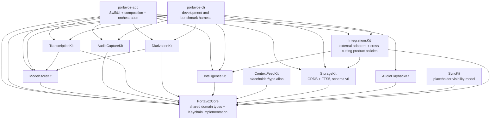
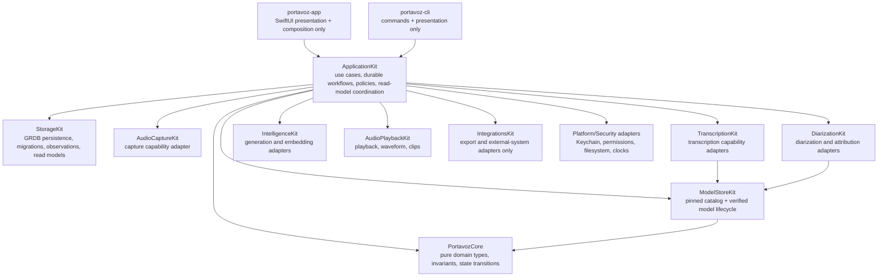
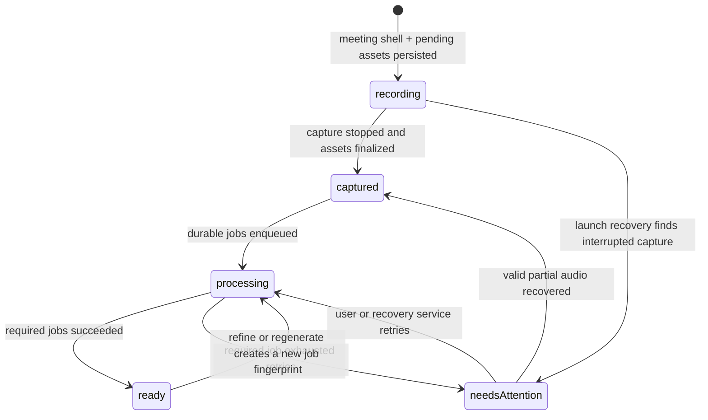

# Architecture Refactor Program — 2026-07-14

Status: **approved direction; Bands 0 and 1 complete, Band 2 in progress**

Execution branch: `codex/refactor-20260717`

Planning baseline: `main` at `f911203`

Latest released product baseline: `v0.6.0` at `4f2af25`

Current storage schema: `v6`

Current verified quality baseline: 516 package tests (13 model-gated) and 19 XCUITest cases

Owners: project maintainers and coding agents working under `AGENTS.md`

This document is the executable plan for evolving Portavoz without creating a
second product or a feature-parity gap. It combines the architecture audit,
the target design, the migration bands, the commit protocol, and measurable
acceptance criteria. It is a plan, not an as-built specification: current
behavior remains documented in `specs/`, while `ARCHITECTURE.md` must always
describe the architecture that exists at the current commit and clearly label
the target that has not landed yet.

## Product north star

Portavoz must remain the meeting assistant that knows who said what without
requiring the user's audio to leave the Mac. The refactor strengthens that
promise into four engineering invariants:

1. **Captured audio is never hidden or discarded because a derived step fails.**
2. **The transcript preserves what each person actually said and the language
   in which each segment was spoken.** Summary language is a separate policy.
3. **Every generated artifact can explain which input, engine, model, and
   configuration produced it.**
4. **Any off-device transfer is explicit, attributable, and visible to the
   user.**

The product must remain fully usable after every band and every commit. The
current release is the permanent feature baseline, not a later milestone to
rebuild.

## Why this architecture is appropriate for audio

Audio capture is irreversible: a failed query or summary can be retried, but a
lost conversation normally cannot be recreated. Portavoz also spans two
consistency domains — files on disk and metadata in SQLite — and two workloads
with opposite quality-of-service needs:

- live capture, captions, and diarization need predictable low latency;
- refine, embeddings, chapter titles, summaries, exports, and indexing are
  long-running, retryable batch work.

The target therefore keeps the existing live/batch bulkhead, makes capture a
durable state machine, and moves post-processing into idempotent jobs. It does
not introduce a server, microservices, full CQRS, or full event sourcing.

## Non-goals

- No rewrite and no temporary "new Portavoz" application.
- No removal or suspension of a released feature.
- No backend or account requirement for architecture's sake.
- No migration from GRDB to SwiftData, Realm, or another database.
- No generic `Repository<T>` abstraction over domain-specific storage APIs.
- No TCA or other state framework unless a later measured problem justifies it.
- No `sqlite-vec` until the semantic-search benchmark misses its budget.
- No XPC model host until measured crashes or memory reclamation justify it.
- No telemetry SDK that silently exports user or meeting data.

## Current architecture — verified baseline

The repository is a single SwiftPM package. It currently contains
`PortavozCore`, ten Kit libraries, the macOS app, the CLI, and the package test
target.



### Current strengths to preserve

- Dual-channel capture makes the microphone channel hardware ground truth for
  `Me` and keeps remote speakers available for diarization.
- Live and batch transcription use separate scheduler capacity.
- Capture writes crash-readable CAF files.
- Summary snapshots are immutable and versioned.
- Models and downloads are pinned and verified.
- The app is local-first, bilingual, notarized, Sparkle-updatable, and tested
  through the real application with disposable XCUITest data.

### Released feature-parity ledger

This ledger is the minimum regression contract for every band. A slice may
improve these capabilities, but it may not defer, hide, or remove one while a
new architecture path is introduced.

| Capability | Released baseline that must remain | Required regression evidence when touched |
|---|---|---|
| Capture | Microphone + meeting-app/all-system channel choices, AEC, preferred mic fallback, device-change resilience, local mic mute, live level/health warnings, floating HUD, and menu-bar control | Capture unit tests, XCUITest where reachable, and copied-audio/device smoke for hardware behavior |
| Live understanding | Dual-channel captions, fast speaker-row separation, `Me` hardware attribution, streaming diarization, optional translated captions, notes, rolling summary, and Companion cards | Scheduler/coalescer/language/diarization tests plus EN/ES UI smoke |
| Transcript truth | Refine draft/compare/apply flow, silence and boilerplate suppression, speaker attribution, mixed ES/EN preservation, vocabulary, and editable names | All-Spanish, all-English, mixed-speaker, and rapid-turn corpus tests; no source translation |
| Intelligence | Foundation Models, Ollama, embedded MLX, and BYOK summaries; Recipes/custom structures; fingerprint cache and pivot translation; RAG, briefs, titles, action items, chapters, health, and persisted Companion | Provider contract, cache, provenance/language, scheduler, and model-gated tests where applicable |
| Review and audio | Synchronized playback, transcript seek, channel waveform, skip silence, only-my-voice, clips, AAC compression, chapter navigation, and source audio access | Playback/range/export tests plus Meeting Detail XCUITest |
| Library and ownership | FTS, Insights, trash/restore/purge, audio import, Markdown backup, `.portavoz` round-trip with optional audio, configurable recording folder, and immutable summary history | Storage/migration/bundle tests and Library/Insights XCUITest |
| Identity | Voice enrollment, encrypted voiceprint, remembered-voice gallery, explicit name suggestions, forget/delete semantics, and no biometric sync | Voice-store/matcher/attribution tests and destructive-path verification |
| Automation and access | System-wide dictation, configurable/hold-to-talk hotkey, post-meeting Shortcut hook, `portavoz://record`, Spotlight, launch at login, CLI, and local MCP | Interface tests, app-bundle smoke for OS services, and CLI/MCP protocol tests |
| Integrations | Markdown/PDF, Gist, GitHub, and Linear paths with explicit egress; Keychain secrets; offline-safe failures | Exporter contract tests, egress confirmation, and token-backed smoke only with user-owned test destinations |
| Distribution and UX | English/Spanish UI, onboarding, keyboard/accessibility identifiers, notarized DMG, Sparkle, Homebrew, and separate release/dev installations | Localization tests, EN/ES XCUITest, packaging/release checks only when touched |

### Planning-baseline pressure points and current disposition

These were verified against the planning baseline. Items completed after that
baseline are marked resolved so the document never presents old debt as
current behavior:

1. `AppServices` is both composition root and business-service container.
2. `RecordingController` coordinates capture, post-processing, persistence,
   navigation, and recovery-sensitive work from the app target.
3. A global integer `libraryVersion` broadly invalidates Library, Detail,
   Insights, and Spotlight after unrelated writes.
4. **Resolved in Band 1 slices 1B–1D-b2b:** the meeting is now discoverable
   before capture, and audio survives empty captions or later derivation
   failure. Valid files publish atomically and captured assets plus live content
   install in one Unit of Work. StorageKit now owns typed idempotent jobs,
   owner leases, retries, and terminal lifecycle derivation. Process launch now
   revalidates and reconciles interrupted capture evidence and expired leases.
   Domain-specific diarization and summary Units of Work now fence stale input
   and commit artifacts, job success, and dependent enqueue atomically (D41).
   Owner-fenced cancellation preserves degradable outcomes and a live-rooted
   scheduled-wake query avoids worker polling. A process-scoped supervisor now
   resumes supported diarization/summary jobs after recovery with exact
   operation fingerprints, heartbeats, bounded retries, and one scheduled
   future wake (D42). Normal Stop now commits captured content plus the exact
   first job in one transaction, navigates immediately, kicks that worker, and
   retains transcript-only/Shortcut behavior (D43).
5. **Resolved in Band 0 slice 0A:** StorageKit record and read-model decoding
   throws typed integrity errors for malformed persisted IDs instead of
   creating or omitting identities; invalid persisted enums also fail instead
   of changing meaning.
6. **Resolved in Band 0 slice 0A:** summaries, finding inputs, participant and
   action-item totals, open actions, voice mixes, and talk balance all scope
   through live meetings; delete/restore conservation tests guard the boundary.
7. **Partially resolved in Band 1 slices 1A–1C:** schema v6 contains the
   complete `audioAsset` row shape and constraints, and new recordings reserve
   typed staging assets before capture. Published assets carry finalized
   checksum/media/health metadata. `meeting.audioDirectory` remains the product
   read path and asset-reader parity remains; the migration deliberately
   performs no filesystem backfill.
8. Segment embeddings live on the hot `segment` row and are loaded by broad
   segment fetches even when semantic search is not needed.
9. **Resolved in Band 0 slice 0B:** transcript recognition and summary output
   use independent typed policies, and recording, rolling summary, import, and
   regeneration share one summary-language resolver.
10. Generated artifacts do not have a shared provider/model/input provenance
    envelope.
11. `IntegrationsKit` contains both outbound adapters and pure product/read
    policies, making the boundary broader than its name.
12. The shipped app has Hardened Runtime and notarization but is not currently
    App Sandbox-enabled. Any public security statement must reflect that fact.

## Target architecture

Portavoz remains a modular local monolith. One application layer is added;
existing capability Kits remain focused adapters behind domain-oriented
protocols.



### `PortavozCore`

Owns pure, portable concepts and invariants:

- typed identifiers and domain entities;
- language policies and artifact types;
- meeting and processing states;
- error categories and capability descriptors;
- pure policies such as chapter extraction, voice colors, summary-section
  parsing, reminder policy, and playback-range calculations;
- protocols for clocks, UUID generation, filesystem capabilities, secrets,
  and external egress where those protocols are truly domain-facing.

It must not import SwiftUI, AppKit, GRDB, Security, or networking frameworks.
The current concrete `SecretStore` moves to a platform/security adapter while
the protocol and secret identifiers remain in Core.

### `ApplicationKit`

Owns workflows that currently span multiple Kits:

- `StartRecording`
- `StopRecording`
- `RecoverInterruptedMeetings`
- `RefineMeeting`
- `ImportMeeting`
- `RegenerateSummary`
- `ExportMeeting`
- `DeleteMeeting` and `RestoreMeeting`
- library, meeting-detail, Insights, and processing-status read models

ApplicationKit coordinates capabilities; it does not contain SwiftUI views,
AppKit windows, SQL strings, model-specific APIs, or localized presentation
copy.

### `portavoz-app`

Owns only:

- dependency composition;
- navigation and windows;
- feature-scoped `@MainActor @Observable` models;
- rendering and localized presentation;
- conversion of application results into user-visible state.

`AppServices` becomes a composition root. Feature models expose immutable
state snapshots and enum actions — a reducer-light unidirectional flow without
introducing a state-management dependency.

Suggested feature boundaries:

```text
Features/
  Library/
    LibraryModel.swift
    LibraryView.swift
  Recording/
    RecordingModel.swift
    RecordingView.swift
  MeetingDetail/
    MeetingDetailModel.swift
    SummaryPane.swift
    TranscriptPane.swift
    MeetingRightRail.swift
    PlayerDock.swift
    ProcessingStatusView.swift
  Insights/
  Settings/
```

### `StorageKit`

Owns GRDB records, migrations, domain conversions, transactions, scoped
`ValueObservation`s, query-specific read models, and integrity verification.
It must never invent domain identity while decoding corrupt data.

Use `DatabasePool` only if measured read contention demonstrates a benefit.
The first step is replacing global invalidation with scoped observations.

### `IntegrationsKit`

Owns only outbound adapters and formats:

- Markdown/PDF/bundle exporters;
- GitHub, Gist, Linear, and future Jira clients;
- MCP transport and protocol surface;
- Calendar, Spotlight, Shortcuts, App Intents, and sync-facing adapters.

Pure policies and read calculations move to Core or ApplicationKit. The target
does not create a generic "utilities" Kit.

### Placeholder Kits

`ContextFeedKit` and `SyncKit` are currently placeholder-scale. During the
migration, either give them a real bounded responsibility or remove the target
until its capability exists. Do not keep empty architectural promises solely
to preserve a diagram; preserve public package API only if an external consumer
is verified.

## Business patterns and their concrete use

| Business situation | Pattern | Portavoz application |
|---|---|---|
| A recording must survive interruption | Durable state machine | Persist the meeting shell before capture and advance only through valid states. |
| SQLite and audio files cannot share one transaction | Saga / process manager | Reconcile `.partial` files, checksums, DB state, and retries on launch. |
| Initial meeting/cast/transcript/job writes must agree | Unit of Work | One StorageKit transaction installs the captured snapshot and exact first job. |
| Refine and summary can fail or repeat | Durable job queue + idempotency | One job per meeting, kind, and input fingerprint. |
| Spotlight, sync, and hooks must not block saving | Transactional outbox | Persist an event with the state change and deliver it asynchronously. |
| Live captions must not wait for batch work | Bulkhead | Preserve separate live and batch scheduler capacity. |
| Engines and Apple APIs evolve | Strategy + adapter + anti-corruption layer | Stable application protocols isolate WhisperKit, FluidAudio, MLX, and OS APIs. |
| Generated text must be trustworthy | Provenance envelope | Record provider, model, revision, input fingerprint, language, timings, and outcome. |
| UI changes should be local | Unidirectional feature state | Feature model receives actions and publishes one scoped state. |
| Views need efficient specialized data | CQRS-lite read models | Query-specific projections and observations; no full CQRS infrastructure. |
| Permissions/models differ by Mac | Capability matrix | Typed available, downloadable, unsupported, and permission-missing states. |
| Network use must respect privacy | Policy enforcement point | `DataEgressGateway` is the only route for meeting data leaving the process. |
| Repeated people need stable identity | Canonical person + aliases | Link per-meeting speakers to an optional local person without unsafe auto-merge. |
| Waveforms and chapters are deterministic | Content-addressable cache | Cache by audio SHA-256 and algorithm version. |

## Durable meeting lifecycle

The meeting aggregate becomes discoverable before capture starts. Derived work
never determines whether captured audio is visible.



Processing status belongs primarily to jobs. A meeting in `needsAttention`
remains openable and its audio remains exportable.

### Start recording

1. Validate capabilities and permissions.
2. Persist a meeting shell in `recording` state.
3. Reserve `AudioAsset` rows with `.partial` relative paths.
4. Start capture sources transactionally.
5. Stream chunks to crash-readable files and live engines.

Slices 1B and 1C implement steps 2–5. The current staging convention is
`<channel>.partial.caf`: CAF remains the terminal extension required by
`AVAudioFile`, while product readers discover only `<channel>.caf` after
validated publication.

### Stop recording

1. ✅ Stop sources and flush writers.
2. ✅ Inspect real files and record duration, size, channel health, and checksum.
3. ✅ Atomically publish valid files from staging to final names without overwrite.
4. ✅ Install the captured meeting, provisional cast/live segments, notes, and
   Companion cards through one database Unit of Work; final diarization uses
   atomic cast replacement.
5. Enqueue idempotent refine/diarization/summary/index jobs.
6. Navigate immediately to the captured meeting.

### Recovery

Slice 1D-b1 implements the process-launch reconciliation half (D40). It first
recovers expired leases, then scans non-ready meetings and pending assets in
both the configured recordings root and the default fallback. Staging-only
CAFs are fully remeasured from persisted PCM and published; final-only CAFs are
fully revalidated; no candidate becomes explicit missing evidence. Staging
plus final or duplicate-root candidates are preserved as
`capture.recovery.ambiguous` without overwrite, deletion, or guessing. Hashing
and signal measurement run off the main actor, and the StorageKit transition
is repeat-safe and protects already-ready meetings. The pass invokes no ML and
defers while live capture is active.

Slice 1D-b2a provides stale-safe atomic diarization/summary artifact completion
(D41). The first 1D-b2b control-plane unit adds owner-fenced cancellation and
capability-filtered scheduled-wake discovery. The second adds the concrete
process-scoped supervisor/executor (D42): launch starts it only after recovery,
claims only supported jobs, recomputes exact inputs, heartbeats leases, retries
bounded transient failures, atomically chains diarization to summary, and uses
one durable future wake instead of polling. The final 1D-b2b unit (D43) makes
normal Stop atomically install captured content plus the exact first job,
navigate immediately, and kick that executor. Terminal processing preserves
the configured Shortcut, including transcript-only completion; disposable
stores suppress host side effects. Every recovery path remains safe to run
repeatedly and may resume work or mark a meeting `needsAttention`; it may never
silently delete usable audio.

## Target storage evolution

Schema v6 landed in Band 1 slice 1A as one additive migration. Destructive
cleanup remains forbidden until the new read paths have shipped and migration
fixtures are green.

### Schema v6 — implemented durability, policy, and provenance foundation

The tables and columns below are as-built. Existing meetings migrate to
`ready`, transcript revision zero, and no processing error. New workflow rows
start empty: the migration never inspects audio files, and runtime adoption is
split across later Strangler slices (D36). SQL constraints enforce lifecycle,
job/outbox states, relative asset paths, bounded progress, idempotent job keys,
and valid fixed-versus-automatic language pairs.

#### `meeting` additions

```text
lifecycleState       recording | captured | processing | ready | needsAttention
transcriptRevision   integer
lastProcessingError  nullable text/code
```

#### `audioAsset`

```text
id, meetingID, channel, role, relativePath,
container, codec, sampleRate, channelCount,
durationSeconds, byteCount, sha256,
healthStatus, peakDBFS, rmsDBFS,
sourceAssetID, createdAt, updatedAt, supersededAt, deletedAt
```

#### `processingJob`

```text
id, meetingID, kind, inputFingerprint,
state, priority, progress, attempt, maxAttempts,
notBefore, leaseOwner, leaseExpiresAt,
errorCode, errorMessage,
createdAt, startedAt, finishedAt, updatedAt

UNIQUE(meetingID, kind, inputFingerprint)
```

#### `generationRun`

```text
id, meetingID, kind,
providerID, modelID, modelRevision,
inputFingerprint, configJSON, outputLanguage,
startedAt, finishedAt, outcome, metricsJSON
```

`summary`, refined `segment`, `companionCard`, and future `chapter` rows gain a
nullable `generationRunID`.

#### `outboxEvent`

```text
id, aggregateID, kind, idempotencyKey,
payloadJSON, state, attempts, nextAttemptAt,
createdAt, deliveredAt
```

#### `meetingPreference`

```text
meetingID,
transcriptLanguageMode, transcriptLanguage,
summaryLanguageMode, summaryLanguage,
recipeID, summaryEngineID, refineEngineID,
updatedAt
```

### Schema v7 — scale, identity, and evidence

#### `segmentEmbedding`

```text
segmentID PRIMARY KEY, modelID, dimensions, vector, updatedAt
```

Move the vector out of the hot segment row after compatibility and migration
tests prove that old embeddings survive.

#### People

```text
person(id, preferredName, createdAt, updatedAt, deletedAt)
personAlias(id, personID, normalizedAlias, source, confidence)
speaker.personID NULLABLE
```

Voiceprints remain encrypted local files and reference a person identifier;
they never enter SQLite as plaintext and never sync.

#### Chapters and evidence

```text
chapter(id, meetingID, startTime, endTime, title, generationRunID, createdAt)
evidenceLink(sourceKind, sourceID, segmentID, rank, confidence)
```

Do not replace typed entities with a generic EAV artifact table.
`generationRun` is the common envelope; hot product entities remain typed.

### Candidate indexes

Confirm every candidate with `EXPLAIN QUERY PLAN` and write benchmarks:

```text
meeting(deletedAt, startedAt DESC)
segment(meetingID, startTime) WHERE deletedAt IS NULL
speaker(meetingID) WHERE deletedAt IS NULL
summary(meetingID, recipeID, version DESC) WHERE deletedAt IS NULL
actionItem(meetingID, isDone) WHERE deletedAt IS NULL
processingJob(state, notBefore, priority)
outboxEvent(state, nextAttemptAt)
```

## Language architecture

Transcript truth and generated-output language are separate policies.

The following policy values are implemented in `PortavozCore`:

```swift
struct LanguageCode: Codable, Hashable, Sendable

enum TranscriptLanguagePolicy: Codable, Equatable, Sendable {
    case automatic
    case fixed(LanguageCode)
}

enum SummaryLanguagePolicy: Codable, Equatable, Sendable {
    case followSpokenLanguage
    case fixed(LanguageCode)
}
```

Rules:

- `automatic` is the transcript default; mixed-language evidence produces no
  single Whisper hint.
- Refine may improve recognition but must not translate the transcript.
- Mixed meetings may contain Spanish and English segments from different
  speakers or from the same speaker.
- Summary generation uses an independently persisted global policy: follow
  homogeneous speech or fixed English/Spanish. Follow-spoken mode falls back
  to the selected app locale for mixed/unknown meetings.
- Recording, rolling summary, import, and regeneration use the same app
  adapter. An explicit per-meeting regeneration language is persisted by its
  immutable summary snapshot; a fixed refine language is an explicit recovery
  operation.
- Schema v6 now provides the durable `meetingPreference` row shape. Current
  app flows still use the global policy adapter; per-meeting row adoption is a
  later Band 1 slice. Band 0 itself deliberately left schema v5 unchanged.
- Every language transformation is represented as a new artifact; it never
  overwrites the source transcript.

## Privacy and egress

Introduce `DataEgressGateway` as the policy enforcement point for operations
that can send meeting-derived data away from the Mac. Each request carries:

```text
operation
destination
dataClassification
meetingID (when applicable)
consentSource
provider disclosure
```

Model downloads and update checks are metadata/network operations, not meeting
content, and must be classified separately. GitHub, Gist, Linear, BYOK, future
sync, and user-requested exports route through the gateway where applicable.
Ollama on localhost remains distinguishable from a remote provider.

A per-meeting privacy receipt can then state what left the device, when, why,
and under which user action.

App Sandbox is not an automatic Band 0 toggle. Run a capability spike covering
process taps, global hotkeys, Accessibility paste, custom recording folders,
Sparkle, model downloads, CLI/shared DB access, and integrations. Then either
adopt App Sandbox with a supported design or retain the notarized non-sandboxed
distribution with accurate public documentation and a hardened threat model.

## Error model

Replace unclassified best-effort failure with explicit categories:

| Category | Example | Required behavior |
|---|---|---|
| critical | captured audio cannot be finalized | Preserve partial files, surface `needsAttention`, provide recovery/export. |
| recoverable | refine engine failed | Persist failure, retry with policy, keep live transcript. |
| degradable | chapter title generation failed | Use deterministic excerpt fallback and record degraded provenance. |
| external | GitHub/Linear/Shortcut failed | Meeting remains saved; outbox records retry or visible failure. |
| destructive | purge or migration | Require validation, backup where applicable, and explicit confirmation. |

`try?` is acceptable only when the error is intentionally degradable and the
fallback is documented or observable. It is not acceptable around critical or
destructive operations.

## Scoped observation and UI state

Replace the global `libraryVersion` signal with query-specific GRDB
observations:

- active library rows and voice mix;
- deleted meetings;
- one meeting's detail;
- processing jobs for one meeting;
- action-item counts;
- Insights projections;
- incremental Spotlight outbox state.

Each feature model owns its loading, loaded, empty, degraded, and failed states.
Views do not call multiple Kits directly and do not infer business state from
the presence of unrelated UI data.

## Performance and observability budgets

Add `OSSignposter` intervals before claiming improvements:

- capture start;
- first audio chunk;
- first caption;
- stop and file flush;
- captured meeting visible;
- refine, diarization, summary, waveform, and detail first content.

Use Time Profiler, SwiftUI update causes, hangs/hitches, allocations, and energy
instruments. MetricKit diagnostics stay local by default and are exported only
through explicit user action or opt-in.

| Metric | Target |
|---|---:|
| Stop → captured meeting shell visible | p95 < 250 ms |
| Stop → existing live transcript visible | p95 < 1 s |
| Main-thread work for direct interaction | < 100 ms |
| Detail first content, 2 h / 5k segments | p95 < 300 ms |
| Waveform cache hit | < 50 ms |
| FTS | p95 < 50 ms |
| Semantic search, 100k segments | p95 < 100 ms |
| Audio loss under lifecycle fault injection | 0 |

Benchmark library sizes of 1k, 10k, 50k, and 100k segments; meeting lengths
of 30 minutes, 2 hours, and 8 hours; and low-memory conditions. Preserve the
existing measured live-latency, drift, DER, summary, startup, and memory
baselines unless a deliberately accepted trade-off is documented.

## Test architecture

### Architecture tests

Add automated rules for:

- the app depending on ApplicationKit instead of coordinating SQL or engines;
- PortavozCore importing no UI, database, Security, or networking framework;
- only the egress boundary creating meeting-content network requests;
- no random UUID fallback while decoding persisted identity;
- IntegrationsKit containing adapters, not product policy;
- documentation under `docs/` using English explanatory prose.

### Durable workflow tests

Exercise model-based sequences:

```text
start → capture → kill → relaunch → recover → stop
stop → refine fails → retry → summary succeeds
ready → refine → kill → resume
delete → verify every read model → restore → verify every read model
```

Invariants:

- captured audio is always discoverable;
- the same job fingerprint cannot duplicate artifacts;
- restore returns every affected read model;
- no summary references a missing transcript revision;
- no generated translation replaces the original segment.

### Storage and migration tests

- fixtures from every schema version to latest;
- malformed UUID, invalid relative path, missing file, and checksum mismatch;
- interrupted migration and recovery;
- live/trash filtering for every aggregate query;
- old `.portavoz` bundle compatibility;
- backup and restore around the first durability migration.

### Language and audio quality corpus

Maintain versioned synthetic and permitted real-copy fixtures for:

- all-Spanish, all-English, and mixed-speaker meetings;
- within-speaker language changes;
- rapid consecutive remote speakers;
- silence, punctuation-only deltas, and repeated Whisper boilerplate;
- domain vocabulary and names;
- device changes, missing channels, and low microphone levels.

## Migration bands

Bands are ordered by risk reduction. Each band is independently shippable and
must finish with feature parity or better.

### Band 0 — Integrity and truth

Estimated effort: 1–3 engineering days.

Current execution status: complete in slices 0A and 0B. All five scopes and
their package, lint, documentation, and EN/ES UI gates are green.

Scope:

1. Replace random UUID decoding fallbacks with strict conversion and typed
   integrity errors or diagnosed row omission.
2. Scope every cross-library aggregate through live meetings; add delete and
   restore regression tests.
3. Introduce typed, independent transcript and summary language policies; keep
   one persisted global default per policy and preserve explicit per-meeting
   output choices in immutable artifacts without a premature schema change.
4. Correct source-of-truth contradictions and establish English-only docs.
5. Add initial architecture/documentation guards.

Acceptance status:

- ✅ zero persisted-identity paths use `?? UUID()`;
- ✅ trash has no effect on live Insights, participant, summary, finding, or
  action-item counts;
- ✅ restore returns exactly the previous projections;
- ✅ mixed ES/EN evidence leaves the refine hint automatic, while an explicit
  fixed recovery policy remains available;
- ✅ summary language follows one configured policy across recording, rolling
  summary, import, and regeneration without mutating transcript language;
- ✅ all Band 0 validation is green: build, 413 package tests (13 gated),
  SwiftLint, documentation checks, and the 15-test XCUITest suite in English
  and Spanish.

Primary documentation in the same commits:

- `ARCHITECTURE.md`
- `DECISIONS.md` if policy details become binding
- `ROADMAP.md`
- `specs/02-transcription.md`
- `specs/05-storage.md`
- `specs/08-quality.md`
- `GAPS.md`
- README and CHANGELOG only if user-visible behavior changes

### Band 1 — Indestructible recording

Estimated effort: 5–8 engineering days.

Scope:

1. ✅ Add schema v6 durability tables/columns with migration fixtures.
   This includes durable `meetingPreference` rows for per-meeting transcript,
   summary, recipe, and engine defaults.
2. ✅ Persist the meeting shell and pending assets before capture. Slice 1B
   also rolls back a no-byte/no-content provisional shell and preserves any
   written channel as `needsAttention` (D37).
3. ✅ Finalize files atomically and install captured state through one Unit of
   Work. Slice 1C validates/hashes/measures staged CAFs, publishes without
   overwrite, and commits assets plus provisional live content together (D38).
4. ✅ Add idempotent processing jobs and launch recovery. Slice 1D-a owns
   strict typed job records, atomic immutable-key enqueue, capable-worker
   priority claims, owner-bound leases, monotonic heartbeat progress,
   scheduled retries, terminal lifecycle derivation, and repeat-safe expired-
   lease recovery (D39). Slice 1D-b1 now owns process-launch reconciliation of
   interrupted `recording`/`processing` meetings and staging/final evidence,
   including conservative ambiguity handling (D40). Slice 1D-b2a adds
   domain-specific diarization and summary completion Units of Work: each
   verifies the owned lease, operation fingerprint, live ownership, and source
   transcript revision, then commits the artifact, job success, and optional
   dependent enqueue atomically (D41). The first 1D-b2b control-plane unit adds
   owner-fenced terminal cancellation for degradable/superseded work and
   capability-filtered scheduled-wake discovery. The second 1D-b2b unit adds a
   process-scoped serial executor with exact operation fingerprints,
   heartbeat/retry ownership, stale cancellation, atomic diarization-to-summary
   chaining, optional-summary degradation, and one non-polling wake (D42). The
   final 1D-b2b unit atomically commits the captured snapshot and initial exact
   job, then kicks that executor with Shortcut parity (D43).
5. ✅ Navigate immediately to a progressive processing detail state.
6. ✅ Preserve export/playback access when derived processing fails.

Acceptance:

- forced termination at every lifecycle boundary loses no valid audio;
- audio without captions is visible, playable, and exportable;
- retries do not duplicate speakers, segments, snapshots, cards, or chapters;
- Stop → meeting shell meets the p95 budget;
- a copied real v5 database migrates successfully in scratch;
- the release app and its live data are never touched during validation.

### Band 2 — Application layer and scoped state

Estimated effort: 4–7 engineering days.

Scope:

1. ✅ Add `ApplicationKit` and enforce its dependency direction. Slice 2A
   starts Core-only, links app/CLI/tests, and adds five manifest/import rules
   without changing runtime behavior (D44).
2. ✅ Extract `DeleteMeeting` and `RestoreMeeting` as the first vertical slice.
   Slice 2B adds only StorageKit, uses a narrow persistence port, adopts all
   three app paths, and adds bypass plus aggregate-conservation tests (D44).
3. ✅ Complete trash mutation extraction. Slice 2C adds manual and expired
   purge use cases over separate storage/filesystem ports, preserves degradable
   audio cleanup and strict 30-day semantics, and adopts both app paths (D44).
4. 🔄 Extract recording, stop, recovery, refine, import, and regeneration use
   cases one at a time. Slice 2D completes Meeting Detail regeneration through
   storage/preferences/provider ports with override, cache, pivot, and error
   parity; slice 2E closes T16 with recipe-scoped reuse and newest-snapshot
   display without mutable-history loss. Slice 2F moves import through typed
   file/preferences/processor/store/summary ports, keeps large copies off the
   main actor, and makes staged-file rollback plus aggregate persistence
   explicit. Slice 2G moves refine draft generation and accepted apply behind
   typed ports, adds explicit cancellation and run-identity fencing, and
   commits language/cast/transcript/revision atomically behind the draft's
   source revision while keeping summaries immutable and Companion degradable.
   Slice 2H moves `StopRecording` evidence reconciliation, attribution/language,
   no-audio/needs-attention policy, exact first-job admission, worker kick, and
   engine release behind typed filesystem/store/lifecycle ports; the controller
   keeps platform session teardown and presentation mapping. `StartRecording`
   is the next bounded workflow (D44–D48).
5. Reduce `AppServices` to dependency composition.
6. Introduce feature models through the Strangler pattern.
7. Replace `libraryVersion` with scoped observations.
8. Move pure product policies out of IntegrationsKit.
9. Decide whether placeholder Kits gain a boundary or are removed.

Acceptance:

- current app and CLI features remain available;
- an action-item update does not reload transcript, waveform, and unrelated
  library/Insights state;
- views do not coordinate several capability Kits directly;
- app and CLI share applicable use cases;
- dependency rules are enforced by tests.

### Band 3 — Provenance, privacy, and diagnostics

Estimated effort: 4–6 engineering days.

Scope:

1. Add generation-run provenance and link generated artifacts.
2. Route external operations through `DataEgressGateway`.
3. Add the local privacy receipt.
4. Introduce the error taxonomy, signposts, and local diagnostics export.
5. Run and document the App Sandbox capability spike.

Acceptance:

- every new generated artifact identifies its input fingerprint, engine,
  model/revision, language, outcome, and timing;
- the user can determine whether meeting content left the device;
- critical/destructive failures cannot disappear behind `try?`;
- diagnostics redact meeting content by default.

### Band 4 — Detail decomposition and measured scale

Estimated effort: 5–8 engineering days.

Scope:

1. Split Meeting Detail into feature model and focused panes.
2. Make the right rail and summary structures adaptive.
3. Add waveform/chapter caches keyed by content and algorithm version.
4. Make Spotlight incremental through the outbox.
5. Move embeddings out of hot segment rows if benchmarks support the v7 step.
6. Run the long-meeting and large-library performance matrix.

Acceptance:

- performance budgets are measured and met or a trade-off is explicitly
  accepted in DECISIONS;
- SwiftUI update profiling shows no broad invalidation for local edits;
- light, dark, high contrast, Reduce Motion, VoiceOver, and keyboard coverage
  are verified;
- EN/ES XCUITest remains green.

### Band 5 — Evidence and human memory

Estimated effort: 1–2 engineering weeks.

Scope:

1. Add canonical people and aliases without unsafe automatic merging.
2. Add typed evidence links for summaries, decisions, action items, and
   Companion cards.
3. Introduce evidence navigation to transcript and audio.
4. Add local feedback for corrections and unsupported claims.
5. Build optional post-meeting aftercare and commitment views on evidence.

Acceptance:

- generated claims can jump to supporting transcript/audio;
- identity merges require user confirmation when ambiguous;
- feedback remains local and exportable;
- no engagement mechanic uses guilt, artificial urgency, or hidden tracking.

### Band 6 — Platform expansion only when ready

- CKSyncEngine and iOS build on the durable journal/tombstone model.
- XPC isolation is added only after measured justification.
- A local memory graph follows people and evidence; it does not precede them.

## Commit and documentation protocol

Every refactor commit is a complete, reviewable slice. Do not accumulate a
whole band into one opaque commit.

### Before editing

1. Re-read `ROADMAP.md`, `ARCHITECTURE.md`, this document, and the matching
   as-built spec.
2. Verify the live branch, commit, package graph, schema version, and tests;
   never copy a status claim from this dated plan without re-checking it.
3. Record the feature behavior being preserved and add characterization tests
   before moving it when coverage is missing.
4. Identify the rollback boundary and any database compatibility consequence.

### During the slice

1. Add the new path behind the existing contract.
2. Keep the old path until parity is proven.
3. Prefer additive schema and API changes.
4. Make retries and repeated launches safe.
5. Do not mix unrelated feature development into an architecture slice.

### Documentation required in the same commit

`docs/ARCHITECTURE.md` is updated in **every refactor commit**. It must record
the actual dependency graph and migration status at that commit, not merely
repeat the final target. Also update every document whose truth changed:

| Change | Required documentation |
|---|---|
| Module/dependency/workflow boundary | `ARCHITECTURE.md`, this plan's band status, and `DECISIONS.md` when binding |
| Implemented runtime behavior | matching `specs/*.md` |
| Project state or next action | `ROADMAP.md` |
| Remaining limitation or field validation | `GAPS.md` |
| Product promise, installation, public workflow | `README.md` and possibly `PRODUCT.md` |
| User-visible feature or fix | `CHANGELOG.md`, newest first under the current date |
| Internal refactor/docs/tests only | **no CHANGELOG entry**; do not misrepresent plumbing as a user feature |
| Packaging or release process | `RELEASING.md` and relevant scripts/comments |
| iOS/platform constraint | `IOS.md` |

All explanatory content under `docs/` is written in English. Literal localized
UI copy, bilingual transcript examples, and language-quality fixtures may be
quoted when they are evidence and clearly remain literals.

### Validation before commit

Minimum:

```sh
git diff --check
swift build
DEVELOPER_DIR=/Applications/Xcode.app/Contents/Developer swift test
swiftlint lint --strict
```

For UI changes:

```sh
make test-ui
make test-ui-en
make test-ui-es
make install
```

For capture, device, model, or performance changes, run the relevant real
harness and record the measured result in the matching spec. XCUITest remains
the default UI verification method; real-device/audio smoke is additional
evidence where automation cannot simulate the capability.

### Commit acceptance checklist

- [ ] Every released feature remains available.
- [ ] New and old paths have equivalent behavior before old code is removed.
- [ ] Failure and retry behavior are tested.
- [ ] Database migration/rollback implications are explicit.
- [ ] `ARCHITECTURE.md` describes this commit accurately.
- [ ] Matching specs and roadmap/gaps are synchronized.
- [ ] English-only documentation check is green.
- [ ] CHANGELOG was updated only if the user receives a visible benefit.
- [ ] No real release database or recording was modified during testing.

## Status table

Update this table in the commit that changes a band's state. A band is not
complete while required documentation or acceptance evidence is missing.

| Band | State | Evidence | Next slice |
|---|---|---|---|
| Band 0 — Integrity and truth | Complete — slices 0A and 0B | Typed `StorageError` decoding, zero random UUID fallbacks, live-meeting joins, delete/restore conservation, and D35 independent language policies retained by the 516-test package suite | None; preserve these invariants in every later band |
| Band 1 — Indestructible recording | Complete — slices 1A, 1B, 1C, 1D-a, 1D-b1, 1D-b2a, and 1D-b2b | Additive v6 migration; real-v5 scratch migration; atomic pending reservations; D37 guarded rollback; staged CAF validation, SHA-256, media/level/health metadata, no-overwrite rename; captured/recovery Units of Work; typed immutable-key jobs with owner leases/retries/lifecycle derivation plus degradable cancellation and scheduled wake discovery (D39); evidence-first launch reconciliation across audio roots and expired leases (D40); stale-safe atomic diarization/summary artifact completion (D41); process-scoped exact heartbeat/retry execution with optional-summary degradation and no polling (D42); atomic snapshot/initial-job handoff, immediate detail navigation, and Shortcut parity (D43); `recording → captured → processing → ready/needsAttention`; 449-test Band 1 baseline retained by the current 516-test package suite | None; preserve the durability contract while extracting Band 2 use cases |
| Band 2 — Application layer | In progress — slices 2A, 2B, 2C, 2D, 2E, 2F, 2G, and 2H | ApplicationKit contract/rules; StorageKit, IntelligenceKit, TranscriptionKit, and DiarizationKit ratchets; all trash workflows, Meeting Detail regeneration, external-audio import, reviewable refine draft/apply, and durable Stop policy adopted; recipe-scoped immutable summaries; typed storage/filesystem/preferences/provider/processor/progress/lifecycle ports; staged import rollback; explicit refine cancellation; revision-fenced acceptance; capture evidence reconciliation; audio-first Stop fallbacks; atomic captured snapshot/job admission; worker kick and engine release; private app adapters; bypass, failure-policy, expiry, reuse/pivot, history, conservation, language, release, cancellation, stale-write, rollback, and real-adapter coverage (D44–D48) | Extract `StartRecording` with atomic reservation, engine preparation, source-start rollback, live scheduler isolation, and presentation parity |
| Band 3 — Provenance/privacy | Not started | Target schema and egress boundary defined | Wait for stable ApplicationKit use cases |
| Band 4 — Detail/performance | Not started | Existing benchmarks in spec 08 | Profile after scoped observations land |
| Band 5 — Evidence/people | Not started | Product concept defined | Wait for provenance and v7 data boundary |
| Band 6 — Platform expansion | Deferred | D11/D12 and `IOS.md` | Reassess after Bands 0–3 |

## Decision gates

The following require measured evidence or an explicit binding decision before
implementation:

1. App Sandbox adoption versus accurate non-sandboxed threat model.
2. `DatabasePool` versus the current database queue.
3. `sqlite-vec` versus brute-force vectors.
4. XPC model isolation versus in-process engines.
5. Keeping or removing placeholder Kits.
6. **Resolved by D36:** `AudioAsset`, jobs, provenance links, outbox, lifecycle,
   and meeting preferences ship atomically in one additive v6 migration;
   behavioral adoption remains sliced.
7. Sync conflict semantics beyond existing immutable snapshots and tombstones.

## Success definition

The refactor is successful when Portavoz retains every released capability and
the following statements are demonstrably true:

- a successful capture is always visible even if every AI step fails;
- stopping and reopening the app at any pipeline boundary is safe;
- transcript language remains faithful per segment;
- generated results are attributable and evidence-linked;
- external data movement is explicit;
- UI updates and storage reads are scoped;
- architecture dependencies are enforced by tests;
- every commit leaves code, tests, architecture, specs, roadmap, and public
  documentation describing the same product.
