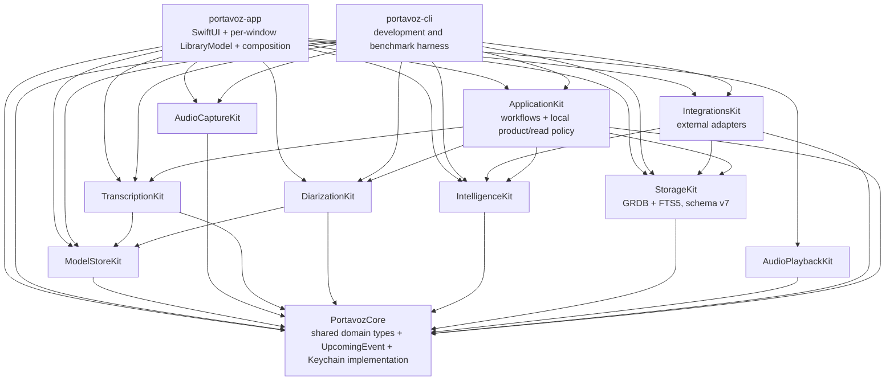
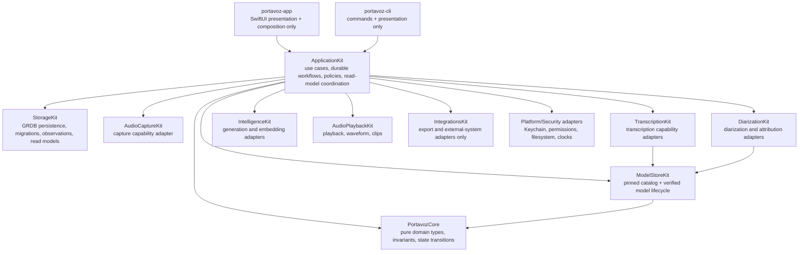
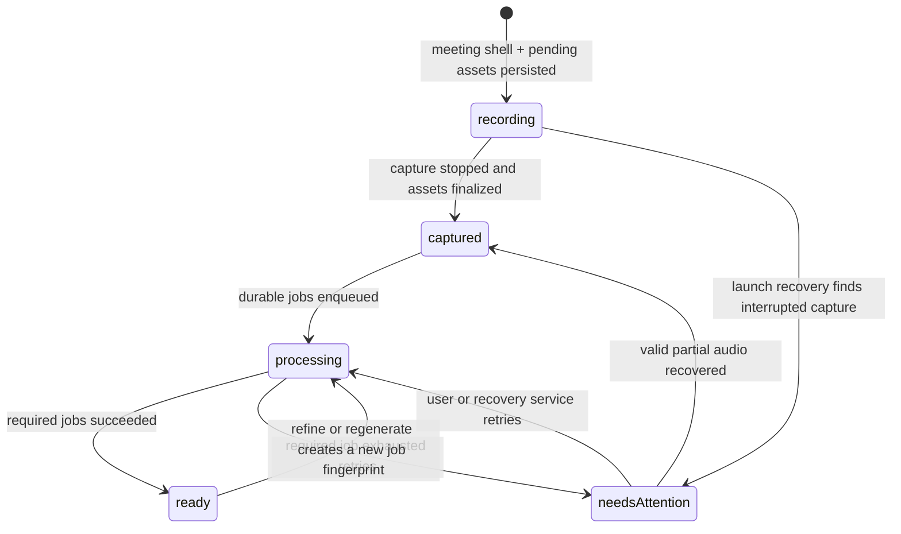

# Architecture Refactor Program — 2026-07-14

Status: **approved direction; Bands 0–4 complete; slices 3A–3K and Sequoia stabilization units 1–6 complete; Band 4A measured baseline, 4B health optimization, 4C bounded lexical retrieval, 4D semantic-scale measurement, 4E semantic adapter optimization, 4F stateless waveform optimization, and 4G protected Spotlight reconciliation complete; Band 5A canonical people and aliases is next**

Execution branch: `codex/refactor-20260717`

Planning baseline: `main` at `f911203`

Latest released product baseline: `v0.6.0` at `4f2af25`

Current storage schema: `v7`

Current verified quality baseline: 683 package tests (13 model-gated), zero
strict-lint violations across 254 Swift source files, and 25 XCUITest cases
passing in both English and Spanish

Owners: project maintainers and coding agents working under `AGENTS.md`

## Jul 16 Sequoia stabilization interrupt

Before slice 3H, field feedback was resolved as independently shippable
units without weakening the band contracts:

1. Stop compares recording reservations at SQLite's canonical millisecond
   precision, preserving every stronger ownership/path/channel fence.
2. Capture starts before Parakeet/diarization readiness; missing or failed live
   lanes become exact durable first-pass transcription from finalized audio
   (D70).
3. Settings proactively prepares Whisper Turbo/Compact through one app-scoped
   verified task. Refine/Import join it, and an opaque completed token survives
   without pinning the heavyweight runtime (D71).
4. Summary and Companion consume one explicit Foundation Models capability.
   Clean-install defaults use a feasible local path, selected engines never
   fall through silently, typed failures open exact setup, and Companion does
   not expose an impossible Sequoia toggle (D72).
5. Speech-model readiness is role-specific and independently deduplicated.
   Refine requires Whisper, then loads only degradable pyannote attribution;
   Import loads only its diarizer; durable first-pass recovery and Dictation
   load only Parakeet. No offline quality path acquires the live engine as an
   incidental prerequisite (D73).
6. Distribution notarizes and staples the signed app before packaging, then
   notarizes and staples the DMG. The release gate independently extracts and
   assesses the inner app, and CI runs the package suite on Sequoia (D74).

The stabilization interrupt is complete. Slices 3H–3J then completed the
privacy/recovery verticals, and slice 3K closed the App Sandbox decision gate
with signed sandbox/control evidence plus D78.

This document is the executable plan for evolving Portavoz without creating a
second product or a feature-parity gap. It combines the architecture audit,
the target design, the migration bands, the commit protocol, and measurable
acceptance criteria. It is a plan, not an as-built specification: current
behavior remains documented in `specs/`, while `ARCHITECTURE.md` must always
describe the architecture that exists at the current commit and clearly label
the target that has not landed yet.

## Product north star

Portavoz must remain the meeting assistant that knows who said what without
requiring the user's audio to leave the Mac. The refactor strengthens that
promise into four engineering invariants:

1. **Captured audio is never hidden or discarded because a derived step fails.**
2. **The transcript preserves what each person actually said and the language
   in which each segment was spoken.** Summary language is a separate policy.
3. **Every generated artifact can explain which input, engine, model, and
   configuration produced it.**
4. **Any off-device transfer is explicit, attributable, and visible to the
   user.**

The product must remain fully usable after every band and every commit. The
current release is the permanent feature baseline, not a later milestone to
rebuild.

## Why this architecture is appropriate for audio

Audio capture is irreversible: a failed query or summary can be retried, but a
lost conversation normally cannot be recreated. Portavoz also spans two
consistency domains — files on disk and metadata in SQLite — and two workloads
with opposite quality-of-service needs:

- live capture, captions, and diarization need predictable low latency;
- refine, embeddings, chapter titles, summaries, exports, and indexing are
  long-running, retryable batch work.

The target therefore keeps the existing live/batch bulkhead, makes capture a
durable state machine, and moves post-processing into idempotent jobs. It does
not introduce a server, microservices, full CQRS, or full event sourcing.

## Non-goals

- No rewrite and no temporary "new Portavoz" application.
- No removal or suspension of a released feature.
- No backend or account requirement for architecture's sake.
- No migration from GRDB to SwiftData, Realm, or another database.
- No generic `Repository<T>` abstraction over domain-specific storage APIs.
- No TCA or other state framework unless a later measured problem justifies it.
- No `sqlite-vec` until the semantic-search benchmark misses its budget.
- No XPC model host until measured crashes or memory reclamation justify it.
- No telemetry SDK that silently exports user or meeting data.

## Current architecture — verified baseline

The repository is a single SwiftPM package. It currently contains
`PortavozCore`, nine Kit libraries, the macOS app, the CLI, and the package test
target.



### Current strengths to preserve

- Dual-channel capture makes the microphone channel hardware ground truth for
  `Me` and keeps remote speakers available for diarization.
- Live and batch transcription use separate scheduler capacity.
- Capture writes crash-readable CAF files.
- Summary snapshots are immutable and versioned.
- Models and downloads are pinned and verified.
- The app is local-first, bilingual, notarized, Sparkle-updatable, and tested
  through the real application with disposable XCUITest data.

### Released feature-parity ledger

This ledger is the minimum regression contract for every band. A slice may
improve these capabilities, but it may not defer, hide, or remove one while a
new architecture path is introduced.

| Capability | Released baseline that must remain | Required regression evidence when touched |
|---|---|---|
| Capture | Microphone + meeting-app/all-system channel choices, AEC, preferred mic fallback, device-change resilience, local mic mute, live level/health warnings, floating HUD, and menu-bar control | Capture unit tests, XCUITest where reachable, and copied-audio/device smoke for hardware behavior |
| Live understanding | Dual-channel captions, fast speaker-row separation, `Me` hardware attribution, streaming diarization, optional translated captions, notes, rolling summary, and Companion cards | Scheduler/coalescer/language/diarization tests plus EN/ES UI smoke |
| Transcript truth | Refine draft/compare/apply flow, silence and boilerplate suppression, speaker attribution, mixed ES/EN preservation, vocabulary, and editable names | All-Spanish, all-English, mixed-speaker, and rapid-turn corpus tests; no source translation |
| Intelligence | Foundation Models, Ollama, embedded MLX, and BYOK summaries; Recipes/custom structures; fingerprint cache and pivot translation; RAG, briefs, titles, action items, chapters, health, and persisted Companion | Provider contract, cache, provenance/language, scheduler, and model-gated tests where applicable |
| Review and audio | Synchronized playback, transcript seek, channel waveform, skip silence, only-my-voice, clips, AAC compression, chapter navigation, and source audio access | Playback/range/export tests plus Meeting Detail XCUITest |
| Library and ownership | FTS, Insights, trash/restore/purge, audio import, Markdown backup, `.portavoz` round-trip with optional audio, configurable recording folder, and immutable summary history | Storage/migration/bundle tests and Library/Insights XCUITest |
| Identity | Voice enrollment, encrypted voiceprint, remembered-voice gallery, explicit name suggestions, forget/delete semantics, and no biometric sync | Voice-store/matcher/attribution tests and destructive-path verification |
| Automation and access | System-wide dictation, configurable/hold-to-talk hotkey, post-meeting Shortcut hook, `portavoz://record`, Spotlight, launch at login, CLI, and local MCP | Interface tests, app-bundle smoke for OS services, and CLI/MCP protocol tests |
| Integrations | Markdown/PDF, Gist, GitHub, and Linear paths with explicit egress; Keychain secrets; offline-safe failures | Exporter contract tests, egress confirmation, and token-backed smoke only with user-owned test destinations |
| Distribution and UX | English/Spanish UI, onboarding, keyboard/accessibility identifiers, notarized DMG, Sparkle, Homebrew, and separate release/dev installations | Localization tests, EN/ES XCUITest, packaging/release checks only when touched |

### Planning-baseline pressure points and current disposition

These were verified against the planning baseline. Items completed after that
baseline are marked resolved so the document never presents old debt as
current behavior:

1. **Partially resolved through Band 2 slice 2T:** `AppServices` remains the
   composition root and still owns business/platform adapters, but Library,
   Insights, and Meeting Detail now have route/window-scoped models behind
   narrow clients. They receive storage-independent scoped updates, and
   Meeting Detail mutations no longer coordinate Store/lifecycle calls from
   SwiftUI.
2. `RecordingController` coordinates capture, post-processing, persistence,
   navigation, and recovery-sensitive work from the app target.
3. **Resolved for feature reads and Meeting Detail persistence in Band 2 slice
   2T:** Library, Insights, and Meeting Detail reads no longer consume the
   global `libraryVersion` integer. Their query families
   observe only explicit GRDB regions through storage-independent feature read
   contracts, and each route/window owns the matching state. Meeting Detail
   persistence mutations enter through model actions and a narrow app adapter.
   D85 later removes the final counter: Spotlight now uses one process-scoped
   reconciliation actor and a measured StorageKit snapshot, independent of
   SwiftUI window lifetime.
4. **Resolved in Band 1 slices 1B–1D-b2b:** the meeting is now discoverable
   before capture, and audio survives empty captions or later derivation
   failure. Valid files publish atomically and captured assets plus live content
   install in one Unit of Work. StorageKit now owns typed idempotent jobs,
   owner leases, retries, and terminal lifecycle derivation. Process launch now
   revalidates and reconciles interrupted capture evidence and expired leases.
   Domain-specific diarization and summary Units of Work now fence stale input
   and commit artifacts, job success, and dependent enqueue atomically (D41).
   Owner-fenced cancellation preserves degradable outcomes and a live-rooted
   scheduled-wake query avoids worker polling. A process-scoped supervisor now
   resumes supported diarization/summary jobs after recovery with exact
   operation fingerprints, heartbeats, bounded retries, and one scheduled
   future wake (D42). Normal Stop now commits captured content plus the exact
   first job in one transaction, navigates immediately, kicks that worker, and
   retains transcript-only/Shortcut behavior (D43).
5. **Resolved in Band 0 slice 0A:** StorageKit record and read-model decoding
   throws typed integrity errors for malformed persisted IDs instead of
   creating or omitting identities; invalid persisted enums also fail instead
   of changing meaning.
6. **Resolved in Band 0 slice 0A:** summaries, finding inputs, participant and
   action-item totals, open actions, voice mixes, and talk balance all scope
   through live meetings; delete/restore conservation tests guard the boundary.
7. **Partially resolved in Band 1 slices 1A–1C:** schema v6 contains the
   complete `audioAsset` row shape and constraints, and new recordings reserve
   typed staging assets before capture. Published assets carry finalized
   checksum/media/health metadata. `meeting.audioDirectory` remains the product
   read path and asset-reader parity remains; the migration deliberately
   performs no filesystem backfill.
8. Segment embeddings live on the hot `segment` row and are loaded by broad
   segment fetches even when semantic search is not needed.
9. **Resolved in Band 0 slice 0B:** transcript recognition and summary output
   use independent typed policies, and recording, rolling summary, import, and
   regeneration share one summary-language resolver.
10. **Resolved in Band 3 slices 3A–3E:** generated summaries, accepted Refine
    transcripts, and Companion cards carry provider/model/input provenance
    linked atomically to the retained artifact where success has product
    meaning.
11. **Resolved through Band 2 slice 2Q:** every characterized local product/read
    policy now lives in ApplicationKit. The calendar-neutral `UpcomingEvent`
    value lives in Core, while EventKit, RAG, external formats/egress, and MCP
    remain in IntegrationsKit as outbound adapters.
12. **Resolved as an explicit defer gate in Band 3 slice 3K (D78):** the
    shipped app has Hardened Runtime and notarization but is not App
    Sandbox-enabled. Public security statements reflect that fact, and adoption
    waits for the documented reversible feature-parity migration.

## Target architecture

Portavoz remains a modular local monolith. One application layer is added;
existing capability Kits remain focused adapters behind domain-oriented
protocols.



### `PortavozCore`

Owns pure, portable concepts and invariants:

- typed identifiers and domain entities;
- language policies and artifact types;
- meeting and processing states;
- error categories and capability descriptors;
- reusable domain invariants and policies that are independent of a specific
  app feature or presentation decision;
- protocols for clocks, UUID generation, filesystem capabilities, secrets,
  and external egress where those protocols are truly domain-facing.

It must not import SwiftUI, AppKit, GRDB, Security, or networking frameworks.
The current concrete `SecretStore` moves to a platform/security adapter while
the protocol and secret identifiers remain in Core.

### `ApplicationKit`

Owns workflows that currently span multiple Kits:

- `StartRecording`
- `StopRecording`
- `RecoverInterruptedMeetings`
- `RefineMeeting`
- `ImportMeeting`
- `RegenerateSummary`
- `ExportMeeting`
- `DeleteMeeting` and `RestoreMeeting`
- library, meeting-detail, Insights, and processing-status read models
- feature-specific product/read policy, including meeting review and Insights

ApplicationKit coordinates capabilities; it does not contain SwiftUI views,
AppKit windows, SQL strings, model-specific APIs, or localized presentation
copy.

### `portavoz-app`

Owns only:

- dependency composition;
- navigation and windows;
- feature-scoped `@MainActor @Observable` models;
- rendering and localized presentation;
- conversion of application results into user-visible state.

`AppServices` becomes a composition root. Feature models expose immutable
state snapshots and enum actions — a reducer-light unidirectional flow without
introducing a state-management dependency.

Suggested feature boundaries:

```text
Features/
  Library/
    LibraryModel.swift
    LibraryView.swift
  Recording/
    RecordingModel.swift
    RecordingView.swift
  MeetingDetail/
    MeetingDetailModel.swift
    SummaryPane.swift
    TranscriptPane.swift
    MeetingRightRail.swift
    PlayerDock.swift
    ProcessingStatusView.swift
  Insights/
  Settings/
```

### `StorageKit`

Owns GRDB records, migrations, domain conversions, transactions, scoped
`ValueObservation`s, query-specific read models, and integrity verification.
It must never invent domain identity while decoding corrupt data.

Use `DatabasePool` only if measured read contention demonstrates a benefit.
The first step is replacing global invalidation with scoped observations.

### `IntegrationsKit`

Owns only outbound adapters and formats:

- Markdown/PDF/bundle exporters;
- GitHub, Gist, Linear, and future Jira clients;
- MCP transport and protocol surface;
- Calendar, Spotlight, Shortcuts, App Intents, and sync-facing adapters.

Pure policies and read calculations move to Core or ApplicationKit. The target
does not create a generic "utilities" Kit.

### Package-boundary discipline

Slice 2U removed the placeholder-scale `ContextFeedKit` and `SyncKit` products
after verifying that no app, CLI, test, project, script, or visible public
source consumed them. Package targets now represent implemented bounded
behavior. Core's `ContextItem` remains the note-domain value, and future sync
must arrive as a vertical slice with conflict semantics, schema, use cases,
platform adapters, privacy rules, and tests (D61).

## Business patterns and their concrete use

| Business situation | Pattern | Portavoz application |
|---|---|---|
| A recording must survive interruption | Durable state machine | Persist the meeting shell before capture and advance only through valid states. |
| SQLite and audio files cannot share one transaction | Saga / process manager | Reconcile `.partial` files, checksums, DB state, and retries on launch. |
| Initial meeting/cast/transcript/job writes must agree | Unit of Work | One StorageKit transaction installs the captured snapshot and exact first job. |
| Refine and summary can fail or repeat | Durable job queue + idempotency | One job per meeting, kind, and input fingerprint. |
| Spotlight, sync, and hooks must not block saving | Measured reconciler or transactional outbox | Spotlight uses D85's bounded protected snapshot and launch repair; select an outbox only when a side effect's measured freshness/status contract requires per-mutation delivery. |
| Live captions must not wait for batch work | Bulkhead | Preserve separate live and batch scheduler capacity. |
| Engines and Apple APIs evolve | Strategy + adapter + anti-corruption layer | Stable application protocols isolate WhisperKit, FluidAudio, MLX, and OS APIs. |
| Generated text must be trustworthy | Provenance envelope | Record provider, model, revision, input fingerprint, language, timings, and outcome. |
| UI changes should be local | Unidirectional feature state | Feature model receives actions and publishes one scoped state. |
| Views need efficient specialized data | CQRS-lite read models | Query-specific projections and observations; no full CQRS infrastructure. |
| Permissions/models differ by Mac | Capability matrix | Typed available, downloadable, unsupported, and permission-missing states. |
| Network use must respect privacy | Policy enforcement point | `DataEgressGateway` is the only route for meeting data leaving the process. |
| Repeated people need stable identity | Canonical person + aliases | Link per-meeting speakers to an optional local person without unsafe auto-merge. |
| Waveforms and chapters are deterministic | Stateless derived adapter first | Vectorize over immutable source audio; add a content-addressable cache only after a real-audio budget miss proves it necessary (D84). |

## Durable meeting lifecycle

The meeting aggregate becomes discoverable before capture starts. Derived work
never determines whether captured audio is visible.



Processing status belongs primarily to jobs. A meeting in `needsAttention`
remains openable and its audio remains exportable.

### Start recording

1. Validate capabilities and permissions.
2. Persist a meeting shell in `recording` state.
3. Reserve `AudioAsset` rows with `.partial` relative paths.
4. Start capture sources transactionally.
5. Stream chunks to crash-readable files and live engines.

Slices 1B and 1C implement steps 2–5. The current staging convention is
`<channel>.partial.caf`: CAF remains the terminal extension required by
`AVAudioFile`, while product readers discover only `<channel>.caf` after
validated publication.

### Stop recording

1. ✅ Stop sources and flush writers.
2. ✅ Inspect real files and record duration, size, channel health, and checksum.
3. ✅ Atomically publish valid files from staging to final names without overwrite.
4. ✅ Install the captured meeting, provisional cast/live segments, notes, and
   Companion cards through one database Unit of Work; final diarization uses
   atomic cast replacement.
5. Enqueue idempotent refine/diarization/summary/index jobs.
6. Navigate immediately to the captured meeting.

### Recovery

Slice 1D-b1 implements the process-launch reconciliation half (D40). It first
recovers expired leases, then scans non-ready meetings and pending assets in
both the configured recordings root and the default fallback. Staging-only
CAFs are fully remeasured from persisted PCM and published; final-only CAFs are
fully revalidated; no candidate becomes explicit missing evidence. Staging
plus final or duplicate-root candidates are preserved as
`capture.recovery.ambiguous` without overwrite, deletion, or guessing. Hashing
and signal measurement run off the main actor, and the StorageKit transition
is repeat-safe and protects already-ready meetings. The pass invokes no ML and
defers while live capture is active.

Slice 1D-b2a provides stale-safe atomic diarization/summary artifact completion
(D41). The first 1D-b2b control-plane unit adds owner-fenced cancellation and
capability-filtered scheduled-wake discovery. The second adds the concrete
process-scoped supervisor/executor (D42): launch starts it only after recovery,
claims only supported jobs, recomputes exact inputs, heartbeats leases, retries
bounded transient failures, atomically chains diarization to summary, and uses
one durable future wake instead of polling. The final 1D-b2b unit (D43) makes
normal Stop atomically install captured content plus the exact first job,
navigate immediately, and kick that executor. Terminal processing preserves
the configured Shortcut, including transcript-only completion; disposable
stores suppress host side effects. Every recovery path remains safe to run
repeatedly and may resume work or mark a meeting `needsAttention`; it may never
silently delete usable audio.

## Target storage evolution

Schema v6 landed in Band 1 slice 1A as one additive migration. Destructive
cleanup remains forbidden until the new read paths have shipped and migration
fixtures are green.

### Schema v6 — implemented durability, policy, and provenance foundation

The tables and columns below are as-built. Existing meetings migrate to
`ready`, transcript revision zero, and no processing error. New workflow rows
start empty: the migration never inspects audio files, and runtime adoption is
split across later Strangler slices (D36). SQL constraints enforce lifecycle,
job/outbox states, relative asset paths, bounded progress, idempotent job keys,
and valid fixed-versus-automatic language pairs.

#### `meeting` additions

```text
lifecycleState       recording | captured | processing | ready | needsAttention
transcriptRevision   integer
lastProcessingError  nullable text/code
```

#### `audioAsset`

```text
id, meetingID, channel, role, relativePath,
container, codec, sampleRate, channelCount,
durationSeconds, byteCount, sha256,
healthStatus, peakDBFS, rmsDBFS,
sourceAssetID, createdAt, updatedAt, supersededAt, deletedAt
```

#### `processingJob`

```text
id, meetingID, kind, inputFingerprint,
state, priority, progress, attempt, maxAttempts,
notBefore, leaseOwner, leaseExpiresAt,
errorCode, errorMessage,
createdAt, startedAt, finishedAt, updatedAt

UNIQUE(meetingID, kind, inputFingerprint)
```

#### `generationRun`

```text
id, meetingID, kind,
providerID, modelID, modelRevision,
inputFingerprint, configJSON, outputLanguage,
startedAt, finishedAt, outcome, metricsJSON
```

`summary`, refined `segment`, `companionCard`, and future `chapter` rows gain a
nullable `generationRunID`.

#### `outboxEvent`

```text
id, aggregateID, kind, idempotencyKey,
payloadJSON, state, attempts, nextAttemptAt,
createdAt, deliveredAt
```

#### `meetingPreference`

```text
meetingID,
transcriptLanguageMode, transcriptLanguage,
summaryLanguageMode, summaryLanguage,
recipeID, summaryEngineID, refineEngineID,
updatedAt
```

### Schema v7 — implemented privacy evidence

Band 3 slice 3H adds two content-free structures (D75):

#### `dataEgressEvent`

```text
id, meetingID, operation,
destinationScope, destinationHost,
dataClassification, consentSource,
providerID, modelID, attemptedAt
```

Rows are immutable attempts recorded after complete policy validation and
before transport. They never contain a full URL/path/query, payload, response,
transcript, prompt, notes, summary, action item, fingerprint, configuration, or
metrics. The source meeting must exist; destination host and provider must be
non-empty and equal. A composite meeting/time index serves the receipt.

#### `privacyReceiptCoverage`

```text
id = meeting-content-egress PRIMARY KEY,
trackingStartedAt
```

The singleton migration timestamp distinguishes meetings whose complete
lifetime is tracked from legacy meetings for which absent events are not
historical proof. The migration reads no meeting content and rewrites no prior
row.

### Future additive schemas — scale, identity, and evidence

Migration identifiers are immutable now that v7 has shipped. The following
targets require new version numbers and measured compatibility evidence; they
must not be retrofitted into migration v7.

#### `segmentEmbedding`

```text
segmentID PRIMARY KEY, modelID, dimensions, vector, updatedAt
```

Move the vector out of the hot segment row after compatibility and migration
tests prove that old embeddings survive.

#### People

```text
person(id, preferredName, createdAt, updatedAt, deletedAt)
personAlias(id, personID, normalizedAlias, source, confidence)
speaker.personID NULLABLE
```

Voiceprints remain encrypted local files and reference a person identifier;
they never enter SQLite as plaintext and never sync.

#### Chapters and evidence

```text
chapter(id, meetingID, startTime, endTime, title, generationRunID, createdAt)
evidenceLink(sourceKind, sourceID, segmentID, rank, confidence)
```

Do not replace typed entities with a generic EAV artifact table.
`generationRun` is the common envelope; hot product entities remain typed.

### Candidate indexes

Confirm every candidate with `EXPLAIN QUERY PLAN` and write benchmarks:

```text
meeting(deletedAt, startedAt DESC)
segment(meetingID, startTime) WHERE deletedAt IS NULL
speaker(meetingID) WHERE deletedAt IS NULL
summary(meetingID, recipeID, version DESC) WHERE deletedAt IS NULL
actionItem(meetingID, isDone) WHERE deletedAt IS NULL
processingJob(state, notBefore, priority)
outboxEvent(state, nextAttemptAt)
```

## Language architecture

Transcript truth and generated-output language are separate policies.

The following policy values are implemented in `PortavozCore`:

```swift
struct LanguageCode: Codable, Hashable, Sendable

enum TranscriptLanguagePolicy: Codable, Equatable, Sendable {
    case automatic
    case fixed(LanguageCode)
}

enum SummaryLanguagePolicy: Codable, Equatable, Sendable {
    case followSpokenLanguage
    case fixed(LanguageCode)
}
```

Rules:

- `automatic` is the transcript default; mixed-language evidence produces no
  single Whisper hint.
- Refine may improve recognition but must not translate the transcript.
- Mixed meetings may contain Spanish and English segments from different
  speakers or from the same speaker.
- Summary generation uses an independently persisted global policy: follow
  homogeneous speech or fixed English/Spanish. Follow-spoken mode falls back
  to the selected app locale for mixed/unknown meetings.
- Recording, rolling summary, import, and regeneration use the same app
  adapter. An explicit per-meeting regeneration language is persisted by its
  immutable summary snapshot; a fixed refine language is an explicit recovery
  operation.
- Schema v6 now provides the durable `meetingPreference` row shape. Current
  app flows still use the global policy adapter; per-meeting row adoption is a
  later Band 1 slice. Band 0 itself deliberately left schema v5 unchanged.
- Every language transformation is represented as a new artifact; it never
  overwrites the source transcript.

## Privacy and egress

`DataEgressGateway` is the policy and evidence boundary for every current HTTP
operation that carries meeting content: Companion BYOK questions,
OpenAI-compatible summary material, Gist meeting documents, and GitHub/Linear
action items. Each request carries content-free metadata separately from its
payload:

```text
operation
destination
dataClassification
meetingID
consentSource
provider disclosure
```

The concrete adapter validates HTTP(S), canonical operation-specific endpoint,
request method/body, classification, consent, meeting, provider/model, and
conservative destination scope. Only provable loopback is `local-device`;
unknown and private-network hosts are `remote`. After validation, schema v7
persists an immutable content-free attempt through the composition-root
recorder. Only a successful write permits URLSession to observe the body.
Transport failure retains the event because bytes may already have left the
process, and redirects are denied so the validated host cannot forward content
elsewhere.

Meeting Detail independently observes a purpose-built privacy receipt that
combines these attempts with generation provenance. A meeting created after the
persisted tracking boundary may report that all tracked processing stayed on
the Mac when it has no remote event. A legacy meeting can only report that no
remote transfer has been recorded since that boundary. A remote attempt is
shown conservatively as content that may have left, with operation, host, and
time. No receipt copies transcript, prompt, notes, summary, action item, payload,
full URL, or provider configuration.

App generation/publishing paths and persisted CLI summary/export/issue paths
compose the store-backed recorder. A transient `summarize` command without
`--save` has no durable meeting aggregate and therefore makes no per-meeting
receipt claim. Content-free model downloads, Ollama discovery, and update
checks remain outside this meeting-content boundary. The user-configured
Shortcut remains an explicit local process surface whose later behavior is not
attributed to Portavoz's network adapter.

App Sandbox was not treated as an automatic toggle. Slice 3K's signed
sandbox/control harness measures storage containment, child-process inheritance,
microphone, Core Audio setup, hotkeys, Keychain, networking, and observational
automation/authorization state. D78 retains the notarized non-sandboxed
distribution until a reversible data/App Group migration, security-scoped
custom folders, Sparkle sandbox integration, and product-level capture and
automation smoke preserve every released feature.

## Error model

Replace unclassified best-effort failure with explicit categories:

| Category | Example | Required behavior |
|---|---|---|
| critical | captured audio cannot be finalized | Preserve partial files, surface `needsAttention`, provide recovery/export. |
| recoverable | refine engine failed | Persist failure, retry with policy, keep live transcript. |
| degradable | chapter title generation failed | Use deterministic excerpt fallback and record degraded provenance. |
| external | GitHub/Linear/Shortcut failed | Meeting remains saved; outbox records retry or visible failure. |
| destructive | purge or migration | Require validation, backup where applicable, and explicit confirmation. |

`try?` is acceptable only when the error is intentionally degradable and the
fallback is documented or observable. It is not acceptable around critical or
destructive operations.

## Scoped observation and UI state

Replace the global `libraryVersion` signal with query-specific GRDB
observations:

- active library rows and voice mix;
- deleted meetings;
- one meeting's detail;
- processing jobs for one meeting;
- action-item counts;
- Insights projections;
- process-scoped Spotlight snapshot reconciliation and compact client state.

Each feature model owns its loading, loaded, empty, degraded, and failed states.
Views do not call multiple Kits directly and do not infer business state from
the presence of unrelated UI data.

## Performance and observability budgets

Add `OSSignposter` intervals before claiming improvements:

- capture start;
- first audio chunk;
- first caption;
- stop and file flush;
- captured meeting visible;
- refine, diarization, summary, waveform, and detail first content.

Use Time Profiler, SwiftUI update causes, hangs/hitches, allocations, and energy
instruments. MetricKit diagnostics stay local by default and are exported only
through explicit user action or opt-in.

| Metric | Target |
|---|---:|
| Stop → captured meeting shell visible | p95 < 250 ms |
| Stop → existing live transcript visible | p95 < 1 s |
| Main-thread work for direct interaction | < 100 ms |
| Detail first content, 2 h / 5k segments | p95 < 300 ms |
| Waveform generation, 56-minute dual channel | first < 150 ms; repeat p95 < 100 ms |
| FTS | p95 < 50 ms |
| Semantic search, 100k segments | p95 < 100 ms |
| Audio loss under lifecycle fault injection | 0 |

Benchmark library sizes of 1k, 10k, 50k, and 100k segments; meeting lengths
of 30 minutes, 2 hours, and 8 hours; and low-memory conditions. Preserve the
existing measured live-latency, drift, DER, summary, startup, and memory
baselines unless a deliberately accepted trade-off is documented.

## Test architecture

### Architecture tests

Add automated rules for:

- the app depending on ApplicationKit instead of coordinating SQL or engines;
- PortavozCore importing no UI, database, Security, or networking framework;
- only the egress boundary creating meeting-content network requests;
- no random UUID fallback while decoding persisted identity;
- IntegrationsKit containing adapters, not product policy;
- documentation under `docs/` using English explanatory prose.

### Durable workflow tests

Exercise model-based sequences:

```text
start → capture → kill → relaunch → recover → stop
stop → refine fails → retry → summary succeeds
ready → refine → kill → resume
delete → verify every read model → restore → verify every read model
```

Invariants:

- captured audio is always discoverable;
- the same job fingerprint cannot duplicate artifacts;
- restore returns every affected read model;
- no summary references a missing transcript revision;
- no generated translation replaces the original segment.

### Storage and migration tests

- fixtures from every schema version to latest;
- malformed UUID, invalid relative path, missing file, and checksum mismatch;
- interrupted migration and recovery;
- live/trash filtering for every aggregate query;
- old `.portavoz` bundle compatibility;
- backup and restore around the first durability migration.

### Language and audio quality corpus

Maintain versioned synthetic and permitted real-copy fixtures for:

- all-Spanish, all-English, and mixed-speaker meetings;
- within-speaker language changes;
- rapid consecutive remote speakers;
- silence, punctuation-only deltas, and repeated Whisper boilerplate;
- domain vocabulary and names;
- device changes, missing channels, and low microphone levels.

## Migration bands

Bands are ordered by risk reduction. Each band is independently shippable and
must finish with feature parity or better.

### Band 0 — Integrity and truth

Estimated effort: 1–3 engineering days.

Current execution status: complete in slices 0A and 0B. All five scopes and
their package, lint, documentation, and EN/ES UI gates are green.

Scope:

1. Replace random UUID decoding fallbacks with strict conversion and typed
   integrity errors or diagnosed row omission.
2. Scope every cross-library aggregate through live meetings; add delete and
   restore regression tests.
3. Introduce typed, independent transcript and summary language policies; keep
   one persisted global default per policy and preserve explicit per-meeting
   output choices in immutable artifacts without a premature schema change.
4. Correct source-of-truth contradictions and establish English-only docs.
5. Add initial architecture/documentation guards.

Acceptance status:

- ✅ zero persisted-identity paths use `?? UUID()`;
- ✅ trash has no effect on live Insights, participant, summary, finding, or
  action-item counts;
- ✅ restore returns exactly the previous projections;
- ✅ mixed ES/EN evidence leaves the refine hint automatic, while an explicit
  fixed recovery policy remains available;
- ✅ summary language follows one configured policy across recording, rolling
  summary, import, and regeneration without mutating transcript language;
- ✅ all Band 0 validation is green: build, 413 package tests (13 gated),
  SwiftLint, documentation checks, and the 15-test XCUITest suite in English
  and Spanish.

Primary documentation in the same commits:

- `ARCHITECTURE.md`
- `DECISIONS.md` if policy details become binding
- `ROADMAP.md`
- `specs/02-transcription.md`
- `specs/05-storage.md`
- `specs/08-quality.md`
- `GAPS.md`
- README and CHANGELOG only if user-visible behavior changes

### Band 1 — Indestructible recording

Estimated effort: 5–8 engineering days.

Scope:

1. ✅ Add schema v6 durability tables/columns with migration fixtures.
   This includes durable `meetingPreference` rows for per-meeting transcript,
   summary, recipe, and engine defaults.
2. ✅ Persist the meeting shell and pending assets before capture. Slice 1B
   also rolls back a no-byte/no-content provisional shell and preserves any
   written channel as `needsAttention` (D37).
3. ✅ Finalize files atomically and install captured state through one Unit of
   Work. Slice 1C validates/hashes/measures staged CAFs, publishes without
   overwrite, and commits assets plus provisional live content together (D38).
4. ✅ Add idempotent processing jobs and launch recovery. Slice 1D-a owns
   strict typed job records, atomic immutable-key enqueue, capable-worker
   priority claims, owner-bound leases, monotonic heartbeat progress,
   scheduled retries, terminal lifecycle derivation, and repeat-safe expired-
   lease recovery (D39). Slice 1D-b1 now owns process-launch reconciliation of
   interrupted `recording`/`processing` meetings and staging/final evidence,
   including conservative ambiguity handling (D40). Slice 1D-b2a adds
   domain-specific diarization and summary completion Units of Work: each
   verifies the owned lease, operation fingerprint, live ownership, and source
   transcript revision, then commits the artifact, job success, and optional
   dependent enqueue atomically (D41). The first 1D-b2b control-plane unit adds
   owner-fenced terminal cancellation for degradable/superseded work and
   capability-filtered scheduled-wake discovery. The second 1D-b2b unit adds a
   process-scoped serial executor with exact operation fingerprints,
   heartbeat/retry ownership, stale cancellation, atomic diarization-to-summary
   chaining, optional-summary degradation, and one non-polling wake (D42). The
   final 1D-b2b unit atomically commits the captured snapshot and initial exact
   job, then kicks that executor with Shortcut parity (D43).
5. ✅ Navigate immediately to a progressive processing detail state.
6. ✅ Preserve export/playback access when derived processing fails.
7. ✅ Field-harden clean-install capture: model readiness never gates source
   start. Missing or failed live captions atomically admit an exact durable
   first-pass Parakeet job from finalized channels; transcript publication,
   revision advance, job success, and dependent diarization commit together
   (D70).

Acceptance:

- forced termination at every lifecycle boundary loses no valid audio;
- audio without captions is visible, playable, and exportable;
- retries do not duplicate speakers, segments, snapshots, cards, or chapters;
- Stop → meeting shell meets the p95 budget;
- a copied real v5 database migrates successfully in scratch;
- the release app and its live data are never touched during validation.

### Band 2 — Application layer and scoped state

Estimated effort: 4–7 engineering days.

Scope:

1. ✅ Add `ApplicationKit` and enforce its dependency direction. Slice 2A
   starts Core-only, links app/CLI/tests, and adds five manifest/import rules
   without changing runtime behavior (D44).
2. ✅ Extract `DeleteMeeting` and `RestoreMeeting` as the first vertical slice.
   Slice 2B adds only StorageKit, uses a narrow persistence port, adopts all
   three app paths, and adds bypass plus aggregate-conservation tests (D44).
3. ✅ Complete trash mutation extraction. Slice 2C adds manual and expired
   purge use cases over separate storage/filesystem ports, preserves degradable
   audio cleanup and strict 30-day semantics, and adopts both app paths (D44).
4. ✅ Extract recording, stop, recovery, refine, import, and regeneration use
   cases one at a time. Slice 2D completes Meeting Detail regeneration through
   storage/preferences/provider ports with override, cache, pivot, and error
   parity; slice 2E closes T16 with recipe-scoped reuse and newest-snapshot
   display without mutable-history loss. Slice 2F moves import through typed
   file/preferences/processor/store/summary ports, keeps large copies off the
   main actor, and makes staged-file rollback plus aggregate persistence
   explicit. Slice 2G moves refine draft generation and accepted apply behind
   typed ports, adds explicit cancellation and run-identity fencing, and
   commits language/cast/transcript/revision atomically behind the draft's
   source revision while keeping summaries immutable and Companion degradable.
   Slice 2H moves `StopRecording` evidence reconciliation, attribution/language,
   no-audio/needs-attention policy, exact first-job admission, worker kick, and
   engine release behind typed filesystem/store/lifecycle ports; the controller
   keeps platform session teardown and presentation mapping. Slice 2I moves
   `StartRecording` preference sampling, title/sequence policy, atomic
   shell/asset reservation, source-start invocation, evidence-first failure
   reconciliation, and failure-time release behind typed
   runtime/filesystem/store ports. A private app runtime retains concrete
   capture sources/session, direct live Parakeet feeds, and the shared
   voiceprint future; the controller retains live presentation policy.
   Slice 2J moves `RecoverInterruptedMeetings` expired-lease ordering,
   per-candidate live-writer exclusion, evidence-to-lifecycle policy,
   canonical failure preservation, and invalidation reporting behind typed
   store/files/activity ports. A private app adapter retains configured plus
   fallback root discovery and detached CAF validation/publication; launch
   still awaits this no-ML pass before worker adoption (D44–D50).
5. 🔄 Reduce `AppServices` to dependency composition. Slice 2K moves
   `ImportMeetingBundle` machine-path clearing, canonical attachment admission,
   staged-directory compensation, and full meeting/cast/transcript/summary/
   notes/Companion persistence behind document/files/store ports. The private
   app adapter retains detached IntegrationsKit decode/remap and filesystem
   materialization; one StorageKit Unit of Work replaces up to six sequential
   writes (D51). Slice 2L moves `ExportMeetingBundle` aggregate loading,
   machine-path clearing, optional canonical audio, and format-neutral document
   assembly behind store/files/document ports. One GRDB read supplies a
   coherent live snapshot; private app adapters retain fallback-root lookup and
   IntegrationsKit format-v1 mapping while full channel reads and JSON/base64
   encoding run at utility priority. Native save presentation and exact error
   behavior remain in Meeting Detail (D52). Slice 2M adds a narrow Library
   composition client so views no longer coordinate Store, lifecycle, import,
   or platform calls directly. Slice 2N maps scoped StorageKit observations
   into storage-independent ApplicationKit Library updates and removes the
   Library's `libraryVersion` dependency while preserving other consumers
   (D53/D54).
6. ✅ Introduce the first feature model through the Strangler pattern. Each
   `ContentView` now owns one `@MainActor @Observable LibraryModel` with a
   private-write value snapshot, enum actions/effects, and query-fenced search
   over a narrow client (D53/D54).
7. ✅ Replace the Library's `libraryVersion` dependency with scoped
   observations. ApplicationKit owns storage-independent Library contracts;
   StorageKit owns explicit meeting/voice-mix, open-item, trash, and active-FTS
   regions; the app adapter maps and merges them. At that slice Detail,
   Insights, and Spotlight remained independent parity slices (D54).
8. ✅ Move pure product policies out of IntegrationsKit. Slice 2O relocates the
   characterized meeting-review cluster (`ChapterExtractor`,
   `PlaybackRanges`, `SummarySections`, and `VoiceHue`) to ApplicationKit,
   updates all direct consumers, and adds a source-ownership/import guard
   without changing behavior (D55). Slice 2P moves the characterized Insights
   cluster (`InsightsScope`, `LibraryStats`, `InsightsFindings`) inward, removes
   the app's broad adapter import, and adds a second ownership guard without
   changing dashboard behavior (D56). Slice 2Q moves `BriefRelevance`,
   `ReminderPolicy`, and `MirrorStats` to ApplicationKit, moves the neutral
   `UpcomingEvent` value to Core, and leaves external formats, egress, EventKit,
   RAG, and MCP adapters in IntegrationsKit (D57).
9. ✅ Replace Insights' `libraryVersion` dependency with one scoped read model.
   ApplicationKit owns the storage-independent aggregate and update contracts;
   one per-window app model merges live meetings, participant/commitment facts,
   voice balance, and finding evidence. StorageKit owns their explicit regions,
   bounds findings to the 60 newest live meetings in the active scope, and
   shares one-shot query helpers. Meeting Detail and Spotlight remain
   independent seams (D58).
10. ✅ Replace Meeting Detail's `libraryVersion` read dependency and mutation
    bypasses. Slice 2S adds
    storage-independent review contracts, one route-owned feature model, and
    independent core, newest-summary/action-item, and Companion observations.
    It preserves partial healthy state and newest-recipe selection; accepted
    Refine regenerates from the exact accepted draft instead of waiting for a
    reload. Slice 2T moves every direct detail persistence mutation and search
    invalidation behind explicit model actions/client adapters while retaining
    released failures, consent, and navigation. Spotlight stays independent
    for Band 4 (D59/D60).
11. ✅ Remove speculative package boundaries after compatibility audit. Slice
    2U removes the unused `ContextFeedKit` and `SyncKit` products, targets,
    test edges, and placeholder files; a package-surface architecture test
    prevents their accidental return without a vertical use case (D61).

Acceptance:

- current app and CLI features remain available;
- an action-item update does not reload transcript, waveform, and unrelated
  library/Insights state;
- views do not coordinate persistence or several capability Kits directly;
- app and CLI share applicable use cases;
- dependency rules are enforced by tests.

### Band 3 — Provenance, privacy, and diagnostics

Estimated effort: 4–6 engineering days.

Scope:

1. ✅ Add generation-run provenance and link generated artifacts (3A–3E).
2. ✅ Route every current meeting-content HTTP operation through
   `DataEgressGateway` (3F–3G-b).
3. ✅ Add the local privacy receipt with explicit historical coverage (3H).
4. ✅ Introduce content-free signposts, redacted local diagnostics export, and
   actionable durable-processing recovery (3I).
5. ✅ Adopt the error taxonomy in bounded recording workflows (3J).
6. ✅ Run and document the App Sandbox capability spike; record D78 (3K).

**Slice 3A — summary generation provenance is complete (D62).** Core now owns
typed run identity/kind/outcome values. ApplicationKit's manual regeneration
creates one run for each direct generation or Apple translation-pivot attempt,
including provider, model/revision, the existing material fingerprint,
recipe/reuse operation, output language, timing, terminal outcome, and only
aggregate byte/action metrics. Exact cache hits create no run. Failed/cancelled
attempts are best-effort terminal records; a failed pivot remains distinct from
the successful fallback attempt. StorageKit validates envelopes and commits a
successful run, immutable summary, and action items atomically through the v6
`generationRunID` link. It rejects orphaned success and malformed or mismatched
links. No transcript, note, prompt, summary, or action text is duplicated.
Accepted Refine reaches the same path for its follow-up summary.

**Slice 3B — durable post-capture summary provenance is complete (D63).** The
worker creates an immutable attempt only after meeting/request/provider and
exact operation-fingerprint validation, immediately before the provider call.
It records provider/model and optional pinned revision, durable job ID/attempt,
recipe, output language, source transcript revision, timing, outcome, and only
aggregate output bytes/action count. `SummaryArtifact` requires the successful
run. StorageKit then inserts run + immutable summary + actions + job success +
lifecycle reconciliation in the existing owner-lease and source-
revision-fenced transaction. An injected late job-write failure rolls every
artifact/provenance write back. Provider/publish failures, task cancellation,
lease loss, or input supersession after model start create standalone best-
effort failed/cancelled runs. Provider unavailability or pre-attempt input
supersession creates no run. Retry, optional-summary degradation, fallback,
immediate detail availability, and post-meeting Shortcut timing are unchanged.

**Slice 3C — external-audio import summary provenance is complete (D64).** The
use case resolves one metadata-bearing provider after the required imported
meeting/cast/transcript aggregate commits and creates an immutable attempt
immediately before the real model call. The envelope contains provider/model
and optional revision, the material `SummaryFingerprint`, General recipe,
requested output language, timing, `audio-import` workflow, terminal outcome,
and only aggregate output byte/action counts. Success commits run + immutable
summary + actions atomically. Provider failure, cancellation, or publish
failure records the same attempt separately as best-effort failed/cancelled
provenance; an injected summary failure rolls the success transaction back but
cannot remove the already committed meeting or copied audio. Provider
unavailability creates no synthetic run. Progress, navigation, staged-audio
compensation, idle release, and optional-summary behavior remain unchanged.

**Slice 3D — refined transcript provenance is complete (D65).** Refine creates
one composite attempt immediately before the first real Whisper call across its
non-silent system/microphone channels. The exact fingerprint binds the source
transcript revision, provider/model/revision, automatic or fixed language hint,
vocabulary material, and content digest of each actual channel. Configuration
and metrics persist only channel names, policy/count/revision identity, output
bytes/segment count/speech duration, timing, and outcome — never paths,
vocabulary, transcript, or draft text. A successful run remains ephemeral in
the review draft and commits only when Apply atomically inserts it, links every
accepted segment, replaces language/cast/transcript, and increments revision
inside the existing stale-draft transaction. Discarded, empty, stale, invalid,
or transactionally rejected drafts leave no orphaned success. Failure or
cancellation after the attempt begins records one standalone best-effort run;
silent channels invoke no provider and create no run. Finalized v6 assets reuse
their checksum only after current size verification; legacy files are hashed
locally. Existing review, cancellation, mixed-language, Companion-after-commit,
summary regeneration, and CLI behavior remain unchanged.

**Slice 3E — Companion generation provenance is complete (D66).** Each durable
card now carries one successful `.companion` run with an exact hashed operation
identity over meeting/revision/workflow, candidate, ordered context, owner,
language, time, and configured external provider. Persisted configuration is
content-free and distinguishes classifier identity, actual answer provider,
context count, and BYOK transfer occurrence/success; metrics are aggregate only.
Cancellation never becomes an unintended local fallback, while ordinary remote
failure retains and records the released on-device fallback. Live artifacts and
completed terminal attempts commit in the atomic Stop snapshot. Post-Refine
success replaces cards and links runs in one current-revision transaction;
incomplete refresh preserves prior cards and records current terminal attempts
best effort. Normal no-card paths and deduplication create no orphaned success.

**Slice 3F — Companion BYOK egress enforcement is complete (D67).** Core owns
content-free operation, destination/scope, classification, meeting, consent,
and provider metadata plus the `DataEgressGateway` port. IntegrationsKit's
concrete adapter checks an HTTP(S)-only exact destination/provider disclosure,
the question-only non-empty POST contract, and source meeting identity for persisted
Settings consent before invoking URLSession. IntelligenceKit's Companion client
cannot transport without the injected port; live and post-Refine composition
use that path. Only the classified knowledge question plus static instructions
leave the capability, never transcript context. Provable loopback is recorded
as `local-device`; every unknown/private destination is conservatively
`remote`. Ordinary failure retains on-device fallback, explicit cancellation
does not, and provenance persists only the destination scope. Architecture and
offline transport tests reject a direct Companion bypass.

**Slice 3G-a — OpenAI-compatible summary egress is complete (D68).** Core adds
summary operation/material and Settings/explicit-provider consent values.
IntelligenceKit's pure OpenAI-compatible codec owns no transport; its summary
client and provider require the gateway. App-selected Ollama regeneration,
import, and durable generation compose the concrete adapter with Settings
consent; explicit CLI BYOK composes it after the existing warning. Every
summary transfer carries its source meeting, complete-material classification,
provider/model, and conservative destination scope. The adapter rejects a
missing meeting/model, wrong classification or consent, malformed POST, and
destination/provider mismatch before URLSession. Ollama discovery remains
direct because it carries no meeting content.

**Slice 3G-b — explicit publishing egress is complete (D69).** Gist, GitHub
Issue, and Linear Issue publishing now require the Core gateway port and a real
source meeting instead of owning URLSession. Each path declares its own
operation and explicit consent plus document/action-item classification, exact
provider host, no model, and conservative destination scope. The concrete
adapter accepts only POST requests to the exact GitHub Gist or Linear GraphQL
endpoint, or to a canonical GitHub `/repos/{owner}/{repo}/issues` endpoint with
no port, query, fragment, empty component, or dot traversal. Forged metadata is
rejected before transport. App secret-Gist confirmation and CLI opt-in,
warnings, body construction, response parsing, and failure semantics remain
unchanged. The 24th architecture rule prevents publisher, app, or CLI bypass.
Content-free Ollama discovery and model downloads remain direct; the Shortcut
hook is an explicit local process surface, not a hidden network adapter.

**Slice 3H — local privacy receipts are complete (D75).** Schema v7 persists
immutable, content-free egress attempts and one migration-time coverage
boundary. `MeetingStore` rejects missing/unknown meeting identities and forged
host/provider/scope evidence. `URLSessionDataEgressGateway` now follows the strict
validation → receipt → transport order, fails closed when evidence cannot be
stored, retains attempts across transport failure, and denies redirects.
App and persisted CLI composition use the store-backed recorder. Meeting Detail
adds a fourth independent read stream and right-rail card that distinguishes
complete local tracking, legacy partial history, and remote attempts with
purpose, host, and time. Migration, validation, rollback, ordering, transport,
redirect, observation, localization, and XCUITest coverage protect the claim.

**Slice 3I — redacted support evidence and actionable recovery is complete
(D76).** One explicit Settings action exports a versioned JSON report from a
single read-consistent Store snapshot. It includes app/build/OS identity, model
readiness, pseudonymous meeting references, lifecycle/revision state, stable
error codes, durable jobs, content-free generation provenance, and the existing
privacy receipt/events. It rehashes meeting IDs and stored fingerprints, and
never admits titles, meeting text, generated output, prompts, secrets,
configuration/metrics JSON, raw errors, full URLs, or local paths. Meeting
Detail observes jobs as a fifth independent section, distinguishes active,
failed, and shell-recovery states, and offers one retry that preserves job
identity/idempotency/input evidence before normal worker validation. Local
`OSSignposter` points of interest carry only kind, attempt, and outcome. The
privacy receipt remains the sole user-facing egress truth. Adversarial
redaction, persistence, observation, model, localization, and EN/ES XCUITest
coverage protect the boundary.

**Slice 3J — typed recording lifecycle failures are complete (D77).** Core owns
five product-level failure categories and one `CodedFailure` contract.
ApplicationKit's Start and Stop workflows map dependency errors into bounded
failure enums with stable support codes while retaining every released durable
outcome: untouched-shell discard, preserved partial audio, fallback commit,
critical persistence failure, and destructive cleanup failure. No dependency
`localizedDescription`, raw path, or provider prose crosses the workflow
boundary. The macOS adapter owns localized messages and explicit retry,
Library, or support-diagnostics recovery. Its failed screen exposes a
selectable stable reference; a temp-store-only fixture and EN/ES XCUITest lock
the visible contract without weakening 3I redaction.

**Slice 3K — the App Sandbox gate is complete (D78).** A Developer-ID-signed
experimental app and identical non-sandboxed control produce one tracked JSON
matrix. The sandbox proves container enforcement, legacy shared-path denial,
and inherited child restrictions while allowing microphone start/stop,
Keychain, Carbon hotkey, loopback network, and process-catalog access. The full
private process-tap graph creates its IOProc and starts/stops in both variants,
proving structural setup compatibility while real product capture remains a
gate. Shortcuts,
Accessibility/Calendar permission state, panels/bookmarks, Sparkle installation,
model reuse, and app/CLI/MCP parity remain explicit migration gates. Production
entitlements stay unchanged because enabling them now would split existing
data and risk released recording, update, and automation features.

**Band 4A — measured scale baseline is complete (D79).** The Release
`bench-scale` matrix uses throwaway production-schema databases for
1k/10k/50k/100k library segments and 30-minute/2-hour/8-hour detail
projections. Exact FTS remains inside 50 ms at 100k; broad OR retrieval misses
at 50k and 100k. Storage core reads and chapter extraction do not justify a
`DatabasePool` or chapter cache. `MeetingHealth` is the dominant hotspot,
reaching p95 347.58 ms at 5k and 5.39 s at 20k segments. A temp-store-only
5k-detail app fixture reaches content in 522.30 ms, exposes one 515.86 ms
initial hang, applies a later summary observation, and retains a deterministic
XCUITest screenshot. Xcode 26.6 captures Time Profiler symbols but explicitly
returns no SwiftUI update rows, so update-cause scope remains an honest tooling
gap rather than a claimed success. The tracked JSON reports and both runner
scripts make the gate repeatable without touching user data or the notarized
release app.

**Band 4B — measured health optimization is complete (D80).** A prefix maximum
end-time index bounds reverse interruption scans only when the entire remaining
prefix cannot overlap. The adversarial case where an older long turn survives
behind a newer ended segment remains characterized. Release p95 drops from
24.25/347.58/5,385.76 ms to 2.55/9.94/41.39 ms at
1,250/5,000/20,000 segments. The same native 5k fixture drops from 522.30 ms to
91.87 ms first content and from one 515.86 ms hang to zero. No schema, cache,
feature model, or UI behavior changed.

**Band 4C — bounded lexical retrieval is complete (D81).** StorageKit retains
safe exact FTS and complete segment content, while IntegrationsKit owns the RAG
candidate policy. Up to eight unique content terms retrieve bounded top-k
lists and fuse through reciprocal rank; longer pasted questions retain the
complete broad-OR fallback. The tracked Release matrix reduces 100k lexical
p95 from 111.19 ms to 66.89 ms and exact p95 from 38.38 ms to 30.99 ms without
a schema, vector-layout, model, or UI-hierarchy change.

**Band 4D — isolated semantic scale is complete (D82).** A dedicated Release
probe stores normalized 512-dimensional vectors and runs the exact
`MeetingStore.searchSemantic` path in a fresh process per
1k/10k/50k/100k checkpoint. At 100k, wall/CPU p95 is 325.41/328.43 ms,
incremental physical-footprint p95 is 8.50 MiB, absolute peak p95 is 50.05 MiB,
raw vectors occupy 195.31 MiB, and the complete database 416.54 MiB.

**Band 4E — exact semantic retrieval is inside budget (D83).** StorageKit now
streams SQLite-owned BLOB bytes and rowids, applies production-width
Accelerate dot products, retains deterministic bounded top-k candidates, and
loads complete passages only for winners. The comparable 100k wall/CPU p95 is
90.22/91.26 ms, down 72.3%/72.2% from 325.41/328.43 ms; absolute peak
footprint falls from 50.05 to 15.66 MiB. sqlite-vec and a persisted vector
layout are rejected at the measured scale.

**Band 4F — stateless waveform generation is inside budget (D84).** A
Release-only CLI probe copies source audio into a throwaway directory, reports
no source paths or content, separates first and repeated generation, and
characterizes replacement invalidation. On a real 55.9-minute, 644.19 MB
dual-channel CAF capture, range-aligned Accelerate maxima preserve the exact
600-bucket fingerprint while reducing first wall/CPU from 761.75/767.43 ms to
109.25/94.81 ms and repeat p95 from 747.53/754.79 ms to 70.11/71.33 ms.
Incremental footprint p95 remains 0.33 MiB and replacement changes the result,
so a durable cache, sidecar, schema/read model, and invalidation lifecycle are
rejected at the measured scale.

**Band 4G — protected Spotlight reconciliation is complete (D85).** The
disposable Release matrix compares the released N+1 projection with one
StorageKit snapshot at 1k/10k/100k meetings and preserves exact result
fingerprints. At 100k, wall/CPU p95 falls from
22,085.35/22,720.40 ms to 425.64/423.58 ms. Absolute/incremental physical
footprint p95 is 141.14/76.03 MiB. A process-scoped actor replaces the
window-owned compatibility counter, coalesces bursts, compares compact client
state, retries transient failures, and repairs at launch. Its private backend
publishes 500-item batches to a named `.complete`-protected index and cleans
the released default-index domain only after success. Synthetic-only 1,000-
item delivery completes in 21.19 ms and cleanup succeeds. D85 therefore keeps
the v6 outbox unconsumed by Spotlight at the measured scale.

**Next slice:** Band 5A inventories current speaker/name/voiceprint/calendar
identity, defines confirmation-safe alias and merge semantics, and implements
the smallest additive canonical-person vertical without automatic merging or
biometric sync. Detail decomposition, `DatabasePool`, vector storage,
derived-audio caching, and a Spotlight outbox remain deliberately unselected.

Acceptance:

- every new generated artifact identifies its input fingerprint, engine,
  model/revision, language, outcome, and timing;
- the user can determine whether meeting content left the device;
- critical/destructive failures cannot disappear behind `try?`;
- diagnostics redact meeting content by default.

### Band 4 — Detail decomposition and measured scale

Estimated effort: 5–8 engineering days.

Scope:

1. Split Meeting Detail into feature model and focused panes.
2. Make the right rail and summary structures adaptive.
3. Measure waveform/chapter derivation before selecting caches; D84 rejects a
   waveform cache at the measured 55.9-minute scale.
4. Reconcile Spotlight without blocking saves. D85 selects a measured
   protected snapshot instead of an outbox at the current scale.
5. Move embeddings out of hot segment rows if benchmarks support the v7 step.
6. Run the long-meeting and large-library performance matrix.

Execution order after 4A evidence:

1. **4B complete:** optimize `MeetingHealth` without changing interruption
   semantics; retain adversarial overlap characterization and compare the same
   matrix.
2. **4B complete:** re-run first-content/Hangs evidence. The result is 91.87 ms
   and zero hangs, so do not decompose the detail state or derived panes.
3. **4C complete:** retrieve bounded per-term lexical candidates at the
   IntegrationsKit RAG edge, fuse multi-term evidence, retain the long-question
   broad-OR fallback, and keep exact FTS semantically equivalent. Lexical p95 is
   66.89 ms at 100k segments.
4. **4D complete:** isolate the exact production semantic path by Release
   process and measure wall time, process CPU, footprint, raw payload, and
   database size at the same embedded-corpus sizes.
5. **4E complete:** stream semantic BLOBs and rowids, score in place with
   Accelerate, retain deterministic exact top-k, materialize only winners, and
   reject vector-storage complexity after 100k wall/CPU p95 passes at
   90.22/91.26 ms.
6. **4F complete:** measure copied real-audio first/repeat behavior, vectorize
   exact bucket spans with Accelerate, and reject a content-addressable cache
   after 55.9-minute first/repeat budgets pass at 109.25 ms and 70.11 ms wall.
7. **4G complete:** project one exact StorageKit snapshot, replace the window
   counter with a process-scoped coalescing reconciler, publish through a named
   protected batch index with client state/retries/launch repair, and reject an
   outbox after the 100k wall/CPU and memory gates pass.

Completed 4A evidence:

- `scripts/run-scale-baseline.sh` and
  `docs/evidence/scale-baseline-20260716.json`;
- `scripts/run-detail-ui-baseline.sh` and
  `docs/evidence/detail-ui-baseline-20260716.json`;
- temp-store-only 2-hour/5,000-segment app fixture, content-free first-content
  signpost, delayed scoped summary mutation, 25th XCUITest, and retained
  `band-4a-scale-detail-5000-segments` screenshot;
- D79's measured keep/change decisions and the 32nd architecture rule.

Completed 4B evidence:

- `docs/evidence/scale-baseline-20260716-after-health.json` preserves the full
  Release matrix and records 9.5×/35×/130× health speedups;
- `docs/evidence/detail-ui-baseline-20260716-after-health.json` records
  91.87 ms first content and zero potential hangs on the same fixture;
- two new `MeetingHealthTests` cases protect the older-long-overlap semantic
  edge and compare 200 dense timelines against the exhaustive reference, while
  D80 and the 25th architecture rule reject a naive break;
- the package baseline is 675 tests (13 gated); the unchanged 25-case EN/ES UI
  baseline and inspected 5k screenshot remain authoritative.

Completed 4C evidence:

- `docs/evidence/scale-baseline-20260716-after-search.json` preserves the full
  Release matrix and records exact/lexical p95 30.99/66.89 ms at 100k segments;
- Storage characterization proves hidden-rank top-k selects the same IDs as
  explicit BM25 and keeps hostile OR input harmless;
- RAG characterizations prove multi-term evidence climbs without duplicates,
  complete segment text reaches the answer context, and a question longer than
  eight terms retains the broad-OR fallback;
- D81 and the extended 32nd architecture rule require the production harness,
  <100 ms lexical budget, >25% improvement, and unchanged schema boundary;
- the package baseline is 678 tests (13 gated); no UI layout or localized copy
  changed, so the existing 25-case EN/ES contract remains authoritative.

Completed 4D evidence:

- `scripts/run-semantic-scale-baseline.sh` launches one Release process per
  checkpoint and aggregates
  `docs/evidence/semantic-scale-baseline-20260716.json`;
- each production-schema fixture stores deterministic normalized vectors at the
  `NLContextualEmbedding` dimension (512), validates the exact vector ranks
  first, and reports 20 wall/CPU/footprint samples;
- semantic wall/CPU p95 scales 2.62/2.66 ms at 1k, 29.72/30.26 ms at 10k,
  159.07/161.98 ms at 50k, and 325.41/328.43 ms at 100k;
- 100k incremental/absolute footprint p95 is 8.50/50.05 MiB; raw vectors are
  195.31 MiB and the complete database is 416.54 MiB;
- D82 and the extended architecture rule preserve the missed target and the
  decision to optimize the adapter before adding sqlite-vec.

Completed 4E evidence:

- `MeetingStore.searchSemantic` streams SQLite-owned BLOB bytes and rowids,
  performs Accelerate dot products without per-row Float-array allocation,
  retains deterministic bounded top-k candidates, and fetches complete text
  only after ranking;
- deleted meetings stay excluded through one tombstone subquery instead of a
  meeting join for every scored vector; wrong-width/non-finite vectors, empty
  queries, and non-positive limits remain safe;
- `docs/evidence/semantic-scale-after-adapter-20260717.json` records 20 Release
  runs per checkpoint: wall/CPU p95 is 0.51/0.55 ms at 1k, 9.86/9.95 ms at
  10k, 45.18/45.86 ms at 50k, and 90.22/91.26 ms at 100k;
- 100k wall/CPU falls 72.3%/72.2%; incremental footprint p95 is 8.42 MiB and
  absolute peak p95 falls from 50.05 to 15.66 MiB;
- scalar-oracle, malformed-vector, tombstone, complete-text, exact top-k, tie,
  and limit characterizations plus D83 reject sqlite-vec and schema change.

Completed 4F evidence:

- `portavoz-cli bench-waveform` copies one or both source channels to a unique
  throwaway directory, reports only format/size/duration, and measures first
  generation plus 20 repeated wall/CPU/physical-footprint samples;
- `docs/evidence/waveform-scale-baseline-20260717.json` records a real
  55.9-minute, 644.19 MB dual-channel CAF baseline: first wall/CPU
  761.75/767.43 ms and repeat p95 747.53/754.79 ms;
- `docs/evidence/waveform-scale-after-accelerate-20260717.json` preserves the
  exact 600-bucket fingerprint while recording first wall/CPU 109.25/94.81 ms,
  repeat p95 70.11/71.33 ms, incremental footprint p95 0.33 MiB, and absolute
  peak p95 5.03 MiB;
- replacement with a newly written valid audio file changes the fingerprint;
  stereo, cross-channel peak, bucket-boundary, and final-remainder semantics
  remain characterized;
- D84 and the 29th engineering rule reject durable cache, sidecar, schema,
  read-model, and invalidation complexity until a future longer real corpus
  misses an explicit budget.

Completed 4G evidence:

- `scripts/run-spotlight-scale-baseline.sh` launches isolated Release legacy
  and snapshot processes at 1k/10k/100k meetings and aggregates
  `docs/evidence/spotlight-scale-after-snapshot-20260717.json`;
- exact result fingerprints match at every checkpoint; 100k projection
  wall/CPU p95 falls from 22,085.35/22,720.40 ms to 425.64/423.58 ms;
- 100k absolute/incremental physical-footprint p95 is 141.14/76.03 MiB,
  inside D85's 160/96 MiB reopen gates;
- synthetic-only delivery publishes 1,000 items to a unique named
  `.complete`-protected index in 21.19 ms and deletes the test domain/index
  content successfully;
- three projection tests and four actor tests preserve newest cross-recipe
  selection, ordered first-40 content, tombstones/cap/empty behavior, burst
  coalescing, state no-op, default-index cleanup, retry, terminal failure, and
  recovery after a new request;
- D85 and the 30th engineering rule reject a Spotlight outbox at the measured
  scale while retaining the v6 foundation for a future proven vertical.

Acceptance:

- performance budgets are measured and met or a trade-off is explicitly
  accepted in DECISIONS;
- scoped observations and the removed global counter prove broad read reloads
  are gone; exact SwiftUI update causes remain explicitly unclaimed until the
  Xcode 26.6 no-data tool gap is resolved;
- light, dark, high contrast, Reduce Motion, VoiceOver, and keyboard coverage
  are verified;
- EN/ES XCUITest remains green.

### Band 5 — Evidence and human memory

Estimated effort: 1–2 engineering weeks.

Scope:

1. Add canonical people and aliases without unsafe automatic merging.
2. Add typed evidence links for summaries, decisions, action items, and
   Companion cards.
3. Introduce evidence navigation to transcript and audio.
4. Add local feedback for corrections and unsupported claims.
5. Build optional post-meeting aftercare and commitment views on evidence.

Acceptance:

- generated claims can jump to supporting transcript/audio;
- identity merges require user confirmation when ambiguous;
- feedback remains local and exportable;
- no engagement mechanic uses guilt, artificial urgency, or hidden tracking.

### Band 6 — Platform expansion only when ready

- CKSyncEngine and iOS build on the durable journal/tombstone model.
- XPC isolation is added only after measured justification.
- A local memory graph follows people and evidence; it does not precede them.

## Commit and documentation protocol

Every refactor commit is a complete, reviewable slice. Do not accumulate a
whole band into one opaque commit.

### Before editing

1. Re-read `ROADMAP.md`, `ARCHITECTURE.md`, this document, and the matching
   as-built spec.
2. Verify the live branch, commit, package graph, schema version, and tests;
   never copy a status claim from this dated plan without re-checking it.
3. Record the feature behavior being preserved and add characterization tests
   before moving it when coverage is missing.
4. Identify the rollback boundary and any database compatibility consequence.

### During the slice

1. Add the new path behind the existing contract.
2. Keep the old path until parity is proven.
3. Prefer additive schema and API changes.
4. Make retries and repeated launches safe.
5. Do not mix unrelated feature development into an architecture slice.

### Documentation required in the same commit

`docs/ARCHITECTURE.md` is updated in **every refactor commit**. It must record
the actual dependency graph and migration status at that commit, not merely
repeat the final target. Also update every document whose truth changed:

| Change | Required documentation |
|---|---|
| Module/dependency/workflow boundary | `ARCHITECTURE.md`, this plan's band status, and `DECISIONS.md` when binding |
| Implemented runtime behavior | matching `specs/*.md` |
| Project state or next action | `ROADMAP.md` |
| Remaining limitation or field validation | `GAPS.md` |
| Product promise, installation, public workflow | `README.md` and possibly `PRODUCT.md` |
| User-visible feature or fix | `CHANGELOG.md`, newest first under the current date |
| Internal refactor/docs/tests only | **no CHANGELOG entry**; do not misrepresent plumbing as a user feature |
| Packaging or release process | `RELEASING.md` and relevant scripts/comments |
| iOS/platform constraint | `IOS.md` |

All explanatory content under `docs/` is written in English. Literal localized
UI copy, bilingual transcript examples, and language-quality fixtures may be
quoted when they are evidence and clearly remain literals.

### Validation before commit

Minimum:

```sh
git diff --check
swift build
DEVELOPER_DIR=/Applications/Xcode.app/Contents/Developer swift test
swiftlint lint --strict
```

For UI changes:

```sh
make test-ui
make test-ui-en
make test-ui-es
make install
```

For capture, device, model, or performance changes, run the relevant real
harness and record the measured result in the matching spec. XCUITest remains
the default UI verification method; real-device/audio smoke is additional
evidence where automation cannot simulate the capability.

### Commit acceptance checklist

- [ ] Every released feature remains available.
- [ ] New and old paths have equivalent behavior before old code is removed.
- [ ] Failure and retry behavior are tested.
- [ ] Database migration/rollback implications are explicit.
- [ ] `ARCHITECTURE.md` describes this commit accurately.
- [ ] Matching specs and roadmap/gaps are synchronized.
- [ ] English-only documentation check is green.
- [ ] CHANGELOG was updated only if the user receives a visible benefit.
- [ ] No real release database or recording was modified during testing.

## Status table

Update this table in the commit that changes a band's state. A band is not
complete while required documentation or acceptance evidence is missing.

| Band | State | Evidence | Next slice |
|---|---|---|---|
| Band 0 — Integrity and truth | Complete — slices 0A and 0B | Typed `StorageError` decoding, zero random UUID fallbacks, live-meeting joins, delete/restore conservation, and D35 independent language policies retained by the current 690-test package suite | None; preserve these invariants in every later band |
| Band 1 — Indestructible recording | Complete — slices 1A, 1B, 1C, 1D-a, 1D-b1, and 1D-b2a/1D-b2b plus the Jul 16 persistence/model-readiness field hardening | Additive v6 migration; real-v5 scratch migration; atomic pending reservations; D37 guarded rollback; staged CAF validation, SHA-256, media/level/health metadata, no-overwrite rename; canonical persisted timestamp matching; model-independent source start; exact durable first-pass recovery for missing/failed live captions; captured/recovery Units of Work; typed immutable-key jobs with owner leases/retries/lifecycle derivation plus degradable cancellation and scheduled wake discovery (D39); evidence-first launch reconciliation across audio roots and expired leases (D40); stale-safe atomic transcription/diarization/summary artifact completion (D41/D70); process-scoped exact heartbeat/retry execution with optional-summary degradation and no polling (D42); atomic snapshot/initial-job handoff, immediate detail navigation, and Shortcut parity (D43); `recording → captured → processing → ready/needsAttention`; 449-test Band 1 baseline retained by the current 690-test package suite | None; preserve these invariants while ApplicationKit owns the launch workflow |
| Band 2 — Application layer | Complete — slices 2A through 2U | ApplicationKit contract/rules; storage-independent Library, Insights, and Meeting Detail updates; all characterized local policy inward; StorageKit, IntelligenceKit, TranscriptionKit, and DiarizationKit ratchets; characterized lifecycle, regeneration, import/export, refine, Start/Stop, and launch recovery workflows; route/window-scoped feature owners; explicit-region observations with partial failure isolation and bounded Insights evidence; explicit Meeting Detail mutation actions/adapters; private app adapters; twenty-one architecture rules; direct policy, model, observation, workflow, and UI coverage; unused speculative package targets removed after compatibility audit. Spotlight indexing and detail audio-path decomposition were left as measured Band 4 seams; D85 has now closed Spotlight (D44–D61/D85) | None; preserve the inward dependency and package-surface ratchets |
| Band 3 — Provenance/privacy | Complete — slices 3A–3K (D62–D78) | Manual/post-refine, durable post-capture, and external-audio import summary attempts, accepted refined transcripts, and generated durable Companion cards persist content-free terminal provenance. Durable success shares its owning transaction and revision/lease fence. Every current meeting-content HTTP path crosses one content-free policy port with operation-specific consent and canonical endpoint validation. Schema v7 records immutable attempts before transport plus an honest historical-coverage boundary; receipt failure fails closed, transport failure remains visible, redirects are blocked, and Meeting Detail renders an independently observed content-free receipt. One explicit local support export consumes an atomic redacted projection with pseudonymous identities, Meeting Detail observes durable jobs as a fifth section with bounded recovery, and signposts carry no meeting content. Recording Start/Stop preserve exact durable outcomes as stable coded failures until the app localizes recovery. The signed sandbox/control matrix closes the security capability gate with an explicit feature-parity defer decision. No-attempt/cache/discard/stale/no-card paths create orphaned success; migration, failure, cancellation, mismatch, rollback, observation, localization, UI, redaction, typed-boundary, network-bypass, and sandbox-decision boundaries are characterized | None; preserve D78 until every migration gate passes |
| Band 4 — Detail/performance | Complete; 4A measurement, 4B health optimization, 4C bounded lexical retrieval, 4D isolated semantic scale, 4E exact adapter optimization, 4F stateless waveform optimization, and 4G protected Spotlight reconciliation complete (D79–D85) | Reproducible Release/app/audio/index reports; health p95 9.94 ms at 5k; first content 91.87 ms; exact/lexical p95 30.99/66.89 ms at 100k segments; semantic wall/CPU p95 90.22/91.26 ms; 55.9-minute waveform first wall/CPU 109.25/94.81 ms and repeat p95 70.11/71.33 ms; 100k-meeting Spotlight projection wall/CPU p95 425.64/423.58 ms with exact content and protected synthetic delivery; exact-result, replacement, resource, retry, and recovery guards | None; keep detail decomposition, `DatabasePool`, sqlite-vec, derived-audio caches, and a Spotlight outbox evidence-gated |
| Band 5 — Evidence/people | Not started | Product concept defined; provenance and v7 boundaries are complete prerequisites | 5A: inventory identity paths and implement one confirmation-safe additive canonical-person/alias vertical |
| Band 6 — Platform expansion | Deferred | D11/D12 and `IOS.md` | Reassess after Bands 0–3 |

## Decision gates

The following require measured evidence or an explicit binding decision before
implementation:

1. **Resolved by D78:** retain the accurate non-sandboxed threat model until
   the reversible feature-parity migration gates pass.
2. `DatabasePool` versus the current database queue.
3. `sqlite-vec` versus brute-force vectors.
4. XPC model isolation versus in-process engines.
5. **Resolved by D61:** remove placeholder Kits until a real vertical use case
   justifies a bounded package product.
6. **Resolved by D36:** `AudioAsset`, jobs, provenance links, outbox, lifecycle,
   and meeting preferences ship atomically in one additive v6 migration;
   behavioral adoption remains sliced.
7. Sync conflict semantics beyond existing immutable snapshots and tombstones.
8. **Resolved at the measured scale by D84:** keep waveform derivation
   stateless until a longer real-audio corpus misses an explicit budget.
9. **Resolved at the measured scale by D85:** reconcile Spotlight through one
   protected snapshot; add an outbox consumer only after field staleness or a
   user-visible per-mutation delivery-status contract proves it necessary.

## Success definition

The refactor is successful when Portavoz retains every released capability and
the following statements are demonstrably true:

- a successful capture is always visible even if every AI step fails;
- stopping and reopening the app at any pipeline boundary is safe;
- transcript language remains faithful per segment;
- generated results are attributable and evidence-linked;
- external data movement is explicit;
- UI updates and storage reads are scoped;
- architecture dependencies are enforced by tests;
- every commit leaves code, tests, architecture, specs, roadmap, and public
  documentation describing the same product.
